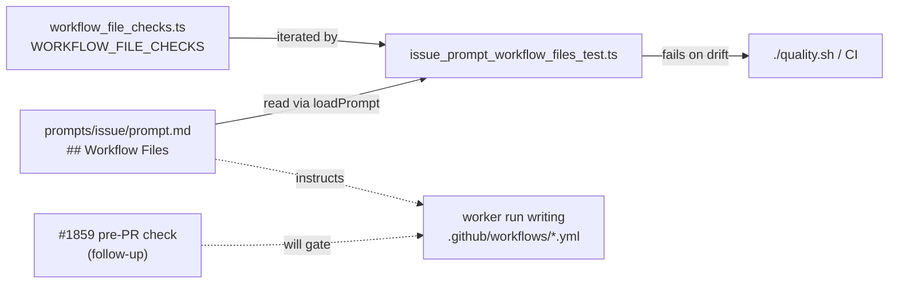

# Issue prompt rule for `.github/workflows/` files (Issue #1825)

## Summary

`prompts/issue/prompt.md` — the template that actually writes workflow files
into monitored repositories — said nothing about `.github/workflows/`, so a run
either inferred the rules or invented them (the NEAT-AI-scorer `semgrep.yml`
bare-digest pin in stSoftwareAU/NEAT-AI-scorer#617 is the invented shape). This
change adds a `## Workflow Files` section beside `## Change Scope`, covering
any file the run adds or changes under `.github/workflows/`. It states three
things:

- **A workflow-sync template is committed verbatim.** When the issue body
  carries a `<!-- vibe-coder:workflow-sync:… -->` tag, the file differs from the
  issue's YAML only in the values its "How to apply" section lists as
  repository-specific. Its pins are already resolved: copy each pin and its
  version comment exactly as given, never re-resolve, bump or reformat.
- **Every workflow file, template or not, must yield no finding** from the
  file-scoped Actions checks — all eleven `WORKFLOW_FILE_CHECKS` entries are
  named by id with their one-line rule, so a workflow no template produces (a
  `deploy.yml`) is held to the same bar.
- **An action SHA is resolved in the run, never written from memory**, with the
  tag recorded in a trailing comment — the wording reused from
  `prompts/workflow_setup/prompt.md` § "Resolving action SHAs".

`worker/deno/tests/issue_prompt_workflow_files_test.ts` locks the section to the
exported table: it iterates `WORKFLOW_FILE_CHECKS` and fails when the prompt
drops a label or the table gains an entry the prompt does not name. The `issue`
row of `docs/PROMPTS.md` gains one sentence on the rule.

Enforcement here is by construction — the prompt is an instruction, not a gate.
The worker-side gate is filed as the follow-up this issue asked for:
**stSoftwareAU/VibeCoder#1859** — run `WORKFLOW_FILE_CHECKS` over every changed
`.github/workflows/` file before `gh pr create` and fail loud on any finding.
The dedup search (`gh issue list --state open --search "pre-PR workflow file
checks in:title,body"`) returned only this issue, so no duplicate exists.

Closes #1825.

## Evidence

Prompt-and-test change with no web interface, so there is nothing to
screenshot. The evidence is the test behaving in both directions, verified by
mutating the inputs:

- Removing the `strict-mode` bullet from the prompt fails
  `issue prompt - names every workflow file check with its rule` with
  ``the section does not name the `strict-mode` check`` (mutation reverted).
- The independent Spec reviewer separately mutated the other direction —
  inserting a `brand-new-check` entry into `WORKFLOW_FILE_CHECKS` — and the same
  case failed (mutation reverted; tree clean).
- `./quality.sh` → `Result: PASSED (with skipped checks)`; the one skip is
  `config integration`, environmental and pre-existing.

One accuracy note for the reviewer: the "How to apply" section
`worker/deno/setup/workflow_sync.ts:252` emits today lists no repository-specific
values, so the exception clause currently points at an empty list and resolves to
the safe "verbatim" behaviour. #1824 is the issue that populates it; the wording
here is deliberately the one #1825 specified.

## Acceptance Criteria

<!-- vibe-spec-review inputs="diff+issue-body" -->

- **met** — the prompt section exists and the new test passes; removing a check
  label from the section, or adding a table entry the section does not name,
  fails the test — evidence: `prompts/issue/prompt.md` § "Workflow Files —
  `.github/workflows/`" and
  `worker/deno/tests/issue_prompt_workflow_files_test.ts::issue prompt - names every workflow file check with its rule`,
  mutation-verified in both directions — reviewer: met
- **met** — `docs/PROMPTS.md` issue row updated — evidence: `docs/PROMPTS.md:30`
  — reviewer: met
- **met** — the follow-up issue for the pre-PR check exists and is linked from
  the PR summary — evidence: stSoftwareAU/VibeCoder#1859, linked in the Summary
  above — reviewer: partial — reason: the reviewer saw a diff with no
  `pr-summary-1825.md` in it and could only confirm the issue's half; the link
  is in this file, which is the artefact the criterion names
- **met** — `./quality.sh` passes, including the prompt prose and
  house-vocabulary tests over the new text — evidence: full gate run after the
  final edit, `Result: PASSED (with skipped checks)`; targeted
  `prompt_prose_test.ts`, `prompt_house_vocabulary_drift_test.ts` and
  `prompt_h1_version_suffix_test.ts` also pass — reviewer: met

No `unrequested` entries: the Spec reviewer traced every element of the diff to
a bullet in the issue.

## Standards Review

<!-- vibe-standards-review inputs="diff+CODING-STANDARDS.md" -->

- **violation** — the new suite asserts on the text of a Markdown document
  rather than on behaviour, which reads against the "no grep-the-source tests"
  standard — evidence:
  `worker/deno/tests/issue_prompt_workflow_files_test.ts:55` — reason: stands,
  narrowed. A prompt template has no runtime behaviour to call, the issue asks
  for exactly this test, and it is the shape every existing prompt suite uses
  (`issue_prompt_v39_independent_review_test.ts`,
  `prompt_house_vocabulary_drift_test.ts`). What was fixable was fixed: the
  weakest case looped over the bare words `bump` and `reformat`, which prose
  saying the opposite would satisfy — it now asserts the whole phrases
  (`never bump one to a newer tag`). The load-bearing case iterates the exported
  table rather than a hand-written list, so it fails on real drift.
- **violation** — the copy-pins rule was stated four times in 62 lines, against
  the token-economy standard — evidence: `prompts/issue/prompt.md:584` —
  reason: fixed here; the duplicate bullet under "Resolving action SHAs" was
  removed, leaving one positive statement and its three negatives.
- **violation** — the test docstring claimed Australian English "(behaviour,
  colour, organisation)" for words the file does not contain — evidence:
  `worker/deno/tests/issue_prompt_workflow_files_test.ts:18` — reason: fixed
  here; the parenthetical now names words the file actually uses.
- **violation** — no `docs/archive/pr-summaries/pr-summary-1825.md` in the diff
  — evidence: the branch at review time — reason: fixed here; this file is that
  summary, written after the reviews as the prompt prescribes.
- **clean** — Australian English throughout the three files; prompt edited in
  place with no `vN` scheme; commit carries the issue reference and the
  `Vibe-Coder-Run-Id` trailer; no hidden path staged; `@std/assert` only; the
  new suite is parallel-safe (no env mutation, no sleep, no spawn, 4 ms) and
  needs no manifest entry; the helpers fail loud rather than returning an empty
  section or passing vacuously on an empty table.

One observation left unactioned: every other clause in the `docs/PROMPTS.md`
issue row links to a `docs/workflows/issue-processing.md` section, and this one
does not. The issue asked for one sentence in the row; adding a new
issue-processing section is outside its scope.

## Test Plan

- Added `worker/deno/tests/issue_prompt_workflow_files_test.ts` (5 cases): the
  section exists and names `.github/workflows/`; every `WORKFLOW_FILE_CHECKS` id
  and label is named (iterating the exported table, and failing loudly if that
  table is ever empty); the workflow-sync template is committed verbatim with
  the "How to apply" exceptions; resolved pins are copied as given and never
  re-resolved, bumped or reformatted; an action SHA is resolved in the run with
  the tag recorded beside the pin.
- Re-ran the prompt suites that read the same template:
  `prompt_prose_test.ts`, `prompt_house_vocabulary_drift_test.ts`,
  `prompt_h1_version_suffix_test.ts`, `issue_prompt_v38_reproduction_method_test.ts`,
  `issue_prompt_v39_independent_review_test.ts`, `prompt_manager_test.ts`,
  `custom_prompts_docs_test.ts` — 78 passed.
- `./quality.sh` — PASSED.
