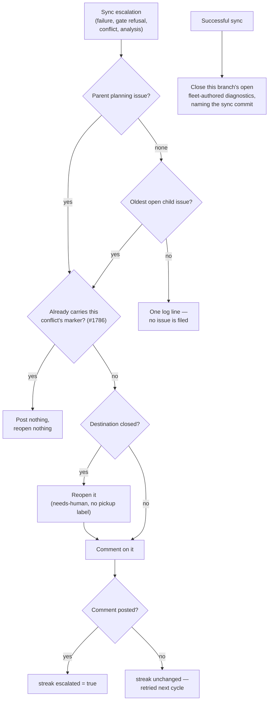

# Emergency: land the #1769 milestone-sync fix on `main`

## Summary

The fix for #1769 was merged by PR #1809 into
`milestone/1730-resolve-merge-conflicts-without-humans-sync` only, so live
`main` still carried `fileStuckSyncDiagnostic` and deployed fleet workers kept
filing fresh `needs-human` milestone-sync diagnostic issues
(NEAT-AI-scorer#623/#624, VibeCoder#1807/#1808/#1821). This lands #1809's merge
commit `a50536d` directly on `main` — no milestone branch in between. Closes
#1826.

No milestone-sync escalation files an issue any more. Every escalation —
`escalateSyncFailure`, `escalateMergeGateFailure`, `escalateConflictAnalysis`
and `escalateSyncConflict` — resolves a destination that already exists: the
milestone's parent planning issue (reopened, labelled `needs-human` and never a
pickup label, when planning has closed it), else its oldest open non-tracking
child **issue**, else nowhere, which is one log line and a streak marked
escalated so the line is not repeated. A branch that syncs closes the open
fleet-authored diagnostics the old path filed for it, naming the commit the
branch now stands at.

**Conflict resolution against `main`.** `main` gained Issue #1786's cross-host
conflict dedup after the milestone branch diverged, and #1809 deleted the code
path it lived in. Both are preserved: `escalateToExistingIssue` takes an
optional dedup marker and passes it to `resolveMilestoneEscalationTarget` as an
`alreadyEscalated` predicate, so the marker is now checked against whichever
existing issue the escalation resolves to, **before** anything is reopened. A
naive port checked it after resolution and would have reopened an issue a human
had closed only to then post nothing — that ordering defect was found by the
spec reviewer and is fixed and tested here.

## Evidence

Backend-only change — no web interface to screenshot. Evidence is the test
suites below plus the full gate re-run on the merged tree (not on #1809's):
`./quality.sh < /dev/null` → **PASSED** (`completeness checks`, `semgrep`,
`deno tests`, lint, type check, fmt, mermaid, markdownlint all green; `config
integration` skipped as it always is locally).

`main` no longer contains the issue-creation path:

```
$ grep -c fileStuckSyncDiagnostic worker/deno/lib/milestone_branch_sync.ts
0
```



## Reproduction

- **symptom** — a milestone sync failure on a milestone whose title carries no
  `#NNN` filed a fresh `needs-human` diagnostic issue per branch and per
  conflicting commit, and nothing ever closed one once the branch synced
- **status** — `verified` — with `main`'s pre-fix
  `worker/deno/lib/milestone_branch_sync.ts` restored over the cherry-picked
  tree (`git checkout bc8002a -- worker/deno/lib/milestone_branch_sync.ts`),
  `deno test tests/milestone_branch_sync_test.ts` reported **4 failed / 34
  passed**, the first failure quoting the live
  `["issue","create","--repo","owner/repo","--title","Milestone sync merged
  with conflicts: …","--label","needs-human"]` argv; with the fix in place all
  38 pass
- **regression test** —
  `worker/deno/tests/milestone_branch_sync_test.ts::syncMilestoneBranches - no escalation path ever files an issue (Issue #1769)`
- **second symptom (found in review, introduced by this port)** — a second
  worker host resolving a CLOSED parent planning issue reopened it and then
  posted nothing, silently undoing a human's close; covered by
  `worker/deno/tests/milestone_sync_conflict_analysis_escalation_test.ts::milestone sync - a second host does not reopen a closed issue only to post nothing (Issues #1786, #1826)`

## Acceptance Criteria

<!-- vibe-spec-review inputs="diff+issue-body" -->

- **met** — `main` no longer contains `fileStuckSyncDiagnostic` or any
  milestone-sync escalation path that calls `gh issue create` — evidence:
  `worker/deno/lib/milestone_branch_sync.ts` (function deleted; the only `gh`
  writes are `issue comment` / `reopen` / `edit`) and
  `worker/deno/tests/milestone_branch_sync_test.ts::syncMilestoneBranches - no escalation path ever files an issue (Issue #1769)`
  — reviewer: met — reason: the reviewer noted it could only see the branch,
  not `main`; the branch targets `main` directly, which is what the issue asks
  for.
- **met** — the regression tests from #1809 are present — evidence: the diff is
  a strict superset of `gh pr diff 1809`;
  `tests/milestone_escalation_target_test.ts` (13 tests),
  `tests/milestone_sync_diagnostic_closeout_test.ts` (6), five new
  `milestone_branch_sync_test.ts` cases, plus the rewritten `#1465` and
  conflict-escalation suites — reviewer: met
- **met** — a milestone sync conflict comments/reopens an existing issue or
  logs only, never files a fresh diagnostic — evidence:
  `worker/deno/lib/milestone_escalation_target.ts` and
  `tests/milestone_sync_conflict_escalation_test.ts::milestone sync - a conflict on a milestone with no tracking issue lands on its oldest open child (Issues #1558, #1769)`
  — reviewer: met — reason: the reviewer flagged one ordering defect under this
  criterion (reopen ran before the #1786 dedup check); fixed in
  `escalateToExistingIssue` / `resolveMilestoneEscalationTarget` and covered by
  three new tests.
- **met** — existing fleet-authored diagnostics can be closed when their branch
  subsequently syncs — evidence:
  `worker/deno/lib/milestone_sync_diagnostic_closeout.ts`, called on every
  successful sync, and `tests/milestone_sync_diagnostic_closeout_test.ts` (six
  cases, including a same-titled issue by a non-fleet author left alone) —
  reviewer: met — reason: the reviewer added that it only fires for milestones
  still returned by `findActiveMilestoneBranches`, so a diagnostic on a branch
  of a closed milestone is not retired; that is #1809's design as tested and
  the criterion asks for close-on-sync, which is what ships.
- **met** — normal quality checks pass — evidence: `./quality.sh < /dev/null`
  → `Result: PASSED`, re-run on the merged tree after the conflict resolution
  and after every review fix — reviewer: met
- **unrequested** — main's #1786 dedup marker is now checked through a new
  `alreadyEscalated` predicate on `resolveMilestoneEscalationTarget`, returning
  an `already-escalated` target — reviewer: unrequested — reason: not in
  #1809, which never met #1786; without it the port would either lose the
  cross-host dedup or reopen a human's closed issue to post nothing.
- **unrequested** — `titleMatches` predicate on the shared
  `findFleetAuthoredIssuesTitled` — reviewer: unrequested — reason: carried
  from #1809; the conflict diagnostic's title carries the conflicting commit,
  so the close-out cannot know the exact title. The default is the existing
  exact comparison and the author check is never widened.
- **unrequested** — `conflictDiagnosticTitlePrefix` exported from
  `milestone_sync_conflict.ts`; `stuckSyncDiagnosticTitle` moved into the new
  close-out module — reviewer: unrequested — reason: carried from #1809 — one
  definition of each title, so the search key and the filed title cannot drift.
- **unrequested** — `ActiveMilestone.milestoneNumber` and `dedupAuthors` on
  `MilestoneBranchSyncDeps` — reviewer: unrequested — reason: carried from
  #1809; the child lookup needs the milestone number and the close-out needs
  the fleet identity.
- **unrequested** — the reopened parent is labelled `needs-human` and the
  comment carries a `_Reopened by the milestone branch sync…_` preamble —
  reviewer: unrequested — reason: carried from #1809; a reopened issue with no
  explanation is worse than none, and `needs-human` is what keeps a reopen out
  of the fleet's pickup queue.
- **unrequested** — one archive note added to the head of
  `docs/archive/pr-summaries/pr-summary-1769.md` — reviewer: unrequested —
  reason: that file arrives with the cherry-pick and its evidence describes
  #1809's tree, not this one; the note says so and points here.

## Standards Review

<!-- vibe-standards-review inputs="diff+CODING-STANDARDS.md" -->

- **violation** — no `pr-summary-1826.md` for the issue this branch exists for
  — evidence: `docs/archive/pr-summaries/pr-summary-1769.md:1` — reason: fixed
  here; this file is it, and it carries `Closes #1826`.
- **violation** — the archived #1809 summary claims a gate run and a
  reproduction that describe a different tree — evidence:
  `docs/archive/pr-summaries/pr-summary-1769.md:26` — reason: fixed here; the
  archive is kept verbatim as #1809's own record with a note pointing at this
  summary, and the gate was re-run on the merged tree.
- **violation** — new exported `conflictDiagnosticTitlePrefix` had no test of
  its own — evidence: `worker/deno/lib/milestone_sync_conflict.ts:162` —
  reason: fixed here;
  `tests/milestone_sync_conflict_test.ts::conflictDiagnosticTitlePrefix - one branch's prefix never matches a longer branch name (Issue #1769)`
  covers the prefix-collision edge case and the empty-branch edge.
- **violation** — the default `titleMatches` closure was rebuilt inside the
  per-row loop — evidence: `worker/deno/lib/idle_task_wrapper_dedup.ts:155` —
  reason: fixed here, hoisted above the loop with the other invariants.
- **violation** — an escalation with nowhere to go returns `true` and records
  `escalated: true` — evidence: `worker/deno/lib/milestone_branch_sync.ts:980`
  — reason: stands; it is #1809's tested behaviour and what the alternative
  costs is the same log line every cycle for ever. Nothing is silenced — the
  `WARNING` line and the `sync_failed` self-heal event still fire every cycle;
  only the escalation attempt is not repeated.
- **violation** — the `gh` stubs in the new suites route on argv substrings
  rather than modelling GitHub's own matching rules — evidence:
  `worker/deno/tests/milestone_escalation_target_test.ts:116` — reason: stands;
  this is the injected-`gh`-runner convention every milestone suite in the repo
  already uses, and rewriting them onto the `github_graphql_fake.ts` precedent
  is a change to test infrastructure this emergency hotfix should not carry.
- **violation** — a removed test case was not documented — evidence:
  `worker/deno/tests/milestone_sync_escalation_reachable_1465_test.ts` —
  reason: documented here. #1809 reversed that suite's "file where no tracking
  issue exists" premise, and in doing so dropped
  `"an issue nobody can vouch for does not suppress the escalation"`. The
  property it asserted survives in
  `tests/idle_task_wrapper_dedup_author_test.ts` and in
  `tests/milestone_sync_diagnostic_closeout_test.ts` (a stranger's same-titled
  issue is left alone), so no coverage is lost.
- **violation** — `conflictDiagnosticTitle` has no production caller left —
  evidence: `worker/deno/lib/milestone_sync_conflict.ts:146` — reason: stands,
  with its doc comment corrected here to say why: nothing files one any more,
  and it survives as the definition the close-out's prefix search is built
  from, so the two cannot drift.
- **clean** — Australian English throughout; Deno-native tooling only
  (`deno fmt`/`lint`/`check`/`test`, `check:manifests` green, both new `lib/`
  modules registered in `docs/audits/lib-sweep-coverage.json`); tests call the
  real exports through injected seams with no source-grepping, no sleeps and no
  wall-clock assertions; every `catch` logs the error with context and its
  consequence; no hidden paths staged; `docs/INTERNALS.md` updated in the same
  change; `milestone_branch_sync.ts` shrank from 1204 to ~1130 lines into two
  focused modules; commit carries the `Vibe-Coder-Run-Id` trailer.

## Test Plan

- **Cherry-picked from #1809** — `tests/milestone_escalation_target_test.ts`,
  `tests/milestone_sync_diagnostic_closeout_test.ts`, the five new
  `tests/milestone_branch_sync_test.ts` cases, the three
  `tests/idle_task_wrapper_dedup_author_test.ts` cases, and the reversed
  `#1465` / conflict-escalation suites.
- **New** `tests/milestone_escalation_target_test.ts::resolveMilestoneEscalationTarget - a destination that already carries the escalation is not reopened (Issue #1786)`
  and `… - an escalation not yet on the destination still reopens it (Issue #1786)`.
- **New** `tests/milestone_sync_conflict_analysis_escalation_test.ts::milestone sync - a second host does not reopen a closed issue only to post nothing (Issues #1786, #1826)`
  — the end-to-end ordering regression through `syncMilestoneBranches`.
- **New** `tests/milestone_sync_conflict_test.ts::conflictDiagnosticTitlePrefix - one branch's prefix never matches a longer branch name (Issue #1769)`.
- **Unchanged and still green** — `tests/milestone_conflict_dedup_test.ts` and
  the four pre-existing `#1559`/`#1786` cases in
  `tests/milestone_sync_conflict_analysis_escalation_test.ts`, which is what
  proves the conflict resolution preserved main's dedup.
- Full gate on the merged tree: `./quality.sh < /dev/null` → PASSED.
