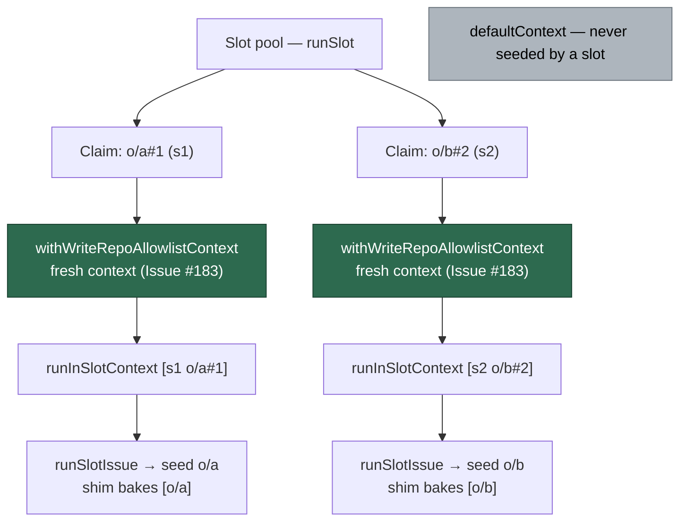

# PR Summary — Issue #183

## Summary

`withWriteRepoAllowlistContext()` (Issue #4175) gave each pool slot its own
write-repo allowlist, but **nothing in production called it** — the only
references were tests. Every slot therefore resolved `ctx()` to the
process-wide `defaultContext`, and because `seedWriteRepoAllowlist()` clears
`allowed` on every claim, the slot that claimed second clobbered its sibling's
allowlist. The losing slot's `gh` guard shim was baked with the *other* claim's
repo, so every GitHub write from that agent was refused — including writes to
its own claim repo and its `needs-human` escalation (observed: slot B on
`stSoftwareAU/GRQ#4206` refused with `[WRITE_REPO_BLOCKED] … not on run
allowlist [stsoftwareau/vibecoder]`).

The slot pool now wraps **every claim** in a fresh allowlist context
(`worker/deno/lib/run_core.ts`), so a slot's egress boundary always matches its
claim regardless of seed order. Per claim rather than per slot, because each
claim seeds and resets its own allowlist and a heartbeat pin (Issue #3760)
belongs to the claim that took it.

**Heartbeat pin check (asked for in the issue).** The pin survives the move: a
claim's `pinWriteRepo()` now lives in the same context as that claim's seed, so
a reseed inside the claim still leaves the heartbeat's repo writable, and a
sibling slot can no longer see it. The asymmetry the issue flagged —
`listAllowedWriteRepos()` (what `prepareGhGuardShim` bakes) returns `allowed`
only, while `isWriteRepoAllowed()` also honours `pinned` — is **deliberate and
left as is**: the claim repo is always in `allowed` at snapshot time (the seed
precedes the shim in `issue_worker.ts` → `execute_claude_phase.ts`), so the
agent never needs a pinned repo, and baking pins in would widen the agent's
boundary to a background writer's repo — the opposite of the #3311 containment
property. Both behaviours are now asserted by a test.

Closes #183.

## Evidence

Backend/CLI change with no web interface to screenshot — the evidence is the
regression tests below, which drive the real `runCoreLoop` slot pool.

Against the unfixed code (fix stashed, tests kept):

```text
$ deno test … tests/run_core_slot_pool_test.ts --filter "Issue #183"
slot pool - two concurrent claims each seed their own write-repo allowlist (Issue #183) … FAILED
  AssertionError: Values are not equal:  -   [ "o/b" ]  +   [ "o/a" ]
slot pool - a claim's heartbeat pin stays inside its own allowlist context (Issue #183/#3760) … FAILED
  AssertionError: Values are not equal: o/b's pin leaked  -   true  +   false
FAILED | 0 passed | 2 failed
```

With the fix applied:

```text
$ deno test … tests/run_core_slot_pool_test.ts --filter "Issue #183"
slot pool - two concurrent claims each seed their own write-repo allowlist (Issue #183) ... ok (16ms)
slot pool - a claim's heartbeat pin stays inside its own allowlist context (Issue #183/#3760) ... ok (6ms)
ok | 2 passed | 0 failed
```

Where the allowlist context now sits relative to the slot context:



**Original trigger is closed, with no trivial bypass.** The observed trigger —
two concurrent claims, the second seed clearing the first's `allowed` set — can
no longer occur: `seedWriteRepoAllowlist()` mutates only `ctx()`, and after this
change every claim in the pool runs inside its own
`createWriteRepoAllowlistContext()`, so `ctx()` resolves to that claim's object
rather than `defaultContext`. `AsyncLocalStorage` propagates through every
`await`/timer continuation of the claim, so there is no path from one claim's
body into another's context: the seed, `registerWriteRepo`, the pins, the
`enforceGhWriteAllowlist` check at the `spawnGh` chokepoint and the shim
snapshot all resolve the same per-claim object. Seed order is now irrelevant,
and a slot can neither lock its sibling out nor inherit the sibling's repo. The
pool is the only concurrent claim path (the serial loop and the CLI
single-issue path keep the default context, i.e. today's single-slot
behaviour); the tests assert the default context is left inactive after a
two-slot cycle, so a future regression that drops the wrapper fails loudly.

## Test Plan

Added to `worker/deno/tests/run_core_slot_pool_test.ts` — both drive
`runCoreLoop` with `maxConcurrentIssues: 2` and let each claim seed the
allowlist exactly as `issue_worker.ts` does, with a barrier so the claims
interleave:

- `worker/deno/tests/run_core_slot_pool_test.ts::slot pool - two concurrent claims each seed their own write-repo allowlist (Issue #183)`
  — reproduces the flaw (each claim sees only its own repo in
  `listAllowedWriteRepos()`, a write to the sibling's repo is refused with
  `WriteRepoBlockedError`, and the default context is never seeded). Fails
  against the unfixed code, passes after the fix.
- `worker/deno/tests/run_core_slot_pool_test.ts::slot pool - a claim's heartbeat pin stays inside its own allowlist context (Issue #183/#3760)`
  — a pin taken by one claim is invisible to its sibling, still keeps the
  claim's own repo writable across a reseed, and stays out of the shim
  snapshot. Fails against the unfixed code (the sibling's pin leaks), passes
  after the fix.

Full gate: `./quality.sh` passes except for 10 pre-existing, environment-
dependent failures in `setup_workdir_reminder_test.ts`,
`fleet_health_test.ts`, `host_workdir_guard_test.ts` and
`optional_feature_env_test.ts` (this container has a populated host work dir).
They fail identically on unmodified `main` — verified by stashing this branch's
changes and re-running those four files.

Docs updated in the same change: `SECURITY.md` §6 gains the per-claim
isolation bullet (including why pins stay worker-side), and the
`write_repo_allowlist.ts` module docstring now names the production wrap site.
