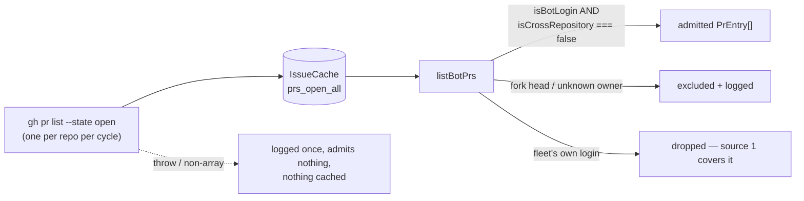

# listBotPrs — bot-authored, same-repository PR lookup

## Summary

Adds `worker/deno/lib/pr_bot_lookup.ts`, a fail-closed lookup that returns a
repo's open **bot-authored, same-repository** PRs from the un-filtered
open-PR listing the cycle already fetches (`prs_open_all`), so
`listActionablePrs` can admit them as a third source. Bot logins cannot be
enumerated for `gh pr list --author`, which is why the un-filtered listing is
the source rather than a per-author loop. Closes #1846.

`fetchAllOpenPRs` now requests `author`, `isCrossRepository`, `headRefOid`,
`autoMergeRequest` and `mergeable` alongside its existing fields, so the new
door costs no extra API call. The wiring into `listActionablePrs` is a
separate issue in the #1828 milestone; this change ships the lookup and its
tests only.

Boundaries the lookup holds:

- **Same repository only.** A fork-headed bot PR is dropped with a logged
  reason — the worker cannot push a fix to a fork it does not own. Unknown
  ownership (a pre-#1846 cache entry) is dropped by the same rule.
- **Not the fleet's own PRs.** A fleet account is often a GitHub App whose
  login ends in `[bot]`, which `isBotLogin` cannot tell apart from a
  dependency bot; those PRs already arrive through the maintenance listing.
- **Fail loud, fail closed.** An unreadable listing is caught, logged once,
  and admits nothing; nothing is cached. The log sink is a **required**
  option, so a fail-closed drop can never be silenced by omission.

## Evidence

Backend/CLI change with no web interface to screenshot. Evidence is test
output:

- `deno task test tests/pr_bot_lookup_test.ts tests/issue_query_test.ts` —
  **80 passed / 0 failed**.
- `./quality.sh` — **PASSED** (deno tests, lint, type check, fmt, semgrep,
  markdownlint, mermaid, completeness checks; `config integration` skipped as
  it is on this host).

`worker/deno/lib/pr_bot_lookup.ts` is registered as sweep slice `12n` in
`docs/audits/lib-sweep-coverage.json`, with its written record at
`docs/audits/security-sweep-1846-pr-bot-lookup.md` — required by the repo's
own completeness gate for any new `lib/` module.

## Acceptance Criteria

<!-- vibe-spec-review inputs="diff+issue-body" -->

- **met** — `dependabot[bot]`, `renovate[bot]`, `github-actions` and
  `copilot-swe-agent[bot]` PRs with `isCrossRepository: false` are returned; a
  human-authored PR and the host login's own PR are not — evidence:
  `worker/deno/tests/pr_bot_lookup_test.ts::listBotPrs - admits same-repository bot PRs and logs each admission`
  and `::listBotPrs - a human PR and the host's own bot-shaped PR are not admitted`
  — reviewer: met — reason: the reviewer noted the host half was satisfied only
  incidentally (a test host login shaped to miss `isBotLogin`); a fleet-login
  exclusion (`githubUser` / `fleetPrAuthors`) and a bot-shaped host login in the
  test were added after the review, so the criterion now holds structurally.
- **met** — a bot PR with `isCrossRepository: true` is excluded and the
  exclusion is logged with the PR number — evidence:
  `worker/deno/tests/pr_bot_lookup_test.ts::listBotPrs - a fork-headed bot PR is excluded and the exclusion logged`
  — reviewer: met
- **met** — a listing that throws or returns a non-array admits no PR and logs
  the failure; nothing is written to the cache — evidence:
  `worker/deno/tests/pr_bot_lookup_test.ts::listBotPrs - an unreadable listing admits nothing, logs, and caches nothing`,
  `::listBotPrs - a non-array gh payload is logged, admits nothing, caches nothing`,
  `worker/deno/tests/issue_query_test.ts::issue_query - fetchAllOpenPRs - rejects a non-array payload (Issue #1846)`
  — reviewer: partial — reason: the reviewer found a real gap — a valid-JSON
  non-array payload returned `[]` unlogged through `issue_query.ts`; fixed by
  making `fetchAllOpenPRs` throw on it, and the departure from the reviewer's
  `partial` is that fix, not a disagreement.
- **met** — a second call in the same cycle with a cache issues no second
  `gh pr list` — evidence:
  `worker/deno/tests/pr_bot_lookup_test.ts::listBotPrs - a second call in the cycle issues no second gh pr list`
  — reviewer: met
- **met** — entries are de-duplicated by number; an entry with no
  `author.login` is not admitted — evidence:
  `worker/deno/tests/pr_bot_lookup_test.ts::listBotPrs - de-duplicates by PR number`
  and `::listBotPrs - an entry with no author login is not admitted` —
  reviewer: met
- **met** — `./quality.sh` passes — evidence: full gate run after the final
  edit, `Result: PASSED` — reviewer: met — reason: the reviewer verified lint,
  fmt, check and the changed suites piecewise and did not run the full suite;
  it was run here and passed.
- **unrequested** — `OpenPRWithBody.authorLogin` instead of the issue's literal
  `author` — reviewer: unrequested — reason: `OpenPR.author` already means "the
  fleet login the PR was fetched under" and feeds
  `getBlockingPRForIssue`/`isHumanAuthoredPr`, which the idle census calls with
  this very listing; overloading it would have changed which PRs block issue
  pickup. Both reviewers judged the rename correct.
- **unrequested** — `mergeable?: string` added to `PrEntry` and carried through
  — reviewer: unrequested — reason: the issue asks the listing to fetch
  `mergeable`, and `PR_MAINTENANCE_LIST_FIELDS` already requests it; fetching a
  field and dropping it would leave the third source poorer than the first.
- **unrequested** — `docs/audits/security-sweep-1846-pr-bot-lookup.md` and
  sweep slice `12n` — reviewer: unrequested — reason: forced by the last
  criterion; `lib_sweep_coverage_test.ts` fails `./quality.sh` until every new
  `lib/` module is claimed by a slice with a written record.
- **unrequested** — the `cross-repository-unknown` exclusion branch, and
  `fetchAllOpenPRs` throwing on a non-array payload — reviewer: unrequested —
  reason: both are the fail-closed/fail-loud reading of criteria 2 and 3; the
  issue names only `isCrossRepository === true`, but treating "unknown" as
  admissible would push to a fork the worker does not own.

## Standards Review

<!-- vibe-standards-review inputs="diff+CODING-STANDARDS.md" -->

- **violation** — a tautological assertion compares the request text against
  the constant the production call passes into argv — evidence:
  `worker/deno/tests/issue_query_test.ts:813` (pre-fix) — reason: fixed here;
  the assertion was removed and `OPEN_PR_LIST_FIELDS` un-exported with it, so
  the test now checks only the individual field names it cares about.
- **violation** — the `--limit` case asserted argv position rather than a
  decision, and the `gh` fake ignored its arguments — evidence:
  `worker/deno/tests/pr_bot_lookup_test.ts:269` and `:38-46` (pre-fix) —
  reason: fixed here; the fake now honours `--limit` and the test asserts that
  a limit of 2 returns two of three PRs.
- **violation** — a test named for the host login asserted a property the code
  did not implement — evidence: `worker/deno/tests/pr_bot_lookup_test.ts:111`
  (pre-fix) — reason: fixed here; `listBotPrs` now excludes the fleet's own
  logins and the test uses a bot-shaped host login, so the case fails if the
  exclusion is removed.
- **violation** — an optional log sink made a fail-closed drop completely
  silent, against "Never Fail Silently — Fail Loud" — evidence:
  `worker/deno/lib/pr_bot_lookup.ts:54` (pre-fix) — reason: fixed here; `log`
  is now a required option.
- **violation** — `sweptAt` pointed at the branch's base commit, in which the
  swept module does not exist, so slice `12n` would report its own module as
  drift — evidence: `docs/audits/lib-sweep-coverage.json:975` (pre-fix) —
  reason: fixed here; stamped at `0071043`, the commit that carries both the
  module and its record.
- **violation** — the PR summary file was missing — evidence:
  `docs/archive/pr-summaries/pr-summary-1846.md` — reason: fixed here; this
  file.
- **clean** — Australian English throughout; no hidden paths, key material or
  credentials staged; commit messages carry the `Vibe-Coder-Run-Id` trailer;
  both suites are behavioural unit tests with no sleeps, clock assertions or
  env mutation, using `Deno.makeTempDir` with cleanup; `deno task
  check:manifests` passes; KISS/DRY (one flat loop, no premature abstraction);
  log lines carry only repo, PR number and a `sanitiseLogField`-escaped login;
  no operator doc goes stale (`prs_open_all` appears in none, and
  `docs/GH-API-OPTIMISATION.md`'s table covers per-author keys only).

## Test Plan

Added `worker/deno/tests/pr_bot_lookup_test.ts` (14 cases):

- four bot logins with `isCrossRepository: false` admitted, one log line each
- the full `PrEntry` shape carried through (`headRefOid`, `baseRefName`,
  `autoMergeRequest`, `mergeable`, `author`, `isCrossRepository`)
- a human PR and the host's own bot-shaped PR dropped; a sibling fleet login's
  bot PR dropped
- a fork-headed bot PR excluded with `prNumber` and reason logged
- unknown head ownership fails closed
- a throwing listing, and a valid-JSON non-array payload: nothing admitted,
  one log line, nothing cached
- a second call in the cycle served from the cache (one `gh pr list`)
- de-duplication by number; blank / missing / whitespace author login dropped
- a hostile login sanitised out of the admission log
- `--limit` bounds what the listing returns

Added to `worker/deno/tests/issue_query_test.ts` (3 cases): the listing
requests the bot-lookup fields; the new fields are carried through and stay
unset on a pre-#1846 shape; a non-array payload is rejected and not cached.
