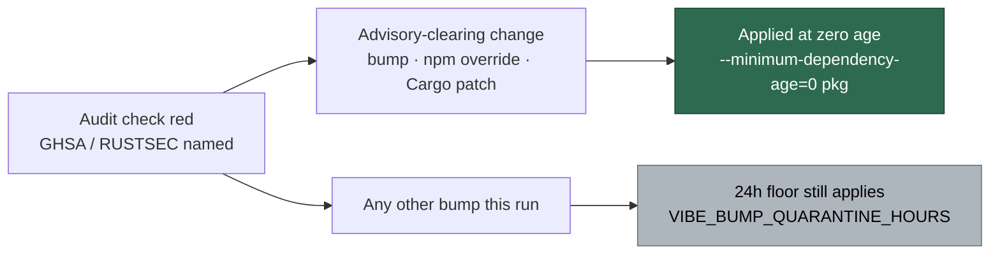

## Summary

The CI-fix agent now knows that a dependency bump or override made to clear a
**failing dependency audit** is applied regardless of the fixed version's
publish age, while every other bump in the same run keeps the 24h quarantine
floor. Closes #1847.

- `prompts/ci_fix/prompt.md` gains a **"Dependency audit failures"** subsection
  under "Fixing the Failure": the audits it covers (`deno audit`, `cargo audit`,
  or any check whose log names a GHSA/RUSTSEC advisory), the three
  advisory-clearing mechanisms, the publish-age exemption and how to apply it
  (`--minimum-dependency-age=0` for that package, or a direct manifest edit —
  never an edit to the repository's `minimumDependencyAge` config or its
  `exclude` globs), the limit (every other bump keeps the floor), the fact that
  the fix may touch files the bot's own PR did not, and the audit command as the
  reproduction loop.
- `docs/security-advisory-triage.md` records the automatic audit-driven bypass
  beside the maintainer's manual emergency override, and its limit.

No code path changes: `bump_age_audit.ts` is never run on the CI-fix path, so the
quarantine reaches a CI-fix run only through the injected coding guidelines. The
new subsection is the more specific instruction that wins there.

## Evidence

Prompt-and-docs change with no web interface to screenshot. The evidence is the
rendered-prompt tests and the full quality gate:

- `deno test tests/ci_fix_prompt_v4_test.ts` — 8 passed, 0 failed.
- Red-then-green check: with the new subsection cut out of
  `prompts/ci_fix/prompt.md`, the three new cases fail (`5 passed | 3 failed`);
  with it restored, all 8 pass. That is the failure detection the issue asks
  for.
- `./quality.sh` — PASSED (all checks; the pre-existing `config integration`
  check is skipped, as on the base branch).

## Acceptance Criteria

<!-- vibe-spec-review inputs="diff+issue-body" -->

- **met** — Prompt test asserts the exemption, the zero-age mechanism, all three
  override mechanisms, and the other-bumps-keep-the-floor sentence are rendered,
  and no `{{…}}` placeholder remains — evidence:
  `worker/deno/tests/ci_fix_prompt_v4_test.ts::ci_fix - an advisory-clearing bump is exempt from the publish-age floor (Issue #1847)`,
  `::ci_fix - the audit exemption names all three override mechanisms (Issue #1847)`,
  `::ci_fix - every other bump in the run keeps the 24h floor (Issue #1847)` —
  reviewer: met
- **met** — `docs/security-advisory-triage.md` describes the automatic
  audit-driven bypass and its limit — evidence:
  `docs/security-advisory-triage.md:158-176` — reviewer: met
- **met** — `./quality.sh` passes, including the prompt-template checks the gate
  runs — evidence: full gate run after the final edit, PASSED; the reviewer also
  ran `./quality.sh --validate-prompts` and reported `prompt placeholders:
  PASSED` — reviewer: met
- **unrequested** — the prompt states that this subsection is the more specific
  instruction and wins over the 24h floor in the injected coding-guidelines block
  — evidence: `prompts/ci_fix/prompt.md:104` — reviewer: unrequested — reason:
  without it the run receives two contradicting instructions; the issue's own
  Context names this precedence as the mechanism the exemption relies on, so it
  stands
- **unrequested** — the prompt adds "do not sweep unrelated dependencies forward
  while you are in the manifest" — evidence: `prompts/ci_fix/prompt.md:106` —
  reviewer: unrequested — reason: it is the operational half of the requested
  "other bumps keep the floor" rule, one clause long, so it stands

## Standards Review

<!-- vibe-standards-review inputs="diff+CODING-STANDARDS.md" -->

- **violation** — the new tests assert prompt prose rather than a computed
  decision — evidence:
  `worker/deno/tests/ci_fix_prompt_v4_test.ts:138` — reason: partly fixed here —
  the assertions were rewritten to drop markdown emphasis so a formatting edit no
  longer reddens them. The rest stands: the issue's acceptance criterion *is*
  "the rendered prompt contains these rules", and this is the established pattern
  of `ci_fix_reproduction_loop_v14_test.ts`, which pins the same template the
  same way. The `{{PLACEHOLDER}}` assertion is behavioural.
- **violation** — the exemption lands on the phase prompt while
  `prompts/coding_guidelines/prompt.md` still states the 24h floor
  unconditionally — evidence: `prompts/ci_fix/prompt.md:103` — reason: stands.
  The issue specifies this design explicitly ("the quarantine reaches a CI-fix
  run only via `prompts/coding_guidelines/prompt.md`, and the coding guidelines
  state that the more specific task instruction wins"); editing the shared
  guidelines block is out of scope for this issue and would change every phase.
- **violation** — the extended test file's docstring names
  `prompts/ci_fix/v4.md`, a path that no longer exists — evidence:
  `worker/deno/tests/ci_fix_prompt_v4_test.ts:2` — reason: stands. Pre-existing,
  and the filename carries `_v4_` too, so correcting it is a rename outside this
  issue's scope.
- **violation** — the docs paragraph called the agent path "the same bypass",
  looser than the maintainer gate's confirmed-exposure-plus-active-exploitation
  conditions — evidence: `docs/security-advisory-triage.md:158` — reason: fixed
  here; the paragraph now says the trigger is *narrower* and states what it is.
- **clean** — Australian English throughout; every referenced name resolves
  (`VIBE_BUMP_QUARANTINE_HOURS`, `minimumDependencyAge`, and
  `--minimum-dependency-age`, which the installed Deno accepts); the docs change
  accompanies the prompt change and refers to the prompt by path, not version;
  `deno fmt`, `deno lint`, markdownlint and the manifest check pass; the new
  tests are fast, hermetic and parallel-safe; the commit carries the issue
  reference and the `Vibe-Coder-Run-Id` trailer; no hidden or credential paths
  staged.

## Test Plan

Added to `worker/deno/tests/ci_fix_prompt_v4_test.ts`, each rendering the real
template through `buildCiFixPrompt` with `promptsDir` pointing at `prompts/` and
a `deno audit` failure carrying a GHSA annotation:

- `ci_fix - an advisory-clearing bump is exempt from the publish-age floor
  (Issue #1847)` — the subsection, the audits it covers, the exemption sentence,
  the `--minimum-dependency-age=0` mechanism, and the ban on editing the repo's
  `minimumDependencyAge` config or `exclude` globs.
- `ci_fix - the audit exemption names all three override mechanisms (Issue
  #1847)` — direct bump, `deno.json`/`package.json` override for a transitive
  `deno.lock` entry, `Cargo.toml` `[patch]`/parent-crate bump, plus the
  re-run-the-audit-green loop.
- `ci_fix - every other bump in the run keeps the 24h floor (Issue #1847)` — the
  limit sentence, `VIBE_BUMP_QUARANTINE_HOURS`, and that no `{{PLACEHOLDER}}`
  survives rendering.

Existing tests unchanged; none removed or skipped.
