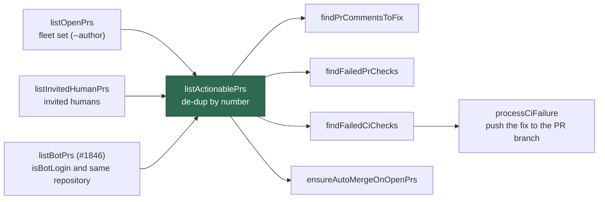

# Admit bot PRs into `listActionablePrs`

## Summary

`listBotPrs` (Issue #1846) is now the **third source** of `listActionablePrs`,
the admission point the four acting PR-maintenance scans list through. A
same-repository bot PR — a `dependabot[bot]` or `renovate[bot]` bump — therefore
joins the PR-feedback, spelling-fix, CI-fix and auto-merge scans, so its red
quality check is fixed on its own branch instead of sitting unattended. The
union is de-duplicated by PR number, and uninvited human PRs are still admitted
by no source.

No change to `pr_ci_processor.ts`: `processCiFailure` already checks out the PR
branch, runs the repo gate, pushes the fix commit with the run-id trailer to
that branch, and escalates with `needs-human` after three attempts per failure
signature. Because the fix lands on the bot PR's own branch, no new issue and no
second PR are raised for the failure.

The policy change is recorded in `docs/HUMAN-PR-POLICY.md` (new **Bot-authored
PRs** section, a third branch in the rule flowchart, a **Bot PR** column in the
will/will-not table), `DESIGN-PRINCIPLES.md` and the `README.md` documentation
table.

Closes #1848.

## Evidence

Backend/CLI change — no web interface to screenshot. The evidence is the test
suite: 13 new scan-level tests drive the real scan functions against a fake `gh`
that filters `--author` server-side exactly as GitHub does, so what a scan sees
is decided by the admission point and nothing else.

Verified red-then-green: with the `listActionablePrs` change reverted, 7 of the
13 new tests fail; with it applied, all 13 pass.

```
$ deno test --allow-all tests/pr_maintenance_bot_prs_test.ts
ok | 13 passed | 0 failed

$ deno test --allow-all tests/pr_maintenance_test.ts tests/pr_invitation_lookup_test.ts \
    tests/pr_maintenance_pr_list_cache_test.ts tests/pr_bot_lookup_test.ts \
    tests/pr_uninvited_action_test.ts tests/pr_uninvited_action_drift_test.ts \
    tests/human_pr_policy_docs_test.ts
ok | 148 passed | 0 failed

$ ./quality.sh
Result: PASSED (with skipped checks)
```



### Known limitation, stated rather than hidden

`listBotPrs` is called without an explicit `limit`, so `fetchAllOpenPRs` uses
its default page size of 50 while the fleet listing uses
`PR_MAINTENANCE_LIST_LIMIT = 100`. Forcing 100 here would not fix the gap: the
un-filtered listing is shared through the `prs_open_all` cache key, so the depth
is whatever the cycle's _first_ consumer asked for, and raising it only in this
caller would make the depth order-dependent rather than consistent. In a repo
with more than 50 open PRs, a bot PR outside the newest 50 is not admitted.

## Acceptance Criteria

<!-- vibe-spec-review inputs="diff+issue-body" -->

- **met** — The five scan tests pass; existing `pr_maintenance_test.ts`,
  `pr_invitation_lookup_test.ts` and `pr_maintenance_pr_list_cache_test.ts` pass
  unchanged — evidence: `worker/deno/tests/pr_maintenance_bot_prs_test.ts`
  (CI-fix, auto-merge ×3, feedback ×2, spelling, two-bot check-id keying); the
  three existing suites are untouched by the diff and pass — reviewer: met
- **met** — A PR present in more than one source appears once — evidence:
  `worker/deno/lib/pr_maintenance.ts` de-dups by `number`;
  `pr_maintenance_bot_prs_test.ts::listActionablePrs - unions the bot source and de-duplicates by number`
  — reviewer: met — reason: the reviewer noted the invited∩bot overlap is
  untested; the de-duplication is a single loop over both extra sources, so
  fleet∩bot exercises the same code path
- **met** — An uninvited human PR is still never returned by any scan —
  evidence:
  `pr_maintenance_bot_prs_test.ts::listActionablePrs - an uninvited human PR is admitted by no source`,
  plus per-scan counter-cases in the CI-fix, spelling and feedback tests;
  `pr_uninvited_action_test.ts` and its drift guard pass unchanged — reviewer:
  met — reason: the reviewer attached a caveat that `isBotLogin` matches
  `copilot`/`cursor`/`snyk`/`codecov` by prefix, so a human login starting with
  one of those words would be admitted. Confirmed real and inherited from the
  shared predicate; documented in the policy doc and filed as
  stSoftwareAU/VibeCoder#1872 rather than narrowing a predicate six other
  callers share
- **met** — `docs/HUMAN-PR-POLICY.md`, `DESIGN-PRINCIPLES.md` and `README.md`
  updated; the Mermaid block parses — evidence: the three files in this diff;
  `mermaid` and `markdownlint` stages of `./quality.sh` PASSED — reviewer: met
- **met** — `./quality.sh` passes — evidence: full gate run,
  `Result: PASSED (with skipped checks)`; `config integration` SKIPPED is
  pre-existing — reviewer: met
- **partial** — Update the `PrScanOptions` field comments that say bot PRs are
  never fetched — evidence: `worker/deno/lib/pr_maintenance.ts` `cache` field —
  reviewer: partial — reason: no `PrScanOptions` field made that claim on the
  base branch, so the requested edit had no target. The `cache` field comment
  was extended instead (it is the field the bot door consumes), and the two
  module doc blocks that _did_ assert the old two-source world —
  `pr_bot_lookup.ts` and `pr_invitation_lookup.ts` — were corrected after the
  reviewer pointed them out
- **unrequested** — A second Mermaid diagram in `docs/HUMAN-PR-POLICY.md`
  showing the three-source fan-out into the four scans — reviewer: unrequested —
  reason: the issue's own body carries this diagram; reproducing it in the
  policy doc is what makes the new section readable without cross-referencing
  the issue. The requested third branch in the `## 🔑 The rule` flowchart is
  present as well
- **unrequested** — A row in the policy doc's "Verifying the policy holds" table
  naming the two bot-PR test files — reviewer: unrequested — reason: that table
  is the doc's index of what pins each claim; a new section with no row would
  leave the new claims unpinned
- **unrequested** — Three tests beyond the five enumerated (fork-headed
  exclusion, and human-PR regressions at the admission point and in the feedback
  scan) — reviewer: unrequested — reason: they are the counter-cases for
  acceptance criterion 3, asserted at scan level rather than at the lookup level
  where `pr_bot_lookup_test.ts` already covers them

## Standards Review

<!-- vibe-standards-review inputs="diff+CODING-STANDARDS.md" -->

- **violation** — `docs/HUMAN-PR-POLICY.md` kept the claim that an uninvited
  human PR "is never fetched", which this change falsifies: the bot door reads
  the repo's un-filtered listing, so a human PR's metadata is now visible to it
  — evidence: `docs/HUMAN-PR-POLICY.md:48` — reason: fixed in this diff; the
  invariant is restated as "never **admitted**", in both the original paragraph
  and the new section's boundary list
- **violation** — The new section repeated the same inaccuracy in its boundary
  list — evidence: `docs/HUMAN-PR-POLICY.md:115` — reason: fixed in this diff
- **violation** — Boy Scout Rule: the truncated sentence "The last row changed
  in." sits in the block being edited — evidence: `docs/HUMAN-PR-POLICY.md:52` —
  reason: fixed in this diff (reworded to "The last row is the one that
  changed."); the elided issue number could not be recovered, so it was not
  invented
- **violation** — `docs/archive/pr-summaries/pr-summary-1848.md` absent —
  evidence: repository root — reason: fixed — this file
- **violation** — `listBotPrs`'s _failure_ messages ("open PR listing failed …
  no bot PR admitted") are routed to `logger.info`, which is weak against
  "prefer loud, early failure" — evidence:
  `worker/deno/lib/pr_maintenance.ts:459` — reason: **stands**, deliberately.
  `listBotPrs` takes one `log` sink and classifies nothing, so raising the level
  here would mean either sniffing message text or changing the #1846 module's
  signature — out of scope for this issue. The failure is not swallowed: it is
  logged explicitly, names the cause, and states "no bot PR admitted", and the
  door fails closed
- **clean** — Australian English throughout; TDD with real function calls and no
  source-grepping; counter-cases present for every admission rule; no wall-clock
  or sleep-based assertions; temp dirs cleaned per test; no hidden or
  key-material paths staged; every commit references Issue #1848 and carries a
  `Vibe-Coder-Run-Id` trailer; README, DESIGN-PRINCIPLES and the policy doc
  updated in the same change; `deno fmt`/`lint`/`check`, `markdownlint`,
  `mermaid` and `semgrep` all pass; every field the four scans destructure is
  populated by `toPrEntry`, so the new source cannot degrade a scan silently

## Test Plan

New — `worker/deno/tests/pr_maintenance_bot_prs_test.ts` (13 tests):

| Test                                                                                    | What it pins                                                                                       |
| --------------------------------------------------------------------------------------- | -------------------------------------------------------------------------------------------------- |
| `listActionablePrs - unions the bot source and de-duplicates by number`                 | A PR in two sources appears once                                                                   |
| `listActionablePrs - an uninvited human PR is admitted by no source`                    | The #4074 default survives the new door                                                            |
| `findFailedCiChecks - returns a bot PR's failed check, carrying its head branch`        | A red `Deno Audit` on a `dependabot[bot]` PR reaches the CI-fix route with the bot's `headRefName` |
| `findFailedCiChecks - an uninvited human PR with a red check is still not returned`     | Regression guard                                                                                   |
| `findFailedCiChecks - a fork-headed bot PR is not admitted`                             | The worker never tries to push to a fork                                                           |
| `findFailedCiChecks - two red bot PRs are independent candidates, keyed by check id`    | A spent budget on one bot PR does not suppress the other                                           |
| `findFailedPrChecks - a bot PR's red spelling check reaches the spelling scan`          | The spelling scan sees bot PRs; the human PR still yields null                                     |
| `findPrCommentsToFix - an authorised human's comment on a bot PR is actionable`         | Feedback scan lists the bot PR                                                                     |
| `findPrCommentsToFix - the bot's own comment on its PR is not actionable`               | The existing `isAuthorisedCommenter` gate still applies                                            |
| `findPrCommentsToFix - an authorised comment on an uninvited human PR is still ignored` | Regression guard                                                                                   |
| `ensureAutoMergeOnOpenPrs - arms auto-merge on a green bot PR`                          | `enableAutoMergeFn` called for the bot PR only                                                     |
| `ensureAutoMergeOnOpenPrs - a bot PR the repo already armed is skipped`                 | `autoMergeRequest.mergeMethod` set → skipped                                                       |
| `ensureAutoMergeOnOpenPrs - skip_auto_merge still governs bot PRs`                      | No per-repo opt-out key, but `skip_auto_merge` still applies                                       |

Unchanged and re-run green: `pr_maintenance_test.ts`,
`pr_invitation_lookup_test.ts`, `pr_maintenance_pr_list_cache_test.ts`,
`pr_bot_lookup_test.ts`, `pr_uninvited_action_test.ts`,
`pr_uninvited_action_drift_test.ts`, `human_pr_policy_docs_test.ts`,
`markdown_anchors_test.ts`, `pr_ci_nudge_scan_test.ts`,
`pr_maintenance_command_test.ts`.

## Follow-up filed

- stSoftwareAU/VibeCoder#1872 — `isBotLogin` matches
  `copilot`/`cursor`/`snyk`/`codecov` by prefix, so a human login sharing a bot
  prefix would be admitted. Surfaced by the Spec reviewer; the predicate is
  shared with six other callers, so narrowing it is its own change.
