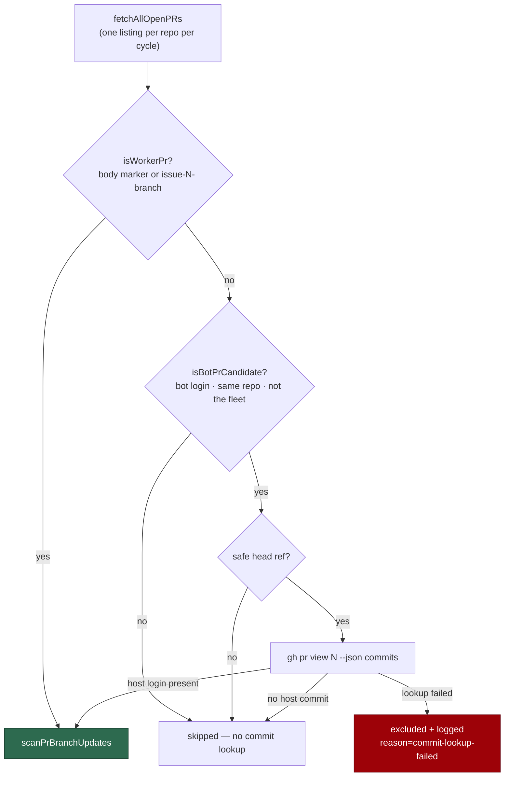

# Branch-update scan keeps host-pushed bot PRs current with their base

## Summary

A dependency bot stops rebasing its own PR the moment a foreign commit lands on
it, so a Dependabot/Renovate PR the worker fixed drifted behind its base until
the merge gate skipped it as "branch not fresh". The branch-update scan
(Priority 1.6) now selects those PRs as well as the worker's own.

- `worker/deno/lib/pr_branch_update.ts` — `isHostPushedBotPr(author,
  isCrossRepository, commitAuthorLogins, githubUser)`: true when the author is a
  bot (`isBotLogin`), the head branch is in the target repo
  (`isCrossRepository === false`), and the commit authors include this host
  (case-insensitive, via `isFleetAuthor`). Its lookup-free half,
  `isBotPrCandidate`, is the single source of the selector's cheap pre-screen so
  the two cannot drift.
- `selectBranchUpdatePrs` — the selection the production `listPrs` runs: worker
  PRs by marker or `issue-<n>-` branch, plus host-pushed bot PRs. The commit
  lookup (`fetchPrCommitAuthorLogins` → `gh pr view <n> --json commits`) is
  issued **only** for bot-authored same-repository PRs, so non-bot PRs cost no
  extra call. A failed lookup **excludes** the PR and is logged — never read as
  "no host commits".
- `worker/deno/lib/run_core_production_deps.ts` — `updateOpenPrBranches`'s
  `listPrs` calls the selector instead of filtering on `isWorkerPr` alone.
- The worker never posts `@dependabot rebase` or any equivalent bot command: it
  recreates the branch and discards the worker's commits. The worker rebases and
  pushes the branch itself.

Closes #1849.

## Evidence

Backend/CLI change with no web interface, so no screenshot applies. Evidence is
the test suites below, plus `./quality.sh` (`Result: PASSED`, config-integration
skip pre-existing).

## Acceptance Criteria

<!-- vibe-spec-review inputs="diff+issue-body" -->

- **met** — Predicate: bot + host commit → true; bot without host commit →
  false; bot + fork head → false; human author with host commit → false;
  fleet-login author → false — evidence:
  `worker/deno/tests/pr_branch_update_test.ts::isHostPushedBotPr - …` (8 cases)
  — reviewer: met
- **met** — Wiring: no commit lookup is issued for non-bot PRs; a bot PR whose
  commit lookup fails is excluded and the failure is logged — evidence:
  `worker/deno/tests/pr_branch_update_bot_prs_test.ts::branch-update selection -
  no commit lookup is issued for a non-bot PR` and `::a failed commit lookup
  excludes the PR and is logged` — reviewer: met
- **met** — Existing `pr_branch_update_*` tests pass unchanged — evidence: the
  six existing suites are untouched (the predicate tests are appended to
  `pr_branch_update_test.ts`); 133 passed, 0 failed — reviewer: met
- **met** — `./quality.sh` passes — evidence: full gate run after the final edit,
  `Result: PASSED` — reviewer: met
- **unrequested** — `docs/HUMAN-PR-POLICY.md` gains a "Keeping a fixed bot PR up
  to date" section and an evidence-table row — reviewer: unrequested — reason:
  the repo standard requires a code change to update the docs surface that
  describes it; this page documents the sibling bot-PR door from #1846
- **unrequested** — `selectBranchUpdatePrs`, `fetchPrCommitAuthorLogins` and
  their two interfaces are exported rather than inlined in `listPrs` —
  reviewer: unrequested — reason: the issue asks for a wiring test, and logic
  inside the production deps closure cannot be driven by one

## Standards Review

<!-- vibe-standards-review inputs="diff+CODING-STANDARDS.md" -->

- **violation** — DRY: the selector's pre-screen restated three gates that
  `isHostPushedBotPr` already owns — evidence:
  `worker/deno/lib/pr_branch_update.ts:549` — reason: fixed here; both now call
  the shared `isBotPrCandidate`
- **violation** — a test pinned the exact `gh` argv (including the `jq` path)
  instead of faking the service — evidence:
  `worker/deno/tests/pr_branch_update_bot_prs_test.ts:80` — reason: fixed here;
  the tests drive `makeGhFake`, which answers only questions `gh` would answer
  and errors on a wrong field or `jq` path
- **violation** — the new doc sentence numbered the branch-update pass 1.27 —
  evidence: `docs/HUMAN-PR-POLICY.md:159` — reason: fixed here; the canonical
  number in `docs/INTERNALS.md` and `docs/OVERVIEW.md` is 1.6
- **violation** — the bot route skipped the `isSafeGitRef` head-ref guard the
  marker route applies (Issue #12) — evidence:
  `worker/deno/lib/pr_branch_update.ts:552` — reason: fixed here, with a
  regression test; the guard is defence in depth ahead of `git_ref_args.ts`
- **violation** — the exclusion log interpolated a raw error message beside a
  sanitised login — evidence: `worker/deno/lib/pr_branch_update.ts:562` —
  reason: fixed here; the message goes through `sanitiseLogField` too
- **violation** — `fetchPrCommitAuthorLogins` throws where the module's
  convention is `Result<T, E>` — evidence:
  `worker/deno/lib/pr_branch_update.ts:450` — reason: stands; it mirrors
  `fetchAllOpenPRs`, whose throw-rather-than-empty-list contract (#4257) is the
  behaviour this lookup must inherit, and the caller converts it to an
  exclusion at the seam
- **clean** — Australian English throughout; secret redaction wired through
  `logger.warn`; fail-closed on unknown head ownership; tests drive the real
  selector and the real `scanPrBranchUpdates` with only `gh` stubbed; happy,
  error and edge cases for every new public function; no hidden paths staged;
  run-id trailer on both commits

## Test Plan

- `worker/deno/tests/pr_branch_update_test.ts` — 8 new `isHostPushedBotPr` cases
  (bot + host commit, case-insensitive match, bot without host commit, fork
  head, unknown head ownership, human author, fleet login, blank inputs).
- `worker/deno/tests/pr_branch_update_bot_prs_test.ts` (new) — 13 wiring cases
  driving the real `selectBranchUpdatePrs` through the real
  `scanPrBranchUpdates`: a bot PR with a host commit reaches the scan and one
  without does not; worker PRs still reach it; no commit lookup for non-bot,
  fork-headed or dash-leading-ref PRs; a failed lookup is excluded and logged and
  does not stop the other PRs; the selection issues no mutating `gh` call; and
  `fetchPrCommitAuthorLogins` reads the commit authors and throws on an
  unparseable or non-array answer.
- Regression suites re-run unchanged: the six existing `pr_branch_update_*`
  files, `pr_branch_arg_injection_test.ts`, `human_pr_policy_docs_test.ts`,
  `run_core_production_deps*_test.ts` — 0 failures.
- `./quality.sh` — `Result: PASSED`.
