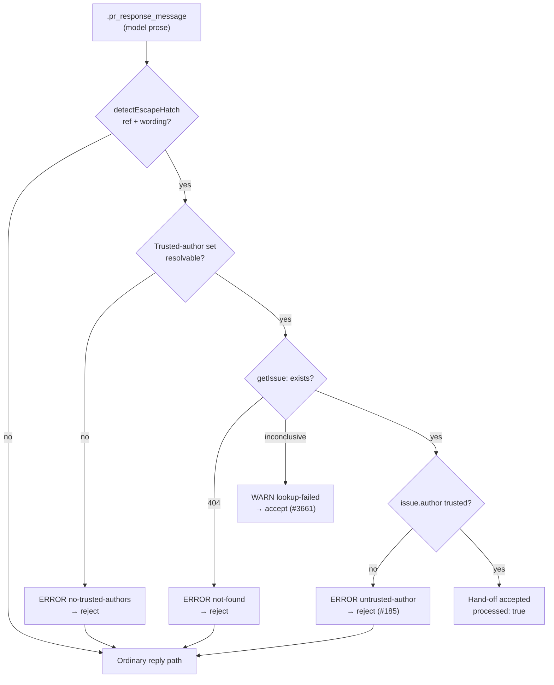

# Forgeable escape-hatch resolution accepts unrelated issues

## Summary

The escape-hatch hand-off was accepted on nothing but issue **existence** plus
the model's own prose. `verifyFollowUpIssueExists()` called
`ghClient.getIssue()` and returned `verified: true` on success, so a
prompt-injected `.pr_response_message` that named any pre-existing issue
("tracked separately in #4321") was recorded as `processed: true`, replied to
as a hand-off, and skipped the escalation genuinely unresolved feedback would
trigger — while also reaching the label-strip mutation on the named issue.

Two changes close the chain:

1. **Authorship gate on the follow-up** (`escape_hatch_verify.ts`). Existence
   alone is forgeable by whoever steers the prompt text; GitHub's record of
   **who filed the issue** is not. The follow-up must be authored by the
   worker's own login, a fleet sibling (`fleet_pr_authors`), or an allowlisted
   human (`allowed_authors`, `authorized_commenters`) — the set resolved by the
   new `resolveTrustedFollowUpAuthors()`
   (`escape_hatch_trusted_authors.ts`, reusing the shared
   `resolveFleetAuthors()` helper). Anything else is rejected at ERROR
   (`reason: "untrusted-author"`) and the run falls through to the ordinary
   reply path. With no allowlist resolvable the gate **fails closed**
   (`reason: "no-trusted-authors"`, logged at ERROR) rather than waving the
   hand-off through. The deliberate #3661 asymmetry survives: an inconclusive
   lookup (timeout, 5xx) still accepts, so a transient API error cannot push
   the worker back into the retry loop the hatch exists to prevent.
2. **Trust gate on the upstream input** (`pr_maintenance.ts`). A
   `CHANGES_REQUESTED` review body was fed straight into the feedback prompt
   with no authorisation check, unlike PR comments. It now passes the same
   `isAuthorisedCommenter` check; an unauthorised reviewer's review is skipped
   with an `UNAUTHORISED_REVIEW_SKIPPED` security log.

**Original trigger closed, no trivial bypass.** The reported attack —
a reviewer's injected text steering the run's message into citing an existing
issue `#N` — now fails at both hops. The review body no longer reaches the
prompt at all unless its author is an authorised commenter, and even if the
message names `#N` by some other route, `#N` is only accepted when GitHub
reports its author as a trusted login. The attacker controls the *number* in
the prose but not the *author* GitHub recorded for that issue, and there is no
looser path: an empty or unresolvable allowlist rejects rather than accepts,
matching is exact (case-insensitive, blank entries dropped, so an empty
allowlist entry cannot act as a wildcard), and no code path skips the gate
before the label-mutation/`processed: true` outcome.

Closes #185.

## Evidence

Backend/CLI change — no web interface to screenshot. Evidence is the test suite.

Hand-off acceptance after the change:



Targeted runs (all green):

```
deno test --allow-all tests/escape_hatch_verify_test.ts \
  tests/escape_hatch_trusted_authors_test.ts \
  tests/pr_feedback_processor_escape_hatch_test.ts \
  tests/pr_maintenance_test.ts
ok | 86 passed | 0 failed
```

`./quality.sh` passes lint, type check, fmt, markdownlint, mermaid and the
chokepoint gates. The `deno tests` gate reports 10 failures in
`setup_workdir_reminder_test.ts`, `fleet_health_test.ts`,
`optional_feature_env_test.ts` and `host_workdir_guard_test.ts` — all
pre-existing and unrelated: the identical 10 fail on a clean `git stash`-ed tree
in this container (they assert on host work-dir layout).

## Test Plan

Regression tests that **fail against the unfixed code and pass after the fix**
(verified by disabling the new gates and re-running):

- `worker/deno/tests/escape_hatch_verify_test.ts::verifyFollowUpIssueExists - rejects an existing issue filed by an untrusted author (Issue #185)`
  — reproduces the flaw at the unit level: the named issue exists, so the
  #3661 existence check passes; only authorship exposes the decoy.
- `worker/deno/tests/pr_feedback_processor_escape_hatch_test.ts::processPrFeedback - a hand-off naming an existing issue filed by an untrusted author is rejected (Issue #185)`
  — end-to-end through `processPrFeedback`: the run is not recorded as a
  resolution, the neutral reply is posted instead, and no label is mutated on
  the attacker-named issue.
- `worker/deno/tests/pr_maintenance_test.ts::findPrCommentsToFix - ignores a CHANGES_REQUESTED review from an unauthorised reviewer (Issue #185)`
  — the injected review body never reaches the feedback prompt.

Supporting tests added:

- `worker/deno/tests/escape_hatch_verify_test.ts::verifyFollowUpIssueExists - accepts a follow-up filed by an allowlisted author (Issue #185)`
- `worker/deno/tests/escape_hatch_verify_test.ts::verifyFollowUpIssueExists - author matching ignores login case (Issue #185)`
- `worker/deno/tests/escape_hatch_verify_test.ts::verifyFollowUpIssueExists - rejects when no trusted author set is available (Issue #185)`
- `worker/deno/tests/escape_hatch_verify_test.ts::isTrustedFollowUpAuthor - matches case-insensitively and rejects strangers`
- `worker/deno/tests/escape_hatch_trusted_authors_test.ts::resolveTrustedFollowUpAuthors - unions the worker, fleet and allowlists`
- `worker/deno/tests/escape_hatch_trusted_authors_test.ts::resolveTrustedFollowUpAuthors - drops blanks and de-duplicates by login case`
- `worker/deno/tests/escape_hatch_trusted_authors_test.ts::resolveTrustedFollowUpAuthors - an unconfigured worker yields an empty set (Issue #185)`
- `worker/deno/tests/escape_hatch_trusted_authors_test.ts::resolveTrustedFollowUpAuthors - an arbitrary reviewer is not trusted`
- `worker/deno/tests/pr_maintenance_test.ts::findPrCommentsToFix - still actions a CHANGES_REQUESTED review from an authorised reviewer (Issue #185)`

Existing tests modified (no test removed or disabled):

- `escape_hatch_verify_test.ts` — every `verifyFollowUpIssueExists` call now
  passes the new required `trustedAuthors` argument, and the fake client's
  issue author is configurable.
- `pr_feedback_processor_escape_hatch_test.ts` — the fixture config now supplies
  `allowed_authors` (the trusted-author source) and the follow-up author is a
  parameter, so the existing hand-off scenarios model a worker-filed follow-up.

## Documentation

- `DESIGN-PRINCIPLES.md` — "Escape hatch for out-of-scope work" gains the
  unforgeable-signal rule, the fail-closed behaviour, and the review-body trust
  gate.
- `docs/workflows/pr-feedback.md` — trigger, discovery and escape-hatch
  paragraphs updated to match the new authorisation and authorship checks.

## Security self-check

- **Input validation** — the follow-up author is compared against an explicit
  allowlist (trimmed, case-insensitive, blanks dropped); the reviewer login goes
  through the existing `isAuthorisedCommenter` allowlist.
- **Secrets** — none added or staged.
- **Injection surface** — no new shell, SQL or filesystem calls; the GitHub read
  uses the existing `gh` client with a parsed repo/number.
- **Authorisation** — this change *adds* authorisation to two paths that had
  none; both fail closed.
- **Error handling** — rejections log a machine-readable reason at ERROR with no
  internal state leaked; no error is swallowed.
- **Dependencies** — none added.
