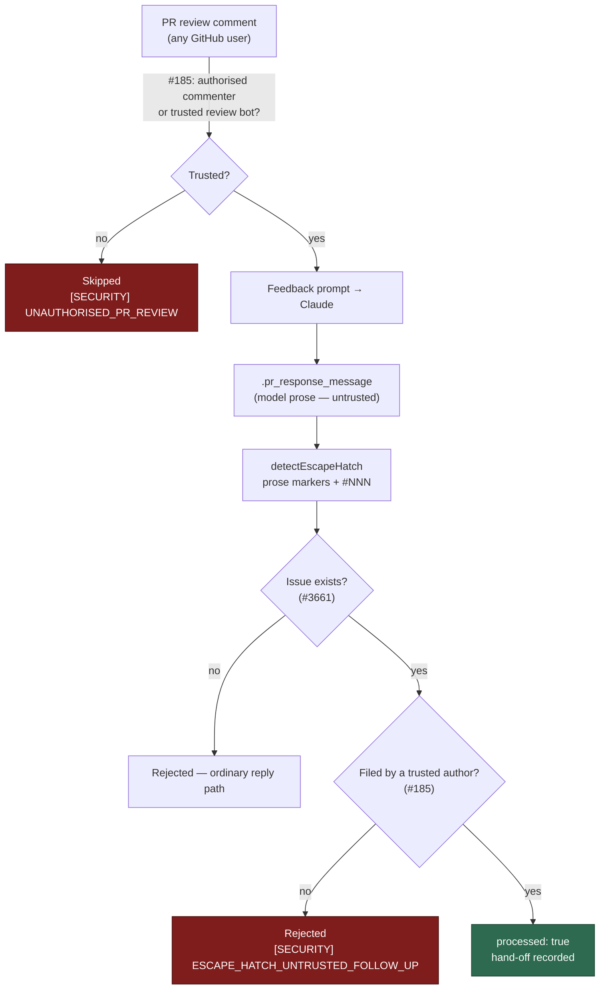

# Forgeable escape-hatch resolution accepts unrelated issues

## Summary

The escape-hatch hand-off was accepted on the *existence* of the issue number
the model wrote, and nothing else. `verifyFollowUpIssueExists` returned
`verified: true, reason: "exists"` the moment `getIssue` succeeded, so a
`.pr_response_message` steered by an injected PR review comment ("tracked
separately in #N") could name any real issue — an attacker's decoy or any issue
already open — and `pr_feedback_processor.ts` recorded the run as
`processed: true`, replied with the model's own text, and mutated labels on the
named issue, skipping the escalation genuinely unresolved feedback would get.

Two gates close the chain, both on signals GitHub attests and the model cannot
forge:

1. **Authorship, not existence.** `verifyFollowUpIssueExists` now also requires
   the referenced issue to have been filed by a trusted account — the host's own
   login, the fleet accounts (`fleet_pr_authors` / `service_accounts`), or an
   allowlisted human (`allowed_authors` / `authorised_commenters`), resolved by
   the new `lib/escape_hatch_trusted_authors.ts`. An untrusted or blank author
   is rejected loudly (`untrusted-author`), and an empty trusted set — no gate to
   apply — is rejected before the lookup (`author-unverifiable`) rather than
   silently degrading to bare existence. The documented #3661 asymmetry is
   unchanged: a definitive 404 still rejects, a transient API error still
   accepts.
2. **The injection surface itself.** `findPrCommentsToFix` fed every
   CHANGES_REQUESTED review body straight into the feedback prompt with no trust
   check, so any reviewer could steer the model's final message. Reviews now
   clear the same check PR comments do — authorised commenter or
   `trusted_review_bots` — and a skipped review logs
   `[SECURITY] UNAUTHORISED_PR_REVIEW`.

Closes #185.

## Evidence

Backend/CLI change — no web interface to screenshot. Evidence is the test suite
below plus the authority chain, which now has an unforgeable check on every hop:



**Regression tests, fail-before / pass-after.** Added
`worker/deno/tests/escape_hatch_verify_test.ts::verifyFollowUpIssueExists - rejects an existing issue filed by an untrusted author (Issue #185)`,
which reproduces the exact trigger — an issue that genuinely exists, filed by
somebody who is not the worker. Run against the unfixed library
(`deno test --no-check` with `lib/escape_hatch_verify.ts` and
`lib/pr_maintenance.ts` reverted) it fails, together with three siblings:

```
verifyFollowUpIssueExists - rejects an existing issue filed by an untrusted author (Issue #185) ... FAILED
verifyFollowUpIssueExists - rejects when the issue author is missing (Issue #185) ... FAILED
verifyFollowUpIssueExists - rejects when no trusted authors are known (Issue #185) ... FAILED
findPrCommentsToFix - ignores a CHANGES_REQUESTED review from an unauthorised reviewer (Issue #185) ... FAILED
FAILED | 69 passed | 4 failed
```

After the fix the same files pass (`ok | 77 passed | 0 failed`), and the
end-to-end processor test
`worker/deno/tests/pr_feedback_processor_escape_hatch_test.ts::processPrFeedback - a hand-off naming somebody else's existing issue is rejected (Issue #185)`
confirms the run is no longer recorded as a resolution and the named issue's
labels are not touched.

**Original trigger is closed, with no trivial bypass.** The attack input — a
hand-off message citing a real, pre-existing issue with escape-hatch phrasing —
now reaches `verifyFollowUpIssueExists`, which rejects it because
`isFleetAuthor(issue.author, trustedAuthors)` is false; only accounts the
operator configured can satisfy it, and the model cannot choose an issue's
author. Equivalent bypasses are closed on the same path: a blank or missing
author fails closed rather than matching, comparison is case-insensitive so
casing tricks do not help, an empty trusted set rejects instead of falling back
to existence, and the pre-existing `not-found` rejection still covers a
hallucinated number. The only remaining accept-on-doubt branch is the
deliberate #3661 `lookup-failed` case (a transient network/rate-limit error,
not attacker-selectable — GitHub answers an inaccessible or missing issue with
404, which rejects). Upstream, the review body that produced the message must
now come from an authorised commenter or a trusted review bot, so the
drive-by-reviewer attacker of the issue's threat model no longer reaches the
prompt at all.

**Full quality gate:** `./quality.sh` passes every check except `deno tests`,
which reports the same 10 pre-existing, environment-dependent failures
(`buildFleetHealthConfig`, `host workdir guard`, `applyOptionalFeatureEnv`,
`remind_obsolete_host_work_dirs`) on a clean checkout of `main` with these
changes stashed. All 14,786 other tests pass.

## Test Plan

- `worker/deno/tests/escape_hatch_verify_test.ts` — added: rejects an existing
  issue filed by an untrusted author (Issue #185); accepts a follow-up filed by
  a trusted account regardless of login casing; rejects when the issue author is
  missing; rejects when no trusted authors are known. Existing cases updated to
  pass the new required `trustedAuthors` argument — none removed or disabled.
- `worker/deno/tests/escape_hatch_trusted_authors_test.ts` (new) — the resolver
  unions host/fleet/allowlisted logins, drops blanks and case-insensitive
  duplicates, resolves an unconfigured fleet to an empty set, and never admits
  an attacker login.
- `worker/deno/tests/pr_maintenance_test.ts` — added: an unauthorised reviewer's
  CHANGES_REQUESTED review is ignored; an authorised reviewer's is still
  actionable; a trusted review bot's stays actionable.
- `worker/deno/tests/pr_feedback_processor_escape_hatch_test.ts` — added the
  end-to-end rejection above; the harness now wires the host login
  (`githubUser`) as production does, so the existing hand-off tests still
  verify.

## Security Self-Check

- **Input validation** — the follow-up ref is still parsed by the existing
  anchored `parseFollowUpIssueRef`; the added check validates the API-reported
  author against a configured allowlist (allowlist, not denylist).
- **Secrets** — none staged; no `.config*.json` or hidden files touched.
- **Injection surface** — no new shell, SQL, or HTTP construction; the only new
  GitHub read is the existing `getIssue` call.
- **Authorisation** — this change *adds* authorisation to two paths that had
  none, matching the check adjacent code already applies.
- **Error handling** — rejections log a reason and a `[SECURITY]` event; no
  stack traces or internal state reach user-facing replies.
- **Dependencies** — none added.
