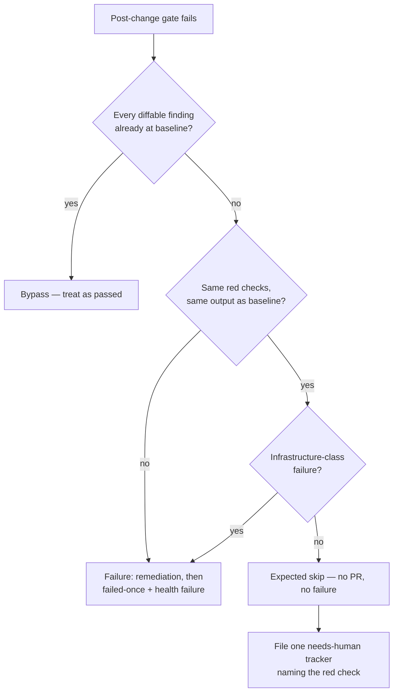

# Pre-existing gate failure: a run no change could have passed is not a worker failure

## Summary

A repository whose **own** quality check is red on its default branch failed
every run at `quality_gate`, recorded a host health failure and left the issue
for the failure cooldown — after which the next claim repeated the same eight
minutes and the same failure. The worker's own diagnostics already said the
failure predated the run (`GRQ-actual-validation#82`).

The baseline-aware bypass (Issues #2604/#1641) could not help: it reasons over
*findings*, which only the diffable checks (mermaid, markdownlint, workflow
hygiene) produce. This change adds the check-agnostic half of the same
question. Closes #1852.

- **`decidePreExistingGateFailure`** (`worker/deno/lib/baseline_gate.ts`)
  compares the post-change gate's failing checks — and what each one printed —
  against the untouched tree's. Same checks red, same lines or fewer, and the
  run reproduced a failure it did not cause.
- **The baseline phase records what each failing check printed**
  (`CheckResult.output`, carried through the content-keyed cache), which is the
  input that comparison needs.
- **A pre-existing failure ends the run as an expected skip**: no PR, no
  `failed`/`failed-once` label, no failure tracking, no repo failure record and
  no host health failure. The issue keeps its labels and takes the ordinary
  bounce cooldown. The remediation attempt is not spent either — no change of
  the agent's can clear a check that fails without it.
- **One deduplicated `needs-human` tracker** names the check that is red on the
  repository's default branch, with its own title and marker so an open
  carryover tracker cannot suppress it.
- **Gate excerpts keep the head as well as the tail** (`redactedHeadTail`): the
  gate names a check as it starts it, so a tail-only excerpt began mid-sentence
  and the log could not say what was red.
- **Fail-closed everywhere else.** A check green at baseline, a red check that
  has gained a line, a baseline with no recorded per-check output, and an
  **infrastructure-class** failure all keep today's behaviour. That last guard
  matters: a host that cannot find `deno` fails the baseline and the post-change
  gate with byte-identical output, so without it a broken *host* would read as a
  broken *repository* — silencing the health failure an operator needs and
  filing a tracker on an innocent repo.

## Evidence

Backend/worker change with no web interface to screenshot. The evidence is the
test suite and the full gate.

- `./quality.sh` — **PASSED** (all checks; `config integration` skipped as it is
  on a clean checkout), run after the final edit.
- 302 tests across the touched suites pass:
  `pre_existing_gate_failure_test.ts`, `quality_gate_phase_pre_existing_test.ts`,
  `baseline_carryover_tracker_test.ts`, `quality_helpers_test.ts`,
  `quality_gate_test.ts`, `baseline_quality_cache_test.ts`,
  `baseline_quality_phase_cache_test.ts`, `redacted_text_test.ts`,
  `issue_worker_test.ts`.

## Reproduction

- **symptom** — a repository whose own quality check is red on its untouched
  default branch fails the gate on every run: the run ends `failure`, a host
  health failure is recorded, and the issue enters the failure cooldown, even
  though the worker logged the failure as pre-existing.
- **status** — `verified` — the regression test was observed **failing against
  the unfixed code** (the new block temporarily removed from
  `quality_gate_remediation_phase.ts`: `status` was `failure`, expected
  `early_exit`) and passing after the fix.
- **regression test** —
  `worker/deno/tests/quality_gate_phase_pre_existing_test.ts::pre-existing gate - the same red check with the same output ends the run as an expected skip`

## Acceptance Criteria

<!-- vibe-spec-review inputs="diff+issue-body" -->

- **met** — same check with the same output (or a strict subset) ends the run as
  a typed pre-existing gate failure — evidence:
  `worker/deno/lib/baseline_gate.ts::decidePreExistingGateFailure`, wired at
  `worker/deno/lib/phases/quality_gate_remediation_phase.ts` — reviewer: met
- **met** — no host health failure — evidence: the run returns `expectedSkip`,
  so `run_core.ts`'s skip path runs no `trackFailure` / `recordRepoFailure` /
  `setStatusFailure`; `quality_gate_phase_pre_existing_test.ts` asserts
  `expectedSkip === true` and `handleIssueFailure` never called — reviewer: met
- **met** — no failure cooldown on the issue — evidence:
  `worker/deno/lib/issue_worker.ts` (quality-gate early exit → `expectedSkip`),
  which takes the bounce path, not the failure path — reviewer: partial —
  reason: the reviewer is right that the bounce path still writes the flat
  600 s retry cooldown; that is the ordinary skip cooldown, not the failure
  cooldown (no failure tracking, no repo failure record, no `failed-once`), and
  suppressing it entirely would return the issue to the pool to repeat the same
  doomed run every scan. The docs and the code comment were corrected to say
  exactly this rather than "no cooldown".
- **met** — the issue is released untouched so a human can fix the repo's gate
  first — evidence: the early exit carries no `qualityFailureMessage`, so
  `handleIssueFailure` (and with it the `failed` / `failed-once` labelling) is
  never reached — reviewer: met
- **met** — one marker-deduped comment or issue on the repo naming the red check
  — evidence: `fileRedCheckTracker` +
  `baseline_carryover_tracker_test.ts::fileRedCheckTracker - files one tracker naming each red check`
  — reviewer: partial — reason: the reviewer found the tracker shared its title
  and marker with the #2605 findings tracker, so an open findings tracker would
  have suppressed it; fixed in this diff — the red-check tracker now has its own
  title and marker, covered by
  `fileRedCheckTracker - an open findings tracker does not suppress it`.
- **met** — the head of the gate output survives in the captured excerpt —
  evidence: `redactedHeadTail` in `worker/deno/lib/redacted_text.ts`, used by
  both log sites and the failure snippet; `redacted_text_test.ts` — reviewer: met
- **met** — a genuinely new failure keeps today's behaviour — evidence:
  `new_failing_check` / `new_output` in `baseline_gate.ts`, with four negative
  phase tests — reviewer: met
- **met** — the log says which check is red — evidence: the
  `pre_existing_gate_failure: <checks>` reason and the `checks` log field in
  `quality_gate_remediation_phase.ts` — reviewer: met
- **met** — regression test: baseline X → pre-existing; baseline X ∪ {D} →
  failure as today — evidence:
  `quality_gate_phase_pre_existing_test.ts` (both directions) and
  `pre_existing_gate_failure_test.ts` (the pure decision, nine cases) —
  reviewer: met
- **unrequested** — the remediation attempt is skipped rather than spent —
  reviewer: unrequested — reason: the decision runs on the first failing
  attempt; a fix run cannot clear a check that fails on the untouched tree, so
  spending one costs the fleet eight minutes for a guaranteed no-op.
- **unrequested** — output normalisation (ANSI stripping, whitespace collapse,
  `⏱` timing lines dropped, durations replaced) — reviewer: unrequested —
  reason: without it the gate's own per-check duration lines differ on every run
  over identical content and the comparison could never fire. Trade-off
  accepted: two outputs differing only in a duration token compare equal.
- **unrequested** — the baseline cache persists `failedChecks` (bounded and
  redacted) — reviewer: unrequested — reason: the cached baseline is the common
  path, so without it the comparison would be unarmed whenever the baseline was
  reused. The cache version is deliberately not bumped: the field is optional
  and its absence is fail-closed, so existing entries stay valid.
- **unrequested** — `recordCheck` gained an optional `output` parameter that is
  preserved when omitted — reviewer: unrequested — reason: it is how the gate
  records what a failing check printed; the preserve-on-omit rule stops a
  status-only re-record erasing it. Five tests added in
  `quality_helpers_test.ts`.
- **unrequested** — the deno-missing gate message is reworded to "not installed
  or not in PATH" — reviewer: unrequested — reason: it made
  `detectFailureCategory` classify a missing toolchain as `missing_tools`
  (infrastructure) instead of `unknown`, which is what lets the guard above tell
  a broken host from a broken repository.
- **unrequested** — the reviewer flagged the `no_pr_expected` outcome as
  unreachable because `processIssue` drops the outcome for skips — reviewer:
  unrequested — reason: it is reachable, and load-bearing.
  `worker/deno/lib/issue_worker.ts:152` passes it to `stopHeartbeat`, which
  parks it for the release-marker comment (`heartbeat.ts:288`); without it,
  `deriveRunOutcome` would classify the run as a `quality_check` **failure** on
  that comment. Kept, and this is the one verdict departed from.

## Standards Review

<!-- vibe-standards-review inputs="diff+CODING-STANDARDS.md" -->

- **violation** — no `docs/archive/pr-summaries/pr-summary-1852.md` — evidence:
  the file was absent when the reviewer ran — reason: this file; written after
  the code was committed, as the workflow prescribes.
- **violation** — modified public function `recordCheck` had no test for the new
  parameter or the preserve-on-omit edge case — evidence:
  `worker/deno/lib/quality_helpers.ts:104` — reason: fixed here; five tests
  added to `worker/deno/tests/quality_helpers_test.ts`.
- **violation** — `runQualityGate` now populates `CheckResult.output` and no
  test exercised the real gate doing so (every test faked it) — evidence:
  `worker/deno/lib/quality_gate.ts:1512` — reason: fixed here;
  `quality_gate_test.ts::runQualityGate - a FAILED check carries the output it printed`
  runs the real gate and asserts failing checks carry output and others do not.
- **violation** — duplicated magic excerpt budgets `(250, 500)` across two
  modules, with a third variant beside them — evidence:
  `worker/deno/lib/phases/baseline_quality_phase.ts:104` — reason: fixed here;
  `GATE_EXCERPT_HEAD_CHARS` / `GATE_EXCERPT_TAIL_CHARS` are shared from
  `quality_helpers.ts`, and the snippet pair is named where it is used.
- **violation** — Boy Scout: the bullet being edited carried a broken reference
  `(generalised in )` — evidence: `docs/INTERNALS.md:3579` — reason: fixed here
  to `(generalised in Issue #2604)`.
- **clean** — Australian English throughout; fail-loud (the decision is
  fail-closed on every unknown, the tracker's swallow-and-log is the documented
  non-fatal sibling contract and logs the `gh` error); test quality (no source
  grepping, no sleeps, no wall-clock budgets — the one slow test was traced to
  the infra-retry backoff and zeroed); secret redaction (masked before every
  comparison and before every truncation, `redactedHeadTail` registered in
  `redact_truncate_order_check.ts`); docs updated alongside the code; no hidden
  paths staged; no new `lib/` module, so no sweep-ledger registration owed;
  commit carries the issue reference and the `Vibe-Coder-Run-Id` trailer.

## Test Plan

Added:

- `worker/deno/tests/pre_existing_gate_failure_test.ts` — 13 tests over the pure
  decision and its normalisation: the two acceptance directions, subset of red
  checks, timings-only difference, secret masking, and every fail-closed case.
- `worker/deno/tests/quality_gate_phase_pre_existing_test.ts` — 6 phase-level
  tests through the real wiring: the expected-skip exit (no failure path, no
  Claude fix run, one tracker), a new line, a newly-red check, a clean baseline,
  an unattributed baseline, and an infrastructure-class failure.

Extended:

- `baseline_carryover_tracker_test.ts` — the red-check tracker files, dedups on
  its own title, is not suppressed by an open findings tracker, and is
  non-fatal.
- `baseline_quality_cache_test.ts` — `failedChecks` round-trip, absence,
  per-check redaction and bound, list cap, malformed-entry rejection.
- `baseline_quality_phase_cache_test.ts` — the baseline records what each
  failing check printed, writes it to the cache, reuses it, and stays unarmed
  for a pre-#1852 cache entry.
- `quality_helpers_test.ts` — `recordCheck` output semantics (5 tests).
- `quality_gate_test.ts` — the real gate records output for FAILED checks only.
- `redacted_text_test.ts` — `redactedHeadTail` keeps both ends, returns short
  text whole, masks tokens straddling either cut, and handles zero budgets (that
  last test caught a real `slice(-0)` bug during development).
