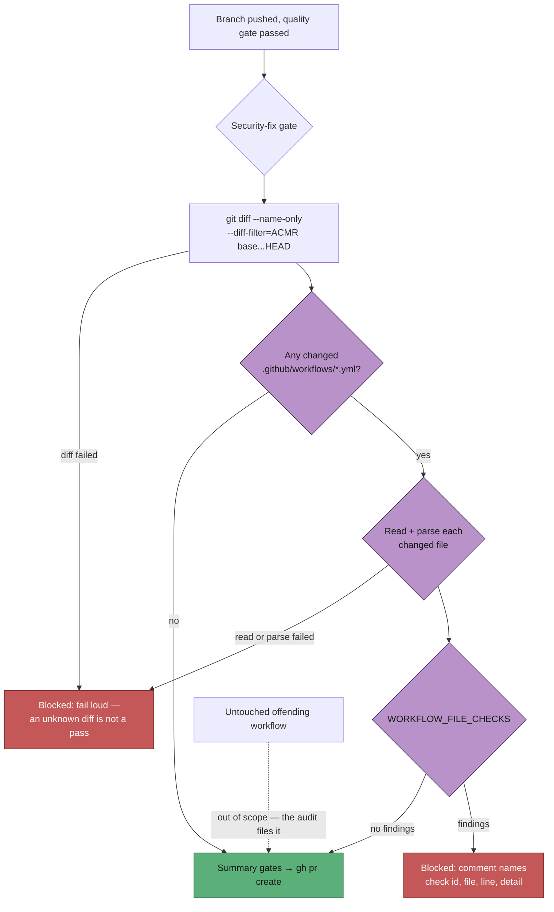

## Summary

Adds a pre-PR gate that runs every entry in `WORKFLOW_FILE_CHECKS` over the
`.github/workflows/` files a worker run added or changed, before
`gh pr create`, and fails loud on any finding. #1755 hardened the provisioning
path by construction only — templates, filing-time pin resolution and a prompt
rule, all of them instructions an LLM run follows rather than a gate. A run that
embellishes what it was given, or writes a workflow no template produces, still
shipped a file the `github-actions-audit` idle task filed a finding against days
later, in a repository the fleet does not own. Closes #1859.

- `worker/deno/lib/changed_workflow_gate.ts` — the seam: an injected
  diff/file reader in, a verdict out. Only `*.yml`/`*.yaml` **directly** under
  `.github/workflows/` are in scope, deletions are excluded
  (`--diff-filter=ACMR`), and a failed diff, an unreadable file, an unparseable
  file or a check that throws each produce `ok: false` with a named error —
  never "no findings". The rendered message goes through `redactSecrets()`.
- `worker/deno/lib/phases/completion_phase.ts` — wires it in beside the
  security-fix gate, ahead of the three summary gates: a workflow finding is a
  defect in the change, not a documentation shortfall, so it stops the run
  whether or not a PR exists. When the base ref is unresolvable in the clone the
  gate stands down at ERROR, matching the ahead-of-base guard beside it.
- Docs: `docs/workflows/issue-processing.md` (new section plus the amended
  gate-order diagram), `docs/EXTENDING.md`, and the module's security sweep in
  `docs/audits/`.

**Behaviour on pre-existing findings** (the decision the issue asked for): only
files the run touched are in scope. An untouched offender never blocks an
unrelated PR — the idle-task audit files those.

## Evidence

Backend/CLI change with no web interface, so there is no screenshot to capture.
The evidence is the test suite below plus a green `./quality.sh` (all checks
`PASSED`, `config integration` skipped as usual — no `.config.json` in the
worktree).

## Acceptance Criteria

<!-- vibe-spec-review inputs="diff+issue-body" -->

- **met** — a run that changes a workflow file carrying a finding raises no PR,
  and the failure names the check id, file and line — evidence:
  `worker/deno/tests/completion_phase_changed_workflow_gate_test.ts::completion - a changed workflow carrying a finding raises no PR`
  (asserts `prCreateCalls === 0`, `BP-SHA-PIN-actions-checkout` and
  `.github/workflows/ci.yml:18` in both the reason and the issue comment) —
  reviewer: met
- **met** — a run that changes a clean workflow file, or no workflow file at
  all, is unaffected — evidence:
  `worker/deno/tests/completion_phase_changed_workflow_gate_test.ts::completion - a changed workflow with no finding raises the PR`
  and `::completion - a run that changes no workflow file is unaffected` —
  reviewer: partial — reason: the reviewer found that an unresolvable base ref
  would have failed *any* run; fixed after the review
  (`completion_phase.ts` now stands the gate down at ERROR) and covered by
  `::completion - an unresolvable base ref stands the gate down, not the run`
- **met** — tests cover the pass, block, out-of-scope-file and read-failure
  paths — evidence: `worker/deno/tests/changed_workflow_gate_test.ts` (23 tests,
  including one seeded fixture per check family and a guard asserting no family
  is untested) plus the six live-phase tests — reviewer: met
- **met** — `./quality.sh` passes — evidence: full gate run after the final
  edit, `Result: PASSED (with skipped checks)` — reviewer: missing — reason: the
  reviewer ran the gate against the first commit, where the new module was
  unclaimed in `docs/audits/lib-sweep-coverage.json`; the slice and its written
  sweep were added and the gate is green
- **unrequested** — an unparseable changed workflow file blocks — reviewer:
  unrequested — reason: the issue names read and collection failures; a file the
  structural checks cannot inspect decided nothing, so reporting it as a pass
  would be the masked fault the fail-loud standard forbids
- **unrequested** — a `..` path segment is refused before it can reach a
  filesystem read — reviewer: unrequested — reason: the caller turns a path from
  this list into `Deno.readTextFile`, and git never emits such a path, so it is
  a cheap defence-in-depth guard on a new sink
- **unrequested** — findings a check anchors to a file outside the changed set
  are dropped — reviewer: unrequested — reason: it is the enforcement of the
  issue's own scope rule ("an untouched offender must not block an unrelated
  PR") for any check that reasons across the set it is handed
- **unrequested** — the block also posts a comment on the issue — reviewer:
  unrequested — reason: every other PR gate tells the issue thread why, so the
  next attempt has the check id and line rather than one host's log; a failed
  comment is logged and the block still stands
- **unrequested** — the "security gate is the deliberate exception" prose in
  `docs/workflows/issue-processing.md` was rewritten — reviewer: unrequested —
  reason: that sentence became false the moment a second non-summary gate
  existed; leaving it would be the docs drift the standards forbid

## Standards Review

<!-- vibe-standards-review inputs="diff+CODING-STANDARDS.md" -->

- **violation** — the new module was claimed by no sweep slice, so
  `deno task check:manifests` failed — evidence:
  `worker/deno/lib/changed_workflow_gate.ts:1` — reason: fixed here — slice
  `12p` added to `docs/audits/lib-sweep-coverage.json` with its written record
  in `docs/audits/security-sweep-1859-changed-workflow-gate.md`
- **violation** — an outbound sink posted un-redacted subprocess output (a
  `git` stderr tail could reach an issue comment and the run record) — evidence:
  `worker/deno/lib/phases/completion_phase.ts:1473` — reason: fixed here — the
  message builder is now the chokepoint and passes the whole message through
  `redactSecrets()`
- **violation** — DRY: the wiring re-implemented `runGitOrThrow`, the phase's
  own adapter used by the security gate 80 lines above — evidence:
  `worker/deno/lib/phases/completion_phase.ts:1445` — reason: fixed here — the
  gate calls `runGitOrThrow`, which is also why the injected seam is documented
  as throwing rather than returning a `Result`
- **violation** — coverage: the traversal refusal and the finding-list
  truncation had no test — evidence:
  `worker/deno/lib/changed_workflow_gate.ts:68` and `:178` — reason: fixed here
  — three tests added (nested path out of scope, traversing path refused,
  over-cap finding list truncated with `…and N more`)
- **violation** — a stale in-code count: "the four PR gates" after a fifth was
  inserted — evidence: `worker/deno/lib/phases/completion_phase.ts:1352` —
  reason: fixed here
- **violation** — the test file's prose called itself "integration tests" while
  the manifests classify it as a unit test — evidence:
  `worker/deno/tests/completion_phase_changed_workflow_gate_test.ts:2` — reason:
  fixed here — the header now says what it is, tests of the gate running in the
  live completion phase
- **violation** — the temp directory leaked when a test failed — evidence:
  `worker/deno/tests/completion_phase_changed_workflow_gate_test.ts:158` —
  reason: fixed here — the run is wrapped in `try`/`finally`
- **clean** — Australian English throughout; no grep-the-source tests (every
  test drives a real function and asserts on the verdict or on whether
  `gh pr create` ran); no existing test removed or commented out; fail-loud on
  every non-deciding path; no hidden or credential paths staged; unit-test
  hygiene (no env mutation, no sleeps, no wall-clock budgets, no subprocess);
  module/test pairing; `deno fmt`, `deno lint`, `deno check` and markdownlint
  all clean.

Two limitations were reported and are documented rather than fixed, in the
module header and the sweep record: a check that reasons across the whole
workflow set (`scanGitleaksDrift`'s "no gitleaks workflow has a `pull_request`
trigger", `findVersionCommentDrift`'s repo-wide pin comparison) sees only the
changed subset here, so it can over- or under-report against the idle-task
audit; and composite actions under `.github/actions/` stay out of scope, as the
issue scoped this to `.github/workflows/`.

## Test Plan

- Added `worker/deno/tests/changed_workflow_gate_test.ts` — 23 tests over the
  collection and reporting seam with an injected diff/file reader: a clean
  changed file passes; one seeded finding per check family blocks (with a guard
  test asserting every family in `WORKFLOW_FILE_CHECKS` has a fixture); a
  changed file the run did not touch is ignored; a nested or traversing path is
  out of scope and never read; a failed diff, an unreadable file and an
  unparseable file each fail loud; one bad file does not hide the others; and an
  over-cap finding list is truncated with a count.
- Added `worker/deno/tests/completion_phase_changed_workflow_gate_test.ts` — six
  tests driving the live `workOnIssueCompletion`: a finding blocks `gh pr create`
  and names the check id, file and line on the issue; a clean workflow and a run
  with no workflow change raise the PR; a pre-existing offender does not block an
  unrelated PR; an unreadable changed workflow fails loud; an unresolvable base
  ref stands the gate down rather than failing the run.
- `./quality.sh` — `Result: PASSED (with skipped checks)`.
