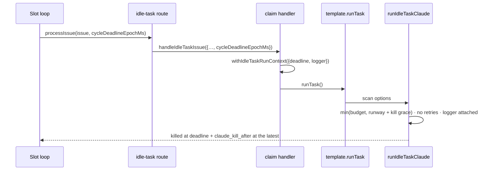

# Idle-task Claude runs are bounded by the cycle deadline and log progress

## Summary

An idle-task scan claimed five minutes before the cycle deadline received the
flat `IDLE_TASK_TIMEOUT_SECONDS` (3600 s) budget, ran ~15 min past the hour with
the worker log silent, and held its slot so the pool could not drain — the
hourly refresh (and the pick-up of new worker code) waited on it.

The cycle deadline now reaches the scan's Claude invocation, and the worker
logger with it. Closes #186.

- **`lib/idle_task_claude_budget.ts`** — new ambient run context
  (`withIdleTaskRunContext({ cycleDeadlineEpochMs, logger }, fn)`).
  `resolveIdleTaskBudget` bounds the timeout to
  `min(requested, runway + claude_kill_after)`, floored at
  `EXECUTE_TIMEOUT_FLOOR_SECONDS` (60 s) — the same
  `resolveExecuteTimeoutSeconds` rule the execute phase applies (Issue #4254) —
  and fills in a logger so the runner's per-minute `[agent-progress]` lines have
  a sink. The clamp is announced once on that logger.
- **`runIdleTaskClaude`** — suppresses retries when the deadline binds. The
  timeout is resolved once and reused by every attempt, so a retry after a
  rate-limit back-off (up to 10 min) would run the bounded budget again from
  past the deadline. A scan has no work-in-progress to protect.
- **`lib/idle_task_claim_handler.ts`** — accepts `cycleDeadlineEpochMs` and
  publishes the context around `template.runTask()`, beside the existing
  write-repo allowlist seeding. The context is ambient rather than threaded
  through all seventeen templates, for the same choke-point reason the budget
  itself is: a template cannot forget to pass what it never sees. It is removed
  in `finally` by identity, so a concurrent slot finishing first cannot strip
  its sibling's bound.
- **`lib/idle_task_process_issue_route.ts` / `lib/run_core_production_deps.ts`**
  — forward the cycle deadline the slot loop already has.
- **`lib/security_scanner.ts`** — invokes `runIdleTaskClaude` instead of
  `withIdleTaskBudget` + a bare `deps.runClaudeFn(...)`, so the one scan with an
  injectable runner picks up the deadline bound, the logger, and the no-retry
  rule too.

**Defect 2 (the unbounded drain)** needs no change to `drainSlots`: with the
scan bounded, the slot's Claude run cannot outlive the deadline by more than
`claude_kill_after`, so the deadline drain finishes on its own. **The claim
floor** the issue asks for already applies — idle-task wrappers are claimed
through the same Priority-2 pool gate (`slotShouldStop` →
`resolveClaimRunwayFloor`, `MIN_CLAIM_RUNWAY_SECONDS`, default 300 s), so no
second gate was added.

Not changed: `container_watchdog.ts` / the launcher's `maxRunSeconds`. The issue
flagged it as "worth checking"; it is a separate host-side backstop and nothing
in this fix depends on it.

## Evidence

Backend/worker change — no web interface to screenshot. Verified by the tests
below (`deno test`), plus `./quality.sh`.



Operator-visible line when the clamp fires (from the test run):

```text
[idle-task] security_scan bounded to 330s by the cycle deadline (requested
3600s) — an idle-task scan has no work-in-progress to preserve, so it must not
outlive the cycle (Issue #186)
```

`./quality.sh < /dev/null` — all gates pass except `deno tests`, which reports
**10 pre-existing environment-dependent failures** unrelated to this change
(`fleet_health_test.ts`, `host_workdir_guard_test.ts`,
`optional_feature_env_test.ts`, `setup_workdir_reminder_test.ts`). Confirmed
pre-existing: the same 10 fail on the unmodified tree (`git stash`, re-run →
`FAILED | 63 passed | 10 failed`). Every other test passes
(`14727 passed`), including all new ones.

## Test Plan

`worker/deno/tests/idle_task_claude_budget_test.ts` (new cases):

- bounds the scan to the runway left in the cycle (300 s runway →
  `300 + claudeKillAfter`, not 3600 s)
- keeps the full budget when the cycle has plenty of runway
- bounds an explicit caller `timeoutSeconds` too
- floors a past deadline at `EXECUTE_TIMEOUT_FLOOR_SECONDS` rather than zero
- announces the clamp on the context logger; stays silent when it does not bind
- `resolveIdleTaskBudget` reports `deadlineBound`
- scans always reach the runner with a logger; an explicit caller logger
  outranks the context; a scan outside any context still gets one
- retries suppressed (`maxRetries: 0`) once the deadline binds, other retry
  settings preserved
- the run context is removed when the body throws, and a concurrent slot
  finishing first leaves its sibling bounded

`worker/deno/tests/idle_task_claim_handler_test.ts` (new cases):

- the cycle deadline bounds the scan's Claude budget, and the context does not
  outlive the run
- no cycle deadline leaves the full idle-task budget
- the worker logger reaches the scan so progress is logged
- a throwing `runTask` still clears the run context

`worker/deno/tests/idle_task_process_issue_route_test.ts` (new cases):

- forwards the cycle deadline to the claim handler
- omits the key entirely when the caller has no deadline

Existing suites re-run unchanged: `idle_task_template_budget_3657_test.ts`
(the #3657 budget guard) and `security_scanner_test.ts`.
