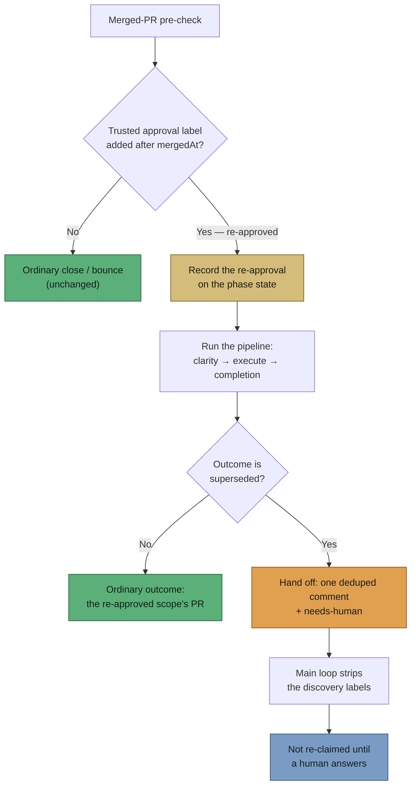

## Summary

An issue re-labelled `work-on` after its PR merged was re-claimed every cycle
for an empty agent run. Two rules, each right on its own, combined into the
loop: the merged-PR pre-check honours a re-approval and keeps the issue open
(#1618), and the superseded release honours the merge (#218) — and nothing in
between asked what the re-approval was *for*. On GRQ-AutoTrader#106 that cost
three Opus invocations in four hours, each a "success" with no output, no
comment and the label untouched.

The pre-check now records the post-merge re-approval on the phase state, and
the orchestrator — the one point that sees both facts — hands a run that
**then** ends superseded to a human: one marker-deduped comment naming the PR
that resolved the issue and asking what the re-approval should change,
`needs-human` applied through the shared escalation chokepoint, and the
discovery labels stripped by the main loop's existing
`stripDiscoveryLabelsOnEscalation`. Both facts are required — a re-approved run
that raised a PR was worked normally, and a superseded release with no
re-approval is the ordinary #218 stop. Closes #1862.

## Evidence

Backend/worker change with no web interface to screenshot. The evidence is the
test suite below, all run headless with stdin closed.



Command output — the three new/extended suites, 49 cases:

```
deno test --allow-all tests/reapproval_superseded_handoff_test.ts \
  tests/reapproval_superseded_loop_1862_test.ts \
  tests/merged_pr_precheck_reapproval_test.ts \
  tests/lib_sweep_coverage_test.ts < /dev/null
ok | 49 passed | 0 failed (426ms)
```

## Reproduction

- **symptom** — GRQ-AutoTrader#106, resolved by PR #116 (merged 09:35Z) and
  re-labelled `work-on` at 15:49Z, was claimed on every scan cycle: the
  pre-check logged "NOT closing — approval post-dates merge", a fresh agent
  found nothing to change, the level branch was released as superseded, the run
  was recorded a success with no comment and the label untouched, and the next
  cycle claimed it again.
- **status** — `verified` — `tests/reapproval_superseded_loop_1862_test.ts`
  drives the whole `workOnIssue` pipeline in that exact shape. Two of its three
  cases were observed failing with the orchestrator hand-off removed from
  `lib/issue_worker.ts` (0 comments posted, no `needs-human`) and passing with
  it restored; `merged_pr_precheck_reapproval_test.ts::records the re-approval
  and the merged PR on the phase state (Issue #1862)` was likewise observed
  failing with the state-recording block removed and passing with it restored.
- **regression test** —
  `worker/deno/tests/reapproval_superseded_loop_1862_test.ts::workOnIssue - a
  re-approved run that ends superseded is handed to a human once (Issue #1862)`

## Acceptance Criteria

<!-- vibe-spec-review inputs="diff+issue-body" -->

- **met** — a re-approved issue whose fresh run ends superseded gets one
  explanatory comment — evidence:
  `worker/deno/tests/reapproval_superseded_loop_1862_test.ts::workOnIssue - a re-approved run that ends superseded is handed to a human once (Issue #1862)`
  — reviewer: met
- **partial** — and is not claimed again until a trusted author comments —
  evidence:
  `worker/deno/tests/reapproval_superseded_handoff_test.ts::the escalated issue is dropped by discovery on the next scan (Issue #1862)`
  — reviewer: partial — reason: the issue is genuinely never re-claimed, but the
  hold is `needs-human` plus the main loop's discovery-label strip, so a human
  releases it by label surgery rather than by commenting; that is the fleet's
  only hold mechanism (the clarity gate's own next step is worded the same way),
  and the comment spells out both steps.
- **partial** — a reply with new direction is worked normally — evidence:
  `worker/deno/lib/reapproval_superseded_handoff.ts:112` asks for the remaining
  scope in the issue description — reviewer: missing — reason: the reviewer is
  right that a *comment* never reaches the agent —
  `IssuePromptOptions` in `lib/prompt_builder.ts` has no `issueComments` field,
  so `execute_phase.ts:432` passes title, body and labels only. That is a
  separate root cause, filed as stSoftwareAU/VibeCoder#1910; this diff closes
  the gap it can by asking the human to put the scope in the description, which
  is the text the agent is given. Recorded as `partial`, not `met`.
- **met** — regression test: merged PR, `work-on` re-added after the merge,
  agent produces no change → superseded release, one comment with the marker,
  the next scan skips the issue; a second run never posts a second comment —
  evidence:
  `worker/deno/tests/reapproval_superseded_loop_1862_test.ts` (3 cases,
  including `a repeat run posts no second comment`) plus the `filterAndSort`
  skip case in `reapproval_superseded_handoff_test.ts` — reviewer: met
- **unrequested** — the message names a superseding PR that differs from the
  one the pre-check saw (`reapproval_superseded_handoff.ts:95`) — reviewer:
  unrequested — reason: a sibling PR can merge mid-run, and a comment giving two
  numbers for one fact reads as a bug; four lines and two tests, kept.
- **unrequested** — the pre-check's local `PostMergeApproval` interface became
  `Omit<PostMergeReapproval, "prNumber" | "mergedAt">`
  (`merged_pr_precheck_phase.ts:281`) — reviewer: unrequested — reason: the two
  shapes would otherwise be duplicated field-for-field and drift; DRY, and the
  carrier has to live in the module both sides import.
- **unrequested** — the new module is registered in
  `docs/audits/lib-sweep-coverage.json` with its own sweep record — reviewer:
  unrequested — reason: house rule, not a choice: `check:manifests` fails on any
  `lib/` module no sweep slice claims.

## Standards Review

<!-- vibe-standards-review inputs="diff+CODING-STANDARDS.md" -->

- **violation** — the new `lib/` module was claimed by no sweep slice, so
  `deno task check:manifests` (and `tests/lib_sweep_coverage_test.ts`) failed —
  evidence: `worker/deno/lib/reapproval_superseded_handoff.ts:1` — reason: fixed
  here — chunk `12p` added to `docs/audits/lib-sweep-coverage.json` with its
  written record at `docs/audits/security-sweep-1862-reapproval-superseded-handoff.md`.
- **violation** — `docs/archive/pr-summaries/pr-summary-1862.md` was missing —
  evidence: this file — reason: fixed here.
- **violation** — `isSupersededOutcome` was exported with no consumer outside
  its own module and no direct test — evidence:
  `worker/deno/lib/reapproval_superseded_handoff.ts:129` — reason: fixed here —
  un-exported; it has one caller, in the same module, and its `undefined` and
  non-superseded branches are exercised through `escalateReapprovalSuperseded`.
- **violation** — `formatUnixSeconds` guarded `!Number.isFinite` but
  `toISOString` still throws `RangeError` for a finite out-of-range value, and
  the call sat outside any `try` — evidence:
  `worker/deno/lib/reapproval_superseded_handoff.ts:73` — reason: fixed here —
  the conversion is guarded and degrades to the raw value, with
  `buildReapprovalSupersededEscalation - an unusable re-approval time degrades to its raw form`
  covering both shapes.
- **clean** — Australian English throughout the added lines; tests call real
  code (the loop suite drives the whole `workOnIssue` pipeline) with no
  source-grepping; no wall-clock sleeps and no absolute timing assertions; the
  dedup clock is injected where the window matters; no hidden paths staged; no
  catch-and-ignore introduced — the escalation's non-fatal behaviour routes
  through the pre-existing `escalateToHuman` chokepoint, which logs every
  failure; `needs-human` is never applied outside that chokepoint; docstrings on
  the module, every interface field and every exported function; new module
  under 200 lines; the docs owed by the change (`docs/workflows/issue-processing.md`,
  its Mermaid flowchart and its implementation links) updated in the same
  commit; `deno fmt --check`, `deno lint` and `deno check` clean.

## Test Plan

- **New** `worker/deno/tests/reapproval_superseded_handoff_test.ts` (12 cases) —
  the message builder (the resolving PR, the re-approval, the request, the
  stable dedup key, a differing superseding PR, an unusable timestamp), the
  escalation itself (one marker-deduped comment + `needs-human`, no second
  comment on a repeat, no hand-off without a re-approval, no hand-off when the
  run raised a PR or failed, a throwing client reported rather than raised), and
  the discovery filter dropping the escalated issue.
- **New** `worker/deno/tests/reapproval_superseded_loop_1862_test.ts` (3 cases)
  — the whole `workOnIssue` pipeline in the GRQ-AutoTrader#106 shape: the
  hand-off fires once with the marker and the label and states itself on the
  claim release; a repeat run posts no second comment; an approval that
  pre-dates the merge takes the ordinary path with no hand-off.
- **Extended** `worker/deno/tests/merged_pr_precheck_reapproval_test.ts`
  (+2 cases) — the pre-check records the re-approval and the merged PR on the
  phase state, and records nothing when the approval pre-dates the merge.
- No existing test was modified or removed.
