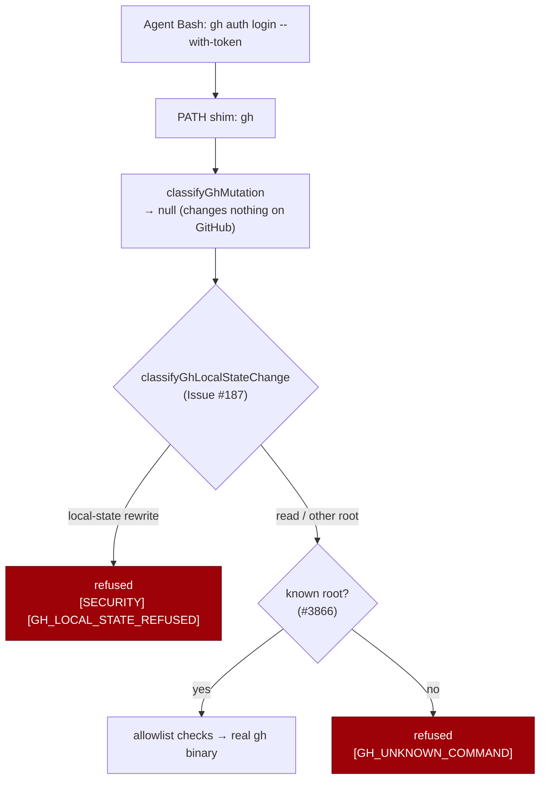

# Refuse local `gh` state rewrites from the agent subprocess

## Summary

The agent-side `gh` guard classified `gh auth login`, `gh auth switch` and
`gh auth setup-git` as plain reads and allowed them unconditionally.
`evaluateGhCommand` only enforces its controls when `classifyGhMutation`
returns a mutation, and that classifier knows mutations made **on GitHub** —
`auth`, `config`, `alias` and `extension` have no entry in `GH_MUTATING_VERBS`,
and none of `login`, `logout`, `switch`, `setup-git`, `refresh` or `install`
appears in `GH_GENERIC_MUTATING_VERBS`. `auth` *is* a recognised root, so the
`GH_UNKNOWN_COMMAND` check passed it too, and the call reached the real binary.

That is not a read. `gh_guard_shim.ts` pins `GH_CONFIG_DIR` to the worker's own
persistent identity directory, so a credential written there outlives the spawn
that wrote it and re-points every later `gh` call — the worker's included;
`setup-git` carries the same redirection into `git push`; and a config, alias or
extension write changes what a later `gh <name>` runs (the gap at the other end
of the `GH_UNKNOWN_COMMAND` check from Issue #3866).

`worker/deno/lib/gh_local_state_guard.ts` now classifies these local-state
rewrites and `evaluateGhCommand` refuses them **unconditionally** — before the
unknown-root check, and whether or not the write-repo allowlist is active — with
`[SECURITY] [GH_LOCAL_STATE_REFUSED]`. This is the same unattended-operation
invariant `interactive_login_scanner.ts` holds the worker's own source to,
applied at the runtime guard: credentials are provisioned once, non-interactively,
by `setup.sh` and consumed read-only. Read verbs (`gh auth status`,
`gh config get`, `gh alias list`, `gh extension list`) are untouched — the
worker's health checks depend on them — and ordinary GitHub writes are
unaffected.

Closes #187.

### Refused verbs

| Root | Refused | Still allowed |
| --- | --- | --- |
| `auth` | `login`, `logout`, `switch`, `refresh`, `setup-git` | `status`, `token` |
| `config` | `set`, `clear-cache` | `get`, `list` |
| `alias` | `set`, `delete`, `import` | `list` |
| `extension` (also `ext`, `extensions`) | `install`, `upgrade`, `remove`, `exec` | `list`, `search` |

## Evidence

Backend/CLI change — no web interface to screenshot. The evidence is the
regression tests below plus the static reasoning on the closed trigger.

**Original trigger is closed, with no trivial bypass.** The issue's trigger,
`echo "$ATTACKER_TOKEN" | gh auth login --with-token` (and `gh auth setup-git`),
now reaches `classifyGhLocalStateChange` inside `evaluateGhCommand` before any
early return that could allow it: the check sits ahead of both the
`GH_UNKNOWN_COMMAND` check and the `if (!info) return { allowed: true }` read
path, and it does not consult `ctx.active`, so an inert allowlist does not
weaken it. The near-miss spellings are covered by construction rather than by
special-casing the trigger string: arguments pass through `normaliseGhArgs`
first (pflag attached shorthands), the root and sub-verb are read with the same
flag-skipping the mutation classifier uses (so `gh --repo o/r auth login` still
resolves `auth`/`login`), root and verb are matched case-insensitively, and
`gh`'s own root aliases `ext`/`extensions` resolve to `extension`. Re-spelling
the write through an alias or an extension is already refused by
`GH_UNKNOWN_COMMAND` (Issue #3866), and creating one is now refused here. The
pre-existing residual risk is unchanged and still stated in `SECURITY.md` §6a:
an agent that invokes the real binary by absolute path or edits `PATH` bypasses
the shim entirely — this change does not claim to close that.

### Regression test linkage

Added `worker/deno/tests/gh_guard_decision_test.ts::gh-guard #187 - refuses a
credential login from the agent subprocess`, which reproduces the flaw: it
drives `evaluateGhCommand(["auth", "login", "--with-token"], ACTIVE)` and asserts
the verdict is refused with the `GH_LOCAL_STATE_REFUSED` marker. Verified it
**fails against the unfixed code and passes after the fix** — with
`worker/deno/lib/gh_guard_decision.ts` stashed back to its pre-fix state the run
reported `FAILED | 54 passed | 3 failed`, the three failures being the new
`#187` refusal tests (the old code returned `allowed: true`); with the fix
applied all 66 tests pass.

Quality gate: `./quality.sh` passes every check except `deno tests`, which
reports 10 pre-existing failures in `fleet_health_test.ts`,
`host_workdir_guard_test.ts`, `optional_feature_env_test.ts` and
`setup_workdir_reminder_test.ts`. These are unrelated to this change and are
environment-dependent (they assert on this container's host work-dir layout) —
confirmed by stashing the whole branch and re-running those four files on a
clean tree, which reproduces exactly the same 10 failures.

### Security self-check

- **Input validation**: `classifyGhLocalStateChange` validates the argument
  vector through the shared `normaliseGhArgs` + flag-skipping path and matches
  against a fixed denylist; it accepts no free-form input.
- **Secrets**: none staged; the refusal message quotes only the root and verb,
  never argument values (a `--with-token` body is never echoed).
- **Injection surface**: no new shell, SQL, filesystem or HTTP call — the module
  is pure and adds no permission to the guard child.
- **Authorisation**: the new refusal sits in the same chokepoint as the existing
  guard checks, so it cannot be reached around.
- **Error handling**: no internal state leaked; the refusal names the store it
  protects and the read verbs that remain available.
- **Dependencies**: none added.

## Test Plan

Added:

- `worker/deno/tests/gh_local_state_guard_test.ts` — 9 tests over
  `classifyGhLocalStateChange`: the credential login, `setup-git`, the config /
  alias / extension writes, `gh`'s `ext`/`extensions` root aliases,
  case-insensitive verb matching, a value-carrying global flag before the root,
  the read verbs on the same roots, other roots and bare vectors, plus
  `ghSubVerb` parity with the mutation classifier.
- `worker/deno/tests/gh_guard_decision_test.ts` — 6 `#187` tests over
  `evaluateGhCommand`: the trigger from the issue; every credential-store verb
  with the allowlist both active and inert; the config, alias and extension
  writes including the root aliases; a global flag before the root; the local
  reads staying allowed; and an ordinary GitHub write staying allowed.

Changed:

- `worker/deno/lib/gh_local_state_guard.ts` (new) — the classification.
- `worker/deno/lib/gh_guard_decision.ts` — the unconditional refusal and the new
  `GH_LOCAL_STATE_REFUSED` marker.
- `worker/deno/lib/audit_mutation_classifier.ts` — exports `ghSubVerb` so the
  guard and the classifier cannot disagree about which token is the verb.
- `SECURITY.md` §6a and `docs/THREAT-MODEL.md` C13 — the new control and marker.

No existing test was commented out, removed or weakened.
