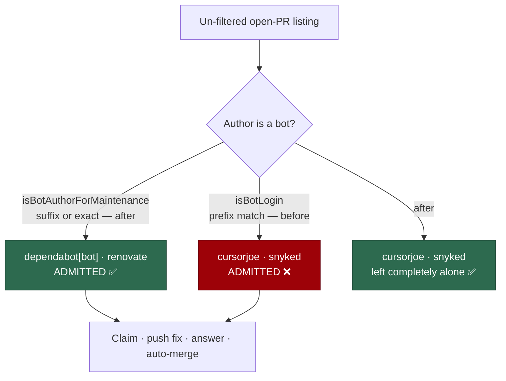

## Summary

`isBotLogin` matches four of its bot patterns by **prefix** — `/^copilot/`,
`/^cursor/`, `/^snyk/`, `/^codecov/` (plus `/^github-copilot/`,
`/^dependabot/`, `/^renovate/`) — so a human login such as `cursorjoe` or
`snyked` reads as a bot. That was harmless while the predicate only decided
whether to *trust a review comment*. Issue #1848 made it an **admission**
decision: `listBotPrs` → `listActionablePrs` admits any bot-shaped author's
same-repository PR into the PR-maintenance scans, and admission means the
worker claims the PR, pushes fix commits to its head branch, answers its
comments and arms auto-merge — adopting a human's PR uninvited, the exact
outcome [`docs/HUMAN-PR-POLICY.md`](../../HUMAN-PR-POLICY.md) exists to
prevent.

This takes **option 1** from the issue — split the predicate, rather than
anchor the prefixes. `isBotAuthorForMaintenance`
(`worker/deno/lib/trust_exclusions.ts`) matches only what GitHub itself
attests, the `[bot]` suffix, or an exact member of `KNOWN_NON_SUFFIX_BOTS`
(`dependabot`, `renovate`, `github-actions`). No prefix ever matches.
`isBotLogin` keeps its looser behaviour for the trust paths it also serves
(`trusted_review_bots` validation, `config_validator.ts`, the trust-exclusion
allowlist), where over-detecting a bot only *withholds* trust and a false
positive costs nothing — so no trust decision moves in the permissive
direction.

Closes #1872.

## Evidence

Backend-only change: no web interface to screenshot. The evidence is the
regression tests below, which drive the real `listBotPrs` and the real
`selectBranchUpdatePrs` (only the `gh` runner is stubbed) and assert on which
PRs are admitted.

Two admission points now use the narrow predicate — both are places where a
match means the worker **writes to the PR's head branch**:

- `listBotPrs` (`worker/deno/lib/pr_bot_lookup.ts:144`) — the door named in the
  issue.
- `isBotPrCandidate` (`worker/deno/lib/pr_branch_update.ts:433`), which backs
  `isHostPushedBotPr` — the branch-update scan rebases and pushes the head
  branch of every PR it selects. It additionally requires a commit by this
  host on the PR, but that is reachable on a human's PR: they cherry-pick a
  worker commit onto their branch. Narrowing only `listBotPrs` would have left
  that path open, so the fix closes both.

`./quality.sh` passes in full (`Result: PASSED (with skipped checks)`; the one
skip, `config integration`, is a pre-existing environment skip unrelated to
this change).

## Reproduction

- **symptom** — a human whose login starts with a bot's name (`cursorjoe`,
  `snyked`, `copilotjoe`, `codecoverage-nerd`, `dependabotanist`) has their
  same-repository PR admitted into the PR-maintenance scans with no
  invitation, so the worker claims it and pushes to its head branch
- **status** — `verified` — both regression tests were run against the unfixed
  code and observed failing (`listBotPrs` returned `[20, 21, 22, 23, 24, 25]`
  where only `[25]` was expected; the branch-update selector returned `[12]`
  where `[]` was expected), then run again after the fix and observed passing
- **regression test** — `worker/deno/tests/pr_bot_lookup_test.ts::listBotPrs - a human login sharing a bot prefix is not admitted`
  and `worker/deno/tests/pr_branch_update_bot_prs_test.ts::branch-update selection - a human login sharing a bot prefix is left alone`

### The original trigger is closed, with no trivial bypass

The trigger is an open PR authored by a login that begins with a bot name.
`isBotAuthorForMaintenance` performs **no prefix matching at all**: after
`normaliseLogin` (trim + lowercase) it returns true only when the login is an
exact member of the three-name `KNOWN_NON_SUFFIX_BOTS` set, or when
`/\[bot\]$/` matches — a suffix GitHub reserves for App accounts and will not
issue to a human. `cursorjoe`, `snyked` and every other prefix collision are
therefore rejected outright, and no casing, whitespace or unicode variant
reaches a different branch, because both remaining checks run on the
normalised string. The only way for a human login to be admitted now is for it
to *be* `dependabot`, `renovate` or `github-actions`, which GitHub already
holds. Both call sites that lead to a write on a PR head branch
(`pr_bot_lookup.ts`, `pr_branch_update.ts`) were converted, so there is no
second door left on the loose predicate; the remaining `isBotLogin` callers
(`config_validator.ts`, `derived_authors.ts`, `security.ts`) are
trust/audit-only and grant no PR ownership.

## Test Plan

Added:

- `worker/deno/tests/trust_exclusions_test.ts::isBotAuthorForMaintenance - admits [bot]-suffixed and known suffix-less bots`
  — the real bots (`dependabot[bot]`, `copilot-swe-agent[BOT]`, padded
  `  renovate[bot]  `, `dependabot`, `Renovate`, `GITHUB-ACTIONS`) still match,
  case-insensitively.
- `worker/deno/tests/trust_exclusions_test.ts::isBotAuthorForMaintenance - rejects human logins sharing a bot prefix`
  — asserts the split itself: for each of seven prefix collisions,
  `isBotLogin` is still `true` and `isBotAuthorForMaintenance` is `false`.
- `worker/deno/tests/trust_exclusions_test.ts::isBotAuthorForMaintenance - rejects ordinary human logins and blanks`
  — edge cases: an ordinary login, the empty string, and whitespace only.
- `worker/deno/tests/pr_bot_lookup_test.ts::listBotPrs - a human login sharing a bot prefix is not admitted`
  — the regression test the issue asks for, alongside the existing fork-headed
  and fleet-account exclusions. Five prefix-colliding humans and one genuine
  `dependabot[bot]` go in; only the bot comes out, and the humans leave no log
  line at all.
- `worker/deno/tests/pr_branch_update_bot_prs_test.ts::branch-update selection - a human login sharing a bot prefix is left alone`
  — a `cursorjoe` PR carrying a host commit is not selected, and the
  `gh pr view --json commits` lookup is never issued.

Modified (documented, per the no-silent-test-changes rule):

- `worker/deno/tests/pr_bot_lookup_test.ts::listBotPrs - sanitises a hostile bot login in the admission log`
  — its fixture login `dependabot"\ninjected=line` reached the admission log
  only via the `^dependabot` prefix, which the fix deliberately removes. The
  login now carries a `[bot]` suffix so the case still exercises what it was
  written to test: that a hostile **payload** is sanitised before it is
  logged. No assertion was weakened or removed.

Existing coverage kept passing unchanged: the `listBotPrs` admission,
fork-headed, fleet-account, unreadable-listing and de-duplication cases; the
branch-update selection cases; `trusted_review_bots` validation (which still
consumes the loose `isBotLogin`).

Full gate: `./quality.sh` — PASSED.
