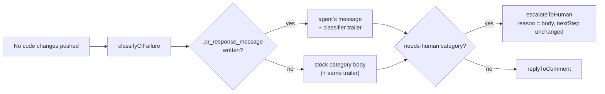

## Summary

The CI-fix no-changes path read the agent's `.pr_response_message` but used it
only on the push-succeeded branch, so a run that produced no code change threw
the message away and posted stock classifier text instead. On
NEAT-AI-Backpropagation PR 150 the agent wrote "No change required for Project
Validation — … tracked by #149" and the PR received "I investigated the CI check
failure (**Project Validation**) but could not determine a fix".

The no-changes branch now posts the agent's message verbatim with the classifier
trailer appended, falling back to the stock body only when the agent wrote
nothing. The `code-fix-required` and `history-rewrite-required` routes still go
through `escalateToHuman`; the agent's message becomes the `reason`, and
`nextStep` is untouched so the history-rewrite "rotate the credential" guidance
survives. The `**Classifier reason:** … **Signals:** …` rendering is extracted
into an exported `formatClassifierTrailer()` so both paths share one rendering.

Closes #1876.

## Evidence

Backend-only change — no web interface to screenshot. Verified by the tests
below plus the full gate.

- `deno test tests/pr_ci_processor_no_changes_test.ts tests/pr_no_changes_response_test.ts`
  — 23 passed, 0 failed.
- `./quality.sh < /dev/null` — `Result: PASSED (with skipped checks)`; deno
  tests, lint, type check, fmt, semgrep and markdownlint all PASSED.

## Reproduction

- **symptom** — a no-changes CI-fix run discarded the agent's
  `.pr_response_message` and posted stock text ("could not determine a fix")
  where the agent had explained the failure sits in the base branch
- **status** — `verified` — both new processor tests were observed failing
  against the unfixed `pr_ci_processor.ts` (the posted body was the stock
  classifier text with no trace of the agent's message) and passing after the
  fix
- **regression test** —
  `worker/deno/tests/pr_ci_processor_no_changes_test.ts::processCiFailure no-changes - posts the agent's message verbatim with the classifier trailer (Issue #1876)`

## Acceptance Criteria

<!-- vibe-spec-review inputs="diff+issue-body" -->

- **met** — a no-changes run with `.pr_response_message` posts that text
  verbatim followed by `**Classifier reason:**` and `**Signals:**` — evidence:
  `worker/deno/lib/pr_ci_processor.ts:1353-1355`, `:1383`; test
  `worker/deno/tests/pr_ci_processor_no_changes_test.ts::processCiFailure no-changes - posts the agent's message verbatim with the classifier trailer (Issue #1876)`
  — reviewer: met
- **met** — a no-changes run without the file posts the existing stock text (no
  regression) — evidence: `verbatimBody ?? response.body` at
  `worker/deno/lib/pr_ci_processor.ts:1383`; the four pre-existing category
  tests in `pr_ci_processor_no_changes_test.ts` are unmodified and pass —
  reviewer: met
- **met** — `code-fix-required` with a message escalates with the agent's
  message as the reason — evidence: `worker/deno/lib/pr_ci_processor.ts:1370`;
  test
  `worker/deno/tests/pr_ci_processor_no_changes_test.ts::processCiFailure no-changes - code-fix-required escalates with the agent's message as the reason (Issue #1876)`
  — reviewer: met
- **met** — both test files and `./quality.sh < /dev/null` pass — evidence: 23
  tests passed; gate `Result: PASSED (with skipped checks)` — reviewer: met
- **unrequested** — two unit tests beyond the two `formatClassifierTrailer`
  cases the issue named (signal rendering, and the stock body ending with the
  trailer) — evidence:
  `worker/deno/tests/pr_no_changes_response_test.ts:135-171` — reviewer:
  unrequested — reason: they pin the extraction as behaviour-preserving, which
  is what makes the shared-rendering refactor safe
- **unrequested** — `docs/workflows/ci-fix.md:179` also documents that the same
  text becomes the `**Why:**` of the escalation comment — evidence:
  `docs/workflows/ci-fix.md:179` — reviewer: unrequested — reason: the
  escalation route is behaviour the issue requires, so the doc line would
  otherwise describe only half the change

The Spec reviewer additionally noted the `history-rewrite-required` arm was
guarded only by a code comment, and that the verbatim body's suffix was asserted
by containment rather than exactly. Both were fixed in this diff before the PR:
`processCiFailure no-changes - a history-rewrite escalation keeps the
rotate-the-credential next step (Issue #1876)`,
and an `endsWith` assertion on the trailer.

## Standards Review

<!-- vibe-standards-review inputs="diff+CODING-STANDARDS.md" -->

- **violation** — the trailer suffix test derived its expectation from the
  function under test, so it only asserted that `buildCiNoChangesResponse` calls
  `formatClassifierTrailer` — evidence:
  `worker/deno/tests/pr_no_changes_response_test.ts:166` — reason: fixed here;
  it now asserts the literal expected trailer text
- **violation** — no `docs/archive/pr-summaries/pr-summary-1876.md` on the
  branch at review time — evidence: `docs/archive/pr-summaries/` — reason: fixed
  here; this file
- **violation** — `prompts/ci_fix/prompt.md:138` still says the message is
  "posted verbatim as the PR reply" without mentioning the appended trailer —
  evidence: `prompts/ci_fix/prompt.md:138` — reason: stands; the issue states no
  prompt change is expected, and the sentence remains accurate — the message is
  posted unedited, with a trailer appended after it
- **clean** — Australian English throughout the added lines (`categorised`,
  `recognisable`); tests drive real code through `processCiFailure` with a real
  temp `.pr_response_message` rather than grepping source; no hidden paths
  staged; no wall-clock sleeps or absolute timing assertions; the fallback is
  `?? response.body`, not a swallowed error; secret redaction still happens
  upstream in `readPrResponseMessage`; the extraction removes duplication rather
  than adding indirection

## Test Plan

Added to `worker/deno/tests/pr_ci_processor_no_changes_test.ts`
(`runNoChangesScenario` extended with an optional message written to
`<workDir>/.pr_response_message`):

- `processCiFailure no-changes - posts the agent's message verbatim with the classifier trailer (Issue #1876)`
- `processCiFailure no-changes - code-fix-required escalates with the agent's message as the reason (Issue #1876)`
- `processCiFailure no-changes - a history-rewrite escalation keeps the rotate-the-credential next step (Issue #1876)`

Added to `worker/deno/tests/pr_no_changes_response_test.ts`:

- `formatClassifierTrailer - renders the reason and bulleted signals`
- `formatClassifierTrailer - empty signals say so rather than rendering nothing`
- `formatClassifierTrailer - more than six signals are truncated with a count`
- `formatClassifierTrailer - the stock body ends with exactly this trailer`

Unmodified and still passing: the four existing no-changes category tests, the
PR #1678 semgrep regression, and the Issue #1863 / #579 push-claim tests.
