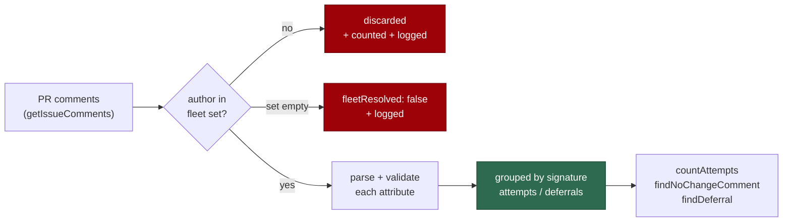

## Summary

Adds `worker/deno/lib/ci_fix_attempt_markers.ts`, the pure module that builds
and parses the two PR comment markers the CI-fix lane will use as its
**fleet-wide** record of attempts and deferrals:

```text
<!-- vibe-ci-fix-attempt signature="…" check="…" head="…" attempt="2" outcome="pushed" -->
<!-- vibe-ci-fix-deferred signature="…" check="…" depends-on="owner/repo#149" -->
```

Both use the canonical `vibe-` grammar (bare prefix, `key="value"` attributes,
no colon payload), so `marker_grammar_test.ts` passes unchanged with no new
`ACCEPTED_DEVIATIONS` entry. `collectFleetCiFixMarkers` filters comments to
fleet authors *before* reading their values — a marker in a PR comment is text
anyone may write, and only the author is authenticated (the control
`alert_dedup_authors.ts` applies to body-marker dedup, Issue #1216) — and every
attribute value is validated rather than passed through. The module does no
I/O; the processor and scanner wiring land in their own sub-issues of #1861.

Closes #1877.



## Evidence

Backend-only change — no web interface to screenshot. The evidence is the test
suite and the quality gate:

- `deno test worker/deno/tests/ci_fix_attempt_markers_test.ts worker/deno/tests/marker_grammar_test.ts` → **24 passed, 0 failed**.
- `./quality.sh < /dev/null` → **PASSED** (semgrep, markdownlint, completeness
  checks, deno tests/lint/type check/fmt all green; `config integration`
  skipped as it always is without a `.config.json`).
- `deno task check:manifests` → **633 passed**, after registering the new module
  as sweep slice `12aa` with its written record.

## Acceptance Criteria

<!-- vibe-spec-review inputs="diff+issue-body" -->

- **met** — Both markers parse round-trip and satisfy `marker_grammar_test.ts` as canonical — evidence: `worker/deno/tests/ci_fix_attempt_markers_test.ts::ci_fix_attempt_markers - an attempt marker round-trips`, `::a deferral marker round-trips`, `::both emitted markers are canonical`; `marker_grammar_test.ts` untouched and green — reviewer: met
- **met** — Markers in comments by logins outside the fleet set are never counted — evidence: `worker/deno/lib/ci_fix_attempt_markers.ts` (`isFleetAuthor` runs before any value is read), `tests/…::a marker outside the fleet is never counted`, `::discarded outside-fleet markers are reported` — reviewer: met
- **met** — Invalid attribute values are rejected rather than passed through — evidence: `tests/…::malformed markers are ignored`, `::a suffixed or re-cased marker name is a different marker`, `::an attempt beyond the cap is refused both ways` — reviewer: met — reason: the reviewer's caveat was that the `check` attribute is *sanitised* rather than validated; the sweep record's claim was corrected to say so and the residual is recorded there
- **met** — `deno test …` and `./quality.sh < /dev/null` pass — evidence: the runs listed under Evidence — reviewer: met
- **partial** — "the first non-marker line of the body" — evidence: `worker/deno/lib/ci_fix_attempt_markers.ts` (`firstDiagnosisLine`), `tests/…::marker text never leaks into the diagnosis` — reviewer: partial — reason: the reviewer found the original line-prefix skip leaked marker attributes when a marker trailed a sentence or wrapped across lines; fixed in this diff by stripping whole HTML comments, with a test for both layouts
- **unrequested** — `docs/audits/security-sweep-1877-ci-fix-attempt-markers.md` and the `12aa` slice in `docs/audits/lib-sweep-coverage.json` — reviewer: unrequested — reason: `lib_sweep_coverage_test.ts` fails for any `lib/` module claimed by no sweep slice, so a new module cannot land without them
- **unrequested** — the `docs/INTERNALS.md` lib-index row — reviewer: unrequested — reason: no gate enforces it, but a new `lib/` module owes the index a line (the precedent PR #1921 set)
- **unrequested** — the builders **throw** on a malformed signature, head, attempt or dependency reference — reviewer: unrequested — reason: those are the worker's own values, so the fail-loud standard applies; only the check name, which the worker does not choose, is sanitised instead
- **unrequested** — `fleetResolved` / `ignoredOutsideFleet` on the result and the log sink argument — reviewer: unrequested — reason: added in response to the standards reviewer's fail-loud finding; without them an unresolved fleet identity reads as "no attempts yet" and the cap never binds

## Standards Review

<!-- vibe-standards-review inputs="diff+CODING-STANDARDS.md" -->

- **violation** — silent fail when the fleet identity cannot be resolved: an empty tally was indistinguishable from "cannot tell", the unsafe direction for an attempt cap — evidence: `worker/deno/lib/ci_fix_attempt_markers.ts` (`collectFleetCiFixMarkers`) — reason: fixed here — the result carries `fleetResolved` and `ignoredOutsideFleet`, and both conditions are reported on an injectable log sink, as `alert_dedup_authors.ts` does
- **violation** — exported helpers and length constants with no direct test and no caller — evidence: `worker/deno/lib/ci_fix_attempt_markers.ts` (`sanitiseCheckName`, `isDependencyRef`, `firstDiagnosisLine`, `MAX_CHECK_NAME_LENGTH`, `MAX_DIAGNOSIS_LENGTH`) — reason: fixed here — all five are module-private, and the boundaries they own (name truncation, the attempt ceiling) are now tested through the public API
- **violation** — a test asserting a naming pattern over two constants rather than behaviour, duplicating `marker_grammar_test.ts` — evidence: `worker/deno/tests/ci_fix_attempt_markers_test.ts` (the former "marker names use the canonical grammar" case) — reason: fixed here — it now builds both markers and asserts the emitted text is canonical, which is the property the acceptance criterion actually names
- **violation** — the diagnosis extractor and the parsers disagreed on what a marker is, so a wrapped marker's attributes became the "diagnosed" cell — evidence: `worker/deno/lib/ci_fix_attempt_markers.ts` (`firstDiagnosisLine`) — reason: fixed here — HTML comments are stripped before the split, covered by `tests/…::marker text never leaks into the diagnosis`
- **violation** — a doc claim the code did not support ("`marker_grammar_test.ts` pins these") when the scanner only sees marker *literals* — evidence: `worker/deno/lib/ci_fix_attempt_markers.ts` module comment — reason: fixed here — the comment now names this module's own canonical-shape test as the guard
- **violation** — no PR summary in the diff — evidence: `docs/archive/pr-summaries/pr-summary-1877.md` — reason: fixed here — this file
- **clean** — Australian English throughout (no US spellings in the diff); Deno conventions (`@std/assert`, `lib/x.ts` ↔ `tests/x_test.ts`, `deno fmt`/`lint`/`check` clean); tests are pure, sub-millisecond, and call real code; no spawn, filesystem, network, env or secret sink; no regex compiled from data; no hidden paths staged; every commit references Issue #1877 and carries the run-id trailer; the sweep ledger's `sweptAt` is a real commit on this branch

## Test Plan

`worker/deno/tests/ci_fix_attempt_markers_test.ts` (new, 21 cases):

- **Round-trip** — each marker builds and parses back to the same record; both
  emitted markers match the canonical `vibe-` grammar.
- **Multiple markers** — two attempt markers in one comment body both parse.
- **Rejection** — malformed signature, short head, unknown outcome, negative or
  over-cap attempt, missing outcome, a `depends-on` that is not `owner/repo#N`,
  and a suffixed or re-cased marker name are all ignored; the builders throw on
  each invalid worker-supplied field.
- **Injection** — a check name carrying `-->`, a quote and a tag neither ends
  the comment nor adds an attribute; an over-long name is truncated without
  splitting a surrogate pair.
- **Fleet authorship** — a non-fleet author is never counted, a case-different
  fleet login still is, an empty fleet set collects nothing and says so, and
  discarded outside-fleet markers are counted and reported.
- **Grouping and helpers** — records group by signature; `countAttempts`,
  `findNoChangeComment` and `findDeferral` return the expected records and
  `undefined`/zero for an unseen signature.
- **Diagnosis line** — the first non-marker line is lifted (skipping marker and
  blank lines), a marker trailing a sentence or wrapped across lines leaks no
  attribute text, and a body that is only markers yields `""`.

Unchanged and still passing: `worker/deno/tests/marker_grammar_test.ts` (3
cases), `deno task check:manifests` (633).
