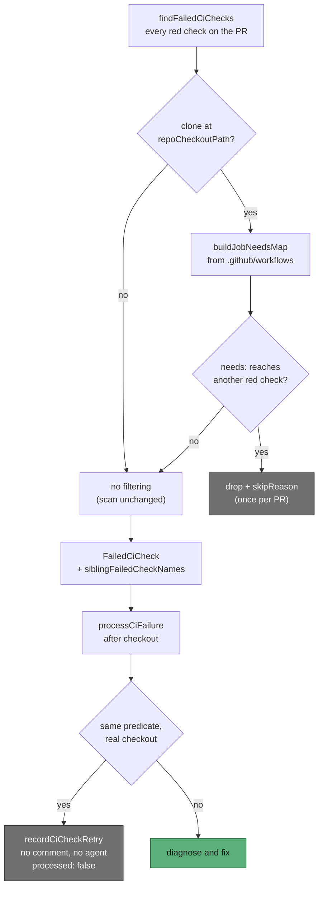

# CI-fix skips aggregator checks whose needed job is also red

## Summary

An aggregator job exists only to gate on other jobs — the
NEAT-AI-Backpropagation `ci-required` job (`name: CI Required Checks`,
`needs: [validation, quality, …]`, `if: always()`) is the canonical shape. It
is red whenever a job it needs is red, so it has no failure of its own, yet the
CI-fix lane diagnosed it: on PR 150 it earned its own failure signature and its
own stock comment about a job that ran none of the repo's code.

The `needs:` topology is now read from the workflow YAML and a failing check
whose needed job is **also red on the same head** is skipped rather than
diagnosed. Closes #1878.

- **New pure module** `worker/deno/lib/workflow_job_needs.ts` —
  `buildJobNeedsMap()` turns the already-parsed `WorkflowFile[]` from
  `readWorkflowFiles()` into a display-name graph (`name:`, else job id, on
  both sides, because that is what a check run is called), and
  `isDownstreamOfRedJob()` answers the question transitively. A check matching
  no job — a matrix leg such as `Build (ubuntu-latest)`, or a check from
  outside Actions — is a non-aggregator.
- **Scanner** (`pr_maintenance.ts::findFailedCiChecks`) reads the host's
  **existing** clone at `repoCheckoutPath(workDir, repo)` — it never clones —
  drops downstream aggregators, logs one `skipReason("aggregator-check", …)`
  per PR, and carries `siblingFailedCheckNames` on the check it returns. No
  clone means no filtering. Wired in both callers of the scan: the run loop
  (`run_core_production_deps.ts`) and the `find-failed-ci-checks` CLI
  subcommand.
- **Processor** (`pr_ci_processor.ts`) repeats the decision after checkout,
  against the branch's own workflow YAML, so a head that added or renamed the
  aggregator is still caught. On a skip it records the check-run retry (a check
  the scanner could not filter must not be re-selected for ever), posts
  nothing, runs no agent, and returns `processed: false`.

## Evidence

Backend-only change — no web interface to screenshot. The evidence is the
tests below, all run with `< /dev/null`:

```text
deno test -A tests/workflow_job_needs_test.ts
  ok | 12 passed | 0 failed

deno test -A tests/pr_maintenance_aggregator_check_test.ts \
          tests/pr_ci_processor_aggregator_check_test.ts
  ok | 8 passed | 0 failed
```

Both new behaviours were watched going **red before the fix**: with the
scanner's `continue` and the processor's predicate disabled,
`findFailedCiChecks - drops the aggregator and returns the real failure` and
`processCiFailure - posts nothing for a downstream aggregator` both fail, and
the other tests stay green.



## Acceptance Criteria

<!-- vibe-spec-review inputs="diff+issue-body" -->

- **met** — With the fixture workflow, a red `CI Required Checks` whose
  `Project Validation` is also red is never returned by the scanner when a
  clone exists, and is skipped by the processor when it is — evidence:
  `worker/deno/tests/pr_maintenance_aggregator_check_test.ts::findFailedCiChecks - drops the aggregator and returns the real failure`
  and
  `worker/deno/tests/pr_ci_processor_aggregator_check_test.ts::processCiFailure - posts nothing for a downstream aggregator (Issue #1878)`
  — reviewer: met
- **met** — `CI Required Checks` red while every needed job is green is
  diagnosed normally — evidence:
  `worker/deno/tests/pr_maintenance_aggregator_check_test.ts::findFailedCiChecks - an aggregator red on its own is still diagnosed`
  and
  `worker/deno/tests/pr_ci_processor_aggregator_check_test.ts::processCiFailure - an aggregator red on its own is processed normally (Issue #1878)`
  — reviewer: met
- **met** — Job matching uses `name:` then id; unmatched checks are
  non-aggregators — evidence: `displayName()` in
  `worker/deno/lib/workflow_job_needs.ts`, tested by
  `workflow_job_needs_test.ts::buildJobNeedsMap - a job without name: is keyed by its id`
  and
  `workflow_job_needs_test.ts::isDownstreamOfRedJob - a matrix-suffixed check name is unmatched, so not skipped`
  — reviewer: met
- **met** — `deno test worker/deno/tests/workflow_job_needs_test.ts` plus the
  scanner/processor tests and `./quality.sh < /dev/null` pass — evidence: the
  20 new tests pass, and the full gate passes after the fixes below —
  reviewer: partial — reason: the reviewer ran the gate at the commit it was
  given, where `completeness checks` failed because the new module was claimed
  by no slice in `docs/audits/lib-sweep-coverage.json`; that ledger entry and
  its written sweep record
  (`docs/audits/security-sweep-1878-workflow-job-needs.md`) were added in
  response and the gate now passes, so the verdict is recorded as met with the
  departure stated here.
- **unrequested** — `buildJobNeedsMap` unions `needs:` when one display name is
  defined in more than one workflow, and keeps an unresolved `needs:` id
  verbatim as an edge — reviewer: unrequested — reason: both are consequences
  of a graph that must not silently lose an edge; unioning can only add edges,
  and the only thing an extra edge buys is a skip.
- **unrequested** — cycle guard in `isDownstreamOfRedJob` and its test —
  reviewer: unrequested — reason: the input is a target repo's YAML on a PR
  head, so `a → b → a` is reachable and an unguarded walk would not terminate.
- **unrequested** — `logger.warn` on unreadable workflow YAML in both helpers,
  and `readJobNeedsFromClone` returning `null` for an empty map — reviewer:
  unrequested — reason: the fail-loud standard forbids a silently swallowed
  read failure, and an empty graph is behaviourally identical to no clone.
- **unrequested** — `workDir` wired into the `find-failed-ci-checks` CLI
  subcommand (`worker/deno/commands/pr_maintenance.ts`) — reviewer:
  unrequested — reason: the reviewer flagged it as the same scanner left
  unfiltered in its second caller; without it the CLI path keeps the fault.
- **unrequested** — `docs/audits/lib-sweep-coverage.json` slice 12aa plus
  `docs/audits/security-sweep-1878-workflow-job-needs.md` — reviewer:
  unrequested — reason: a new `worker/deno/lib/` module is claimed by no sweep
  slice until it is recorded, and the gate fails until it is.

## Standards Review

<!-- vibe-standards-review inputs="diff+CODING-STANDARDS.md" -->

- **violation** — the new `lib/` module was claimed by no sweep slice, so
  `deno task check:manifests` failed — evidence:
  `worker/deno/lib/workflow_job_needs.ts:1` — reason: fixed here — slice 12aa
  added to `docs/audits/lib-sweep-coverage.json` with its written record at
  `docs/audits/security-sweep-1878-workflow-job-needs.md`.
- **violation** — `docs/archive/pr-summaries/pr-summary-1878.md` was absent —
  evidence: the file this text is in — reason: fixed here, with the Mermaid
  diagram the standard asks for on a change to a workflow's sequence of events.
- **violation** — a bare `catch { return null; }` around `Deno.stat` treated
  any stat failure as "no clone" with no log — evidence:
  `worker/deno/lib/pr_maintenance.ts:1207` — reason: fixed here — only
  `Deno.errors.NotFound` is silent now; anything else is warned with the repo
  and the path.
- **violation** — `queue.shift() as string` is an unproven non-null assertion —
  evidence: `worker/deno/lib/workflow_job_needs.ts:136` — reason: fixed here —
  replaced with an explicit `undefined` check. The same class at
  `worker/deno/tests/pr_ci_processor_aggregator_check_test.ts:85` was replaced
  with a guarded local.
- **violation** — the two added error paths (`readJobNeedsFromClone`'s
  unreadable-YAML warn, `_isDownstreamAggregator`'s catch) had no test —
  evidence: `worker/deno/lib/pr_ci_processor.ts:700` — reason: partly fixed —
  a `findFailedCiChecks - a clone with no workflows filters nothing` test now
  covers the empty-graph fallback, and the no-clone and no-sibling-list
  fallbacks are covered; the two `catch` arms themselves need an unreadable
  filesystem to drive, which a unit test cannot create portably. Both fall back
  to "diagnose normally", the pre-change behaviour.
- **clean** — Australian English throughout; no hidden paths staged; every new
  test calls the real `buildJobNeedsMap`, `isDownstreamOfRedJob`,
  `findFailedCiChecks` and `processCiFailure` through real on-disk YAML and
  injected `gh`/agent seams rather than grepping source; JSDoc on every
  exported symbol and both new interface fields; the new module is pure and
  small, with YAML reading left in the already-shared
  `workflow_scan_common.ts`; module ↔ test pairing; `deno fmt`, `deno lint`,
  `deno check`, markdownlint, mermaid and semgrep clean; commit references
  Issue #1878 and carries the `Vibe-Coder-Run-Id` trailer.

## Test Plan

Added:

- `worker/deno/tests/workflow_job_needs_test.ts` — 12 tests over the
  NEAT-AI-Backpropagation fixture: aggregator with `Project Validation` red ⇒
  skipped; aggregator red alone ⇒ not skipped; match by id when there is no
  `name:`; unknown check ⇒ not skipped; matrix-suffixed name ⇒ unmatched;
  `needs:` as a bare string; unparseable YAML ⇒ empty map (asserting the
  fixture really did fail to parse); transitive needs; a `needs:` cycle
  terminates.
- `worker/deno/tests/pr_maintenance_aggregator_check_test.ts` — the scanner
  drops the aggregator and returns the real failure, logs exactly one
  `aggregator-check` skip line, carries `siblingFailedCheckNames`, still
  diagnoses an aggregator that is red alone, and filters nothing without a
  clone or without workflows.
- `worker/deno/tests/pr_ci_processor_aggregator_check_test.ts` — the
  processor-side skip posts no comment, runs no agent, records the check-run
  retry and returns `processed: false`; an aggregator red alone, and an input
  with no sibling list, both still run the agent.

Unchanged suites re-run for regressions (149 tests): `pr_maintenance_test.ts`,
`ci_check_state_dir_test.ts`, `pr_uninvited_action_test.ts` and every
`pr_ci_processor_*_test.ts`.

## Deno regression avoided

The new module and its tests use `deno test` and the repo's existing
`@std/yaml` parse via `workflow_scan_common.ts` — no Node tooling, no new
dependency.
