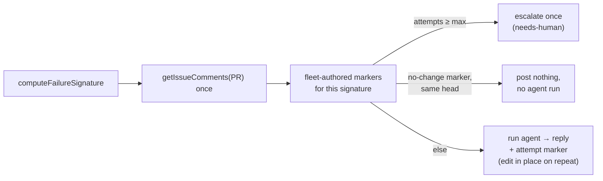

# CI-fix attempt cap and comment dedup read fleet-wide PR markers

## Summary

The CI-fix lane's 3-attempt auto-fix cap and its "one comment per failure"
dedup both lived in each host's own `$HOME/auto-issue-work/.ci_check_state`
volume. Nothing there is visible to another host, so two accounts working one
pull request each spent their own three attempts and each posted their own copy
of the same diagnosis — the stock text nine times in 76 minutes.

Both now read the pull request's own fleet-authored markers
(`ci_fix_attempt_markers.ts`, #1877), so the fleet shares **one** budget and
**one** comment per failure signature:

- `processCiFailure` fetches the PR's comments once, tallies the fleet's attempt
  markers for the signature, escalates at the cap with a consolidated summary
  built from those markers, and hands the same comments to `escalateToHuman` as
  `prefetchedComments`.
- A fleet `no-change` marker whose `head` is the checked-out head short-circuits
  the run: no agent, no comment — nothing has changed since the diagnosis
  already on the PR.
- A repeat `no-change` diagnosis on a **new** head appends this run's own words
  and its marker to the existing comment via the new `GitHubClient.updateComment`
  (`PATCH repos/{repo}/issues/comments/{id}`) rather than posting a second copy.
- `getAutoFixAttempts` / `recordAutoFixAttempt` / `clearAutoFixAttempts` /
  `clearAutoFixAttemptsForLocus` are deleted along with the green-build clear in
  `pr_maintenance.ts`; `auto_fix_attempt_tracker.ts` is now pure. No code path
  reads or writes `*.autofix.json`.

Closes #1879.

## Evidence

Backend/CLI change with no web interface to screenshot. The evidence is the
test suite: `deno test worker/deno/tests/pr_ci_processor_auto_fix_cap_test.ts`
(9 tests, all green) and the full `./quality.sh < /dev/null` gate after the
final edit — `Result: PASSED (with skipped checks)`; `config integration` is the
only skip, as it always is outside a configured host.

An unknown tally must never read as a fresh budget, and the two ways it can be
unknown get opposite answers:

- **The comment read failed** — transient. The cycle stands down with an error
  and the next scan retries, rather than spending an attempt nothing could
  count. This is the "treat `false` as *cannot decide*" contract
  `ci_fix_attempt_markers.ts` states for its callers.
- **The fleet login set is empty** — a configuration fault that would never
  resolve itself. The repair proceeds (standing down would stop every CI fix on
  that host indefinitely) and the error names the keys that restore the cap.

An in-place edit that cannot be applied — a deleted comment, a client with no
`updateComment` — logs an error and posts the diagnosis as a fresh comment
rather than losing the record.

## Reproduction

- **symptom** — the same CI-fix diagnosis posted nine times in 76 minutes by two
  fleet accounts on one PR, because each host counted its three attempts (and
  its "already replied" dedup) in its own `.ci_check_state` directory
- **status** — `verified` — with the marker tally ignored (the host-local
  behaviour: `priorAttempts = []`, no `findNoChangeComment`), three tests failed
  — the cap did not bind and the agent ran a fourth time, the same-head run
  posted again, and the new-head run posted a second comment instead of editing
  the first. With the fix all nine pass.
- **regression test** —
  `worker/deno/tests/pr_ci_processor_auto_fix_cap_test.ts::processCiFailure - three fleet-authored markers on the PR exhaust the budget with an empty state dir`

## Acceptance Criteria

<!-- vibe-spec-review inputs="diff+issue-body" -->

- **met** — Three fleet-authored attempt markers already on the PR ⇒
  `processCiFailure` escalates once with the consolidated summary and never
  invokes the agent, with an empty `stateDir` — evidence:
  `worker/deno/tests/pr_ci_processor_auto_fix_cap_test.ts::processCiFailure - three fleet-authored markers on the PR exhaust the budget with an empty state dir`
  — reviewer: met
- **met** — A second no-changes run for the same signature and head posts
  nothing; a new head with the same signature edits the existing comment rather
  than posting a new one — evidence:
  `worker/deno/tests/pr_ci_processor_auto_fix_cap_test.ts::processCiFailure - a no-change marker on this very head runs no agent and posts nothing`,
  `…::a head answered by a later marker in the same comment still short-circuits`
  and `…::the same failure on a new head edits the existing comment instead of posting again`
  — reviewer: partial — reason: the reviewer read the diff at commit `d0d30d4`,
  where the short-circuit keyed on the *earliest* no-change record and so missed
  a head answered by a later marker inside the same comment. That defect is
  real; commit `2ea796f` (before the review landed) fixes it and adds the third
  test named above.
- **met** — No code path reads or writes `*.autofix.json` — evidence:
  `worker/deno/lib/auto_fix_attempt_tracker.ts` (persistence deleted; the module
  is pure) and the `assertNoAutoFixState` assertion in every cap test —
  reviewer: met
- **met** — `deno test worker/deno/tests/pr_ci_processor_auto_fix_cap_test.ts`
  and `./quality.sh < /dev/null` pass — evidence: 9/9 tests green; the full gate
  reported `Result: PASSED (with skipped checks)` after the final edit —
  reviewer: partial — reason: the reviewer was told not to run the full gate, so
  it could only verify the targeted tests; the gate was run here and passed.
- **unrequested** — `needs-human` is not re-applied on the edit-in-place path —
  reviewer: unrequested — reason: the repo's `needs-human` chokepoint gate
  (#2202) forbids applying the label outside `escalateToHuman`, and calling that
  helper would post the second comment this issue exists to prevent. The label
  was applied by the run that first posted this diagnosis for the same
  signature, and the cap escalation applies it again at attempt 3.
- **unrequested** — new module `worker/deno/lib/ci_fix_pr_markers.ts` (the issue
  described this logic inline in `pr_ci_processor.ts`), with its test and the
  `12ac` security-sweep slice the repo requires for any new `lib/` module —
  reviewer: unrequested — reason: `pr_ci_processor.ts` is already ~2 000 lines
  and the standards favour many small focused files; the sweep ledger is repo
  process, not a choice.
- **unrequested** — `GitHubClient.updateComment` is **optional** on the
  interface, with a runtime guard and a fresh-comment fallback — reviewer:
  unrequested — reason: a required method forces a one-line stub into 46
  unrelated test files (41 in `planning_processor_test.ts` alone), which is
  exactly the unrelated churn the Change Scope rule forbids; the guard keeps the
  fallback loud.
- **unrequested** — `parseCommentIssueNumber` and the comment-cache
  invalidation inside `updateComment` — reviewer: unrequested — reason: the
  per-iteration comment cache (#1841) is keyed by issue, and the PATCH response
  names the issue, so the edit cannot leave a stale body behind for the next
  reader at no extra API call.
- **unrequested** — `buildAutoFixCapSummary`'s table is now
  `| Attempt | Outcome | Diagnosed |` and `summariseChange` is deleted —
  reviewer: unrequested — reason: the issue specifies rows built from the
  markers (attempt number, outcome, first comment line); a marker records no
  "what changed", so that column could only ever have read `_not recorded_`.
- **unrequested** — the literal NUL byte in `auto_fix_attempt_tracker.ts`
  (`.join("\0")`) is rewritten as the escape `"\0"` — reviewer: unrequested —
  reason: the byte made git classify the file as binary, so this change's
  largest source deletion was unreviewable. Same runtime value, same signature:
  `computeFailureSignature`'s tests are unchanged and still pass.

## Standards Review

<!-- vibe-standards-review inputs="diff+CODING-STANDARDS.md" -->

- **violation** — `capEnforced` was computed, logged and never consulted, so an
  unreadable tally silently became "go ahead", contradicting the contract
  `ci_fix_attempt_markers.ts` states for its callers — evidence:
  `worker/deno/lib/pr_ci_processor.ts:965` (as reviewed) — reason: fixed here.
  `PrCiFixMarkerState.readFailed` now separates the transient case from the
  configuration case; a failed read stands the cycle down
  (`worker/deno/lib/pr_ci_processor.ts` + `…::an unreadable comment list stands
  the cycle down rather than spending an uncounted attempt`), and the empty
  `prefetchedComments` trap the Spec reviewer also found is closed with it.
- **violation** — the docs claimed a green build needs no reset while the
  markers are in fact permanent, so an *identical* failure recurring after green
  now resumes its spent tally — evidence: `docs/CONFIGURATION.md:3859` (as
  reviewed) — reason: fixed here. Both `docs/CONFIGURATION.md` and
  `docs/workflows/ci-fix.md` now state the consequence plainly rather than
  glossing it, including why it is preferable to the old locus-wide sweep (which
  handed a flapping check a fresh budget every green cycle, so the cap never
  bound).
- **violation** — four fail-loud fallback paths had no test, while the docs
  promise "the record is never silently dropped" — evidence:
  `worker/deno/lib/pr_ci_processor.ts:1665,1717,1737,1761` (as reviewed) —
  reason: fixed here. `…::an edit that cannot be applied posts the diagnosis
  instead of losing it` covers both the throwing `updateComment` and a client
  without one, and `…::a pushed fix records a pushed marker in its own comment`
  covers the previously unasserted `pushed` outcome.
- **violation** — a test fixture took its timestamp from the host clock —
  evidence: `worker/deno/tests/pr_ci_processor_auto_fix_cap_test.ts:148` (as
  reviewed) — reason: fixed here; pinned to `FIXTURE_CREATED_AT`.
- **violation** — the file carries a literal NUL byte, so git renders the whole
  persistence deletion as a binary diff — evidence:
  `worker/deno/lib/auto_fix_attempt_tracker.ts:128` — reason: fixed here (Boy
  Scout Rule); the byte is written as the escape `"\0"`, so the value is
  identical and the file is text again.
- **violation** — the `alreadyRebuilt` comment claimed only a rebuild can
  produce a `pushed` marker, which is untrue of an ordinary pushed fix —
  evidence: `worker/deno/lib/pr_ci_processor.ts:1309` (as reviewed) — reason:
  fixed here; the comment now states the reading honestly and why erring
  towards *not* force-pushing twice is the safe direction.
- **clean** — Australian English throughout; secret redaction (the new
  `-f body=` sink is masked by the existing `spawnGh` chokepoint); commit safety
  (no hidden or credential-shaped paths staged) and the `Vibe-Coder-Run-Id`
  trailer on every commit; tests are behavioural, spawn nothing, and use no
  sleeps or wall-clock thresholds; module-per-test-file, with the new `lib/`
  module registered in `docs/audits/lib-sweep-coverage.json` against a real
  `sweptAt` and a written sweep ledger; docs updated in the same change with no
  stale `clearAutoFixAttempts` / `*.autofix.json` references outside the
  archive.

## Test Plan

Added:

- `worker/deno/tests/ci_fix_pr_markers_test.ts` — 6 tests for the new reader:
  markers collected; a failed comment read reported as `readFailed` (not an
  empty budget); an unresolved fleet reported as unenforceable but *not* a read
  failure; the cap summary rows built from markers; outcome prose; the in-place
  append.
- `worker/deno/tests/github_test.ts` — `updateComment` refuses a comment id that
  is not a positive integer; `parseCommentIssueNumber` happy and malformed
  paths; `updateComment` present on the real client.

Rewritten:

- `worker/deno/tests/pr_ci_processor_auto_fix_cap_test.ts` — 9 tests, every one
  with an empty `stateDir` and an `assertNoAutoFixState` check: three fleet
  markers ⇒ escalation with no agent run; non-fleet markers ignored; same-head
  no-change ⇒ no agent and no comment; a head answered by a later marker inside
  the same comment also short-circuits; new head ⇒ comment edited in place with
  no second comment; a pushed fix records a `pushed` marker in its own comment;
  an unreadable comment list stands the cycle down; an edit that cannot be
  applied posts the diagnosis instead of losing it; infrastructure not charged
  and writing no marker.

Modified (documented business-logic change — no test was removed to force a
pass):

- `worker/deno/tests/auto_fix_attempt_tracker_test.ts` — the persistence and
  green-reset tests go with the code they covered; the summary tests now build
  `AutoFixCapAttempt` rows.
- `worker/deno/tests/ci_check_state_dir_test.ts`,
  `worker/deno/tests/pr_maintenance_test.ts` — the green-build clear they
  asserted no longer exists (a green PR has no failing signature to count).
- `worker/deno/tests/pr_ci_processor_no_changes_test.ts` — the #1876 verbatim
  reply still ends with the classifier trailer, but the (invisible) attempt
  marker now follows it, so the assertion checks the trailer's position rather
  than the end of the string.
