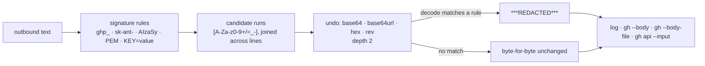

# Secret redaction now decodes transformed secrets before it scans

## Summary

Every rule in `worker/deno/lib/secret_redaction.ts` anchors on a credential's
**original** bytes — the `ghp_` / `sk-ant-` / `AIzaSy` prefixes, a PEM marker, a
`Bearer` scheme, a `KEY=value` shape. A credential piped through `base64`,
`xxd` or `rev`, or printed in two halves by two `echo` calls, carried none of
those bytes, so it matched no rule and was republished verbatim — including
through `gh_body_redaction.ts`, whose `redactSecrets()` pass is the guard on the
worker's public GitHub sinks (comment and PR bodies).

This change adds a decode-then-rescan pass,
`worker/deno/lib/secret_transform_redaction.ts`, wired into `redactSecrets()`
after the signature rules. Each run of encoding-charset characters — joined
across line breaks, so a wrapped `base64` blob or a split token is a single
value — is decoded (base64, url-safe base64, hex) and reversed up to two
transforms deep, re-scanned with the same rules, and masked whole on a hit.
Every new redaction rule inherits transform coverage for free.

Deliberately **not** the entropy backstop the issue floated: masking every
high-entropy string would redact commit SHAs, UUIDs, patch hunks and base64
images out of every log line and PR body. Decoding is deterministic, so a run is
masked only when a decode of it matches a real credential signature.

Closes #188.

## Evidence

Backend/CLI change — no web interface to screenshot. The evidence is the test
suite plus the timings below.

**Original trigger closed, no trivial bypass.** The issue's trigger is
`echo "$GH_TOKEN" | base64` (or `rev`, or `xxd`, or the token split across two
printed lines) placed into a `gh` body. Static reasoning over the changed path:
`redactGhBodyArgs` → `redactSecrets` → `redactTransformedSecrets`, where the
encoded blob is a single candidate run; `atob`/hex-decode/reverse recover the
literal `ghp_…` bytes, `matchesSignatureRule` fires on the `github-token` rule,
and the *whole run* is replaced, so no fragment of the encoded form survives.
The obvious escalations are covered too: chaining two transforms
(`base64 | rev`, `base64 | base64`) is unwound by the depth-2 recursion,
url-safe base64 and unpadded base64 both decode, and a blob wrapped across lines
by `base64(1)` — or a token split across two `echo` calls — is joined before
decoding, so line breaks are not an escape either. Each of those spellings has
its own test below.

**Known residual, unchanged by this PR.** A credential split by *in-line*
separators (`echo "$GH_TOKEN" | fold -w1 | paste -sd' '`) is still not masked,
and closing it is not safe here: joining whitespace-separated fragments would
let ordinary prose that mentions `ghp_` (this repo's own `SECURITY.md` does)
absorb the following 36 characters of text into a placeholder. The tabletop
harness treats that form as a breach it must catch, and that is what its
scanner is for — `docs/CONTAINMENT.md` now states which forms the chokepoint
masks and which the scanner still owns.

**Performance.** The pass is linear and bounded by construction (disjoint
candidate runs, a fixed fan-out of four transforms at depth two, no input cap —
`SECURITY.md`'s redact-before-truncate standard forbids one). Measured on this
container, `redactSecrets` on the existing budget cases: 500 KB of `a` plus a
URL credential 763 ms (test budget 2000 ms), 128 KiB of `a` 208 ms (budget
1000 ms), 128 KiB of `-` 70 ms, a typical log line under 0.1 ms. The existing
ReDoS and bounds suites (`secret_redaction_redos_test.ts`,
`secret_redaction_bounds_test.ts`) pass unchanged.

**Behaviour change, documented rather than silent.** The tabletop harness
(`tabletop_harness.ts`) redacts outbound artefacts before scanning them for the
planted canary, and three of its tests asserted the *old* gap — that a base64
canary survives redaction and is therefore a breach. A base64 canary is now
contained, so those tests were updated in place, not deleted:

- `findCanaryForms recovers a base64-encoded canary the redaction now masks
  (Issue #188)` — now asserts the chokepoint masks it, while the scanner still
  recovers it from the raw artefact.
- `an encoded canary in an outbound artefact is a breach the redaction misses` —
  now uses the separator-split form, which still defeats the chokepoint, so the
  harness keeps a genuine breach case.
- `the evidence document records the verdict but never the canary` — same
  substitution, so the report still has a `BREACHED` verdict to record.

A new test asserts the new behaviour directly, so the change is pinned in both
directions.

## Test Plan

Added `worker/deno/tests/secret_transform_redaction_test.ts` (14 tests). Ten of
them fail against the unfixed code and pass after the fix — verified by running
the file before the implementation landed (`10 failed | 4 passed`) and after
(`14 passed`). The headline regression test is
`worker/deno/tests/secret_transform_redaction_test.ts::redactSecrets - masks a
base64-encoded GitHub token (Issue #188)`, which reproduces the reported trigger
(`echo "$GH_TOKEN" | base64` into a published body): it fails against the
unfixed code, where the encoded token survives `redactSecrets`, and passes after
the fix.

Tests added:

- `redactSecrets - masks a base64-encoded GitHub token (Issue #188)`
- `redactSecrets - masks a base64-encoded token carrying its trailing newline`
- `redactSecrets - masks a url-safe base64 Anthropic key (Issue #188)`
- `redactSecrets - masks a hex-encoded GitHub token (Issue #188)`
- `redactSecrets - masks a reversed token (Issue #188)`
- `redactSecrets - masks a double-transformed token (base64 then rev) (Issue
  #188)`
- `redactSecrets - masks a token split across two lines (Issue #188)`
- `redactSecrets - masks a base64 blob wrapped across lines by base64(1)`
- `containsSecret - reports a transformed secret (Issue #188)`
- `redactGhBodyArgs - masks a base64-encoded token in a published body (Issue
  #188)` — the reported sink, end to end
- `redactSecrets - leaves prose, SHAs, UUIDs and identifiers unchanged`
- `redactSecrets - leaves a base64 image blob and a stats table unchanged`
- `redactSecrets - the transform pass stays linear on a large benign blob (Issue
  #188)`
- `redactSecrets - masks a secret at the tail of a large input (Issue #188)`

Tests modified (behaviour change above):
`worker/deno/tests/tabletop_harness_test.ts` — three updated, plus a new
`a base64-encoded canary in an outbound artefact is contained (Issue #188)`.

Docs: `SECURITY.md` gains a "Transformed secrets are decoded, then re-scanned"
subsection under the redaction standard; `docs/CONTAINMENT.md` corrects the
claim that "shape-based redaction masks only the literal".

`./quality.sh` passes every check except ten pre-existing failures in
`fleet_health_test.ts`, `host_workdir_guard_test.ts`,
`optional_feature_env_test.ts` and `setup_workdir_reminder_test.ts`, which fail
identically on this branch with the fix stashed — they depend on the host work
directory, not on this change. `deno lint`, `deno check`, `deno fmt`,
markdownlint and the mermaid gate all pass.

## Security self-check

- **Input validation** — the new module's only input is text; every decoder
  validates its alphabet, length and padding before decoding and returns `null`
  (not a guess) when the value is not that encoding.
- **Secrets** — no credentials or hidden files staged; the tests use synthetic
  token-shaped values that were never real credentials.
- **Injection surface** — no new shell, SQL, filesystem or HTTP calls; the
  module is pure and performs no I/O.
- **Fail loud** — a decode that cannot apply means "not that encoding", never
  "assume clean"; nothing is skipped silently and no error is swallowed.
- **Dependencies** — none added; `atob` is a Web-standard built-in.
