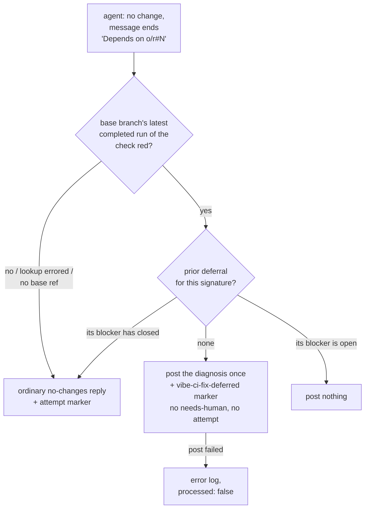

## Summary

When the CI-fix agent reports a failure as pre-existing on the **base branch** —
ending its `.pr_response_message` with a line of its own, `Depends on
owner/repo#N` — the worker now verifies that claim and defers instead of
failing: it reads the base branch's own latest completed run of the same check,
and only a red one earns a deferral. A verified deferral posts the agent's
diagnosis **once** with a `vibe-ci-fix-deferred` marker, applies **no**
`needs-human` and charges **no** fix attempt. Every weaker reading — a green
base, a check the base never ran, a missing base ref, a lookup that errored —
falls through to the ordinary verbatim no-changes reply with one attempt
charged. Closes #1880.

What changed:

- **`worker/deno/lib/ci_base_branch_check.ts`** (new) — `isCheckRedOnBranch()`
  reads `repos/{repo}/commits/{branch}/check-runs?per_page=100` through the
  injected `gh` runner, filters by check name **client-side** (so an
  attacker-chosen workflow name never reaches a URL), takes the highest-id
  *completed* run and reports whether it concluded `failure`. An API or parse
  error is a `Result` error — never a quiet `false`.
- **`baseRef` plumbing** — added to `FailedCiCheck` (`pr_ci_checks.ts`) and
  `CiFixInput` (`pr_ci_processor.ts`), populated from `baseRefName` in
  `pr_maintenance.ts::findFailedCiChecks` and
  `run_core_production_deps.ts::findAndProcessCiFailure`.
- **The no-changes branch of `pr_ci_processor.ts`** runs `detectBlockedOutcome`
  over the agent's message (a bare `#N` resolves to the PR's own repo), verifies
  the base, and then either defers, posts nothing (a deferral for this signature
  already exists), or falls through.
- **Loop guard** — the state read is of the **prior deferral's own** blocker.
  Once that blocker closes and the failure is still here, the deferral did not
  hold, so no second deferral is granted (whatever issue the agent now names)
  and the attempt cap escalates it to a human.
- **The deferral post fails loud** — `replyToComment` now returns whether it
  landed. The comment *is* the deferral record, so a failed post is logged as an
  error and reported as `processed: false`, never as a successful deferral.
- **Prompt and docs** — a `### Base-branch failures` subsection in
  `prompts/ci_fix/prompt.md` § Response Message (search-then-file the tracking
  issue, descriptive labels only, end with the `Depends on owner/repo#N` line),
  noted in the `docs/PROMPTS.md` ci_fix row and
  `docs/workflows/ci-fix.md` § "Decision points and exceptions".
- **Security sweep** — `ci_base_branch_check.ts` is claimed by slice `12ad` in
  `docs/audits/lib-sweep-coverage.json`, with its reading in
  `docs/audits/security-sweep-1880-ci-base-branch-check.md`.

## Evidence

Backend/CLI change — there is no web interface to screenshot. The evidence is
the test suites below plus the full local quality gate.



```text
deno test worker/deno/tests/pr_ci_processor_deferral_test.ts \
          worker/deno/tests/ci_base_branch_check_test.ts
ok | 17 passed | 0 failed
```

## Acceptance Criteria

<!-- vibe-spec-review inputs="diff+issue-body" -->

- **met** — Base red + `Depends on` ⇒ one comment carrying the agent's diagnosis
  and the issue reference, no `needs-human`, no attempt charged, deferral marker
  recorded — evidence: `worker/deno/tests/pr_ci_processor_deferral_test.ts::processCiFailure - a Depends on line with a red base defers once, charging no attempt (Issue #1880)`
  — reviewer: met
- **met** — Base green + `Depends on` ⇒ verbatim no-changes comment and one
  attempt charged — evidence: `worker/deno/tests/pr_ci_processor_deferral_test.ts::processCiFailure - a Depends on line with a green base takes the ordinary path and charges an attempt (Issue #1880)`
  — reviewer: met
- **met** — Prompt instructs the agent to search-then-file the tracking issue
  and end with a `Depends on owner/repo#N` line — evidence:
  `prompts/ci_fix/prompt.md` § Response Message → `### Base-branch failures` —
  reviewer: met
- **met** — `deno test …deferral_test.ts …ci_base_branch_check_test.ts` and
  `./quality.sh < /dev/null` pass — evidence: 17/17 on the two suites; the full
  gate run after the final edit — reviewer: partial — reason: the reviewer saw
  the tree at an intermediate commit where the new `lib/` module was not yet
  claimed by a sweep slice, so `completeness checks` was red; the slice `12ad`
  and its written record are committed here and the gate passes.
- **unrequested** — `?per_page=100` on the check-runs read — reviewer:
  unrequested — reason: the default 30 rows would leave the check being verified
  off page one on a busy base head and read as "not red", so the verification
  would be wrong for exactly the repos that need it.
- **unrequested** — `replyToComment` returns whether the post landed, and the
  deferral path reports `processed: false` when it did not — reviewer:
  unrequested — reason: the comment is the deferral's only record, so a
  swallowed post would claim a deferral that nothing on the pull request
  supports.
- **unrequested** — the loop guard reads the **prior** deferral's blocker rather
  than the reference this run declared — reviewer: unrequested — reason: the
  issue's literal wording ("the agent names the same issue again") leaves a
  prior deferral on a *different*, now-closed blocker parking the PR for ever
  with no comment, no attempt and no human; reading the prior blocker's state
  implements the issue's stated intent that the loop "fail loud through the
  cap".
- **unrequested** — a distinct logged branch for "no base ref", and the
  marker-build failure branch — reviewer: unrequested — reason: both are
  fail-loud paths for inputs the processor cannot verify; each names why it
  refused to defer instead of deferring on an unread value.
- **unrequested** — the Mermaid diagram in `docs/workflows/ci-fix.md` —
  reviewer: unrequested — reason: the repo's documentation standard asks for a
  diagram where one aids understanding of a new decision flow.
- **unrequested** — sweep slice `12ad` and
  `docs/audits/security-sweep-1880-ci-base-branch-check.md` — reviewer:
  unrequested — reason: the `completeness checks` gate fails for any new
  `lib/` module claimed by no sweep slice.

## Standards Review

<!-- vibe-standards-review inputs="diff+CODING-STANDARDS.md" -->

- **violation** — new `lib/` module claimed by no sweep slice, so
  `deno task check:manifests` failed — evidence:
  `worker/deno/lib/ci_base_branch_check.ts:1` — reason: fixed here — slice
  `12ad` added to `docs/audits/lib-sweep-coverage.json` with its written record
  at `docs/audits/security-sweep-1880-ci-base-branch-check.md`.
- **violation** — the deferral's only durable record was posted through a
  `catch {}` that swallowed the failure, so a failed post read as a successful
  deferral — evidence: `worker/deno/lib/pr_ci_processor.ts:2332` — reason: fixed
  here — `replyToComment` returns the outcome and the deferral path logs an
  error and reports `processed: false`.
- **violation** — no `docs/archive/pr-summaries/pr-summary-1880.md` — evidence:
  `docs/archive/pr-summaries/` — reason: fixed here — this file.
- **violation** — the docs say a deferral charges "no attempt" while
  `recordCiCheckRetry` has already spent one host-local check-run retry —
  evidence: `worker/deno/lib/pr_ci_processor.ts:830` — reason: stands. "Attempt"
  is the defined term for the fleet-wide auto-fix tally (`vibe-ci-fix-attempt`),
  which the deferral genuinely does not charge; the check-run retry counter is a
  separate, `checkRunId`-keyed bound the surrounding docs already distinguish,
  and it resets on every push.
- **violation** — `_resolveBaseBranchDeferral` was appended to an already-large
  `pr_ci_processor.ts` rather than extracted — evidence:
  `worker/deno/lib/pr_ci_processor.ts` — reason: stands for this change. The
  base-branch *read* was extracted to its own module; the decision itself reads
  `signature`, `markerState`, `classification` and `customMessage` from the
  processor's own flow, and lifting it would mean threading that state through a
  wider seam than the issue's scope covers.
- **clean** — Australian English throughout code, comments and docs; tests call
  real functions through injected seams with no source-grepping, no sleeps and
  no wall-clock assertions; `Result`-typed fail-loud error handling in the new
  module; no hidden paths staged; reuse of `detectBlockedOutcome`,
  `formatDependencyRef`, `createIssueFetcher` and `ci_fix_attempt_markers.ts`
  rather than re-implementation; every exported symbol documented; the check
  name is never interpolated into a URL and every API row is validated rather
  than cast.

## Test Plan

- **Added** `worker/deno/tests/ci_base_branch_check_test.ts` (7 tests) — latest
  completed run failed ⇒ `true`; a green re-run after an earlier failure ⇒
  `false`; the check absent on the branch ⇒ `false`; an in-progress re-run does
  not hide the completed failure; malformed JSON, a payload with no
  `check_runs` array and an API rejection are each errors, never `false`.
- **Added** `worker/deno/tests/pr_ci_processor_deferral_test.ts` (10 tests) —
  base red ⇒ exactly one comment carrying the agent's message, the issue
  reference and a deferral marker, with no attempt marker and no `needs-human`;
  base green ⇒ ordinary comment with an attempt marker; a lookup error ⇒
  ordinary path plus a loud error log; no base ref ⇒ ordinary path; a prior
  deferral on a still-open blocker ⇒ nothing posted; a prior deferral whose
  blocker has closed ⇒ ordinary path (both when the agent names the same issue
  and when it names a different one); no `Depends on` line ⇒ never deferred; a
  bare `#N` resolves to the pull request's own repo; a deferral comment that
  fails to post is reported as `processed: false`, never as a deferral.
- **Unchanged and still green** — `worker/deno/tests/pr_ci_processor_no_changes_test.ts`,
  `worker/deno/tests/ci_fix_attempt_markers_test.ts`,
  `worker/deno/tests/marker_grammar_test.ts`,
  `worker/deno/tests/lib_sweep_coverage_test.ts`.
