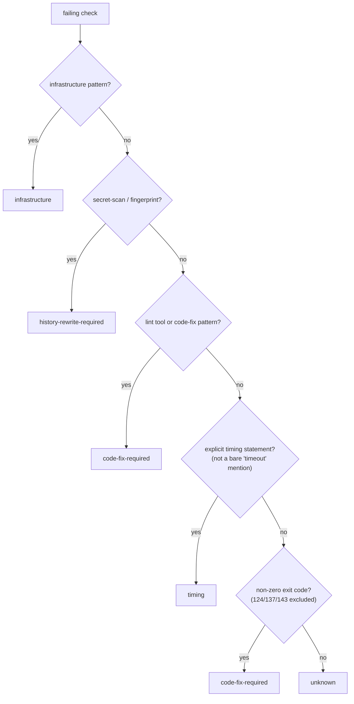

## Summary

The CI failure classifier carried a bare `"timeout"` substring in
`TIMING_TEXT_PATTERNS`. A job log echoes `timeout-minutes:` for every step that
sets one, so NEAT-AI-Backpropagation PR 150's `Project Validation` failure — an
ordinary `check-neat-core-version.sh` exit 1 — was tagged `timing` and the agent
was steered toward a timing remedy.

`timing` now needs an explicit timing statement, and a step's own non-zero exit
routes to `code-fix-required` below it. Closes #1882.

## Evidence

Backend/CLI change with no web surface, so no screenshot: the evidence is the
test suite. `worker/deno/tests/ci_failure_classifier_test.ts` — 40 passed, 0
failed; the four dependent suites (`pr_ci_processor_no_changes`,
`ci_fix_prompt_v4`, `pr_no_changes_response`) — 64 passed, 0 failed;
`./quality.sh < /dev/null` — `Result: PASSED (with skipped checks)` (the
`config integration` check is skipped in this environment, as on `main`).

Routing precedence after the change — the two new rungs are 4 and 5:

## Reproduction

- **symptom** — an exit-1 script failure whose log merely mentions `timeout`
  (a `timeout-minutes:` echo) was classified `timing`, so the CI-fix agent was
  pointed at a timing remedy instead of the script's own error
- **status** — `verified` — the PR 150 fixture returned `timing` against the
  unfixed classifier (observed: `Actual: timing / Expected: code-fix-required`)
  and returns `code-fix-required` after the fix
- **regression test** —
  `worker/deno/tests/ci_failure_classifier_test.ts::ci_failure_classifier - regression for PR 150 (exit-1 script, incidental timeout mention)`

## Acceptance Criteria

<!-- vibe-spec-review inputs="diff+issue-body" -->

- **met** — the PR 150-shaped fixture classifies as `code-fix-required` or
  `unknown`, not `timing` — evidence:
  `worker/deno/tests/ci_failure_classifier_test.ts::ci_failure_classifier - regression for PR 150 (exit-1 script, incidental timeout mention)`
  — reviewer: met
- **met** — existing `ci_failure_classifier_test.ts` cases still pass;
  `./quality.sh < /dev/null` green — evidence: 40 passed / 0 failed in that
  file, and a full gate run reporting `Result: PASSED (with skipped checks)`
  — reviewer: met
- **partial** — the issue's "explicit error line" half of the remedy — evidence:
  `worker/deno/lib/ci_failure_classifier.ts:148` — reviewer: partial — reason:
  the reviewer is right that `::error::` / `##[error]` prefixes still match no
  code-fix pattern, so the fixture routes on its exit code alone; teaching the
  classifier GitHub's annotation prefixes would also reclassify
  `##[error]The operation was canceled.` away from `timing`, so it was left out
  deliberately and the issue's "or" branch (rank an explicit non-zero exit)
  carries the fix
- **unrequested** — the non-zero-exit rung (`EXIT_CODE_REGEX`,
  `NON_CODE_FIX_EXIT_CODES`) as a terminal `code-fix-required` arm — evidence:
  `worker/deno/lib/ci_failure_classifier.ts:183` — reviewer: unrequested —
  reason: it is the issue's own second suggested remedy, and without it the
  fixture would only reach `unknown`; the reviewer's escalation concern is
  answered by excluding 124/137/143, the codes that say how a step died
- **unrequested** — `TIMING_REGEX_PATTERNS`, which lets a timeout named as the
  failure still reach `timing` — evidence:
  `worker/deno/lib/ci_failure_classifier.ts:178` — reviewer: unrequested —
  reason: removing the bare substring without it would drop every real
  `timeout`-worded timing failure, which the issue did not ask for either

The spec reviewer's three regression probes were reproduced and fixed in the
final commit: Jest's `Exceeded timeout of 5000 ms` and `npm ERR! network Socket
timeout` stay `timing` (the windows are now bidirectional), the
`--timeout 60 --retry after failure` false positive is gone (`after`,
`waiting` and a bare `error` dropped from the post-`timeout` keywords), and
exit codes 124/137/143 no longer claim a code fix.

## Standards Review

<!-- vibe-standards-review inputs="diff+CODING-STANDARDS.md" -->

- **violation** — missing PR summary file — evidence:
  `docs/archive/pr-summaries/pr-summary-1882.md` — reason: fixed here; the file
  did not exist when the reviewer ran
- **violation** — the same rationale restated in six places — evidence:
  `worker/deno/lib/ci_failure_classifier.ts:24` — reason: fixed; the module
  header and the inline branch comment now point at the pattern tables instead
  of repeating the anecdote
- **violation** — the precedence list named `code-fix-required` twice with no
  way to tell the rungs apart — evidence:
  `worker/deno/lib/ci_failure_classifier.ts:28` — reason: fixed; rung 5 is
  labelled "code-fix-required, second rung" and names its pattern table
- **violation** — the new `reason` and `signals` values were asserted by no
  test — evidence: `worker/deno/tests/ci_failure_classifier_test.ts:314` —
  reason: fixed; the PR 150 and "timeout named as the failure" tests now assert
  the reason text and the `exit:`/`regex:` signals
- **clean** — tests call the real `classifyCiFailure` and assert on its return
  (no source-text grepping, no wall-clock assertions); no existing test removed
  or altered; Australian English throughout; no hidden paths staged; bounded
  regexes with literal alternations (no ReDoS); `deno lint`, `deno check` and
  `deno fmt` clean

## Test Plan

Added to `worker/deno/tests/ci_failure_classifier_test.ts` (all new, no
existing test changed):

- regression for PR 150 — incidental `timeout-minutes:` echo + `::error::` line
  + exit 1 → `code-fix-required`, asserting the reason and signals
- a bare `timeout-minutes:` echo alone → `unknown`
- a `timeout 900 …` wrapper on the command line → `unknown`
- a `--timeout 60 --retry after failure` command line + exit 1 →
  `code-fix-required`, not `timing`
- `Timeout of 30000ms exceeded …` → `timing`, asserting the regex signal
- `fetch failed: timeout while contacting …` → `timing`
- Jest's `thrown: Exceeded timeout of 5000 ms` + exit 1 → `timing`
- `npm ERR! network Socket timeout` + exit 1 → `timing`
- a timed-out step that also exits 124 → `timing`, not a code fix
- `Process completed with exit code 2` → `code-fix-required`
- exit codes 124 and 137 → `unknown`
- `exit code 0` → `unknown`
