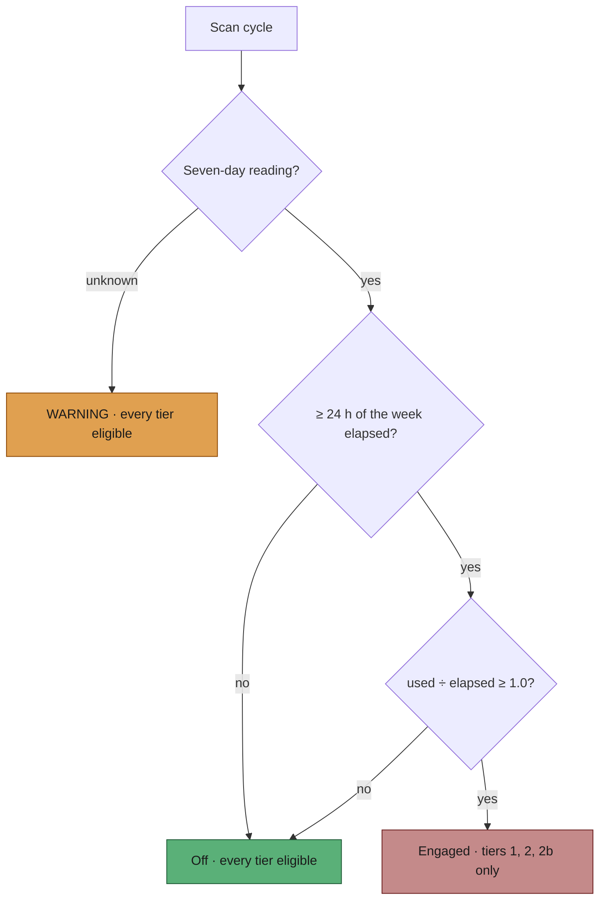

## Summary

The Priority 2 scan never consulted the Claude seven-day window, so a week
burning too fast spent its last hours on `low-priority` and `idle-task` work
while `top-priority` issues waited for the reset. This adds a pace gate over
the bottom two tiers only: while the weekly quota is projected to run out
before its window resets, tiers 3 and 4 are dropped from the ladder and what
is left of the quota goes to `top-priority` and `work-on` work. Closes #1885.

- `worker/deno/lib/claude_week_pace.ts` — the pure verdict
  (`claudeWeekPaceVerdict`, clock injected) and the per-run gate that reads it
  through the existing budget probe, honouring the credential pool's
  ten-minute snapshot age.
- `worker/deno/lib/claude_token_selection.ts` — `CLAUDE_WEEK_PACE_THRESHOLD`
  (1.0) and `CLAUDE_WEEK_PACE_GRACE_HOURS` (24), exported beside the five-hour
  gate constant. Not `.config.json` keys.
- `worker/deno/lib/issue_priority.ts` — `SelectionOptions.weekPaceEngaged`
  splices tiers 3 and 4 out of the ladder; tiers 1, 2 and 2b untouched.
- `worker/deno/lib/idle_decision_census.ts` — models the refusal as
  `low_priority_suppressed`, so an engaged week cannot file a false
  idle-inversion issue about the gate itself.



## Evidence

Backend/CLI only — no web interface to screenshot. Verified by unit tests
calling the real functions:

```text
deno test tests/claude_week_pace_test.ts        → 17 passed, 0 failed
deno test tests/issue_priority_test.ts          → 64 passed, 0 failed
deno test tests/idle_decision_census_test.ts    → 71 passed, 0 failed
./quality.sh                                    → PASSED (semgrep, markdownlint,
                                                  mermaid, lint, type check,
                                                  fmt, full deno test suite)
```

The exact engaged line an operator sees, asserted by
`claude_week_pace_test.ts::week pace gate - engaged skips the backlog and logs
once per reading`:

```text
claude-week-pace: engaged — used=62.0% elapsed=50.0% projected=124.0% at reset 2026-09-13T12:00:00.000Z; skipping low-priority and idle-task pickup so the remaining weekly quota goes to top-priority and work-on issues (Issue #1885)
```

## Acceptance Criteria

<!-- vibe-spec-review inputs="diff+issue-body" -->

- **met** — a pure verdict function (clock injected) returning engaged / off /
  unknown from the seven-day window's used share and reset time; engaged at
  &ge; 24 h elapsed and used ÷ elapsed &ge; 1.0; off otherwise including a
  reset already in the past; unknown when no seven-day window was reported —
  evidence: `worker/deno/lib/claude_week_pace.ts::claudeWeekPaceVerdict`,
  `worker/deno/tests/claude_week_pace_test.ts` (8 verdict cases) — reviewer: met
- **met** — while engaged the Priority 2 scan claims no `low-priority` or
  `idle-task` issue; `top-priority` and `work-on` pickup unchanged; off or
  unknown is exactly today's order — evidence:
  `worker/deno/lib/issue_priority.ts:562`,
  `worker/deno/tests/issue_priority_test.ts::selectHighestPriority - week pace
  engaged claims no low-priority issue` (and four siblings) — reviewer: met
- **partial** — the reading is re-read at most once per scan cycle through the
  existing budget probe, honouring the existing ten-minute snapshot —
  evidence: `worker/deno/lib/claude_week_pace.ts` reuses
  `probeClaudeTokenBudget` and `CLAUDE_BUDGET_SNAPSHOT_MAX_AGE_MS`, tested by
  `claude_week_pace_test.ts::re-probes once the snapshot has gone stale` —
  reviewer: partial — reason: the gate keeps its **own** snapshot rather than
  the credential pool's, because the pool is built in `run_worker.ts` and the
  scan loop cannot reach it; the cost is one extra probe per ten minutes, the
  snapshot is keyed by token so a mid-run switch cannot mix two subscriptions,
  and reaching the pool would mean threading it through
  `createProductionRunCoreDeps` — separate work, not this issue's.
- **partial** — one INFO line per scan cycle while engaged, prefixed
  `claude-week-pace:`, naming used / elapsed / projected shares and the reset
  time; one INFO on lift; one WARNING per scan cycle while unknown —
  evidence: `worker/deno/lib/claude_week_pace.ts::formatWeekPaceEngagedLine`
  and siblings, asserted verbatim in `claude_week_pace_test.ts` — reviewer:
  partial — reason: deliberate departure. `isEngaged()` is asked once per
  `findNextIssue`, which an N-slot pool calls N times per 30-second cycle, so
  the literal rule would repeat one sentence thousands of times over an
  engaged week. The line is emitted when the verdict or its figures change
  instead — never more than one per cycle, and every transition still lands.
- **met** — the threshold (1.0) and the 24 h grace are exported constants
  beside the existing five-hour gate constant, not `.config.json` keys —
  evidence: `worker/deno/lib/claude_token_selection.ts:159-185` — reviewer: met
- **met** — unit tests for the verdict function: on pace, over pace, within
  the first 24 h, reset in the past, unknown budget — evidence:
  `worker/deno/tests/claude_week_pace_test.ts` (all five, plus both
  boundaries, a no-seven-day-window case and a garbled-reset case) —
  reviewer: met
- **met** — the gate stops claiming only; the idle-task filer and runs already
  claimed are untouched — evidence: the only behavioural change is the tier
  splice in `selectHighestPriority`; nothing in `maybe_file_idle_task.ts` or
  any claim handler is touched — reviewer: met
- **met** — a failed or unknown probe leaves the gate off with a WARNING —
  evidence: `claude_week_pace_test.ts::an unknown reading warns and never
  refuses work` — reviewer: met
- **met** — the new line must not be confusable with #1888's `graphql-quota:`
  — evidence: `CLAUDE_WEEK_PACE_LOG_PREFIX = "claude-week-pace:"`, and the
  distinction is stated in `docs/workflows/issue-processing.md` — reviewer: met
- **unrequested** — the idle-decision census now takes `weekPaceEngaged` —
  evidence: `worker/deno/lib/idle_decision_census.ts`,
  `tests/idle_decision_census_test.ts::the week-pace gate's tier-3 refusal is
  modelled` — reviewer: unrequested — reason: without it the census counts the
  skipped `low-priority` backlog as claimable work the scan keeps refusing,
  and after three cycles the worker files an idle-inversion issue about its
  own pace gate — the gate would have caused a defect, so modelling the
  refusal is part of shipping it, not a separate feature.
- **unrequested** — the gate answers `false` for a non-Claude run and discards
  a snapshot on a mid-run token switch — evidence:
  `claude_week_pace_test.ts::a non-Claude run is never paced by a Claude
  window`, `::a mid-run token switch discards the old token's reading` —
  reviewer: unrequested — reason: the issue says the verdict is judged on "the
  token this run selected"; a stale `CLAUDE_CODE_OAUTH_TOKEN` inherited by a
  Codex run, or a pool switch, would otherwise gate pickup on a quota the run
  is not spending.
- **unrequested** — the sweep-ledger entry
  (`docs/audits/lib-sweep-coverage.json`, chunk 12o) and its record —
  reviewer: unrequested — reason: not optional. `tests/lib_sweep_coverage_test.ts`
  fails any new `worker/deno/lib/` module that no sweep slice claims.

## Standards Review

<!-- vibe-standards-review inputs="diff+CODING-STANDARDS.md" -->

- **violation** — silent catch: a `Deno.env.get` permission denial disabled
  the gate with no output, indistinguishable from "this host has no Claude
  subscription" — evidence: `worker/deno/lib/claude_week_pace.ts` (the
  `defaultTokenReader` catch) — reason: fixed here; the catch now logs a
  WARNING naming the error class before answering "no reading".
- **violation** — a production path read an ambient environment variable the
  wiring site never declared — evidence:
  `worker/deno/lib/run_core_production_deps.ts` (the gate construction) —
  reason: fixed here; production passes `token: () => env(…)` through the
  factory's own env lookup, so the dependency is visible where the gate is
  built.
- **violation** — a security property asserted in the sweep ledger had no test
  behind it (NaN / absent reset falling through to `off`) — evidence:
  `docs/audits/security-sweep-1885-claude-week-pace.md` — reason: fixed here;
  `claude_week_pace_test.ts::a garbled reset cannot engage the gate` pins it.
- **violation** — a JSDoc claim was false for two of the three consumers of
  the interface it was written on — evidence:
  `worker/deno/lib/issue_finder_common.ts` (`weekPaceEngaged`) — reason: fixed
  here; the comment now says only `findOldestIssue` reads it and that the
  label and planning scans have no backlog tier to gate.
- **violation** — a doc claim overstated the sharing: the gate reuses the
  probe and the age constant, not the credential pool's cached reading —
  evidence: `docs/SETUP.md` — reason: fixed here; the paragraph now says the
  gate holds its own snapshot and why.
- **violation** — the commit subject carried no issue reference — evidence:
  the branch's first commit — reason: fixed here; the branch is one commit
  whose subject ends `(Issue #1885)`.
- **violation** — `projectedShare` reported the *used* share on the
  `within-grace` and `window-elapsed` paths, so a lift line could print a
  projection nothing computed — evidence:
  `worker/deno/lib/claude_week_pace.ts` (`claudeWeekPaceVerdict`) — reason:
  fixed here; the field is `number | null` and the line prints
  `projected=not-projected` when there is no projection.
- **violation** — `HOUR_MS` and `168` are restated rather than shared with
  `claude_token_selection.ts` — evidence:
  `worker/deno/lib/claude_week_pace.ts` (`HOUR_MS`,
  `SEVEN_DAY_WINDOW_HOURS`) — reason: stands. Both are module-private in the
  owner, and exporting a private `WINDOW_HOURS` record to share one integer
  widens a swept module's surface for less than it costs; the new constant is
  exported and named, so the fact has one public home.
- **violation** — the log sinks default to discarding — evidence:
  `worker/deno/lib/claude_week_pace.ts` (`ClaudeWeekPaceGateOptions`) —
  reason: stands. It is the pattern the neighbouring `claude_credential_pool.ts`
  and `claude_pool_budget.ts` already use, production wires both sinks, and
  the gate can only ever *remove* tiers — a silent gate refuses no work it
  would otherwise have had.
- **clean** — Australian English throughout code, comments and docs; tests
  call real functions and assert on returned state and captured log lines (no
  source-grepping); no wall-clock sleeps or absolute timing assertions (time
  is a parameter); no hidden paths staged; the token value is not an input to
  any formatter and only `error.name` is recorded from a thrown probe; docs
  updated in the same change (README, DESIGN-PRINCIPLES, SETUP,
  issue-processing manual, sweep ledger).

## Test Plan

- Added `worker/deno/tests/claude_week_pace_test.ts` (17 tests): the verdict's
  on-pace, over-pace, exact-threshold, within-grace, grace-boundary,
  reset-in-past, unknown-budget, no-seven-day-window and garbled-reset cases;
  the gate's snapshot reuse, staleness re-probe, engage/lift/unknown logging,
  absent-token no-op, non-Claude-provider no-op, mid-run token switch, and
  `lastEngaged`.
- Added five cases to `worker/deno/tests/issue_priority_test.ts`: engaged
  claims no `low-priority`, engaged claims no `idle-task`, `top-priority` and
  `work-on` unchanged, `self-diagnostic` unchanged, and off keeps every tier
  eligible.
- Added `worker/deno/tests/idle_decision_census_test.ts::the week-pace gate's
  tier-3 refusal is modelled, not read as an inversion (Issue #1885)`, which
  asserts both directions — ungated the repo reports `inversionSignal: true`,
  gated it reports the issue as `low_priority_suppressed`.
- No existing test was modified except the two week-pace log-cadence
  assertions written earlier in this same change.
