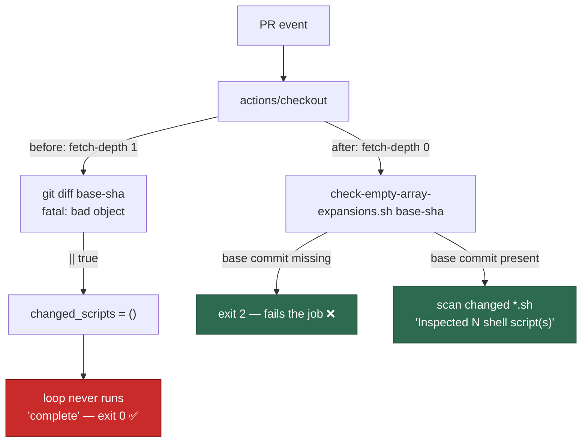

# Empty-array-expansion check no longer passes vacuously (Issue #1891)

## Summary

The `validate` job's "Check for unsafe empty array expansions (bash 3.2
compat)" step checked out with the default `fetch-depth: 1`, so the PR's base
commit was absent from the object store, `git diff --name-only … "<base-sha>"`
died with `fatal: bad object`, the trailing `|| true` swallowed it, and the
step printed "Empty array expansion check complete" having inspected nothing.
A silent failure reported as a pass.

The fix is both halves the issue asked for:

- **Enough history** — the `validate` job now checks out with
  `fetch-depth: 0`, so the base commit is always present.
- **Fail loud** — the scan moved out of the inline `run:` block into
  `.github/scripts/check-empty-array-expansions.sh`, which exits `2` when the
  base commit is not in the local object store (or the diff fails for any
  other reason) instead of falling back to an empty file set. It also prints
  `Inspected N shell script(s).` on every run, so a vacuous pass is visible in
  the log rather than hidden behind the word "complete".

Findings themselves stay advisory, exactly as before — an array proven
non-empty by control flow is a legitimate false positive. It is the scan *not
running* that is now fatal.

The issue also asked for a sweep of the same pattern elsewhere.
`.github/workflows/container-build.yml` was the only other
`git diff <base-sha>` under a `|| true`; that job already checks out with
`fetch-depth: 0`, but the swallow meant a failed diff would have read as
"nothing image-affecting changed" and skipped the image build. The `|| true`
is gone and both SHAs now reach the script through `env:` rather than direct
`${{ }}` interpolation. `.github/workflows/gitleaks.yml` was checked and left
alone: its `git fetch … || true` is belt-and-braces beside `fetch-depth: 0`,
and the gitleaks scan that follows fails loud on an unresolvable range.

Closes #1891.

## Evidence

Backend/CI change — there is no web interface to screenshot. Evidence is the
reproduction below, the new test suite, and a full green `./quality.sh`
(`Result: PASSED (with skipped checks)`; the only skip is `config integration`,
which is skipped on this host independently of this change).



Whole-tree mode against this repository, for comparison — the count is the
part that was missing:

```text
Inspected 26 shell script(s).
Found 21 potentially unsafe empty array expansion(s).
```

## Reproduction

- **symptom** — the check printed `fatal: bad object <base-sha>` followed by
  `Empty array expansion check complete` and exited 0, having inspected no
  files (run 34439186230, PR #1886)
- **status** — `verified` — the pre-fix step body was run verbatim in a
  throwaway repository against an absent base SHA and reproduced the symptom
  exactly (`fatal: bad object`, `changed_scripts count=0`, `complete`,
  `exit=0`); the regression suite below was then run against the tree before
  the script existed (6 failures) and after the fix (6 passes)
- **regression test** —
  `worker/deno/tests/empty_array_expansion_check_test.ts::empty-array check - an absent base commit fails loud (Issue #1891)`

## Test Plan

Added `worker/deno/tests/empty_array_expansion_check_test.ts` — six tests that
run the real script against real throwaway git repositories and assert on exit
codes and output:

- an absent base commit exits 2, names the SHA, and never prints "complete"
  (the regression);
- an empty base argument exits 2;
- an unsafe `${arr[@]}` in a changed script is warned about, with the file and
  line;
- the guarded `${arr[@]+"${arr[@]}"}` form raises no warning;
- a PR that changed no shell script reports `Inspected 0 shell script(s)`;
- whole-tree mode (no base argument) scans every `*.sh` under the tree.

Registered in `INTEGRATION_TEST_FILES` because it drives a repository script,
the same placement as its closest sibling `tests/next_release_tag_test.ts`
(also a `.github/scripts/*.sh` driver); it runs in the per-PR
`integration tests` job and takes ~2s.

**Existing test modified (documented, per the standards):**
`worker/deno/tests/container_build_probe_paths_test.ts` parses the pathspec
list out of the committed workflow by scanning for the literal `|| true)`
terminator. That swallow no longer exists, so the parser now terminates on the
closing `)"` of the command substitution. No assertion was weakened or removed
— both tests still run the real `git diff` with the workflow's pathspecs.

Also run: `./quality.sh` (green), `actionlint` on both changed workflows
(clean), `shellcheck` and `bash -n` on the new script (clean).

## Docs

`docs/BASH-SYNTAX-AUDIT-SCAN.md` said the workflow "greps for unguarded
expansions"; it now names the committed script, states that findings are
advisory while a scan that cannot run is fatal, and records what Issue #1891
fixed.
