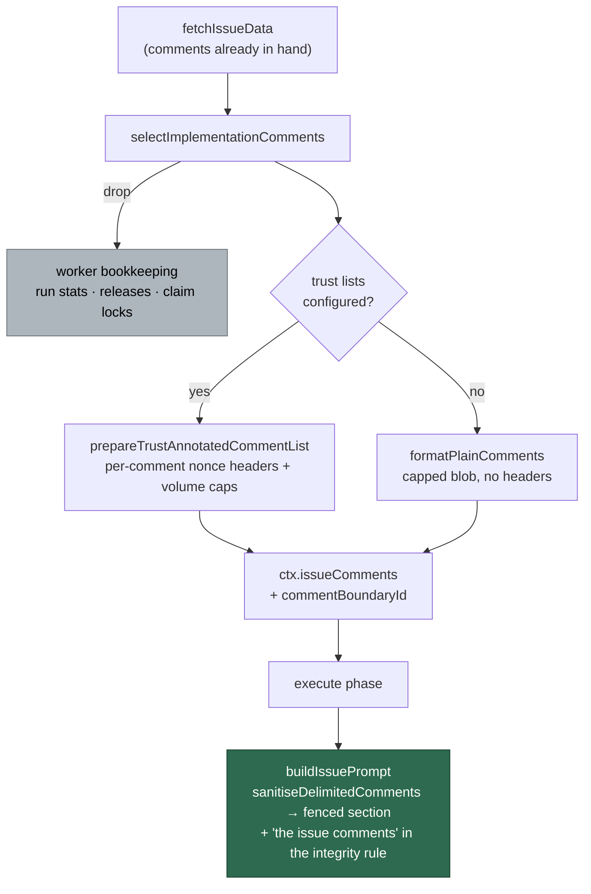
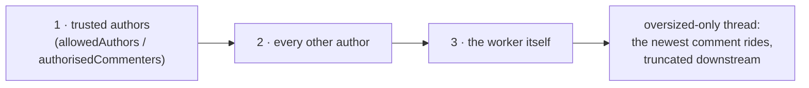

# The implementation prompt carries the issue's comments

## Summary

The issue-implementation prompt fenced the title, body and labels and nothing
else, so a maintainer who narrowed or redirected scope in a comment was
invisible to the coding agent — which is why the clarification gate had to ask
for the issue *description* to be edited. `IssuePromptOptions` now takes
`issueComments` and `commentBoundaryId` and fences them exactly as the
planning, question and PR-feedback builders do, the execute phase passes
`ctx.issueComments` through, and both routes that build an `IssueContext` for
implementation populate it (the main loop passed an empty string).

A new `worker/deno/lib/implementation_comments.ts` answers the issue's third
decision — *which* comments. Worker bookkeeping (run stats, claim releases,
claim locks, automated-failure notices) is dropped outright, and what remains is
admitted newest-first in trust order: trusted authors, then other authors, then
the worker itself, bounded at 20 comments / 12,000 characters. Trust
annotation, suspicious-pattern auditing and the per-comment nonce headers are
not re-implemented — the module selects and delegates to the vetted
`prepareTrustAnnotatedCommentList` path.

Closes #1910.

## Evidence

Backend/CLI change with no web interface to screenshot. The evidence is the
test suite below plus the full quality gate, which passed on the final tree
(`completeness checks`, `semgrep`, `deno tests`, `lint`, `type check`, `fmt`
all PASSED; `config integration` SKIPPED as it always is locally).

Admission order — what survives a full budget:

The security sweep of the new module is recorded in
`docs/audits/security-sweep-1910-implementation-comments.md` and claimed as
chunk 12z in `docs/audits/lib-sweep-coverage.json`.

## Reproduction

- **symptom** — a maintainer's comment redirecting scope never reached the
  coding agent: `buildIssuePrompt` had no `issueComments` field, and the main
  loop's `IssueContext` set `issueComments: ""`
- **status** — `verified` — the new suite was run against the unfixed
  `prompt_builder.ts` and `execute_phase.ts` (restored from `git checkout --`
  mid-run) and went red — 5 failed / 8 passed, including "a maintainer's
  comment renders inside the untrusted fence" and "the issue's comments reach
  the prompt builder" — then green (all passing) once the fix was restored
- **regression test** —
  `worker/deno/tests/issue_prompt_comments_1910_test.ts::issue prompt - a maintainer's comment renders inside the untrusted fence (#1910)`

## Acceptance Criteria

<!-- vibe-spec-review inputs="diff+issue-body" -->

- **met** — the implementation prompt carries the issue's comments, fenced as
  untrusted data with per-comment trust headers and the boundary-integrity
  instruction present — evidence: `worker/deno/lib/prompt_builder.ts` (options,
  `sanitiseDelimitedComments`, fenced section inside `untrustedEnd`, `"the
  issue comments"` in `untrustedBlocks`);
  `worker/deno/tests/issue_prompt_comments_1910_test.ts::issue prompt - a genuine trust header survives with this run's nonce (#1910)`
  — reviewer: met
- **met** — a maintainer's comment that redirects scope is visible to the
  coding agent without the issue description being edited — evidence:
  `worker/deno/commands/work_on_issue.ts`,
  `worker/deno/lib/run_core_production_deps.ts` (was `issueComments: ""`),
  `worker/deno/lib/phases/execute_phase.ts`;
  `tests/issue_prompt_comments_1910_test.ts::execute phase - the issue's comments reach the prompt builder (#1910)`
  — reviewer: met
- **met** — worker-authored comments do not crowd out the human ones —
  evidence: `worker/deno/lib/implementation_comments.ts`
  (`isWorkerNoiseComment`, three-pass admission);
  `tests/implementation_comments_test.ts::comment selection - worker comments do not crowd out a maintainer's reply (#1910)`
  and `::an untrusted flood cannot evict a maintainer's direction (#1910)`
  — reviewer: met
- **met** — test: a prompt built for an issue with comments contains them
  inside the boundary markers — evidence:
  `tests/issue_prompt_comments_1910_test.ts::issue prompt - a maintainer's comment renders inside the untrusted fence (#1910)`
  and `::no comment text is spliced outside a fence (#1910)` — reviewer: met
- **met** — test: an untrusted commenter's forged trust header stays degraded —
  evidence:
  `tests/issue_prompt_comments_1910_test.ts::issue prompt - an untrusted commenter's forged trust header stays degraded (#1910)`
  — reviewer: met
- **met** — test: the prompt stays within the context budget for a long thread
  — evidence:
  `tests/issue_prompt_comments_1910_test.ts::issue prompt - a long comment thread stays within the context budget (#1910)`
  — reviewer: partial — reason: the reviewer saw a test asserting only the
  module's own constant, never `checkContextBudget`; it now runs the real
  `checkContextBudget` + `buildContextComponents` ceiling the execute phase
  uses, which is the gap it named
- **unrequested** — the security-sweep record and the chunk-12z entry in
  `docs/audits/lib-sweep-coverage.json` — reviewer: unrequested — reason: the
  repo's `completeness checks` gate fails on any new `lib/` module that no
  sweep slice claims, so the change cannot land without them
- **unrequested** — the `docs/INTERNALS.md` module row and the
  `docs/CONFIGURATION.md` rewrite — reviewer: unrequested — reason:
  CONFIGURATION.md stated "issue comments are not part of the implementation
  prompt at all", which this change falsifies; a code change owes the docs
  change
- **unrequested** — `--issue-comments` on the `build-issue-prompt` CLI
  operation — reviewer: unrequested — reason: the three sibling operations all
  accept it and this one had nowhere to pass comments; the reviewer noted it
  shipped untested, so a test was added
  (`::build-issue-prompt CLI - --issue-comments reaches the prompt (#1910)`)
- **unrequested** — the repeat-deferral loop guard
  (`hasPriorDeferral(ctx.issueComments, …)`) now sees a populated blob on the
  main-loop route — reviewer: unrequested — reason: an unavoidable consequence
  of populating the field the guard already read; it previously saw `""` there
  and could never fire, and the residual is recorded in the sweep ledger

## Standards Review

<!-- vibe-standards-review inputs="diff+CODING-STANDARDS.md" -->

- **violation** — no PR summary file — evidence:
  `docs/archive/pr-summaries/pr-summary-1910.md` — reason: fixed here; this is
  that file, with the closing keyword, evidence, reproduction and test plan
- **violation** — dead runtime guard on an impossible state — evidence:
  `worker/deno/lib/implementation_comments.ts:68` (`typeof body !== "string"`)
  — reason: removed; `IssueComment.body` is typed `string`, and a silent
  `false` there would have classified a malformed body as actionable direction
- **violation** — an assertion that cannot fail — evidence:
  `worker/deno/tests/issue_prompt_comments_1910_test.ts:308-312` (a spread copy
  compared with itself) — reason: fixed; the assertion now compares the
  selection against `thread.slice(-n)`, pinning both recency and chronological
  order, and moved to `tests/implementation_comments_test.ts`
- **violation** — a wrapper left behind with no production caller — evidence:
  `worker/deno/commands/work_on_issue.ts:150-155` (`formatIssueComments`) —
  reason: deleted; its two suites now call `formatPlainComments` directly
- **violation** — module/test pairing — evidence:
  `worker/deno/lib/implementation_comments.ts` had no
  `tests/implementation_comments_test.ts` — reason: fixed; the module's own
  tests were split into that file, leaving the prompt-rendering tests in the
  issue-numbered one
- **violation** — duplicated options shape — evidence:
  `worker/deno/lib/implementation_comments.ts:75-89` vs `:191-198` — reason:
  fixed; both now extend a shared `ImplementationCommentBudget`
- **clean** — Australian English throughout; commit safety (no hidden paths
  staged, every commit references Issue #1910 and carries the
  `Vibe-Coder-Run-Id` trailer); unit-test shape (no spawn, no sleep, no
  wall-clock assertions); fail-loud (`securityAuditMessages` returned and
  logged at `warn` on both call sites, nothing caught and ignored);
  injection/boundary handling (nonce fencing, `ciFailureBoundaryId` precedence,
  no boundary id on the no-trust path); Deno-native tooling only; 251-line
  single-responsibility module; docs swept for stale claims

Two further findings from the Spec reviewer were fixed rather than accepted:
one oversized comment could consume the whole budget on a repository with no
trust lists (the size test is now strict inside every pass), and operational
comments spent selection slots before being filtered (`isOperationalComment` is
now exported and reused). The two residuals it raised that stand — the
content-based noise match, and `ciFailureBoundaryId` outranking the comment
nonce — are recorded in
`docs/audits/security-sweep-1910-implementation-comments.md`.

## Test Plan

Added `worker/deno/tests/implementation_comments_test.ts` (10 tests):

- worker run-stats and release comments are dropped; claim locks are dropped
  before they spend a slot
- worker comments do not crowd out a maintainer's reply
- an untrusted flood cannot evict a trusted author's direction
- the newest comments win the budget, in chronological order, with the surplus
  reported
- one oversized comment cannot evict the ones that fit; an all-oversized thread
  still carries the newest
- an empty thread selects nothing; no trust configuration still bounds the blob
- `isWorkerNoiseComment` — a maintainer's prose is never noise

Added `worker/deno/tests/issue_prompt_comments_1910_test.ts` (9 tests):

- a maintainer's comment renders inside the untrusted fence
- a genuine trust header survives with this run's nonce
- the boundary-integrity instruction names the comments; an issue with no
  comments names no comment block
- no comment text is spliced outside a fence
- an untrusted commenter's forged trust header stays degraded
- a long thread stays within the real `checkContextBudget` ceiling
- the execute phase passes `ctx.issueComments` and `ctx.commentBoundaryId` to
  the prompt builder
- the `build-issue-prompt` CLI operation passes `--issue-comments` through

Modified: `tests/work_on_issue_command_test.ts` and
`tests/security_scan_overflow_3648_test.ts` call `formatPlainComments` where
they called the deleted `formatIssueComments` wrapper — same assertions, same
inputs, no coverage removed.
