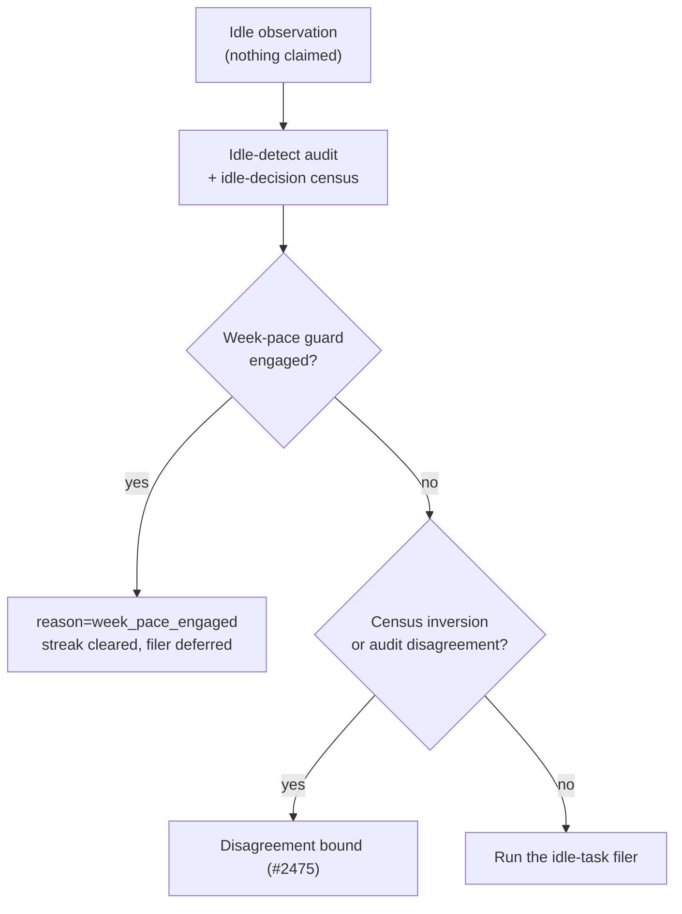

# With the week-pace guard engaged, defer idle-task filing (Issue #1915)

## Summary

The week-pace guard (Issue #1885) drops the `low-priority` and `idle-task`
tiers from the scan's ladder, but the idle-detect audit did not model it. On
GRQ-25 the audit counted 87 pace-suppressed `low-priority` issues as claimable,
so every cycle read as a scan/probe disagreement, and once the twenty-minute
bound was exceeded the idle-task filer was forced through it — walking every
monitored repository at ~800 GraphQL points a cycle, out of the fleet's shared
5,000, to file work the guard forbids claiming for the rest of the week.

Three changes, all off by default and inert while the guard is off:

- `classifyIssues` takes `weekPaceEngaged` and excludes the suppressed tiers as
  `pace_suppressed`, applied **last** so a more fundamental refusal
  (`pr_blocked`, `run_local_hold`, …) keeps its reason. `auditClaimableState`
  forwards it, and the production factory reads the gate's already-recorded
  verdict (`lastEngaged()` — no probe, no request, no log line), the same
  reading the census uses for its own tier-3 suppression.
- The idle hooks defer filing while the guard holds, **above** the
  disagreement chain, and clear the observer's run: a cycle whose eligible work
  is entirely pace-suppressed is agreement, not a disagreement to accumulate.
- The Issue #1052 idle-starvation detector treats an observation taken under
  the guard as `pace-deferred` and ends the episode, so a week of deliberate
  non-filing cannot escalate the worker's own policy to a human;
  `describeIdleHooksRefusal` names `week_pace_engaged` in the evidence.

Closes #1915.

## Evidence

Backend/CLI change — no web interface to screenshot. The evidence is the test
run below and the decision order the change installs:



```text
$ deno test --allow-all tests/idle_detect_week_pace_1915_test.ts \
    tests/run_core_week_pace_idle_hooks_1915_test.ts \
    tests/idle_starvation_week_pace_1915_test.ts \
    tests/idle_starvation_escalation_1052_test.ts
ok | 27 passed | 0 failed

$ ./quality.sh   # full gate, all stages PASSED (config integration SKIPPED)
```

## Reproduction

- **symptom** — with the pace guard engaged and 87 eligible `low-priority`
  issues, the audit reported them claimable, the disagreement streak advanced,
  and the idle-task filer was forced through the bound to walk every monitored
  repository (`priority:idle-work-hooks=800`) and file nothing.
- **status** — `verified` — with the new options declared but unwired, the two
  regression suites failed exactly as GRQ-25 did (`claimableTotal` 87 not 0,
  `misClassification` true, `filerRuns` 1 not 0); both pass after the fix.
- **regression test** —
  `worker/deno/tests/run_core_week_pace_idle_hooks_1915_test.ts::run_core - the pace guard defers idle-task filing and never advances the disagreement streak (Issue #1915)`
  and
  `worker/deno/tests/idle_detect_week_pace_1915_test.ts::auditClaimableState - pace engaged: a pace-suppressed backlog is not claimable and raises no mis_classification (Issue #1915)`

## Acceptance Criteria

<!-- vibe-spec-review inputs="diff+issue-body" -->

- **met** — with the pace guard engaged, a cycle's `idle-work-hooks` GraphQL
  count is near zero — evidence:
  `worker/deno/lib/run_core.ts` defers the filer before the disagreement
  chain; the filer is the only per-repo walker under that priority context and
  `worker/deno/tests/run_core_week_pace_idle_hooks_1915_test.ts` asserts it
  never runs — reviewer: partial — reason: the reviewer noted the audit and
  census still run inside `withPriorityContext("Idle Work Hooks")` and nothing
  measures the counter; both read through the iteration's shared `issues_all`
  / `prs_open_all` caches the scan already populated, so the residual is cache
  hits rather than calls, and keeping them is what the issue's own suggested
  fix requires (it asks for the audit to be *told* about the guard, not
  skipped).
- **met** — with the pace guard engaged, the disagreement streak does not
  advance — evidence: `worker/deno/lib/run_core.ts` clears the observer's run
  on the pace path; asserted over five observations spanning 45 minutes (more
  than twice the 20-minute bound) in
  `worker/deno/tests/run_core_week_pace_idle_hooks_1915_test.ts` — reviewer:
  met
- **met** — with the guard off, the existing audit/filer behaviour is
  unchanged — evidence:
  `worker/deno/tests/idle_detect_week_pace_1915_test.ts::auditClaimableState - pace off: the same backlog counts as claimable and alerts`
  and the guard-off bound test in
  `worker/deno/tests/run_core_week_pace_idle_hooks_1915_test.ts` — reviewer:
  met
- **met** — `weekPaceEngaged` reaches the idle-decision audit so pace-suppressed
  tiers are not counted claimable — evidence:
  `worker/deno/lib/idle_detect_diagnostics.ts` (`pace_suppressed` gate) and
  `worker/deno/lib/run_core_production_deps.ts` (`weekPaceEngaged:
  weekPaceGate.lastEngaged()`) — reviewer: met
- **met** — regression test: pace engaged + 87 eligible low-priority + none
  claimed → no streak, filer not invoked, no per-repo listings — evidence: both
  new suites — reviewer: met — reason: the reviewer recorded "no per-repo
  listings" as covered only indirectly, since the filer stub cannot emit them
  and the filer is their only producer.
- **unrequested** — the Issue #1052 idle-starvation detector gains a
  `pace-deferred` branch, and `describeIdleHooksRefusal` a `week_pace_engaged`
  reason — evidence: `worker/deno/lib/idle_starvation_escalation.ts` —
  reviewer: unrequested — reason: deferring the filer for up to a week
  guarantees the fleet holds no idle task, which the detector reads as
  starvation and escalates to a human twelve hours in — a false signal this
  change would otherwise have created, so it is fixed here rather than left.
- **unrequested** — `pickDominantReason` ranks `pace_suppressed` above
  `run_local_hold` — evidence: `worker/deno/lib/idle_detect_diagnostics.ts` —
  reviewer: unrequested — reason: a new skip reason has to be ranked somewhere;
  it sits below the two PR gates and above the run-local hold because it is only
  ever set on work nothing else refused and it outlives the run.
- **unrequested** — documentation sections in `docs/IDLE-TASK-FRAMEWORK.md` and
  `docs/workflows/issue-processing.md` — evidence: both files — reviewer:
  unrequested — reason: the standards require the docs that describe the changed
  behaviour to move with it; `issue-processing.md` previously stated the
  idle-task filer was untouched by the gate, which this change makes false.

## Standards Review

<!-- vibe-standards-review inputs="diff+CODING-STANDARDS.md" -->

- **violation** — `docs/workflows/issue-processing.md` still claimed "the
  idle-task *filer* is untouched" by the pace gate — evidence:
  `docs/workflows/issue-processing.md:136` — reason: fixed here; the bullet now
  states the deferral and links the new framework section.
- **violation** — `describeIdleHooksRefusal` gained a parameter and a new
  highest-precedence return with no test — evidence:
  `worker/deno/lib/idle_starvation_escalation.ts:332` — reason: fixed here;
  `worker/deno/tests/idle_starvation_week_pace_1915_test.ts` covers the new
  branch and the unchanged vocabulary.
- **violation** — no `docs/archive/pr-summaries/pr-summary-1915.md` — evidence:
  the missing file — reason: fixed here; this is it.
- **violation** — the new `#1915` note in `pickDominantReason` was inserted
  between the Issue #655 comment and the `run_local_hold` return it explains —
  evidence: `worker/deno/lib/idle_detect_diagnostics.ts:790` — reason: fixed
  here; each comment now sits above the return it describes.
- **clean** — Australian English throughout; TDD (both suites were watched
  failing against the unfixed code); tests call real code and assert on
  returned values, logs and persisted state with an injected clock and a
  temp work directory — no wall-clock sleeps, no source grepping; fail-loud
  (no new catch-and-ignore; the added accessors read an already-recorded
  verdict); commit safety (no hidden or credential paths staged); new options
  optional and defaulting to the pre-existing behaviour.

## Test Plan

- Added `worker/deno/tests/idle_detect_week_pace_1915_test.ts` — the classifier
  and `auditClaimableState` under pace engaged and pace off, the 87-issue
  GRQ-25 backlog, precedence against a more fundamental refusal, and
  `pickDominantReason`'s ranking.
- Added `worker/deno/tests/run_core_week_pace_idle_hooks_1915_test.ts` — drives
  the real `runCoreLoop`: the filer is never invoked and the persisted streak
  never advances while the guard holds; with the guard off the filer runs and
  the #2475 bound still forces exactly one attempt.
- Added `worker/deno/tests/idle_starvation_week_pace_1915_test.ts` — the
  detector defers under the guard, ends a running episode, still escalates with
  the guard off, and `describeIdleHooksRefusal` names the new reason.
- Re-ran the neighbouring suites (idle-detect, idle census, idle hooks,
  idle-task filer, week pace, starvation #1052) and the full `./quality.sh`.
