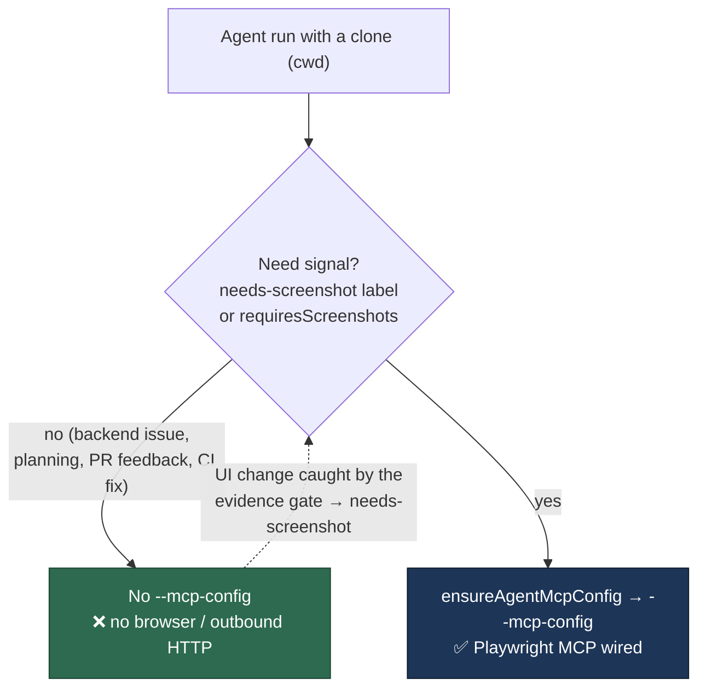

# Browser/network MCP capability is granted on need, not by default

## Summary

The Playwright MCP server — outbound HTTP through a full browser context — was
wired into the agent's tool set for **every** run that carried a `cwd`
(`claude_runner.ts`: "Default true whenever `cwd` is set"), so every issue the
fleet worked, backend or not, handed a possibly prompt-injected agent a browser
it could be steered at an internal or attacker-controlled host (CWE-250,
LLM06 Excessive Agency).

The grant is now opt-in on an explicit need signal:

- `RunClaudeOptions.mcpConfig` is honoured only when the caller sets it `true`
  **and** a `cwd` is present. Absent or `false` means no browser — a `cwd`
  alone grants nothing.
- Both issue-work paths set the signal from the same `detectScreenshotRequired`
  detection that already injects the screenshot instructions — the
  `needs-screenshot` label, or a repo configured with `requiresScreenshots`:
  - `worker/deno/lib/phases/execute_phase.ts` (the main fleet loop — the path
    that actually passes a `cwd`),
  - `worker/deno/lib/execute_claude_phase.ts` (the standalone
    `execute-claude-phase` command).
- Planning, PR feedback, CI-fix, grill-me, quorum and refinement runs are
  invoked with no browser at all.

Nothing else about the server changed: the same per-clone config is generated
into `${WORK_DIR}/.vibe-cache/mcp/` and passed as `--mcp-config` when the
signal is set, so a `needs-screenshot` run captures evidence exactly as before
(Issue #4355 behaviour preserved for the runs that need it).

Closes #192.



**Trade-off, documented in `docs/CONTAINER.md`:** a UI change in a repo that
declared neither signal now reaches the evidence gate with no screenshot. That
is the existing self-healing round trip — the gate blocks the PR, labels the
issue `needs-screenshot`, and the retry is granted the browser. Setting
`requires_screenshots: true` on a UI repo skips the round trip, as it always
has.

## Evidence

Backend/CLI change — no web interface to screenshot. The evidence is the
regression tests below, each verified to fail against the unfixed code.

**Original trigger is closed, with no trivial bypass.** The trigger was "an
issue whose content does not require a browser at all still gets the agent
invoked with Playwright wired in". `runClaudeWithTimeout` now computes
`options.mcpConfig === true && cwd` before calling `ensureAgentMcpConfig`, so
the only way to obtain a `--mcp-config` argument is for a caller to pass
`mcpConfig: true`. The two issue-work callers derive that boolean from
`detectScreenshotRequired(...)` over the issue's labels and the repo config —
worker-controlled inputs the agent cannot write mid-run (labels are read before
the prompt is built, and the `gh` guard refuses reserved-label writes). No
other production call site passes `mcpConfig`, so no run reaches the browser by
omission; the equivalent bypasses — a truthy non-`true` value, or a `cwd`
alone — are both rejected by the strict `=== true` test, and each is covered by
an assertion below.

Verified failure against the unfixed code (`origin/main` implementation files,
new tests in place):

```text
claude runner - a run that declares the browser needed passes --mcp-config … ... FAILED
  AssertionError: a cwd alone must not wire the browser: … --mcp-config /tmp/…/playwright-mcp-9f0d85c4.json …
runExecuteClaudePhase - the browser MCP server is requested only when the issue needs a screenshot (Issue #192) ... FAILED
execute_phase - a backend issue is run with no browser MCP server (Issue #192) ... FAILED
execute_phase - a needs-screenshot issue is granted the browser (Issue #192) ... FAILED
execute_phase - a repo configured with requiresScreenshots is granted the browser (Issue #192) ... FAILED
```

All pass after the fix (`deno test` over the three suites: 48 passed,
0 failed).

## Test Plan

Regression tests added (each reproduces the flaw, fails against the unfixed
code and passes after the fix):

- `worker/deno/tests/execute_phase_browser_grant_test.ts::execute_phase - a backend issue is run with no browser MCP server (Issue #192)`
  — the main-loop path invokes the runner with `mcpConfig: false` for a plain
  `enhancement,work-on` issue; before the fix it passed no flag at all and the
  runner defaulted the browser on.
- `worker/deno/tests/execute_phase_browser_grant_test.ts::execute_phase - a needs-screenshot issue is granted the browser (Issue #192)`
  — the label still grants the browser, so screenshot evidence is unaffected.
- `worker/deno/tests/execute_phase_browser_grant_test.ts::execute_phase - a repo configured with requiresScreenshots is granted the browser (Issue #192)`
  — the per-repo config is the same need signal.
- `worker/deno/tests/agent_mcp_config_test.ts::claude runner - a run that declares the browser needed passes --mcp-config pointing at a written config; a cwd alone does not (Issues #4355, #192)`
  — asserts the runner-level gate end to end over the built argv: a `cwd`-only
  run carries no `--mcp-config`, `mcpConfig: true` with a `cwd` does,
  `mcpConfig: false` does not, and `mcpConfig: true` without a `cwd` does not.
- `worker/deno/tests/execute_claude_phase_test.ts::runExecuteClaudePhase - the browser MCP server is requested only when the issue needs a screenshot (Issue #192)`
  — the same three cases through the standalone command path.

Full gate: `./quality.sh` passes every check except `deno tests`, which reports
10 failures in `fleet_health_test.ts`, `host_workdir_guard_test.ts`,
`optional_feature_env_test.ts` and `setup_workdir_reminder_test.ts`. Those are
pre-existing and unrelated — they assert against this container's real
`WORK_DIR`/config and were confirmed failing identically on a clean
`origin/main` worktree (9 failed there in the three suites re-run; the tenth is
`host_workdir_guard`'s assertion over the same `buildFleetHealthConfig`
behaviour). Nothing in this change touches those modules.

Docs updated in the same change: `docs/CONTAINER.md` (the grant rule, which
run types get a browser, and the self-healing round trip),
`docs/CONFIGURATION.md` (`requires_screenshots` now also grants the browser),
and `CODING-STANDARDS.md` (the agent-facing tool list).

## Pre-PR security self-check

- **Input validation** — no new external input; the gate reads issue labels and
  repo config already validated upstream.
- **Secrets** — none staged; the MCP `--deny-env` denylist is untouched.
- **Injection surface** — no new shell/SQL/HTTP call; this change removes a
  capability rather than adding one.
- **Authorisation** — the browser grant is now least-privilege: granted per run
  on a declared need instead of by default.
- **Error handling** — `ensureAgentMcpConfig` keeps its logged, non-throwing
  failure path; nothing new is swallowed.
- **Dependencies** — none added.
