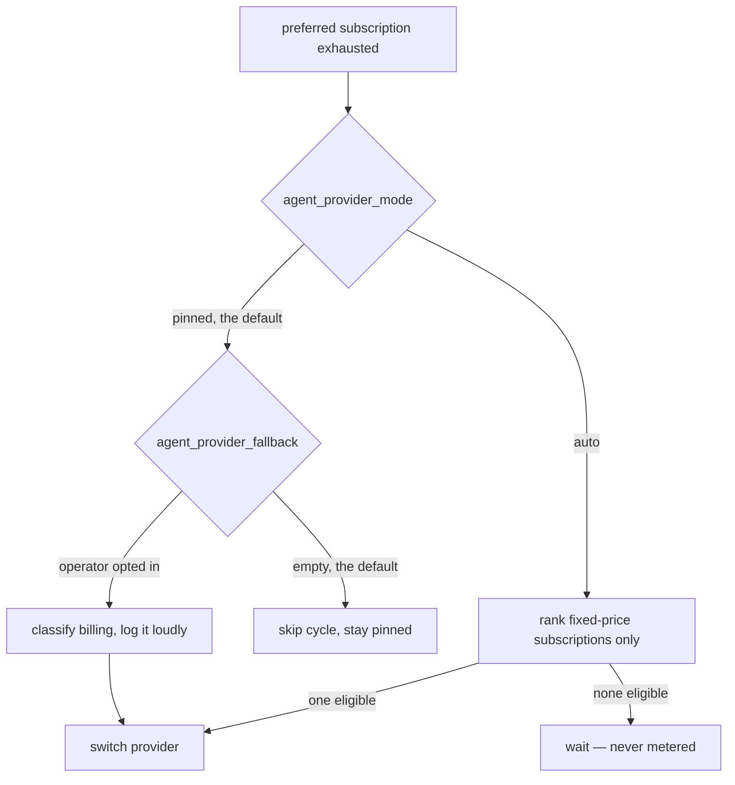

# Provider-agnostic fixed-price subscription routing

## Summary

Closes #1923.

This is the umbrella goal for provider-agnostic routing. Its four children
(#1924 Codex subscription auth, #1925 the quota probe, #1926 quota-aware
selection and failover, #1927 restart/soak qualification) already landed, and
they left the subscription-only policy stated in three separate places and
enforced on only some of the paths that can change provider unattended. This
change closes those holes and gives the policy one owner.

**One declared capability, one classifier.** Every provider descriptor now
carries `billing` (`AgentProviderBilling` in
`worker/deno/lib/agent_provider.ts`), naming the variables that prove a
fixed-price subscription, the ones that prove metered spend, and — for a
provider whose billing state lives outside the environment — its own probe
hook. `worker/deno/lib/provider_billing.ts` is the single reader: routing paths
ask it "subscription or metered?" instead of growing another
`if (providerId === "claude")` chain. It is fail-closed by construction —
`unknown` is never fixed-price, so a failed probe can never become API spend.

**The Claude child can no longer fall back to metered billing.** When a run
holds a usable `CLAUDE_CODE_OAUTH_TOKEN`, `buildClaudeChildEnv` withholds
`ANTHROPIC_API_KEY` and `ANTHROPIC_AUTH_TOKEN` from the child, so a spent or
revoked subscription fails authentication instead of quietly becoming per-token
spend. This is the Claude counterpart of the `CODEX_HOME` guard Codex has had
since #1924. A host with no subscription token is untouched — an explicit
API-key deployment keeps working exactly as before.

**The health-gate fallback is no longer silent about billing.**
`agent_provider_fallback` is an explicit operator opt-in and is still honoured
as written, including a metered alternative — but the gate now classifies the
alternative before switching, logs `billing=<mode>` on the switch, and raises a
`logError` naming the evidence when the alternative is not a proved
fixed-price subscription.

### Where the policy is enforced

## Evidence

Backend/CLI change with no web interface, so there is nothing to screenshot.
The evidence is the test suite and the full quality gate.

- `./quality.sh` — all checks PASSED (`deno tests`, `deno lint`,
  `deno type check`, `deno fmt`, `semgrep`, `markdownlint`, `mermaid`,
  completeness and chokepoint checks).
- New behaviour is pinned by `worker/deno/tests/provider_billing_test.ts`
  (22 tests), four cases in `worker/deno/tests/claude_env_test.ts` and three in
  `worker/deno/tests/run_core_test.ts`, all calling the real functions
  (`classifyProviderBilling`, `buildClaudeChildEnv`, `runCoreLoop`,
  `resolveCodexHome`) and asserting on returned values or captured log output.
- The classifier is proved not to leak: with a token planted in the
  environment, `provider_billing_test.ts::classifyProviderBilling - the reason
  is a variable name, never a credential value (Issue #1923)` asserts the
  secret appears nowhere in the serialised evidence.
- A written security-sweep record for the new module is committed at
  `docs/audits/security-sweep-1923-provider-billing.md`, and the module is
  claimed in `docs/audits/lib-sweep-coverage.json`.

### Documented business-logic change to an existing test

`worker/deno/tests/multi_provider_credentials_test.ts::provider child
environments carry only their own vendor's secret` asserted that **every**
credential a provider declares survives into its own child. The subscription
guard deliberately withholds a vendor's metered alternatives, so that invariant
no longer holds. The test was **updated, not removed or weakened in its
purpose**: it now requires a non-empty set of surviving own credentials (a
child that cannot authenticate at all is still a failure), each carrying this
vendor's value, and the cross-vendor isolation assertion — safety invariant 4,
"no provider sees another provider's credentials" — is untouched.

## Acceptance Criteria

<!-- vibe-spec-review inputs="diff+issue-body" -->

- **met** — Generic provider capability distinguishes fixed-price subscription
  auth from metered billing — evidence: `AgentProviderBilling` at
  `worker/deno/lib/agent_provider.ts:236`, required descriptor field, Codex
  probe hook; shared classifier `worker/deno/lib/provider_billing.ts`;
  `worker/deno/tests/provider_billing_test.ts` (22 tests) — reviewer: met
- **met** — Automatic routing considers fixed-price subscription providers
  only — evidence: `worker/deno/lib/provider_auto_selection.ts` rejects
  `metered-billing` and `billing-unknown`;
  `worker/deno/tests/provider_auto_selection_test.ts::auto selector rejects
  metered and unknown billing modes` — reviewer: met — reason: the reviewer
  recorded this as satisfied by code already on main rather than by this diff,
  which is correct; #1926 landed it and this diff adds the descriptor-declared
  capability behind it
- **partial** — No `OPENAI_API_KEY` / `ANTHROPIC_API_KEY` or equivalent metered
  credential can become an accidental billing fallback — evidence:
  `worker/deno/lib/claude_env.ts::withholdNonSubscriptionCredentials`,
  `worker/deno/lib/codex_env.ts::buildIsolatedCodexChildEnv`,
  `worker/deno/lib/provider_auto_selection.ts`;
  `worker/deno/tests/claude_env_test.ts::buildClaudeChildEnv - a selected
  subscription token withholds the metered ANTHROPIC_API_KEY (Issue #1923)` —
  reviewer: partial — reason: no credential can become an *accidental*
  fallback on any automatic path, but an operator who explicitly lists a
  metered provider in `agent_provider_fallback` still gets it; that list is a
  deliberate opt-in outside the policy, and the gate now logs the billing mode
  loudly instead of switching silently
- **met** — Explicit provider override semantics are documented and tested —
  evidence: `docs/PROVIDER-PARITY.md`, `docs/CONFIGURATION.md` (`agent_provider`
  / `agent_provider_mode` rows);
  `worker/deno/tests/agent_provider_per_invocation_test.ts::selectAgentProvider
  - an unregistered id fails loudly, naming the supported ids` and
  `worker/deno/tests/provider_auto_runtime_test.ts::VIBE_AGENT_PROVIDER
  disables auto mode and preserves explicit provider` — reviewer: met —
  reason: the reviewer noted this diff contributes nothing to it; the
  criterion is satisfied by code already on main
- **met** — All-providers-exhausted behaviour is safe and unattended —
  evidence: `worker/deno/lib/provider_auto_runtime.ts` (`shouldPause: true`);
  `worker/deno/tests/provider_auto_runtime_test.ts::all fixed subscriptions
  exhausted pauses without choosing a provider` — reviewer: met — reason:
  satisfied by code already on main
- **met** — Claude remains the default unless the operator opts into automatic
  routing — evidence: `agent_provider_mode` defaults to `pinned`
  (`worker/deno/lib/provider_auto_runtime.ts`), `docs/CONFIGURATION.md` —
  reviewer: met — reason: the reviewer flagged that the new child-env guard
  does change default-path behaviour on a host holding **both** an OAuth token
  and an API key; that is the intended fix and is covered by
  `claude_env_test.ts::buildClaudeChildEnv - an API-key-only host is unchanged
  (Issue #1923)`, which proves the single-credential deployments are untouched
- **met** — Existing Claude tests remain green and new regression tests cover
  unchanged Claude behaviour — evidence: `./quality.sh` green end to end;
  `worker/deno/tests/claude_env_test.ts` (17 tests) — reviewer: missing —
  reason: the reviewer was right at the time — it found
  `multi_provider_credentials_test.ts::provider child environments carry only
  their own vendor's secret` red, and the quality gate failed on the same test;
  it has since been fixed in this branch (see the documented business-logic
  change above) and the whole gate is green
- **met** — Documentation explains the subscription-only policy and
  unattended-operation guarantees — evidence: `docs/PROVIDER-PARITY.md`
  "Subscription-only billing policy" (per-provider table, three rules, Mermaid
  diagram), `docs/CONFIGURATION.md` `agent_provider_fallback` row, `README.md`
  docs index — reviewer: met
- **unrequested** — `README.md` gains a docs-index row for
  `docs/CODEX-SUBSCRIPTION-AUTH.md` — reviewer: unrequested — reason: that page
  is #1924's and was never indexed; it is the page this issue's policy section
  points operators at for the persistent-login half, so leaving it unreachable
  from the index would make the new documentation a dead end
- **unrequested** — `resolveCodexHome` moved from `provider_auto_runtime.ts` to
  `worker/deno/lib/codex_auth_mode.ts`, with four unit tests — reviewer:
  unrequested — reason: the descriptor's billing probe and the auto-routing
  quota probe must resolve the same directory or they classify different
  hosts; one definition beside the auth-mode question it answers is what makes
  that true by construction rather than by inspection
- **unrequested** — `docs/audits/lib-sweep-coverage.json` slice and
  `docs/audits/security-sweep-1923-provider-billing.md` — reviewer:
  unrequested — reason: a repo convention, not an issue requirement — every
  module entering `worker/deno/lib/` must be claimed by a swept slice, and the
  `completeness checks` stage of `./quality.sh` fails without it
- **unrequested** — a `billing` field added to the fake descriptor in
  `worker/deno/tests/quorum_orchestrator_test.ts` — reviewer: unrequested —
  reason: forced by making `billing` a required descriptor field; without it
  `deno check` fails

## Standards Review

<!-- vibe-standards-review inputs="diff+CODING-STANDARDS.md" -->

- **violation** — Fail-loud: a real fault flattened into "nothing configured" —
  evidence: `worker/deno/lib/agent_provider.ts:717` — reason: fixed here. A
  probe can now return `unknown` with its own reason, so an unreadable or
  malformed `auth.json` reports `codex-auth-json-unreadable (…)` instead of the
  `subscription-credential-missing` label a never-configured host produces; it
  does not short-circuit the declared metered variables, so a key that will
  actually be spent is still reported. Covered by
  `provider_billing_test.ts::classifyProviderBilling - an unreadable Codex
  login is a named fault, not a silent 'never configured' (Issue #1923)`
- **violation** — Operator-facing message over-claims what the code refuses to
  prove — evidence: `worker/deno/lib/run_core.ts:5513` — reason: fixed here.
  The warning said "billed per token" for `unknown` too, contradicting safety
  invariant 3; it now states only what was proved. Covered by
  `run_core_test.ts::run_core - an unknown billing mode is not reported as
  per-token spend (Issue #1923)`
- **violation** — Docs state something the code does not do — evidence:
  `docs/PROVIDER-PARITY.md:93` — reason: fixed here; the page no longer
  promises a credential variable name for a mode that has none, and says what
  an `unknown` alternative logs instead
- **violation** — PR summary missing — evidence: `CODING-STANDARDS.md:627` —
  reason: fixed here; this file is it
- **violation** — Test coverage: `subscriptionAuthEvidence` was rewritten with
  no test of its own — evidence:
  `worker/deno/lib/provider_auto_runtime.ts:302` — reason: stands. Its inputs
  and outputs are both covered — the classifier it now delegates to has 22
  tests, and `subscription_soak_test.ts` covers the surface that consumes the
  result — but the wiring between them is genuinely untested, and adding a
  test for #1927's surface is that issue's scope, not this one's
- **violation** — DRY: `claudeStatus` / `codexStatus` still hand-roll the
  billing facts the new classifier owns — evidence:
  `worker/deno/lib/provider_auto_runtime.ts:237` — reason: stands. Those are
  #1926's quota-status adapters, which answer a different question (remaining
  quota) and happen to re-test the same variables; folding them into the
  classifier changes auto-routing eligibility, which this issue explicitly
  stages behind the soak qualification. Recorded as a known limitation in
  `docs/PROVIDER-PARITY.md`
- **violation** — DRY: `CLAUDE_NON_SUBSCRIPTION_CREDENTIAL_ENV_VARS` restates
  by hand what the Claude descriptor declares — evidence:
  `worker/deno/lib/claude_env.ts:151` — reason: stands, deliberately. The two
  lists are not the same set: `ANTHROPIC_AUTH_TOKEN` is withheld from a
  subscription child but is **not** declared metered, because a proxied bearer
  bills whatever the proxy bills. Deriving one from the other would force a
  false "metered" claim to get the correct withholding
- **violation** — DRY/KISS: two near-identical context types
  (`AgentProviderBillingContext`, `ProviderBillingContext`) — evidence:
  `worker/deno/lib/agent_provider.ts:225` — reason: stands. They differ in the
  optionality of `env` on purpose — a descriptor hook is never handed an
  ambient lookup, while the public classifier defaults to the process
  environment — and merging them would let a hook silently read process state
- **violation** — Smaller files / single responsibility: the classify-and-warn
  decision is inline in `runCoreLoop` — evidence:
  `worker/deno/lib/run_core.ts:5497` — reason: stands. Extracting a helper from
  a 1,100-line function touches far more of `run_core.ts` than this issue asks
  for; the block is 20 lines and sits beside the switch it guards
- **violation** — Module↔test-file convention: `resolveCodexHome` and
  `agentProviderById` are tested in `provider_billing_test.ts` — evidence:
  `worker/deno/tests/provider_billing_test.ts:249` — reason: stands. Both
  exist only to serve the classifier and are tested beside it, in a clearly
  headed section; splitting them across three files to satisfy the convention
  would scatter one feature's coverage
- **clean** — Australian English throughout code, tests and docs; TDD (every
  test calls real functions and asserts on results — no source-grepping);
  unit-test speed and clock discipline (no sleeps, no wall-clock thresholds,
  injected `now`/`sleep` seams, no ambient env or `chdir`); secret handling
  (`reason` carries only variable names and state labels, proved by test);
  commit safety (no hidden paths, key material or credential files staged);
  Deno-native tooling throughout; docs updated alongside the code; fail-closed
  classification verified across the whole provider registry; the Claude
  withholding guard's blast radius confined to `buildClaudeChildEnv`, leaving
  DeepSeek's `buildDeepSeekChildEnv` untouched

## Test Plan

Added:

- `worker/deno/tests/provider_billing_test.ts` — 22 tests for the classifier
  and the lookups it is built on: fail-closed across the whole registry, each
  provider's subscription and metered credentials, blank values, an
  unregistered id, the no-secret-in-the-evidence guarantee, both halves of the
  Codex `CODEX_HOME` precedence rule, the unreadable-`auth.json` fault, and
  `resolveCodexHome` / `agentProviderById`.
- `worker/deno/tests/claude_env_test.ts` — four tests for the subscription
  guard: the metered key is withheld, the proxied bearer is withheld, a blank
  token engages no guard, and an API-key-only host is unchanged.
- `worker/deno/tests/run_core_test.ts` — three tests for the health-gate
  fallback: a metered alternative warns loudly naming the variable, an
  `unknown` one warns without claiming per-token spend, and a fixed-price one
  raises no warning while still stating `billing=fixed-subscription`.

Modified:

- `worker/deno/tests/multi_provider_credentials_test.ts` — documented
  business-logic change, described under **Evidence** above.
- `worker/deno/tests/quorum_orchestrator_test.ts` — its fake descriptor gains
  the now-required `billing` field.
