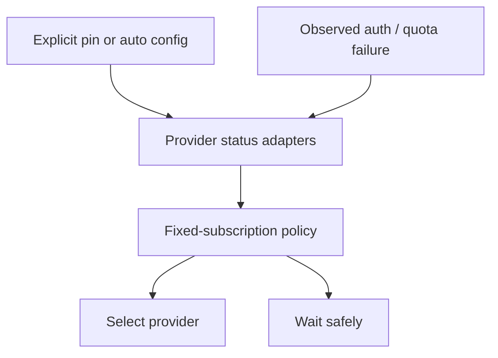

# PR summary — Issue #1926

## Summary

Add opt-in, quota-aware routing between enabled fixed-price coding-agent
subscriptions while preserving every explicit and default pinned-provider path.
When no safe subscription is available, the host defers work instead of
selecting a metered or unknown-billing credential.

Closes #1926.

## Evidence

- `agent_provider_mode` defaults to `pinned`; a missing optional config file
  performs no provider probes and preserves the historical Claude default.
- Auto mode rejects metered and unknown billing, considers every known quota
  window and reset, treats stale/unknown evidence conservatively, and uses the
  configured provider order as the deterministic final tie-break.
- Normalised authentication and quota failures update process-local routing
  state for subsequent work. Quota state expires at the reported reset, or
  after a five-minute recheck cooldown when no reset was supplied.
- Explicit per-invocation routing remains absolute. `VIBE_AGENT_PROVIDER` is
  an emergency pin only after the file opts into auto mode; pinned-mode file
  precedence is unchanged.
- Selection logs contain provider labels and decision metadata, never
  credential values or raw provider failures.
- Focused local validation passed 201 tests across selection, runtime, state,
  output-adapter integration, pinned-mode regression, config validation and
  documentation consistency.

## Test Plan

1. Run `provider_auto_selection_test.ts` for fixed-price eligibility, all-window
   ranking, reset-aware ordering, staleness, deterministic ties and redacted
   logs.
2. Run `provider_auto_runtime_test.ts` and `provider_auto_state_test.ts` for
   opt-in/default behaviour, explicit pins, provider-scoped exhaustion, auth
   failover, cooldown expiry, all-unavailable deferral and fail-closed probes.
3. Run `agent_provider_output_adapter_1695_test.ts` to prove a real normalised
   authentication refusal reaches automatic-routing outage state.
4. Run `repo_config_test.ts` to preserve no-signal and expired-signal pinned
   host behaviour.
5. Run `validation_test.ts`, `config_unknown_keys_test.ts` and config/provider
   documentation consistency tests for the public configuration contract.
6. Run `deno fmt --check`, `deno task check:manifests`, and the repository
   `quality.sh` gate.
