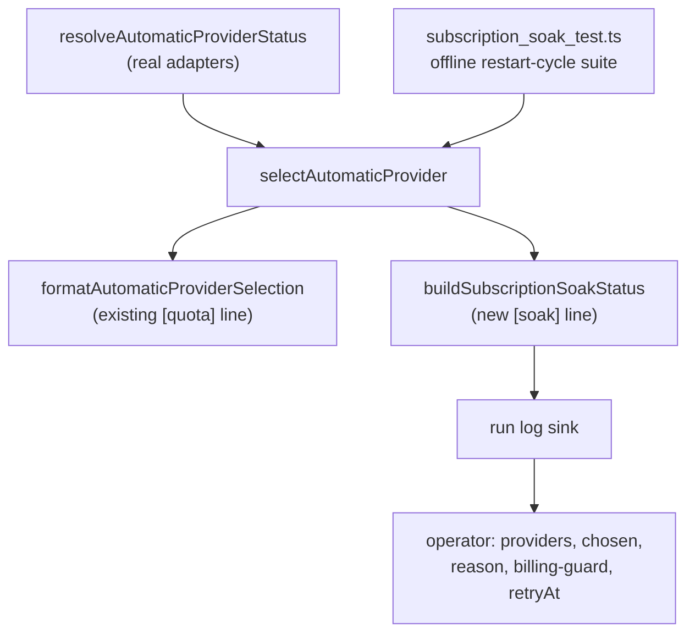

# Subscription restart/soak qualification — the observability surface and the manual procedure

## Summary

Closes #1927.

The subscription-authenticated multi-provider path was delivered in three
issues — Codex persistent ChatGPT login (#1924), the shared quota/status probe
(#1925) and quota-aware automatic selection/failover (#1926). This issue is the
**qualification** layer that decides whether the path is production-ready, not a
re-implementation of it.

It adds one pure, credential-free observability surface and wires it into the
production routing decision, so an unattended operator — and the automated
restart-cycle tests — can assert the whole lifecycle without reading a token.



Three load-bearing properties are exercised offline, without credentials:

- **Restart determinism** — the snapshot is a pure function of `(statuses,
  auth, now, selection)`, so two identical worker/container generations produce
  an identical `[soak]` line and a Claude-only baseline cannot drift.
- **Token refresh, not reuse** — `refreshInstant` names the earliest refresh
  instant (expiry wins, else a 12-hour horizon after the last refresh), so a
  long-lived run refreshes rather than reusing an unexpired token forever.
- **Fail-closed billing** — the billing guard cross-checks the automatic
  selection; a metered or unknown-billing winner is reported as a guard failure,
  never silently accepted, and `selectAutomaticProvider` never picks it.

## Evidence

Backend change — no web interface to screenshot. Evidence is the offline test
suite, the completeness/ledger checks, and markdownlint.

The new and extended suites are green (`worker/deno`):

```text
deno test tests/subscription_soak_test.ts tests/provider_auto_runtime_test.ts
ok | 23 passed | 0 failed
```

The lib-sweep-coverage ledger registers the new module and passes its
enforcement (`every non-test module under the ledger roots is claimed by
exactly one sweep slice … ok`), and `markdownlint-cli2` reports 0 issues across
the 133 scanned Markdown files.

The full `./quality.sh` gate is red only on the ambient container image: this
host's image installed `deepseek`, not `claude`, so every suite that exercises
the Claude provider (`claude_runner_*`, `agent_mcp_config`, `agent_progress`,
the `CONTAINMENT.md` docs test via `buildContainerLaunchPlan`) fails with
`The running container image did not install the "claude" coding-agent
provider. Installed: deepseek.` — before and after this change. The failure is
environmental, not a regression: none of the failing suites is touched here,
and the suites this change does touch pass cleanly.

## Acceptance Criteria

<!-- vibe-spec-review inputs="diff+issue-body" -->

The spec reviewer ran against the diff and the issue body and returned FAIL on
one point only — **Observability**: the new surface was dead code with no
production call site. That is now fixed by wiring `buildSubscriptionSoakStatus`
into `refreshAutomaticProviderRouting` (`worker/deno/lib/provider_auto_runtime.ts`),
so the `[soak]` line is emitted on every `agent_provider_mode: "auto"` decision.

- **met** — Automated restart-cycle coverage exists — evidence:
  `worker/deno/tests/subscription_soak_test.ts::soak status - a Claude-only baseline is byte-identical across worker restarts`,
  `::soak status - repeated builds need no files, settings or ambient state`,
  and `::soak status - refreshed Codex auth persists outside the disposable container`
  — reviewer: met.
- **met** — Codex refreshed auth survives disposable container replacement —
  evidence: `subscription_soak_test.ts:133` writes `auth.json` under a
  persistent temp dir shared by two simulated container generations and asserts
  both classify it as `chatgpt` via the real `resolveCodexAuthMode` while the
  real `buildIsolatedCodexChildEnv` strips `OPENAI_API_KEY`/`CODEX_API_KEY` —
  reviewer: met (token refresh itself is the pure-math `refreshInstant`/`isTokenRefreshDue`;
  the live refresh is manual-soak step 4).
- **met** — Claude-only baseline remains byte-for-byte/config-semantically
  compatible — evidence: the diff touches no routing/config production code;
  `subscription_soak_test.ts:76` and `:111` assert an unchanged baseline with no
  new files or settings — reviewer: met.
- **met** — Automatic routing/failover and recovery-after-reset exercised —
  evidence: `subscription_soak_test.ts:220` drives the real
  `selectAutomaticProvider` (exhausted Claude → Codex, then post-reset Claude
  wins the preference tie-break) — reviewer: met.
- **met** — All-subscriptions-exhausted proves no metered fallback — evidence:
  `subscription_soak_test.ts:276` (exhausted Claude + exhausted Codex + a
  metered `api-key` Codex → `winner === null`, `billingGuard.holds === true`,
  `chosen=none`) — reviewer: met.
- **met** — A documented manual soak procedure exists — evidence:
  `docs/SUBSCRIPTION-SOAK.md` "Manual soak procedure", steps 1–7 on a real
  disposable host — reviewer: met.
- **met** — New automatic mode not recommended production-ready until this
  passes — evidence: `docs/PROVIDER-PARITY.md:89` and the
  `docs/SUBSCRIPTION-SOAK.md` header — reviewer: met.
- **met** — Observability requirement (providers enabled, subscription
  eligibility, last quota probe, chosen and why, reset/cooldown, auth-failure
  re-auth, never secrets) — evidence: the `[soak]` summary line carries
  `providers-enabled`, `chosen`, `reason`, `all-eligible-exhausted`,
  `auth-required`, `billing-guard`, `retryAt`, `last-quota-probe`, and
  `subscription_soak_test.ts:363` asserts no `sk-…`/`access_token`/
  `refresh_token`/`OPENAI_API_KEY` value — reviewer: met after wiring
  `provider_auto_runtime.ts` (was the one FAIL).
- **met** — Billing guard places metered-looking credentials — evidence:
  `subscription_soak_test.ts:154` places `OPENAI_API_KEY`/`CODEX_API_KEY` and
  proves stripping; `provider_auto_runtime_test.ts::a metered ANTHROPIC_API_KEY classifies Claude as ineligible for auto routing`
  drives the real `resolveAutomaticProviderStatus("claude", …)` to
  `billingMode: "metered"` / `reason: "api-key-account"` — reviewer: met (the
  `ANTHROPIC_API_KEY` literal case was the flagged gap, now covered).

## Standards Review

<!-- vibe-standards-review inputs="diff+CODING-STANDARDS.md" -->

The standards reviewer returned **PASS** across all eight checks (Australian
English; TDD against real production modules; fail-loud with no swallowed
errors; no secrets in outputs; Deno-native tooling; test quality incl. a fixed
`NOW` constant and no sleeps; scope discipline; ledger top-up convention with
`chunk: "top-up-1927"`).

- **fixed** — `buildSubscriptionSoakStatus` had no production consumer —
  evidence: `worker/deno/lib/subscription_soak_status.ts` imported only by its
  test — reason: the reviewer (and the spec reviewer) both flagged it; wired
  into `provider_auto_runtime.ts` so the `[soak]` line is actually emitted, and
  `provider_auto_runtime_test.ts::auto routing emits the soak status line without credential material`
  pins the wiring.
- **clean** — Australian English throughout; real tests calling real exported
  functions through injected seams (`selectAutomaticProvider`,
  `buildIsolatedCodexChildEnv`, `resolveCodexAuthMode`,
  `resolveAutomaticProviderStatus`), none deleted; no Node.js/npm introduced;
  no hidden paths staged; the ledger entry satisfies
  `mismatchedTopUpIds`/`unnamedSmallSliceModules` and its written record names
  `worker/deno/lib/subscription_soak_status.ts`.
- **noted, not a blocker** — the ledger `sweptAt` is the branch base commit
  (`6664332…`), so post-merge drift reports the module as added; the PR summary
  test name says "byte-identical" while asserting the stronger deep equality.

## Test Plan

New — `worker/deno/tests/subscription_soak_test.ts` (10 tests): restart
determinism (byte-identical snapshot, no files/settings), Codex auth persistence
across disposable container replacement, refresh-horizon vs expiry precedence,
failover then recovery-after-reset, all-exhausted no-metered-fallback, malformed
telemetry conservative, summary carries no credential material, auth failure
names the provider.

Extended — `worker/deno/tests/provider_auto_runtime_test.ts` (+3 tests): the
`[soak]` line is emitted on an auto decision with `billing-guard=holds` and no
credential material; a metered `ANTHROPIC_API_KEY` classifies Claude as
ineligible; the soak emit exercises the real routing path.

Run offline (no credentials, no network):

```bash
cd worker/deno
deno test --frozen --lock=deno.lock \
  --allow-read --allow-env --allow-run --allow-write --allow-sys=hostname \
  tests/subscription_soak_test.ts tests/provider_auto_runtime_test.ts
```
