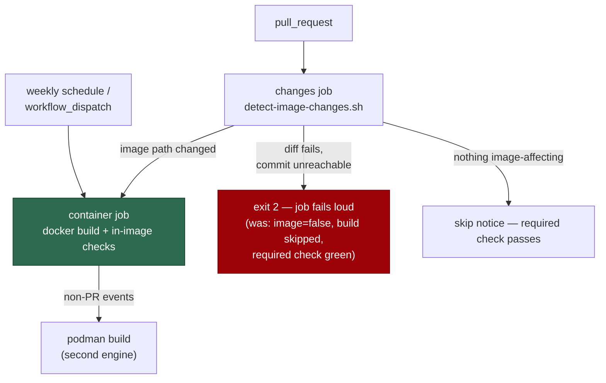

# Container Build's change filter fails loud instead of skipping the image build (Issue #1929)

## Summary

The `changes` job in `.github/workflows/container-build.yml` decided whether
the 11-minute image build ran from a single command:

```bash
changed="$(git diff --name-only "${base}" "${head}" -- … || true)"
```

The `|| true` swallowed every diff failure. A failed diff yields an empty
`changed`, which reads as "nothing image-affecting changed", so the build was
skipped and the **required** `container` check reported green having verified
nothing — the same silent-failure class as #1891.

The filter now lives in `.github/scripts/detect-image-changes.sh`, a committed
script with its own tests (the pattern #1891 established for
`check-empty-array-expansions.sh`). It exits `2` — never `image=false` — on bad
usage, a commit missing from the local object store, a work tree that is not a
git repository, or a `git diff` that fails. The pathspec list moved with it, so
there is one source of truth for what can affect the image.

The issue also required clearing the repo's own `BP-TRIGGER-container-build`
finding, since the changed-workflow gate blocks any PR touching this file while
it stands: this is a test/lint workflow that still triggered on push to `main`.
The push trigger is replaced by a weekly `schedule` plus `workflow_dispatch`.
That keeps the one thing the push trigger bought and the pull-request filter
deliberately skips — a rebuild when `worker/**` or `quality.sh` moves — rather
than dropping it, and the Podman second-engine build (previously gated on
`github.event_name == 'push'`) moves onto the same sweep.

Closes #1929.



## Evidence

Backend/CI change with no web interface, so there is no screenshot to capture.
The evidence is the regression suite plus the repository's own workflow checks.

- `worker/deno/tests/container_image_change_filter_test.ts` — 8 tests, all
  driving the real script against throwaway git repositories and asserting on
  exit codes and `$GITHUB_OUTPUT` writes. Run after the fix:

  ```text
  image filter - a commit outside the object store fails loud (Issue #1929) ... ok
  image filter - an unreachable base commit fails loud ... ok
  image filter - an empty commit argument fails loud ... ok
  image filter - a missing argument fails loud ... ok
  image filter - outside a git repository it fails loud ... ok
  image filter - an image-definition change builds ... ok
  image filter - the screenshot generator builds (Issue #1584) ... ok
  image filter - an unrelated change skips the build ... ok
  ok | 8 passed | 0 failed (2s)
  ```

- `WORKFLOW_FILE_CHECKS` (the changed-workflow gate's table) run over the
  edited workflow with `defaultBranch: "main"` report **no findings** —
  `BP-TRIGGER-container-build` is cleared. Before this change the same run
  produced a `🟡 Test/lint workflow triggers on push to the default branch` finding.
- `shellcheck .github/scripts/detect-image-changes.sh` — clean.
- `actionlint .github/workflows/container-build.yml` — clean.
- `./quality.sh` — `Result: PASSED (with skipped checks)` (`config integration`
  is the pre-existing environment skip).

## Reproduction

- **symptom** — a `git diff` failure in the `changes` job produced an empty
  change set, so `image=false` was written, the image build was skipped, and
  the required `container` check reported green having verified nothing
- **status** — `verified` — the filter script was first written with the
  unfixed inline logic verbatim (`git diff … || true`, no commit checks) and
  the suite ran red: 5 failed, including the headline case, where an
  unreachable head commit exited `0` and wrote `image=false`. With the
  fail-loud script in place the same suite is 8 passed, 0 failed.
- **regression test** —
  `worker/deno/tests/container_image_change_filter_test.ts::image filter - a commit outside the object store fails loud (Issue #1929)`

## Test Plan

- **Added** `worker/deno/tests/container_image_change_filter_test.ts` — eight
  tests over the real script: an unreachable head commit, an unreachable base
  commit, an empty argument, a missing argument and a non-repository work tree
  all exit `2` without ever writing `image=false`; an image-definition change
  and a `worker/deno/setup/screenshot.ts` change write `image=true`; an
  unrelated change writes `image=false`.
- **Updated** `worker/deno/tests/container_build_probe_paths_test.ts` — the
  Issue #1584 probe-path tests read the pathspecs from the committed script's
  `IMAGE_PATHS` array instead of the workflow's inline `git diff`, then run the
  same real `git diff` as before. Both tests keep their original assertions;
  neither was removed or weakened.
- **Updated** `worker/deno/lib/integration_test_manifest.ts` — the new suite
  spawns a repository script, so it joins `INTEGRATION_TEST_FILES`; the
  probe-path suite now names a `.sh` path and is placed in
  `SCRIPT_READING_UNIT_TESTS` with its reason (it reads, never spawns). The
  manifest conformance suite passes in both directions.
- **Updated** `docs/CONTAINER.md` — the CI paragraph described the push
  trigger and the push-time Podman build; both now describe the weekly sweep,
  and the filter script is linked.
