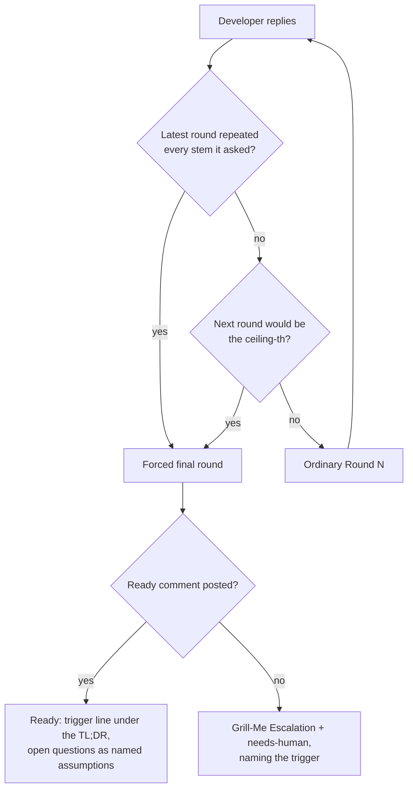

# Grill-me: stall guard + runaway ceiling replace the fixed round cap

## Summary

A productive grilling is no longer halted by a round count. `processGrillMe`
used to escalate with `## Grill-Me Escalation` and `needs-human` the moment the
rounds posted since the latest Ready comment reached `maxGrillMeRounds` —
before invoking Claude, and regardless of whether the grilling was still
making progress. On stSoftwareAU/GRQ#4754 that halted a grilling in which the
developer had answered five rounds in 2.5 hours and every round had asked
questions not asked before.

The stop rule is now productivity-based:

- **Stall guard** — before running a round, the worker parses the numbered
  question stems (`N.` lines under `### Questions`) of every round posted since
  the latest Ready comment. A round is stalled when every one of its stems,
  normalised (lower-cased, whitespace collapsed, trailing punctuation and
  Markdown emphasis stripped, exact match — no similarity threshold), already
  appeared in an earlier round of the same grilling. One stalled round trips
  it; a round with any new stem never does.
- **Runaway ceiling** — `max_grill_me_rounds` keeps its name; its default
  changes from `5` to `20`. The ceiling-th round is itself the forced final
  round.

When either trips, the next round is a **forced final round**: the prompt is
told explicitly that it must post `## Grill-Me — Ready for Next Phase`, record
each still-open question as a named assumption in the issue body, and carry one
line directly under the TL;DR naming the trigger — `Forced final round: stall
guard tripped at Round N` or `Forced final round: round ceiling (20) reached`.
Only a forced final round that fails to post Ready (it posts a round comment
instead, posts nothing, times out, or errors) escalates: today's
`## Grill-Me Escalation` comment plus `needs-human`, naming the trigger and
that no Ready comment followed.

The developer's reply remains the only turn signal — the awaiting-reply gate
runs before the stop rule, so lifting the cap cannot make the worker loop
unattended.

Closes #1933.

## Evidence

Backend/CLI change — no web interface to screenshot. The evidence is the test
suite: 20 unit tests over the new pure module, five behavioural tests driving
`processGrillMe` end to end through the stop rule, and the existing grill-me
suites (126 tests across the two processor files) still green.



Targeted runs (all green):

```
deno test tests/grill_me_stall_guard_test.ts          →  22 passed
deno test tests/grill_me_processor_test.ts            → 117 passed
deno test tests/grill_me_processor_escalation_test.ts →  14 passed
deno task check:manifests                             → 633 passed
```

## Reproduction

- **symptom** — five answered grill-me rounds, every one asking questions not
  asked before, were halted by the fixed cap: the worker posted
  `## Grill-Me Escalation` and `needs-human` instead of Round 6
  (stSoftwareAU/GRQ#4754).
- **status** — `verified` — the five new Issue #1933 tests were run against the
  unfixed `grill_me_processor.ts` / `config_defaults.ts` (restored from
  `HEAD~1`) and all five failed; they pass after the fix.
- **regression test** —
  `worker/deno/tests/grill_me_processor_escalation_test.ts::Issue #1933: five answered productive rounds run Round 6 instead of escalating (GRQ#4754)`
  (it deliberately uses the repository default ceiling, which is the value the
  bug turned on).

## Acceptance Criteria

<!-- vibe-spec-review inputs="diff+issue-body" -->

- **met** — stall guard parses the numbered stems of every round since the
  latest Ready comment; one stalled round trips it, a productive round never
  does — evidence: `worker/deno/lib/grill_me_stall_guard.ts` (`parseQuestionStems`, `isRoundStalled`), wired at `worker/deno/lib/grill_me_processor.ts` via `collectGrillMeRoundsSince` — reviewer: met
- **met** — stem normalisation: lower-case, collapse whitespace, strip trailing
  punctuation and Markdown emphasis, exact equality, no similarity threshold —
  evidence: `worker/deno/lib/grill_me_stall_guard.ts::normaliseQuestionStem`, `worker/deno/tests/grill_me_stall_guard_test.ts::normaliseQuestionStem - a reworded stem does not match (no similarity threshold)` — reviewer: met — reason: the reviewer noted the order differs from the issue's wording (emphasis stripped before whitespace collapse) but the result is equivalent
- **met** — `max_grill_me_rounds` keeps its name, default 5 → 20 — evidence:
  `worker/deno/lib/config_defaults.ts`, `worker/deno/tests/config_defaults_test.ts` — reviewer: met
- **met** — the five named doc surfaces updated in the same change — evidence:
  `docs/CONFIGURATION.md`, `docs/workflows/grill-me.md`, `docs/workflows/planning-and-questions.md`, `docs/SPEC-KIT-COMPARISON.md`, `docs/INTERNALS.md` — reviewer: met
- **met** — the stop rule makes the next round a forced final round that must
  post Ready with open questions as named assumptions; the ceiling-th round is
  itself that round; no escalation when it posts Ready — evidence:
  `worker/deno/lib/grill_me_processor.ts::buildForcedFinalInstruction`, `worker/deno/tests/grill_me_processor_escalation_test.ts::Issue #1933: the ceiling round is itself the forced final round` — reviewer: met
- **met** — the Ready comment carries the trigger line directly under its
  TL;DR — evidence: `worker/deno/lib/grill_me_stall_guard.ts::forcedFinalTriggerLine`, delivered through `prompts/grill-me/prompt.md` — reviewer: met — reason: the reviewer flagged it as instruction-only (nothing checks the posted Ready text afterwards); only the model can write that line, and a forced round that posts no Ready is caught by the escalation path
- **met** — a forced final round that posts no Ready escalates with
  `## Grill-Me Escalation` + `needs-human`, naming the trigger — evidence:
  `worker/deno/tests/grill_me_processor_escalation_test.ts::Issue #1933: a forced final round that posts a round comment instead escalates, naming the trigger` and `…posts nothing escalates as well as failing loudly` — reviewer: met
- **met** — the developer's reply stays the only turn signal — evidence: the
  awaiting-reply gate in `worker/deno/lib/grill_me_processor.ts` runs before
  the stop rule — reviewer: met
- **met** — `prompts/grill-me/prompt.md` drops the `ROUND_NUMBER >= MAX_ROUNDS`
  nudge; the forced final round gets an explicit signal — evidence:
  `prompts/grill-me/prompt.md` Step 4 and the new `{{FORCED_FINAL_INSTRUCTION}}` input — reviewer: met
- **met** — the safety-cap tests in
  `worker/deno/tests/grill_me_processor_escalation_test.ts` are updated to the
  new stop rule — evidence: that file's section 2, plus
  `worker/deno/tests/grill_me_processor_test.ts` — reviewer: met
- **met** — a grilling posts at most `maxGrillMeRounds` rounds since its latest
  Ready comment — evidence: `worker/deno/tests/grill_me_processor_test.ts::processGrillMe - a grilling that already spent the ceiling escalates without posting another round (Issue #1933)` — reviewer: missing — reason: the reviewer found the committed diff could post a 21st round after a failed forced round; fixed in commit `4b59bc57`, which escalates without invoking Claude once the ceiling is spent
- **unrequested** — the forced-final escalation also fires when the round's
  prompt fails to build — reviewer: unrequested — reason: the issue names
  "posts nothing, times out, or errors"; a prompt-build failure is the same
  class of error and leaving it out would report a silent non-escalation, so it
  is kept
- **unrequested** — `collectGrillMeRoundsSince` exported and
  `countGrillMeRoundsSince` re-implemented on top of it — reviewer: unrequested
  — reason: the guard and the counter must see exactly the same window; the
  alternative was duplicating the filter
- **unrequested** — `isFinalRound` redefined from "safety cap hit" to "this was
  the forced final round" — reviewer: unrequested — reason: the old meaning no
  longer exists; the field has no consumers outside the module and its tests

## Standards Review

<!-- vibe-standards-review inputs="diff+CODING-STANDARDS.md" -->

- **violation** — the new `lib/` module was claimed by no sweep slice, failing
  `deno task check:manifests` — evidence: `worker/deno/lib/grill_me_stall_guard.ts:1` — reason: registered in `docs/audits/lib-sweep-coverage.json` in this diff; `check:manifests` now passes (633 tests)
- **violation** — `escalateForcedFinalNotReady` discarded `escalateToHuman`'s
  `Result` and always reported success — evidence:
  `worker/deno/lib/grill_me_processor.ts:1546` (pre-fix) — reason: fixed here; it now returns `false` and logs at error level when both the label add and the comment post failed
- **violation** — the flagship GRQ#4754 regression test pinned
  `maxGrillMeRounds: 20`, so it would have passed against the unfixed code —
  evidence: `worker/deno/tests/grill_me_processor_escalation_test.ts:247` (pre-fix) — reason: fixed here; it uses `buildDefaultWorkerConfig()`, and the test was observed failing against the restored `HEAD~1` implementation
- **violation** — `buildForcedFinalInstruction` and `collectGrillMeRoundsSince`
  were new exported functions with no direct tests — evidence:
  `worker/deno/lib/grill_me_processor.ts` — reason: fixed here; four direct tests added, plus the `maxRounds: 1` / empty-history edge cases for `decideGrillMeStop`
- **violation** — in-code doc comments and one test name still described the
  deleted safety cap — evidence: `worker/deno/lib/grill_me_processor.ts:34`, `:342`, `:623`, `worker/deno/tests/grill_me_processor_test.ts:4225` — reason: all rewritten in this diff
- **violation** — an edit merged two wrapped lines into a 124-character line —
  evidence: `docs/INTERNALS.md:1341` — reason: rewrapped in this diff
- **violation** — the first commit subject carried the issue number only in the
  body — evidence: commit `131933e4` — reason: stands; the follow-up commit
  `4b59bc57` carries `(Issue #1933)` in its subject and the PR title and body
  both name the issue, so amending published-shaped history was not worth it
- **clean** — Australian English throughout (`normalise`, `behaviour`,
  `defence`); `deno fmt`, `deno lint` and `deno check` clean; tests call real
  functions with data and assert on results (no source-grepping, no sleeps, no
  wall-clock thresholds); the stall guard is pure and parallel-safe; DRY
  (`countGrillMeRoundsSince` delegates rather than duplicating); docs updated in
  the same change with a Mermaid diagram and no stale "5 rounds" text; the
  prompt template edited in place with the new placeholder registered as
  optional; no hidden or credential-shaped path staged; a forced round that
  posts nothing still returns `{ ok: false }` and posts the
  `## Grill-Me Failed` marker in addition to escalating

## Test Plan

Added:

- `worker/deno/tests/grill_me_stall_guard_test.ts` — 22 tests over
  `parseQuestionStems`, `normaliseQuestionStem`, `isRoundStalled`,
  `decideGrillMeStop` and `forcedFinalTriggerLine`, including the GRQ#4754
  five-productive-rounds case, the ceiling boundary (19 → forced, 18 → not),
  a ceiling of one, and "a round with no parseable stems is never stalled".
- `worker/deno/tests/grill_me_processor_escalation_test.ts` — five behavioural
  tests: the GRQ#4754 replay running Round 6; a stalled round forcing a final
  round that posts Ready with the trigger line; the ceiling round as the forced
  final round; a forced round posting a round comment instead (escalates,
  naming the trigger); a forced round posting nothing (escalates *and* still
  posts the failure marker with `{ ok: false }`).
- `worker/deno/tests/grill_me_processor_test.ts` — the ceiling round running as
  a forced final round rather than escalating; a failed forced round escalating
  with the next-phase recommendation; a grilling that already spent the ceiling
  escalating without posting another round; direct tests for
  `collectGrillMeRoundsSince` and `buildForcedFinalInstruction`.

Modified (business logic changed, so the old expectations no longer describe
the intended behaviour — documented here as the standards require):

- `worker/deno/tests/grill_me_processor_test.ts::processGrillMe - escalates to needs-human when safety cap is reached without Ready marker`
  — replaced by the two forced-final tests above: reaching the ceiling now runs
  Claude rather than escalating before it.
- `worker/deno/tests/grill_me_processor_test.ts::processGrillMe - safety-cap escalation unassigns the worker (Issue #1830)`
  — renamed and re-pointed at the failed-forced-round path, which is the
  escalation that still exists; the unassign assertion is unchanged.
- `worker/deno/tests/grill_me_processor_escalation_test.ts::Issue #2209: safety-cap escalation posts explanation comment that names planning/work-on`
  — replaced by the Issue #1933 escalation tests, which assert the same
  `planning` / `work-on` recommendation on the path that now produces it.
- `worker/deno/tests/config_defaults_test.ts` — asserts the new default of 20.
