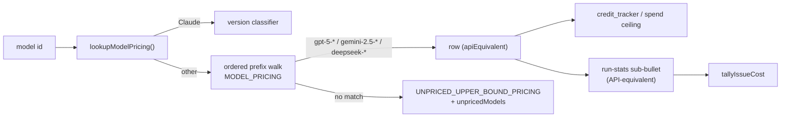

# Price Codex, Gemini and DeepSeek model ids (API-equivalent)

## Summary

`MODEL_PRICING` now carries an **API-equivalent** row for each of the eight
non-Claude model ids the worker routes to, so a Codex, Gemini or DeepSeek run
renders a real USD figure on its run-stats comment, the issue total covers it,
and the daily spend ceiling prices it from the row instead of the unpriced
upper bound. Each non-Claude sub-bullet says `(API-equivalent)` — the figure is
the vendor's API list price for the same tokens, never a bill, because those
providers run on a fixed-price subscription (#1923). Closes #1937.

Rates were read from the vendor pricing pages on **2026-09-11** (never from
memory); every row comment carries its source URL, that checked-on date and the
tier/hours basis:

| Row | Input | Output | Cache write | Cache read | Basis |
|-----|------:|-------:|------------:|-----------:|-------|
| `gpt-5-codex` | $1.25 | $10.00 | $0.00 | $0.1250 | OpenAI model page, standard rate |
| `gpt-5-mini` | $0.25 | $2.00 | $0.00 | $0.0250 | OpenAI pricing page |
| `gpt-5` | $1.25 | $10.00 | $0.00 | $0.1250 | OpenAI pricing page |
| `gemini-2.5-pro` | $1.25 | $10.00 | $0.00 | $0.1250 | paid tier, **≤200k prompt-token** band |
| `gemini-2.5-flash-lite` | $0.10 | $0.40 | $0.00 | $0.0100 | text/image/video rate |
| `gemini-2.5-flash` | $0.30 | $2.50 | $0.00 | $0.0300 | text/image/video rate |
| `deepseek-reasoner` | $0.30 | $1.20 | $0.00 | $0.0060 | **standard-hours** Flash rate, no off-peak discount |
| `deepseek-chat` | $0.30 | $1.20 | $0.00 | $0.0060 | **standard-hours** Flash rate, no off-peak discount |

`lookupModelPricing`, `UNPRICED_UPPER_BOUND_PRICING` and
`estimateCostWithUpperBound` are untouched: the rows resolve through the
existing ordered `startsWith` walk, and every new rate is below the derived
bound, so the bound stays at its pre-change values (pinned by test).
`credit_tracker.ts` and `spend_ceiling.ts` needed no change — both are driven
by `estimateCostWithUpperBound(...).priced`.

### Reviewer-driven corrections in the second commit

- **DeepSeek basis** — the first draft asserted that `deepseek-reasoner` /
  `deepseek-chat` resolved to the thinking and non-thinking modes of the Flash
  model. The cited page does not say that (it names neither id), so the comment
  and docs now state only what the source supports: the standard-hours Flash
  rate, which is what the page says a legacy name it still accepts is billed at.
- **Stale routed ids** — while pricing them it became clear the vendor no
  longer publishes either DeepSeek id the worker defaults to. Filed as
  **#1941** (a human must confirm the vendor-side status before the defaults
  move); changing the routed ids is out of scope here, and the rows price the
  ids as configured today.
- **`batch_api.ts`** — widening `MODEL_PRICING` leaked the new rows into
  `lookupPricing`'s loose tier fallback, so `estimateBatchSavings` began
  applying Anthropic's 50% Batch API discount to OpenAI/Google/DeepSeek list
  prices (and priced `gpt-4.1`, which used to find no row). It now skips
  API-equivalent rows and reports zeros for a non-Claude id, as it did before.
- **Overclaims** — "no vendor bills a per-token cache write" (Anthropic does)
  and "labelled `(API-equivalent)` wherever the figure is shown" (only the
  run-stats sub-bullet carries the label; `credit summary`, the spend ceiling
  and run telemetry consume the figure unlabelled) are both scoped correctly
  now.

## Evidence

Backend/CLI only — no web interface to screenshot. The evidence is the test
suite plus the full quality gate:

- `./quality.sh` — **PASSED** (deno fmt / lint / type check / tests, markdownlint,
  mermaid, semgrep and the chokepoint checks; `config integration` skipped by the
  gate itself).
- `deno test --allow-all --config worker/deno/deno.json worker/deno/tests/token_usage_test.ts worker/deno/tests/unpriced_spend_3870_test.ts worker/deno/tests/cost_estimate_test.ts worker/deno/tests/issue_run_stats_comment_test.ts worker/deno/tests/credit_tracker_test.ts worker/deno/tests/batch_api_test.ts`
  — all pass.

Rendered sub-bullet (the shape `formatCostEstimateLines` emits, four columns for
every provider, `$0.0000` for a column the vendor does not bill):

```markdown
- **Estimated cost (USD, estimate only):** ~$0.9100
  - `claude-fable-5-20250115`: $0.8500 — input $0.4800 · output $0.3300 · cache write $0.0300 · cache read $0.0100
  - `gpt-5-codex`: $0.0600 (API-equivalent) — input $0.0400 · output $0.0200 · cache write $0.0000 · cache read $0.0000
```



## Acceptance Criteria

<!-- vibe-spec-review inputs="diff+issue-body" -->

- **met** — `lookupModelPricing(id)` returns a distinct non-null row for each of the eight ids, with the prefix-order cases asserted — evidence: `worker/deno/tests/token_usage_test.ts::token_usage - each routable non-Claude id resolves to its own priced row (Issue #1937)` and `::token_usage - the ordered prefix walk reaches the specific row, not a broader one (Issue #1937)` (identity assertions, so a shadowed row fails) — reviewer: met
- **met** — `estimateCostWithUpperBound(usage, "gpt-5-codex").priced === true` and its cost equals the row rate, not the bound — evidence: `worker/deno/tests/unpriced_spend_3870_test.ts::token_usage - Codex GPT-5 ids are priced at the API-equivalent row, not the bound (Issue #1937)` — reviewer: met
- **met** — a credit-log day containing only Codex/Gemini/DeepSeek invocations reports `unpricedModels: []` and `unpricedEstimatedCost: 0` — evidence: `worker/deno/tests/unpriced_spend_3870_test.ts::credit_tracker - a day of only Codex/Gemini/DeepSeek invocations reports no unpriced spend (Issue #1937)` — reviewer: met
- **met** — `UNPRICED_UPPER_BOUND_PRICING` equals its four pre-change values (pinned by test) — evidence: `worker/deno/tests/token_usage_test.ts::token_usage - the unpriced upper bound is unchanged by the new rows (Issue #1937)` pins $15 / $75 / $18.75 / $1.50 — reviewer: met
- **met** — an id not in the table still resolves `null` and is charged at the bound — evidence: `worker/deno/tests/token_usage_test.ts::token_usage - a non-Claude id outside the table is still unpriced and bounded (Issue #1937)` (`gpt-4.1`, `gemini-3-pro`, `deepseek-v5`) — reviewer: met
- **met** — a non-Claude sub-bullet contains ` (API-equivalent) — input ` after its per-model total; a Codex entry renders `cache write $0.0000`; Claude sub-bullet text and the heading line are byte-for-byte unchanged — evidence: `worker/deno/tests/cost_estimate_test.ts::cost_estimate - a Codex sub-bullet is labelled API-equivalent with an unbilled cache-write column` and `::cost_estimate - a Claude sub-bullet is byte-for-byte unchanged (no label leaks onto it)` — reviewer: met
- **met** — `tallyIssueCost` on a Codex comment plus a Claude comment returns the sum with `partial: false` — evidence: `worker/deno/tests/issue_run_stats_comment_test.ts::tallyIssueCost - covers a non-Claude run through the unchanged regex (Issue #1937)` — reviewer: met
- **met** — every new row comment carries a source URL, a "checked on" date and (Gemini Pro / DeepSeek) the tier/hours basis — evidence: `worker/deno/lib/token_usage.ts:167-300` — reviewer: partial — reason: the reviewer accepted the form but found the DeepSeek basis prose unsupported by its cited page; it was rewritten in the second commit to state only what the source says, and the routed-id question filed as #1941
- **met** — `docs/MODEL-AND-CACHING.md` sections updated; no remaining "Claude rows only" / "remain unpriced" / "billed by Anthropic" wording — evidence: `docs/MODEL-AND-CACHING.md:129-132, 872-895, 2001, 2044-2115, 2380-2390`; grep for all three phrases returns nothing — reviewer: partial — reason: the reviewer wanted the `Token Usage & Cost Tracking` matrix row at ✅ for all three providers; it is now `✅ ✅ ⚠️ ✅` — Gemini stays ⚠️ because its usage is still UNKNOWN (a sibling sub-issue), so there are no tokens to price, and claiming ✅ would be false
- **met** — `./quality.sh` passes (deno fmt / lint / check / test) — evidence: full gate run after the final edit, `Result: PASSED (with skipped checks)` — reviewer: missing — reason: the reviewer only saw the diff and could not attribute the gate; it was run here twice and passes, and the 40 failures it saw are the ambient `CONFIG_PATH` in its own shell, unrelated to this diff
- **unrequested** — `worker/deno/lib/batch_api.ts` `lookupPricing` skips API-equivalent rows, with a covering case in `worker/deno/tests/batch_api_test.ts` — reviewer: unrequested — reason: both reviewers found that widening `MODEL_PRICING` silently changed this offline helper (Anthropic's 50% Batch discount applied to vendor list prices, `gpt-4.1` newly priced); the guard restores its pre-change behaviour rather than shipping a fabricated figure
- **unrequested** — `worker/deno/tests/credit_tracker_test.ts` Codex case inverted to `unpricedModels: []` at the row rate — reviewer: unrequested — reason: that test asserted the behaviour this issue reverses, so it had to move with the change (documented business-logic change, not a deletion)
- **unrequested** — docs `Credit Logging` matrix row and its `Applies to:` blockquote reworded — reviewer: unrequested — reason: both asserted Codex/DeepSeek cost "is an upper bound because the model id is unpriced", which this change makes false
- **unrequested** — the pre-existing Claude run-stats example was corrected to render as `formatUsd` does and to sum to its own total — reviewer: unrequested — reason: the new sentence beside it claims the columns always reconcile, and the inherited example contradicted it
- **unrequested** — three extra tests (`a dated/suffixed non-Claude id still prices from its row`, `estimateCost prices a Codex run from its row`, `estimateRunCost reports the basis of each matched row`) — reviewer: unrequested — reason: they cover the prefix walk on a vendor snapshot suffix and the new `ModelCostEstimate.apiEquivalent` field, neither of which the listed cases reach

## Standards Review

<!-- vibe-standards-review inputs="diff+CODING-STANDARDS.md" -->

- **violation** — documented labelling the code does not do ("labelled `(API-equivalent)` wherever the figure is shown", while `credit_tracker.formatSummary`, `spend_ceiling` and `run_callback_telemetry` print the figure unlabelled) — evidence: `docs/MODEL-AND-CACHING.md:131`, `docs/MODEL-AND-CACHING.md:2046`, `worker/deno/lib/token_usage.ts:363` — reason: fixed in this diff; all three now name the run-stats sub-bullet as the surface that carries the label, and the docs say plainly that the summary and ceiling consume the figure to guard a budget, not to reconcile an invoice
- **violation** — "no vendor bills a per-token cache write" asserted as a general fact, which is false of Anthropic — evidence: `worker/deno/lib/token_usage.ts:157`, `docs/MODEL-AND-CACHING.md:888`, `docs/MODEL-AND-CACHING.md:2112` — reason: fixed in this diff; scoped to "none of these three vendors ... the way Anthropic does"
- **violation** — a material routing fact (the two DeepSeek ids are no longer published by the vendor) recorded only as a footnote under a price, while `config_defaults.ts` and `docs/CONFIGURATION.md` still present them as current — evidence: `worker/deno/lib/token_usage.ts:268` — reason: fixed by filing **#1941** and cross-referencing it from both the row comment and the docs; moving the routed ids needs vendor confirmation and is out of this issue's scope
- **violation** — `estimateBatchSavings` silently inherited the new rows and fabricated a saving for non-Claude ids — evidence: `worker/deno/lib/batch_api.ts:489` — reason: fixed in this diff with an `apiEquivalent` skip plus a covering test
- **violation** — the new docs example contradicted the sentence it illustrates (mixed 2/4-dp output `formatUsd` never emits, and components summing to $1.00 under a $0.85 total) — evidence: `docs/MODEL-AND-CACHING.md:882-889` — reason: fixed in this diff; both examples (the new one and the pre-existing one it was copied from) now render as `formatUsd` does and reconcile
- **violation** — dangling `(fail-loud,)` with a missing issue number left in a sentence this diff rewrote — evidence: `docs/MODEL-AND-CACHING.md:891` — reason: fixed in this diff (`(fail-loud, Issue #3234)`)
- **violation** — the "fixed-price subscription / never a bill" statement is paraphrased in the interface JSDoc, the section comment, the map comment, all eight per-row JSDocs and twice in `cost_estimate.ts`; per-group basis prose is duplicated between the rows and the docs — evidence: `worker/deno/lib/token_usage.ts:36-46, 149-165, 167-300` — reason: stands, partially reduced. The per-row comments are what the issue explicitly requires (source URL + checked-on date + basis on **every** row) and each is the audit trail for one vendor rate; the second commit cut the two DeepSeek rows down to one full basis and a back-reference, and trimmed the map comment's duplicate labelling claim
- **violation** — `API_EQUIVALENT_ROWS` in the test file restates all 32 rate literals, and `assertEquals(seen.length, 8)` / `assertEquals(nonClaude, 8)` are change detectors — evidence: `worker/deno/tests/token_usage_test.ts:442-500, 512, 567` — reason: stands by design. The issue asks for the pre-change bound values to be pinned and for the eight ids to be asserted as a closed set; a ninth routed id is meant to arrive with its docs and this test updated. Every assertion still calls the real `lookupModelPricing` / `estimateCostWithUpperBound` — the table is the expectation, not a source grep
- **violation** — `run_callback_telemetry` now emits `estimatedCostUsd` for a non-Claude run with no new test — evidence: `worker/deno/lib/run_callback_telemetry.ts:65` — reason: stands. That is the intended consequence of pricing those ids (the issue's premise is that such a run renders a figure), it flows from `MODEL_PRICING` with no code change of its own, and the existing unknown-model case still covers the unpriced path
- **violation** — the first commit's subject carries no `(Issue #N)` suffix — evidence: commit `3d812f0` — reason: stands; the body carries `Issue #1937` and the run-id trailer, and the second commit uses the documented shape
- **clean** — Australian English throughout (labelled, modelled, behaviour; no US spellings in the added lines); Deno-native tooling only (`deno fmt`/`lint`/`check`/`test`, `@std/assert`, no new dependency); no test commented out or deleted to go green — the three inverted cases assert the new behaviour and are named as such; every assertion calls real code rather than grepping source; no sleeps, wall-clock budgets or env mutation; fail-loud preserved (the derived bound is unchanged, ids with no row still land in `unpricedModels` with a visible upper-bound cost, `_pricing unknown_` / `(partial …)` untouched); no hidden paths staged, no `git add -f`, no gate bypass; the eight ids match `config_defaults.ts` exactly and the doc anchors `docs/CONFIGURATION.md` links to still resolve

## Test Plan

Added:

- `worker/deno/tests/token_usage_test.ts` — each of the eight ids resolves to its
  own row with the documented rates; the ordered prefix walk reaches the specific
  row (identity assertions for `gpt-5-codex` vs `gpt-5` and
  `gemini-2.5-flash-lite` vs `gemini-2.5-flash`); a dated/suffixed and an
  upper-case id still price; the `apiEquivalent` marker is on every non-Claude row
  and no Claude row; the four pre-change bound values are pinned and every new
  rate is under them; `gpt-4.1` / `gemini-3-pro` / `deepseek-v5` still resolve
  `null` and cost the bound; a Codex run prices from its row.
- `worker/deno/tests/cost_estimate_test.ts` — a Codex entry renders
  `(API-equivalent)` and `cache write $0.0000`; Gemini and DeepSeek entries carry
  the label; a Claude entry is byte-for-byte unchanged; a mixed Claude + Codex run
  sums into the heading with no `(partial …)` suffix; `estimateRunCost` reports
  each row's basis.
- `worker/deno/tests/unpriced_spend_3870_test.ts` — a day of only
  Codex/Gemini/DeepSeek invocations reports `unpricedModels: []` and
  `unpricedEstimatedCost: 0` at the summed row rates.
- `worker/deno/tests/issue_run_stats_comment_test.ts` — `tallyIssueCost` over a
  Codex run-stats body plus a Claude one returns `runs: 2`, `partial: false` and
  the sum, through the unchanged regex.
- `worker/deno/tests/batch_api_test.ts` — `estimateBatchSavings` finds no rate for
  a non-Claude id, so Anthropic's Batch discount is never applied to a vendor list
  price.

Modified (business-logic change — these three asserted the behaviour this issue
reverses; none was removed or disabled):

- `worker/deno/tests/unpriced_spend_3870_test.ts` — "Codex GPT-5 ids are unpriced
  (subscription ≠ API bill, Issue #1701)" now asserts `priced: true` at the row
  rate, and that the row costs **less** than the bound it used to be charged at.
- `worker/deno/tests/credit_tracker_test.ts` — the Codex daily-summary case now
  asserts `unpricedModels: []` with the exact row cost ($2.25) instead of
  `unpricedModels: ["gpt-5-codex"]`; the "never $0" guarantee it was written for
  still holds.
- `worker/deno/tests/token_usage_test.ts` — the two Issue #366 cases asserting
  non-Claude ids have no pricing row were replaced by the positive cases above
  plus the "outside the table" case that keeps the unpriced path covered.
