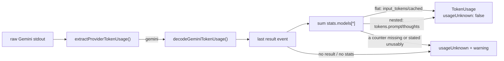

# Decode Gemini CLI stream-json token usage

## Summary

A Gemini run reached the credit log as `usageUnknown` for one reason only:
`gemini_executor.ts` already passed `--output-format stream-json`, but nothing
read the counts back out of it. This adds
`worker/deno/lib/gemini_token_usage.ts` (`decodeGeminiTokenUsage`) and a
`GEMINI_PROVIDER_ID` branch in `extractProviderTokenUsage()`, so a Gemini run
records measured input / output / cache-read tokens — and is costed from the
API-equivalent rows that landed with #1937 — instead of being flagged unknown.
The fail-loud path is kept, not removed: a run that reports no usable stats
still warns and is recorded UNKNOWN, never zero. Closes #1938.

**The event shape was verified, not assumed.** The issue sketched
`stats.models.<id>.tokens.{prompt,candidates,cached,thoughts,…}` and asked for
that to be checked against the pinned CLI. I downloaded
`@google/gemini-cli@0.55.1` from npm, confirmed its sha256 against
`container/tools.json`, and read the bundle. The assumed shape is **not** what
0.55.1 emits on this stream: `StreamJsonFormatter.convertToStreamStats()`
projects five flat fields per model —
`{total_tokens, input_tokens, output_tokens, cached, input}` — where
`input_tokens` is `tokens.prompt` and `input` is
`Math.max(0, prompt - cached)`. So **`input_tokens` already includes the cached
prefix**, and `inputTokens` is prompt *less* cached.

Two consequences worth a reviewer's attention:

- **`thoughts` is not on the stream.** The projection drops it, so a
  thinking-heavy run's output count is its candidates alone. The deficit is
  **not** inferred from `total_tokens` — that would be a guess. Under-counting
  is the conservative direction for a spend guard, and it is stated in the
  module doc-comment, the audit record and `docs/MODEL-AND-CACHING.md`.
- **The nested `tokens` shape is accepted as tolerance, not as a second
  supported format.** It is the CLI's unprojected `ModelMetrics.tokens`, which
  `--output-format json` renders as one pretty-printed document rather than
  NDJSON — so this decoder cannot reach it today. It is read so a CLI that
  stops projecting decodes rather than silently reading as "no usage", and it
  is the one place a `thoughts` count can be honoured. Both documents say so
  plainly rather than claiming both formats are supported.

## Evidence

Backend/CLI change with no web interface to screenshot. The evidence is the
test suite and the verification of the CLI bundle.

**Bundle verification** — `sha256sum` of the downloaded
`gemini-cli-0.55.1.tgz` was
`4587cc6fe4d794cd35517179642cf4df3133a073ef6f96dda691d5604bf4df7e`, matching
`container/tools.json`. `convertToStreamStats` and `uiTelemetry.js`'s
`processApiResponse` were then read directly for the field names and for
`tokens.input = Math.max(0, tokens.prompt - tokens.cached)`. The tarball and
its extraction were deleted before committing.

**Tests** — `deno test tests/gemini_token_usage_test.ts
tests/provider_token_usage_test.ts`: 27 passed, 0 failed.
`./quality.sh`: PASSED (config integration SKIPPED — pre-existing, needs
credentials).

## Acceptance Criteria

<!-- vibe-spec-review inputs="diff+issue-body" -->

- **met** — `extractProviderTokenUsage(GEMINI_SAMPLE, {provider: "gemini"})`
  returns measured usage, `usageUnknown: false`, no warning — evidence:
  `worker/deno/tests/provider_token_usage_test.ts::provider_token_usage - Gemini run with parseable usage is measured, not unknown (Issue #1938)`
  — reviewer: met
- **met** — Gemini output lacking usage returns `usageUnknown: true` with a
  warning naming the provider; empty output likewise — evidence:
  `worker/deno/tests/provider_token_usage_test.ts::provider_token_usage - Gemini run with unparseable usage warns and is unknown`
  and `::provider_token_usage - empty Gemini output is unknown, not zero` —
  reviewer: met
- **met** — multi-model `stats.models` are summed; non-numeric counters do not
  decode as zero — evidence:
  `worker/deno/tests/gemini_token_usage_test.ts::gemini_token_usage - sums every model under stats.models`
  and `::gemini_token_usage - one unreadable counter condemns the whole model`
  — reviewer: partial — reason: the reviewer read a real defect — the first
  version zero-filled any counter it could not read as long as *one* field in
  the entry was numeric, so an entry carrying a numeric `input_tokens` beside
  an `output_tokens` stated as a string decoded to a zero output count rather
  than to UNKNOWN. Fixed here: `readCounter` distinguishes an
  absent field from one stated unusably, one unusable counter condemns the
  whole entry, and an entry missing either billable counter is refused. Three
  new tests cover it
- **met** — Claude and Codex cases in `provider_token_usage_test.ts` are
  unchanged and green — evidence: no Claude or Codex test body is touched in
  the diff; all 9 tests in the file pass — reviewer: met
- **met** — the decoder's doc-comment states the Gemini CLI version whose
  output shape was verified — evidence:
  `worker/deno/lib/gemini_token_usage.ts` header,
  "## The verified event shape (Gemini CLI 0.55.1)" — reviewer: met — the
  reviewer independently re-extracted the bundle and confirmed both the field
  names and the "`input_tokens` already includes the cached prefix" claim
- **met** — the docs sections above no longer say Gemini usage is unparseable —
  evidence: `docs/MODEL-AND-CACHING.md` matrix rows 123/129/130, blockquotes
  2001/2005/1831/2347, and the `#### Non-Claude providers` paragraph, bullet
  and Mermaid flowchart — reviewer: met
- **met** — `./quality.sh` passes — evidence: full gate run after the final
  edit, `Result: PASSED` — reviewer: met — reason: the reviewer ran `deno fmt`,
  `lint`, `check` and the affected test files but not the full gate; it was run
  here and passed
- **unrequested** — the nested `tokens` per-model shape is decoded alongside
  the flat stream-json one — reviewer: unrequested — reason: the issue's
  mapping instruction (`candidate + thought tokens → outputTokens`) was written
  against this shape, and verification showed 0.55.1's stream-json projection
  omits `thoughts` entirely. Dropping the branch would leave that instruction
  with nowhere to live; keeping it silently would be a false claim. It is kept
  and labelled as forward-tolerance in the module doc-comment and the audit
  record, per the reviewers' finding that the original wording overstated it
- **unrequested** — the Gemini branch falls back to the shared Claude extractor
  when its own decoder finds nothing — reviewer: unrequested — reason: the
  pre-existing test `provider_token_usage - non-Claude output in a parseable
  shape is used and stays quiet` passes `provider: "gemini"` with
  Claude-shaped output and expects measured usage. Removing the fallback would
  break a test the issue says to leave unchanged
- **unrequested** — `docs/audits/security-sweep-1938-gemini-token-usage.md` and
  the `12aa` slice in `docs/audits/lib-sweep-coverage.json` — reviewer:
  unrequested — reason: not requested, but forced —
  `tests/lib_sweep_coverage_test.ts` fails any new `worker/deno/lib/` module
  that no sweep slice claims, and `quality.sh` went red on exactly that
- **unrequested** — `docs/MODEL-AND-CACHING.md` line 129 (Token Usage & Cost
  Tracking matrix row, ⚠️ → ✅) and line 2347 (credit-log blockquote) —
  reviewer: unrequested — reason: both state that Gemini usage is UNKNOWN, so
  leaving them would have contradicted the sections the issue did enumerate

## Standards Review

<!-- vibe-standards-review inputs="diff+CODING-STANDARDS.md" -->

- **violation** — a negative counter was propagated instead of refused, so a
  garbled or forged count could *subtract* from the day's totals and the spend
  ceiling — evidence: `worker/deno/lib/gemini_token_usage.ts:98` (`readCounter`)
  — reason: fixed here. `readCounter` now refuses any count below zero, and
  `gemini_token_usage - a negative counter is refused, never subtracted` is the
  regression test. Breached "Never Fail Silently — Fail Loud"
- **violation** — a partially-readable model entry recorded fabricated zeros as
  measured usage — evidence: `worker/deno/lib/gemini_token_usage.ts:130`
  (`readModelCounters`) — reason: fixed here, same change as the criterion
  above; covered by `gemini_token_usage - one unreadable counter condemns the
  whole model` and `- an entry missing a billable counter is refused`
- **violation** — the written security record asserted safety properties the
  code did not have ("a negative input count cannot be produced", "both of the
  CLI's renderings are accepted") — evidence:
  `docs/audits/security-sweep-1938-gemini-token-usage.md:41` and its accepted
  residuals — reason: the first is now true of the code; the second was
  rewritten to say the nested branch is unreachable tolerance under the pinned
  CLI. Breached "A Code Change Owes a Docs Change"
- **violation** — the PR summary file was absent at the time of review —
  evidence: `docs/archive/pr-summaries/pr-summary-1938.md` — reason: this file;
  it was written after the reviewers returned, which is the order this route
  prescribes
- **violation (lower confidence, reviewer's own framing)** — the nested-shape
  branch is unreachable in production, against KISS / "no unrequested changes"
  — evidence: `worker/deno/lib/gemini_token_usage.ts:117-130` — reason: it
  stands, for the reason recorded under the matching `unrequested` entry above;
  the doc-comment and audit record now label it as tolerance rather than
  claiming a second supported format
- **clean** — Australian English throughout (no US spellings in any added
  line); Deno-native tooling only (`deno fmt`/`lint`/`check`/`test`, no Node
  files added); DRY (`parseJsonlEvents`, `readNumber`, `readObject` reused from
  `agent_output.ts`, no new regex and so no ReDoS surface); every test calls
  the real exported function and asserts on its return value, with no
  source-grepping, sleeps or spawned processes; fail-loud on the main path
  (every unreadable case routes to the `usageUnknown` warning); commit safety
  (no hidden path, key or credential staged, no `git add -f`, no
  `--no-verify`); doc-comment conventions (module header plus `@param` /
  `@returns` on every function); Mermaid fenced and updated in both copies;
  the sweep ledger registered as a new slice with its own written record rather
  than appended to a stale one

## Test Plan

New — `worker/deno/tests/gemini_token_usage_test.ts` (18 tests):

- the verified 0.55.1 stream-json `result` event decodes to the expected
  `TokenUsage` (input = prompt less cached, output, cache read, cache write 0)
- two models under `stats.models` are summed, in both renderings
- `input` is derived as `max(0, prompt - cached)` when the CLI omits it
- the last `result` event wins when a stream carries more than one
- the nested `tokens` shape decodes with thoughts billed as output
- `undefined`, never zero, for: no `result` line, empty output, whitespace-only
  output, non-JSON output, a `result` with no `stats`, an empty `stats.models`,
  wholly non-numeric counters, **one** unusable counter among readable ones,
  an unusable nested counter, an entry missing a billable counter, and a
  negative counter
- an unreadable model beside a readable one is skipped, not zero-filled
- a genuine zero-token run still decodes to measured zeros

Modified — `worker/deno/tests/provider_token_usage_test.ts`:

- `GEMINI_STREAM` was rewritten from the issue's assumed nested shape to the
  verified flat 0.55.1 shape, because the old fixture became parseable. A new
  `GEMINI_NO_STATS` fixture carries the genuinely-unparseable case, and the
  existing "Gemini run with unparseable usage warns and is unknown" test was
  repointed at it — this is the one existing test whose inputs changed, and it
  still asserts the same behaviour. No test was removed or commented out.
- Added: Gemini run with parseable usage is measured, not unknown; empty Gemini
  output is unknown, not zero.
- Claude and Codex tests are untouched.

### Deno regression avoided

The decoder, its tests and the sweep-ledger registration are all Deno-native —
`deno test` with `@std/assert`, run through the repo's existing `deno task`
gate. No Node tooling, `package.json` or npm dev-dependency was introduced,
even though the CLI whose output is decoded is itself an npm package: the
tarball was fetched with `curl`, verified with `sha256sum` and deleted, rather
than installed.
