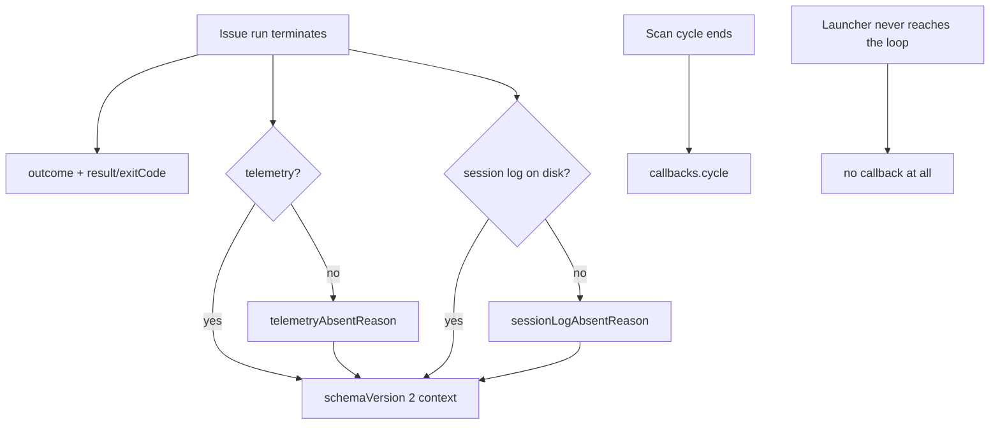

# Fleet run records: structured outcome, absence reasons, cycle heartbeat
(Issues #1947, #1948, #1955)

## Summary

A week of archived fleet records could only count `result`/`exitCode`,
could not tell why telemetry or a transcript was missing, and treated a
host that claimed nothing as indistinguishable from a host that never
reached the scan loop. Schema version 2 of the post-run callback context
closes those three gaps as one contract change:

- **#1947** — optional `outcome` (`kind`, `category`, `phase`,
  `failureClass`, `prNumber`) so an archive can tell a PR-then-later-step
  failure from a gate-red no-PR from a deliberate hand-back. `result` and
  `exitCode` are unchanged.
- **#1948** — every run context has either `telemetry` or
  `telemetryAbsentReason`, and either `sessionLogPath` or
  `sessionLogAbsentReason`, never neither.
- **#1955** — optional `callbacks.cycle` fires once at the end of every
  scan cycle. A launcher that never reaches the loop still emits nothing,
  so silence means dead, not idle.

Closes #1947.
Closes #1948.
Closes #1955.



## Evidence

Backend contract with no web interface, so there is no screenshot to
capture. The evidence is the regression suite plus the conformance fixture.

- Structured outcome: a `no_pr` run carries kind, category, phase and
  failure class; a PR-then-later-step failure still carries `prNumber`; a
  `no_pr_expected` hand-back is distinguishable from a quality-gate
  failure; a setup refusal without a `RunOutcome` still names the phase.
  `result`/`exitCode` stay as they were.
- Absence reasons: tee-off → `tee_disabled`; no home →
  `log_dir_unavailable`; missing file → `file_missing`; empty invocations →
  `agent_not_invoked`; invoked without usage → `usage_not_reported`;
  adapter-less provider → `provider_unsupported`. Size-cap and write
  failure record `size_cap_exceeded` / `write_failed` on the writer.
- Cycle heartbeat: an idle `runCoreLoop` cycle fires `runCycleCallback`
  with `endReason: "no_eligible_work"` and `claimsTaken: 0`. A cycle-only
  config does not fire run hooks. The cycle document and environment omit
  run-only scalars (`result`, `issueNumber`, `exitCode`).
- Conformance fixture is 7/7: the seventh check drives `callbacks.cycle`;
  check 6 now requires `sessionLogAbsentReason: "file_missing"` when no
  transcript exists.

Focused local validation:

```text
run_callbacks_test.ts / run_callback_context_test.ts /
run_callbacks_config_test.ts / run_callback_telemetry_test.ts /
config_callbacks_test.ts / agent_transcript_test.ts
  → 100 passed

run_core_callbacks_test.ts / callback_conformance_test.ts
  → 26 passed (7/7 conformance)

run_core - createWorkProgressTracker tracks issues scanned and claims
attempted (Issue #1955) → ok

deno check (changed modules) → clean
deno lint (changed modules) → clean
deno task check:manifests → 633 passed
```

## Test Plan

- [x] Run the callback unit suites above.
- [x] Run the scan-loop idle-cycle test (`run_core_callbacks_test.ts`).
- [x] Run the conformance fixture (`callback_conformance_test.ts`) and
      confirm the report reads `7/7`.
- [ ] CI `validate` on the PR.
- [ ] Confirm `Closes #1947` / `#1948` / `#1955` close the issues on merge,
      then close [milestone 57](https://github.com/stSoftwareAU/VibeCoder/milestone/57).
