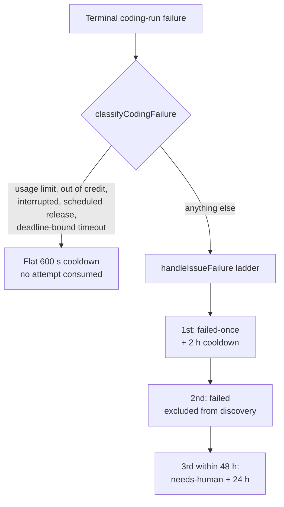

## Summary

Ordinary coding runs never reached the `failed-once` → `failed` ladder. Only the
planning processor, the question processor and the quality-gate remediation
phase called `handleIssueFailure`; every other terminal coding failure recorded
a flat 600 s cooldown and nothing else, so an issue that failed in 40 seconds
was fully eligible again six minutes later and was re-claimed every cycle for
ever — three security-scan findings in one repository were claimed 82 times in
seven days that way.

This change routes every terminal coding-run failure that is not transient
infrastructure through the same ladder, and broadens the escalating re-claim
cooldown (2 h → 6 h → 24 h) so it covers all non-transient failures rather than
timeouts alone. Closes #1949.

- **New `worker/deno/lib/coding_failure_ladder.ts`** — one decision point.
  `classifyCodingFailure` is pure policy (transient infrastructure vs the
  issue's own failure); `applyCodingFailureLadder` is the side effect, injected
  with `handleIssueFailure` so the policy is testable without a GitHub client.
- **`cooldown_state.ts`** — the `kind` field grew from `"timeout"` to a
  `CooldownFailureKind` (`timeout` | `non_transient`). Both kinds count towards
  one escalation ladder, both survive the base-cooldown expiry for the 48 h
  escalation window, and an unrecognised `kind` is dropped rather than silently
  earning a 24 h cooldown.
- **`run_core_production_deps.ts`** — the coding route applies the ladder after
  `workOnIssue` returns a terminal failure, logs the disposition, and surfaces
  (never swallows) a ladder error. Transient infrastructure — usage/rate limit,
  out of credit, interruption, scheduled release, deadline-bound timeout —
  returns no cooldown kind and consumes no attempt. The third consecutive
  ladder failure inside 48 h still hands the issue to a human, now with wording
  that fits a non-timeout failure.
- **Double-step guard** — the quality-gate remediation phase already steps the
  ladder with the raw gate output, so it sets `state.failureLadderApplied`,
  which travels out as `WorkOnIssueResult.ladderApplied`. The main loop then
  records only the cooldown, so one run can never take an unlabelled issue
  straight to `failed`.
- **"Already applied, no evidence"** — an unevidenced already-resolved claim too
  short for the analysis-only hand-off used to land as a bare "no code changes
  and no useful output" failure with no label. It now names the claim in the
  failure reason, which the ladder publishes in its `failed-once` comment.

## Evidence

Backend/worker change with no web interface to screenshot. The evidence is the
test suite below plus the reproduction described in the next section.

## Reproduction

- **symptom** — a coding run that failed for a non-transient reason recorded
  only the flat 600 s cooldown, so the issue was fully claimable again on the
  next cycle, for ever
- **status** — `verified` — a cut-down form of the regression test was run
  against the unfixed code at `564364de` in a scratch worktree and failed
  (`isIssueInCooldown` returned `false` for a 30-minute-old non-transient
  entry); the shipped tests pass against the fix
- **regression test** — `worker/deno/tests/cooldown_state_test.ts::cooldown - the reported symptom: a fast failure is no longer re-claimable 30 minutes on (Issue #1949)`

## Test Plan

Added — `worker/deno/tests/coding_failure_ladder_test.ts` (14 tests):

- `classifyCodingFailure` — a fast quality-gate failure, a no-output run and an
  empty reason all enter the ladder; a budget-burning timeout keeps the
  `timeout` kind; usage limit, interruption, scheduled release, out-of-credit
  and a deadline-bound timeout are transient.
- `applyCodingFailureLadder` — a non-transient failure marks the issue
  `failed-once`; a rate-limited run never touches the ladder; a thrown error and
  an error `Result` are both surfaced rather than swallowed; configured label
  names are passed through.

Added — `worker/deno/tests/cooldown_state_test.ts` (6 tests): a non-transient
failure escalates the ladder rather than the flat base; the reported symptom is
gone; `timeout` and `non_transient` attempts count towards one ladder;
non-transient entries survive the base-cooldown expiry; an unrecognised kind
reverts to the flat base.

Added — `worker/deno/tests/handle_no_changes_phase_test.ts`: an unevidenced
"already applied" claim is named in the failure reason.

Updated — `worker/deno/tests/issue_worker_infra_retry_test.ts` and
`worker/deno/lib/issue_worker_wiring.ts` mocks for the renamed
`consecutiveFailures` field.

Docs — `README.md` (label table), `docs/USAGE.md` (which failures count, with a
Mermaid flowchart), `docs/TROUBLESHOOTING.md` (why an issue you expected to be
retried is idle), `docs/INTERNALS.md` (new module row).
