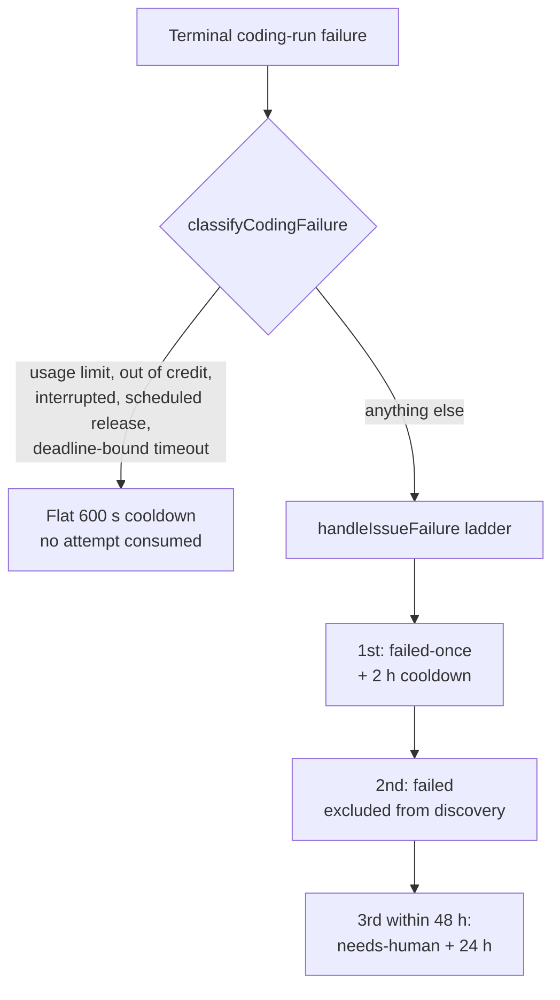

## Summary

Ordinary coding runs never reached the `failed-once` → `failed` ladder. Only the
planning processor, the question processor and the quality-gate remediation
phase called `handleIssueFailure`; every other terminal coding failure recorded
a flat 600 s cooldown and nothing else, so an issue that failed in 40 seconds
was fully eligible again six minutes later and was re-claimed every cycle for
ever — three security-scan findings in one repository were claimed 82 times in
seven days that way.

This change routes every terminal coding-run failure that is not transient
infrastructure through the same ladder, and broadens the escalating re-claim
cooldown (2 h → 6 h → 24 h) so it covers all non-transient failures rather than
timeouts alone. Closes #1949.

- **New `worker/deno/lib/coding_failure_ladder.ts`** — one decision point.
  `classifyCodingFailure` is pure policy (transient infrastructure vs the
  issue's own failure); `applyCodingFailureLadder` is the side effect, injected
  with `handleIssueFailure` so the policy is testable without a GitHub client.
- **`cooldown_state.ts`** — the `kind` field grew from `"timeout"` to a
  `CooldownFailureKind` (`timeout` | `non_transient`). Both kinds count towards
  one escalation ladder, both survive the base-cooldown expiry for the 48 h
  escalation window, and an unrecognised `kind` is dropped rather than silently
  earning a 24 h cooldown.
- **`run_core_production_deps.ts`** — the coding route applies the ladder after
  `workOnIssue` returns a terminal failure, logs the disposition, and surfaces
  (never swallows) a ladder error. Transient infrastructure — usage/rate limit,
  out of credit, interruption, scheduled release, deadline-bound timeout —
  returns no cooldown kind and consumes no attempt. The third consecutive
  ladder failure inside 48 h still hands the issue to a human, now with wording
  that fits a non-timeout failure.
- **Double-step guard** — the quality-gate remediation phase already steps the
  ladder with the raw gate output, so it sets `state.failureLadderApplied`,
  which travels out as `WorkOnIssueResult.ladderApplied`. The main loop then
  records only the cooldown, so one run can never take an unlabelled issue
  straight to `failed`.
- **Host faults are not the issue's** — `disk-full`, `oom`, `worker-crash`,
  `missing-tools` and `killed-unknown` are exempt alongside the account-state
  classes. The run-outcome auto-filer already files those against the worker,
  so letting them consume the issue's two attempts would permanently `failed` a
  perfectly good issue after two host incidents.
- **Pure decision seams** — `planCodingFailure` carries the main-loop decision
  (success, declared skip, already-stepped ladder, ladder) and
  `buildRepeatedFailureEscalation` carries the `needs-human` copy, so the wiring
  the reported defect lives in is covered by tests rather than only by the
  module underneath it. An already-stepped ladder now always counts the attempt,
  even when the run's *final* reason reads transient.
- **"Already applied, no evidence"** — an unevidenced already-resolved claim too
  short for the analysis-only hand-off used to land as a bare "no code changes
  and no useful output" failure with no label. It now names the claim in the
  failure reason, which the ladder publishes in its `failed-once` comment.

## Evidence

Backend/worker change with no web interface to screenshot. The evidence is the
test suite below plus the reproduction described in the next section.

## Reproduction

- **symptom** — a coding run that failed for a non-transient reason recorded
  only the flat 600 s cooldown, so the issue was fully claimable again on the
  next cycle, for ever
- **status** — `verified` — a cut-down form of the regression test was run
  against the unfixed code at `564364de` in a scratch worktree and failed
  (`isIssueInCooldown` returned `false` for a 30-minute-old non-transient
  entry); the shipped tests pass against the fix
- **regression test** — `worker/deno/tests/cooldown_state_test.ts::cooldown - the reported symptom: a fast failure is no longer re-claimable 30 minutes on (Issue #1949)`

## Acceptance Criteria

<!-- vibe-spec-review inputs="diff+issue-body" -->

- **partial** — an issue whose coding run fails twice for a non-transient reason carries `failed` and is not claimed again until a human clears it — evidence: `worker/deno/lib/run_core_production_deps.ts:3493` routes the failure into `handleIssueFailure`, and `worker/deno/lib/issue_filter.ts` excludes `failed` from discovery — reviewer: partial — reason: the reviewer found that `handleIssueFailure`'s Issue #387 infrastructure arm (`label_failure.ts:373`) keeps an infra-category failure (push refusal, zero output, token scope) at `failed-once` for up to five attempts instead of promoting it on the second; that arm is deliberate existing policy for environment faults, so it is documented rather than overridden, and those failures still serve the escalating cooldown and the three-strike `needs-human` hand-off
- **met** — a "nothing to do, no evidence" run is not re-claimed on the next cycle with no state change — evidence: `worker/deno/tests/handle_no_changes_phase_test.ts::handle_no_changes_phase - an unevidenced 'already applied' claim is named in the failure reason (Issue #1949)` plus the `non_transient` cooldown it now records — reviewer: met
- **met** — transient infrastructure failures keep today's plain cooldown and do not consume an attempt — evidence: `worker/deno/tests/coding_failure_ladder_test.ts::applyCodingFailureLadder - a rate-limited run never touches the ladder` — reviewer: met
- **met** — tests cover both directions — evidence: `worker/deno/tests/coding_failure_ladder_test.ts` (25 tests, both directions) and `worker/deno/tests/cooldown_state_test.ts` (6 new) — reviewer: met — reason: the reviewer noted the production wiring itself was untested; `planCodingFailure` and `buildRepeatedFailureEscalation` were extracted and tested in response, so the call site is now a thin delegation
- **unrequested** — `docs/archive/handover/issue-1949.md`, the worker-written handover note from the interrupted attempt — reviewer: unrequested — reason: worker output, not agent output, and nine such files are already tracked in the repository; removing it would discard the resumption record
- **unrequested** — `out-of-credit` and the host-state classes added to the transient exemption set — reviewer: unrequested — reason: the issue names four classes, but blaming an issue for the fleet's billing or the host's full disk is the same error the exemption exists to prevent; both reviewers flagged the host-state gap independently
- **unrequested** — `isCooldownFailureKind` validation that strips an unrecognised persisted `kind` — reviewer: unrequested — reason: the widened union makes a corrupt or future `kind` able to earn a silent 24 h cooldown; the guard keeps that fail-safe
- **unrequested** — the `needs-human` escalation copy rewritten with timeout and non-timeout variants — reviewer: unrequested — reason: the existing copy said "Repeated execute timeouts" and told the operator to raise a timeout budget, which is wrong for a failure that never timed out
- **unrequested** — `fleetFailureClass` narrowed to report only `timeout` (`worker/deno/lib/run_core.ts:1972`) — reviewer: unrequested — reason: required to keep fleet telemetry stable, since `failureKind` can now also be `non_transient`, which describes what a failure earns rather than where the run died
- **unrequested** — the `docs/USAGE.md` Mermaid flowchart and the module header diagram — reviewer: unrequested — reason: the repository's documented standard asks for a diagram where the change alters state transitions

## Standards Review

<!-- vibe-standards-review inputs="diff+CODING-STANDARDS.md" -->

- **violation** — the new `lib/` module was claimed by no slice in the lib-sweep ledger, so `deno task check:manifests` was red — evidence: `docs/audits/lib-sweep-coverage.json:187` — reason: fixed here; `check:manifests` now passes (633 tests, 0 failed)
- **violation** — docs stated a rule the code does not implement ("**every** non-transient coding failure", and "a push refusal" as a ladder example) — evidence: `docs/USAGE.md:267`, `docs/TROUBLESHOOTING.md:842` — reason: fixed here; both now say a *reported* terminal failure, list the host-state exemptions, and state that infrastructure-category failures keep their Issue #387 self-healing retries
- **violation** — a third failure taxonomy that contradicted `isInfrastructureFailure`, so a full disk or an OOM kill could permanently `failed` an issue — evidence: `worker/deno/lib/coding_failure_ladder.ts:88` — reason: partly fixed — the host-state classes are now exempt, which removes the contradiction that mattered; the two predicates are deliberately not merged because they answer different questions (what a failure *earns* in the cooldown, versus how many self-healing retries the label ladder allows), and `handleIssueFailure` still consults `isInfrastructureFailure` itself
- **violation** — the modified wiring and the rewritten escalation copy had no tests — evidence: `worker/deno/lib/run_core_production_deps.ts:3489` — reason: fixed here by extracting `planCodingFailure` and `buildRepeatedFailureEscalation` as pure functions with nine new tests covering success, declared skip, transient, ladder, already-stepped, and both escalation wordings
- **violation** — a mutating `delete entry.kind` inside a `filter` callback — evidence: `worker/deno/lib/cooldown_state.ts:172` — reason: fixed here; `loadState` now validates, then sanitises with `map`, then expires
- **violation** — the PR summary existed on disk but was untracked, so the diff did not carry it — evidence: `docs/archive/pr-summaries/pr-summary-1949.md` — reason: fixed here; committed
- **violation** — the first commit subject omits the documented `(Issue #42)` suffix, carrying only `Refs #1949` in the body — evidence: commit `e4d8ef4f` — reason: stands; it is pushed history from the interrupted attempt, and rewriting a published commit is worse than the deviation. The follow-up commit uses the documented form
- **violation** — a non-timeout escalation still dedups under `timeout-escalation-<n>` — evidence: `worker/deno/lib/run_core_production_deps.ts:3617` — reason: stands, now with a comment saying why: one hand-off per issue is the wanted behaviour, and renaming the key would post a second `needs-human` comment on every issue a timeout escalation already covered
- **clean** — Australian English throughout; `deno fmt`, `deno lint`, `deno check` and `markdownlint-cli2` clean; tests call real code with no source-grepping, no wall-clock sleeps and no shared-state mutation; fail-loud error handling with both the thrown and `ok:false` paths surfaced and pinned by tests; the double-step guard; docs updated alongside the code; no hidden paths or key material staged; `Vibe-Coder-Run-Id` trailers present

## Test Plan

Added — `worker/deno/tests/coding_failure_ladder_test.ts` (25 tests):

- `classifyCodingFailure` — a fast quality-gate failure, a no-output run and an
  empty reason all enter the ladder; a budget-burning timeout keeps the
  `timeout` kind; usage limit, interruption, scheduled release, out-of-credit
  and a deadline-bound timeout are transient.
- `classifyCodingFailure`, host state — a full disk, an OOM kill and a missing
  tool are the host's fault, so they are transient and consume no attempt.
- `applyCodingFailureLadder` — a non-transient failure marks the issue
  `failed-once`; a rate-limited run never touches the ladder; a thrown error and
  an error `Result` are both surfaced rather than swallowed; configured label
  names are passed through.
- `planCodingFailure` — a success and a declared skip owe nothing; a
  non-transient failure steps both the ladder and the cooldown; a transient one
  steps neither; an already-stepped ladder is not stepped twice but still counts
  the attempt, including when the run's final reason reads transient.
- `buildRepeatedFailureEscalation` — the timeout wording keeps the Issue #4304
  budget/split advice; the non-timeout wording points at the per-attempt failure
  comments and never says "timing out".

Added — `worker/deno/tests/cooldown_state_test.ts` (6 tests): a non-transient
failure escalates the ladder rather than the flat base; the reported symptom is
gone; `timeout` and `non_transient` attempts count towards one ladder;
non-transient entries survive the base-cooldown expiry; an unrecognised kind
reverts to the flat base.

Added — `worker/deno/tests/handle_no_changes_phase_test.ts`: an unevidenced
"already applied" claim is named in the failure reason.

Updated — `worker/deno/tests/issue_worker_infra_retry_test.ts` and
`worker/deno/lib/issue_worker_wiring.ts` mocks for the renamed
`consecutiveFailures` field.

Docs — `README.md` (label table), `docs/USAGE.md` (which failures count, with a
Mermaid flowchart), `docs/TROUBLESHOOTING.md` (why an issue you expected to be
retried is idle), `docs/INTERNALS.md` (new module row).

Ledger — `docs/audits/lib-sweep-coverage.json` registers the new module, so
`deno task check:manifests` passes.

## Quality gate

`./quality.sh` passes every check except `deno tests`, which fails on two
pre-existing cases in `worker/deno/tests/provider_auto_runtime_test.ts`:
`assertImageInstalledProvider` refuses to resolve `codex` because this
container image installed only `claude`. The same two tests fail on the base
branch at `564364de` with no local changes, so the failure is not from this
change; filed as stSoftwareAU/VibeCoder#1977. Everything else in the parallel
pass is green — 21,028 passed, those 2 failed.
