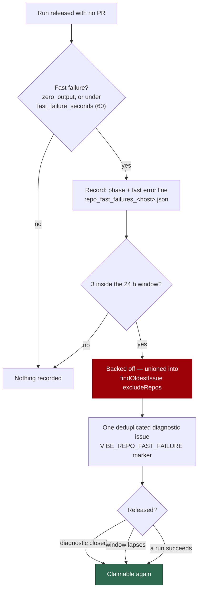

## Summary

A repository whose runs die in their first minute is failing at claim or setup
— a missing toolchain, a broken quality-gate bootstrap, a credential or branch
problem — not at the issues. Nothing in the worker noticed: the per-repo
failure tracker is cleared at the top of every cycle
(`run_core.ts` `resetRepoFailures()`) and keyed on a PID-scoped file, and run
duration was carried but never used as a signal. One repository failed 12 of 14
runs for a week, was retried every cycle, and filed nothing.

This adds the durable half. `repo_fast_failure_tracker.ts` counts *fast*
failures per repository in a hostname-keyed sidecar on the work volume, with a
rolling window that decays on its own; `repo_fast_failure_issue.ts` files one
deduplicated diagnostic issue when a repository crosses the threshold. The
back-off is unioned into the claim scan's `excludeRepos`, cleared by a success
or by closing the diagnostic, and reported on the cycle summary line.

Closes #1950.

## Evidence

Backend/CLI only — no web interface to screenshot. The evidence is the test
suite below plus the full quality gate.



Quality gate: every check passes except `deno tests`, which reports two
failures in `tests/provider_auto_runtime_test.ts`
(`The running container image did not install the "codex" coding-agent
provider`). Both fail identically on the unmodified base commit `564364d` in a
worktree of its own, so they are a property of the running container image, not
of this change.

Cycle-summary line an operator now sees:

```text
repo-fast-failures: owner/repo: 3 fast failures, backed off until 2026-09-12T04:05Z (stSoftwareAU/VibeCoder#8123)
```

## Reproduction

- **symptom** — a repository whose runs fail at setup within a minute is
  re-claimed every cycle, all week, with no back-off and no diagnostic filed;
  the per-cycle tracker is wiped at the top of each scan and each scheduled
  cycle is a fresh process
- **status** — `verified` — a minimal behavioural probe was run against the
  unfixed tree at `564364d` in its own worktree, with only the new tracker
  module copied in so the production deps could be exercised: a repository
  holding three fast failures was **still backed off after
  `deps.recordRepoSuccess`** (`FAILED | 0 passed | 1 failed`), because no
  production dep touched durable state and `deps.describeRepoFastFailures` did
  not exist at all. The shipped equivalents pass after the fix
- **regression test** —
  `worker/deno/tests/run_core_production_deps_fast_failure_test.ts::fast-failure deps - the top-of-cycle reset does not clear the durable back-off`
  and `::fast-failure deps - recordRepoSuccess releases the back-off`

## Acceptance Criteria

<!-- vibe-spec-review inputs="diff+issue-body" -->

- **partial** — a repository failing at setup three times in a day is not claimed again until the window lapses or the diagnostic is closed, and exactly one diagnostic exists for it — evidence: `worker/deno/lib/run_core_production_deps.ts` (`excludeRepos` union in `findNextIssue`), `worker/deno/tests/repo_fast_failure_tracker_test.ts::backedOffRepos - the back-off decays once the window lapses`, `::refreshRepoFastFailureBackOffs - a closed diagnostic releases the repository` — reviewer: partial — reason: the exclusion reaches the implementation claim scan, not the label-driven lanes (refinement, grill-me, planning, question); those remove their own label and stop themselves, and filtering the shared label finder is adjacent work this issue did not ask for. The reviewer's second half — a stale diagnostic pointer could make "exactly one" become zero — was a real defect and is fixed in this diff (`repo_fast_failure_tracker.ts` `decayRecords`, covered by `::recordRepoFastFailure - a decayed record drops its diagnostic pointer so the next break files again`), and the documentation that overclaimed "every scan" is corrected
- **met** — a repository with one fast failure followed by successes is unaffected — evidence: `worker/deno/tests/repo_fast_failure_tracker_test.ts::recordRepoFastFailure - one fast failure then successes leaves the repo alone`, `worker/deno/tests/run_core_production_deps_fast_failure_test.ts::fast-failure deps - recordRepoSuccess releases the back-off` — reviewer: met
- **met** — the counters survive a worker restart — evidence: `worker/deno/tests/repo_fast_failure_tracker_test.ts::recordRepoFastFailure - counters survive a restart (a fresh read of the sidecar)`, `worker/deno/tests/run_core_production_deps_fast_failure_test.ts::fast-failure deps - the cycle summary names a repository a previous process backed off` — reviewer: met
- **partial** — persist the per-repository failure/timeout counters across cycles, same sidecar pattern as `fleet_telemetry_sidecar.ts`, with a decay window — evidence: `worker/deno/lib/repo_fast_failure_tracker.ts` (`repoFastFailurePath`, schema + `future-schema` guard, `atomicWrite`, `decayRecords`) — reviewer: partial — reason: the new fast-failure counters persist and decay, but `repo_failure_tracker.ts`'s own per-cycle counters and its timeout cooldown multiplier are deliberately left as they are; migrating them is a separate behaviour change that would alter the existing per-cycle deprioritisation the issue did not ask to touch
- **met** — count a failure that ended before the agent produced output, or under a configurable `fast_failure_seconds` (default 60), as a fast failure — evidence: `worker/deno/lib/repo_fast_failure_tracker.ts` `isFastFailure`, `config_defaults.ts` `fastFailureSeconds: 60`, `worker/deno/tests/repo_fast_failure_tracker_test.ts::isFastFailure - zero_output counts however long it took` and `::isFastFailure - honours a configured fast_failure_seconds` — reviewer: met
- **partial** — after N fast failures within the window (default 3 in 24 h), deprioritise that repository for the rest of the window — evidence: `worker/deno/tests/repo_fast_failure_tracker_test.ts::recordRepoFastFailure - three failures in the window back the repo off` — reviewer: partial — reason: same scope as the first entry — the deprioritisation is applied to the claim scan, not to the label lanes
- **met** — file one diagnostic issue, deduplicated by a body marker like `run_failure_issue.ts`, carrying the failing phase and the last error line — evidence: `worker/deno/lib/repo_fast_failure_issue.ts`, `worker/deno/tests/repo_fast_failure_issue_test.ts::files exactly one diagnostic when none exists`, `::an existing fleet-authored diagnostic is reused, not duplicated`, `::carries the phase and the last error line` — reviewer: met
- **met** — target the worker repository per the existing run-failure filing policy, or the affected repository where `repo_config` says so — evidence: `resolveRepoFastFailureTarget` (imports `RUN_FAILURE_TARGET_REPO`), `worker/deno/tests/repo_fast_failure_issue_test.ts::repo_config targets the affected repository` — reviewer: met
- **met** — expose the repository's current state in the cycle summary line — evidence: `formatRepoFastFailureSummary`, `deps.describeRepoFastFailures`, `run_core.ts` `logCycleGhTelemetry`, `worker/deno/tests/run_core_production_deps_fast_failure_test.ts::the cycle summary names a repository a previous process backed off` — reviewer: met
- **unrequested** — `NOT_REPO_FAULT` exempts `rate_limit` and `scheduled_release` from the fast-failure definition — reviewer: unrequested — reason: a rate-limited run dies in seconds on every repository at once and a scheduled release is a deliberate handover, so counting either would back off healthy repositories for a host-wide condition — the opposite of what the issue asks for
- **unrequested** — a success clears the whole window rather than resetting a streak — reviewer: unrequested — reason: the issue requires "one fast failure followed by successes is unaffected", and a run that got somewhere is positive proof the repository's environment works
- **unrequested** — `REPO_FAST_FAILURE_DIAGNOSTIC_RECHECK_SECONDS` throttles how often a diagnostic issue's state is re-probed — reviewer: unrequested — reason: "until the diagnostic issue is closed" needs a probe, and without the throttle every scan would spend a `gh` call per backed-off repository
- **unrequested** — the diagnostic filing records a self-diagnostic attestation (`recordSelfDiagnosticFiling`) — reviewer: unrequested — reason: house requirement for any worker-filed diagnostic carrying a provenance marker (Issue #1277); omitting it would leave the new marker unattestable
- **unrequested** — `REPO_FAST_FAILURE_MAX_EVENTS` and the `unreadable`/`unparseable`/`future-schema` read-fault taxonomy — reviewer: unrequested — reason: both come straight from `fleet_telemetry_sidecar.ts`, the pattern the issue names, and bound the sidecar's growth
- **unrequested** — re-sorted pre-existing entries in `docs/audits/lib-sweep-coverage.json` — reviewer: unrequested — reason: unintended churn from the script that added the two new modules; reverted after the review, so the ledger now carries only the two required insertions
- **unrequested** — the Mermaid flowchart and prose section added to `docs/CONFIGURATION.md` — reviewer: unrequested — reason: the repo's documentation standard requires a diagram where a change alters data flow or state transitions, and three new config keys need documenting

## Standards Review

<!-- vibe-standards-review inputs="diff+CODING-STANDARDS.md" -->

- **violation** — `lastErrorLine` selected one line before calling `redactedTail`, so multi-line rules (PEM block, base64 blob, a credential flag and its value split across a newline) could never fire on a value filed into a public issue body — evidence: `worker/deno/lib/repo_fast_failure_tracker.ts:228` (as reviewed) — reason: fixed here — the message is handed to `redactedLineTail` whole before any line is picked, covered by `::lastErrorLine - a multi-line secret is redacted even though one line is kept`
- **violation** — no `docs/archive/pr-summaries/pr-summary-1950.md` — evidence: absent from the reviewed diff — reason: fixed here; this file
- **violation** — the new `.config.json` keys and the `fast_failure_diagnostics_here` mapping had no test — evidence: `worker/deno/lib/config.ts:187`, `:777` — reason: fixed here — three cases added to `worker/deno/tests/config_test.ts` covering set values, defaults and the snake→camel repo_config mapping
- **violation** — `REPO_FAST_FAILURE_FAMILY_ID` is not registered in `SELF_DIAGNOSTIC_FAMILIES` — evidence: `worker/deno/lib/self_diagnostic_provenance.ts:99` — reason: stands, and is now recorded rather than silent — registering it would let a repository the fleet has just backed off self-schedule its own diagnostic, and the filer can be redirected to the affected repository, so the omission is a scheduling decision; the module's "deliberately not every marker" note now names it
- **violation** — `fileRepoFastFailureIssue` repeats roughly 90 lines of `run_failure_issue.ts`'s dedup-and-file shape (DRY) — evidence: `worker/deno/lib/repo_fast_failure_issue.ts:168` — reason: stands — extracting a shared filer would rewrite the live `run_failure_issue.ts` path, which this issue did not ask to touch; the security-critical half is already shared (`ALERT_DEDUP_JSON_FIELDS` + `selectFleetAuthoredMatches`), so the marker-dedup scanner classifies the new site as verified
- **violation** — ~126 lines of decision logic added to `run_core_production_deps.ts`, already the second-largest file in `lib/` (smaller files) — evidence: `worker/deno/lib/run_core_production_deps.ts:792` — reason: stands — `recordFastFailureAndMaybeFile` closes over the factory's `logger`, `machineId`, `config.repoConfig` and `runGhCommandRaw`, the same shape every other dep in that factory has; moving it out would add a parameter-passing module without removing the wiring
- **violation** — `safeForBody` is another copy of a body-escaping helper that already exists in eight modules (DRY) — evidence: `worker/deno/lib/repo_fast_failure_issue.ts:72` — reason: stands — consolidating nine call sites across unrelated modules is a repo-wide cleanup, not part of this issue
- **clean** — Australian English throughout code, comments and docs; every new test calls the real modules and asserts on returned state, sidecar contents or captured `gh` argv (no source-grepping tests), with injected clocks and no sleeps; fail-loud handling (writes return `Result` with context, a corrupt sidecar is reported and distinguished from absent, an unreadable diagnostic issue never releases a back-off, `gh` failures surface as `suppressed:gh_failed` plus a fault event); no hidden path staged and no `git add -f` / `--no-verify`; dedup matches on a body marker **and** fleet authorship; interpolated agent output is neutralised against forged markers and fence breaks; operator config guarded through `positiveInt`; defaults in `config_defaults.ts` as the single source of truth; both new modules claimed by a sweep slice and paired with a test file; commits carry `(Issue #1950)` and a `Vibe-Coder-Run-Id` trailer

## Test Plan

Added:

- `worker/deno/tests/repo_fast_failure_tracker_test.ts` — 24 cases: fast-failure
  classification (sub-threshold, long agent failure, `zero_output`, host-wide
  causes, unknown elapsed, configured threshold), policy guarding of invalid
  operator values, `lastErrorLine` (last non-empty line, multi-line secret
  redaction, bounding), threshold and back-off, one-failure-then-success,
  survival across a restart, decay of the window, the stale-diagnostic-pointer
  regression, per-repository isolation, the summary line, the closed/open/
  unreadable diagnostic probe, the read-fault taxonomy, corrupt-sidecar
  reporting, and hostname path escape.
- `worker/deno/tests/repo_fast_failure_issue_test.ts` — 10 cases: body content
  and marker, marker/fence forgery, target resolution both ways, filing when
  none exists, reuse of a fleet-authored match, refusal of a stranger's marker,
  no filing when not backed off, and a `gh` failure reported rather than thrown.
- `worker/deno/tests/run_core_production_deps_fast_failure_test.ts` — 3 cases:
  the cycle summary reads a sidecar a previous process wrote, the top-of-cycle
  `resetRepoFailures` does not clear the durable back-off, and a success
  releases it.
- `worker/deno/tests/config_test.ts` — 3 cases for the new `.config.json` keys
  and the `fast_failure_diagnostics_here` repo_config mapping.

Modified: `docs/audits/lib-sweep-coverage.json` (two new modules claimed) and
`worker/deno/lib/vibe_env_registry.ts` (the new marker prefix classified) — both
are registration ledgers the completeness family enforces. No existing test was
removed, disabled or weakened.
