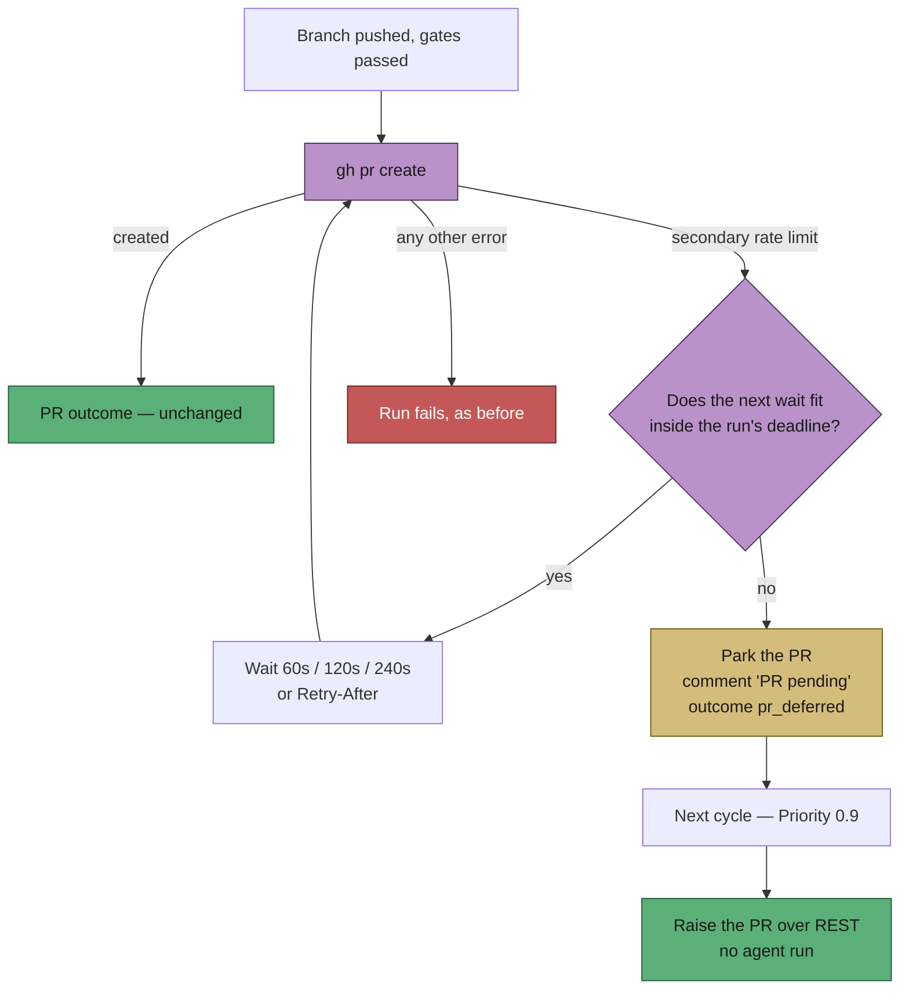

## Summary

A `gh pr create` refused by GitHub's **secondary** (content-creation) rate limit
was retried for about fourteen seconds and then recorded as a **failed run** —
branch pushed, no PR on it, and the refusal filed under `usage-limit` as if the
model subscription were spent. The work behind those runs was finished,
quality-gated and pushed; only the create was outstanding.

This change recognises the secondary limit distinctly, waits it out in minutes,
and — when it outlasts the run — parks the PR instead of failing:

- **`secondary_rate_limit.ts`** — `isSecondaryRateLimitMessage` (deliberately
  not matching the primary quota, which keeps its REST fallback),
  `parseRetryAfterSeconds` (clamped to 30 minutes) and `planSecondaryLimitWait`
  (60 s / 120 s / 240 s, or `Retry-After` when longer, never shorter than the
  shared `pr_creation` circuit breaker's interval, and never a wait that would
  run past the run's hard cap, handler deadline or cycle deadline).
- **`pr_creation_retry.ts`** — the bounded loop around the create. Any error
  that is not the secondary limit is returned untouched, so the primary-quota
  REST fallback and every ordinary failure behave exactly as before.
- **`deferred_pr_store.ts` / `deferred_pr_drain.ts` / `phases/pr_deferral.ts`** —
  the refused PR is parked with its branch, base, title and composed body; the
  issue thread gets a `PR pending` note naming the branch; new **Priority 0.9**
  raises it over REST on the next cycle with **no agent run**, ahead of every
  pass that assumes the PR already exists. Bounded on both axes: five attempts
  for a non-throttle failure, 24 hours for a throttle that never clears, and
  abandonment is loud.
- **`pr_deferred` run outcome** — not a failure: no failure label, no cooldown
  ladder, no failure streak, no run-failure issue. The branch stands and the
  resume state is kept, so the next claim can still recover the PR if the drain
  never runs.
- **`github-abuse-limit` failure class** — a secondary-limit refusal is
  classified apart from `usage-limit`, so a self-clearing GitHub throttle is
  countable separately from a spent subscription.

Closes #1951.

## Evidence

Backend/worker change with no web interface to screenshot. The evidence is the
test suite below, plus the red-then-green reproduction recorded under
**Reproduction**.

Cycle behaviour after the change:

Quality gate: `./quality.sh` — every check PASSED except `deno tests`, which
reports two **pre-existing, environment-dependent** failures in
`tests/provider_auto_runtime_test.ts`
(`The running container image did not install the "codex" coding-agent
provider. Installed: claude.`). That suite touches `lib/agent_provider.ts`,
which this change does not modify; the failure reproduces on the unmodified
tree in this container.

## Reproduction

- **symptom** — a run finished the work, pushed the branch and had
  `gh pr create` refused by GitHub's secondary rate limit; the run was recorded
  as `failure` (`PR creation failed: …`) with the branch orphaned and the
  refusal classified as an account usage limit
- **status** — `verified` — `tests/completion_phase_secondary_limit_test.ts`
  was run against the unfixed `lib/phases/completion_phase.ts` (restored with
  `git checkout HEAD --`) and failed with `Actual: failure / Expected:
  early_exit`; with the fix applied it passes and the deferral record is written
- **regression test** —
  `worker/deno/tests/completion_phase_secondary_limit_test.ts::completion - a secondary-limit refusal defers the PR instead of failing the run`

## Acceptance Criteria

<!-- vibe-spec-review inputs="diff+issue-body" -->

- **met** — a PR creation refused by the secondary limit is retried with minute-scale backoff before the run gives up — evidence: `worker/deno/tests/pr_creation_retry_test.ts::pr creation - a secondary-limit refusal is retried in minutes, not seconds` and `worker/deno/tests/secondary_rate_limit_test.ts::the default schedule steps in minutes` — reviewer: met — reason: the reviewer's caveat stands and is deliberate — `runGhCommand`'s own 4×(2/4/8 s) burst is untouched inside each outer attempt, because narrowing the generic `gh` retry would change every other `gh` call in the worker; the issue asked for a minute-scale layer for PR creation, and that is what this adds
- **met** — when it still cannot be created, the run is not recorded as a failure, the branch is not orphaned, and a PR appears within the next cycle without a new agent run — evidence: `worker/deno/tests/completion_phase_secondary_limit_test.ts::a secondary-limit refusal defers the PR instead of failing the run`, `worker/deno/tests/deferred_pr_drain_test.ts::a parked PR is raised and the record dropped`, and `worker/deno/tests/deferred_pr_dispatch_test.ts::the deferred-PR drain runs before every other pass` — reviewer: met — reason: the reviewer noted no test covered the dispatch wiring; `deferred_pr_dispatch_test.ts` was added in this diff in response
- **met** — the record distinguishes a GitHub content-creation throttle from a model usage limit — evidence: `worker/deno/tests/run_outcome_classifier_test.ts::GitHub's secondary rate limit is its own class, not a usage limit` and `::an agent WRITING about the secondary limit is not a GitHub throttle` — reviewer: met
- **met** — suggested fix: recognise secondary-limit wording distinctly (`isSecondaryRateLimitMessage`) — evidence: `worker/deno/lib/secondary_rate_limit.ts:54` and `worker/deno/tests/secondary_rate_limit_test.ts::the primary quota is NOT a secondary limit` — reviewer: met
- **met** — suggested fix: honour `Retry-After` when present, otherwise back off in minutes — evidence: `worker/deno/tests/pr_creation_retry_test.ts::Retry-After is honoured over the default step` — reviewer: partial — reason: the reviewer read `Retry-After` replacing the step as a hole in the minute-scale guarantee, and caught the docs claiming "whichever is longer". The limit's own statement of when it clears outranks our schedule in either direction, so the code kept precedence semantics and `docs/workflows/issue-processing.md` was corrected to say so
- **partial** — suggested fix: coordinated through the `circuit_breaker.ts` `pr_creation` operation so concurrent slots do not pile on — evidence: `worker/deno/lib/phases/pr_deferral.ts:83` (record) and `worker/deno/tests/pr_creation_retry_test.ts::the breaker's interval can only lengthen the wait` — reviewer: partial — reason: the breaker is consulted *after* a slot's own refusal, so each slot's waits lengthen from the shared count but no slot's *first* attempt is gated; a pre-gate would delay every PR creation on a host with a stale count and was left out of scope
- **met** — suggested fix: bounded by the run's hard cap from `run_hard_cap.ts` — evidence: `worker/deno/lib/phases/pr_deferral.ts:52` and `worker/deno/tests/pr_creation_retry_test.ts::a deadline the wait cannot fit defers without sleeping` — reviewer: met
- **met** — suggested fix: leave the branch, post the claim-release comment with a `PR pending` marker, keep the resume state — evidence: `worker/deno/tests/heartbeat_outcome_render_test.ts::pr_deferred: the release says the PR is pending and names the branch` and `worker/deno/tests/run_outcome_test.ts::a deferred PR keeps its resume state for the next claim` — reviewer: met
- **met** — suggested fix: let the next cycle raise the PR from the pushed branch — evidence: `worker/deno/lib/deferred_pr_drain.ts` and `worker/deno/tests/deferred_pr_drain_test.ts` — reviewer: partial — reason: implemented as a new Priority 0.9 with its own store rather than inside the existing PR-maintenance scan, and the reviewer is right that a drained PR skips the completion phase's post-create finalisation. The gap is bounded: the body already carries `Closes #N`, the base is stored so no milestone retarget is needed, and priority 1.65 arms auto-merge later in the same cycle
- **met** — suggested fix: record the outcome as a dedicated `pr_deferred` kind — evidence: `worker/deno/lib/run_outcome.ts` and `worker/deno/tests/run_outcome_test.ts::a deferred PR is its own kind, never a failure` — reviewer: met
- **met** — suggested fix: a separate `github-abuse-limit` class so fleet records can count it — evidence: `worker/deno/lib/run_outcome_classifier.ts:57` — reviewer: met
- **unrequested** — the drain's abandonment policy (five attempts, 24-hour age bound) and its `⚠️ Deferred PR not raised` comment — reviewer: unrequested — reason: without a bound a record the throttle keeps refusing is parked for ever, which is the silent hold this codebase forbids; abandoning loudly and naming the branch is what makes it not silent
- **unrequested** — the `✅ PR raised` comment the drain posts on a drained issue — reviewer: unrequested — reason: the run that did the work said "PR pending" on that thread; something has to say it is no longer pending
- **unrequested** — the standalone `⏳ PR pending` comment, in addition to the marker on the claim-release comment — reviewer: unrequested — reason: release comments are collapsed and swept (`heartbeat_sweep.ts`), so the durable statement of where the work is lives in its own comment
- **unrequested** — `resetPrCreationBreaker` writing on every successful create, including one that never saw a refusal — reviewer: unrequested — reason: that is `resetOperation`'s documented contract ("call on success"); skipping it would leave another slot's count to expire on the hour instead
- **unrequested** — `MAX_RETRY_AFTER_SECONDS` (1800 s) and `POST_CREATE_RESERVE_MS` (30 s) — reviewer: unrequested — reason: a wait needs an upper bound and the post-create work needs room inside the deadline; both are invented numbers, stated as constants rather than buried
- **unrequested** — the roster filter on the drain's comments only, so a record for a repo that left the roster still gets its PR — reviewer: unrequested — reason: the PR is the work; commenting on a repo this host no longer monitors is not its place

## Standards Review

<!-- vibe-standards-review inputs="diff+CODING-STANDARDS.md" -->

- **violation** — `resetPrCreationBreaker` discarded `resetOperation`'s `Result` and swallowed throws with a bare `catch` — evidence: `worker/deno/lib/phases/pr_deferral.ts:118` — reason: fixed here; both paths now log at `warn`
- **violation** — the drain read any failed `findOpenPr` as "no PR exists", so an API outage became a silent negative — evidence: `worker/deno/lib/deferred_pr_drain.ts:127` — reason: fixed here; a lookup fault is warned about explicitly and the create still runs, where a duplicate resolves to the open PR
- **violation** — a record whose refusal kept matching the throttle was re-parked for ever, and the audit record claimed the retrying was bounded — evidence: `worker/deno/lib/deferred_pr_drain.ts:159` — reason: fixed here with `MAX_DEFERRED_PR_AGE_SECONDS` (24 h) plus a regression test; the audit record now states both axes
- **violation** — raw `gh` stderr was quoted into issue comments without `redactSecrets` — evidence: `worker/deno/lib/deferred_pr_store.ts:236` and `worker/deno/lib/deferred_pr_drain.ts:186` — reason: fixed here; both sinks redact independently, covered by two regression tests
- **violation** — the new wrapper sat ahead of the Issue #42 REST fallback, so the latch's own cool-down (which names both limits) would wait minutes and defer instead of opening the PR at once — evidence: `worker/deno/lib/pr_creation_retry.ts:95` — reason: fixed here with `isSecondaryOnlyRateLimitMessage`; two phase-level tests cover the latch wording in both directions
- **violation** — `const PR_CREATION_OP` was declared between two import statements — evidence: `worker/deno/lib/phases/completion_phase.ts:33` — reason: fixed here; it moved with the helpers
- **violation** — ~190 lines of deferral helpers were added to the already-monolithic `completion_phase.ts`, against "favour many smaller, focused source files" — evidence: `worker/deno/lib/phases/completion_phase.ts` — reason: fixed here; they live in `worker/deno/lib/phases/pr_deferral.ts`
- **violation** — `docs/archive/pr-summaries/pr-summary-1951.md` was untracked at review time — evidence: `docs/archive/pr-summaries/pr-summary-1951.md` — reason: fixed here; it is committed with this change
- **violation** — the sweep ledger's `sweptAt` named the branch base, a commit at which none of the swept modules exist — evidence: `docs/audits/lib-sweep-coverage.json` — reason: fixed here; it names the commit that carries the modules in their final form
- **clean** — Australian English throughout; every test calls the real function and asserts on returned values or on-disk effects (no source-grepping); no wall-clock sleeps or absolute timing assertions (the retry suite uses an injected clock); no `Deno.env` mutation or shared-state races; path traversal refused and regression-tested; flat regexes with bounded digits (no ReDoS); PR creation over `-f` raw fields with no shell; no hidden or credential-shaped path staged; both commits reference the issue and carry `Vibe-Coder-Run-Id`; module/test pairing and the manifest gate pass; the docs the change owes are updated with a Mermaid diagram

## Test Plan

Added:

- `worker/deno/tests/completion_phase_secondary_limit_test.ts` — the deferral
  (outcome, parked record, `PR pending` comment), an ordinary create failure
  still failing the run, and a deferral with nowhere to park failing loudly.
- `worker/deno/tests/secondary_rate_limit_test.ts` — secondary vs primary
  wording, `Retry-After` parsing and clamping, the minute-scale schedule, the
  coordinated floor, the deadline refusal and schedule exhaustion.
- `worker/deno/tests/pr_creation_retry_test.ts` — retry then success,
  `Retry-After` honoured, breaker floor and reset, deferral when the schedule or
  the deadline runs out, and no retry for any other error (injected clock, so
  no test waits a real minute).
- `worker/deno/tests/deferred_pr_store_test.ts` — round-trip, replacement,
  ordering, path-traversal refusal, incomplete-record refusal, malformed-file
  reporting, idempotent clear, the pending note.
- `worker/deno/tests/deferred_pr_drain_test.ts` — raise and clear, already-open,
  still-throttled, other failure counting up, loud abandonment at the cap,
  empty work dir, comment failure never losing the PR.

- `worker/deno/tests/deferred_pr_dispatch_test.ts` — the drain tier exists at
  0.9, runs before every other pass, calls the dep, surfaces a failure, and is a
  clean no-op on a host wired without it.

Extended: `run_outcome_test.ts` (new kind, resume-state survival),
`run_outcome_classifier_test.ts` (`github-abuse-limit` vs `usage-limit`),
`heartbeat_outcome_render_test.ts` (the ✅ release clause for `pr_deferred`).

Docs: `docs/workflows/issue-processing.md` (new section with diagram),
`docs/workflows/README.md` and `docs/USAGE.md` (Priority 0.9),
`docs/audits/security-sweep-1951-deferred-pr.md` plus the lib-sweep ledger slice.
