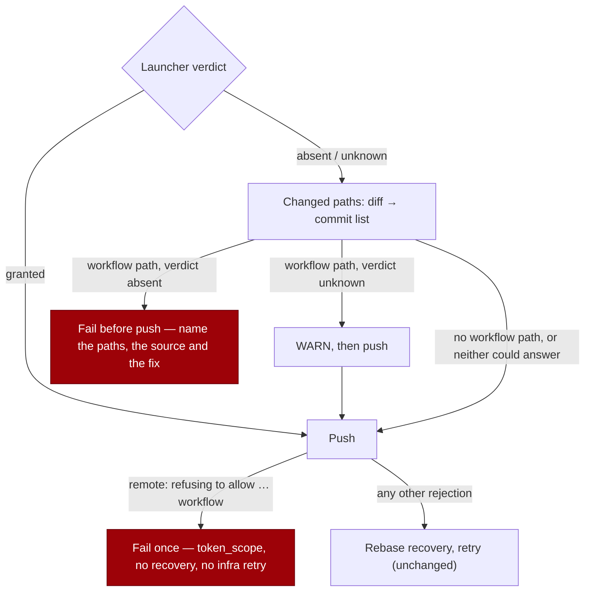

# Fail once on GitHub's workflow-scope refusal

## Summary

A run that touched `.github/workflows/` on a host whose token lacks the
`workflow` OAuth scope pushed anyway, because the pre-push check (#1475) failed
open in two silences — an unrecorded launcher verdict read as "has the scope",
and a `git diff` that errored read as "no changed paths". GitHub's raw refusal
then matched only the generic "Git push failed" rule, so the run spent the
rebase ladder **and** the in-process infra retry against a refusal no rebase can
fix, and the record blamed `push_failure` instead of the host's credential.

This change:

- recognises GitHub's refusal text (OAuth App, fine-grained PAT and GitHub App
  wordings) as `token_scope`, stops the completion phase on the first one, and
  makes `recoverFromPushRejection` bail before any git runs when the caller
  passes the refusal — no rebase, no force-with-lease, no retry push;
- refuses the in-process infra retry for `token_scope`: no backoff grants a
  scope, so the failure stands after one attempt with the operator fix in it;
- probes the changed paths twice — `git diff --name-only`, then
  `git log --name-only origin/<base>..HEAD` — logging the fallback, logging the
  skip when neither can answer, and naming in the failure which of the two
  supplied the paths;
- records the launcher's scope verdict as three states (`granted` / `absent` /
  `unknown`), so "unset" means only "nobody could look" — a failed detection or
  a GitHub App token — and says that at WARN instead of at INFO.

Closes #1952.

## Evidence

Backend/CLI change — no web interface to screenshot. The evidence is the
regression run below plus the behaviour captured in the new tests.

Push path after the change:

Quality gate: `./quality.sh` passes every check except two pre-existing,
environment-bound failures unrelated to this diff —
`tests/provider_auto_runtime_test.ts:136` and `:167` fail with
`Error: The running container image did not install the "codex" coding-agent
provider. Installed: claude.` (21269 tests passed, 2 failed). The manifest,
lint, type-check, fmt, semgrep, mermaid and markdownlint stages all pass.

## Reproduction

- **symptom** — a completed run whose branch changed `.github/workflows/` was
  refused by GitHub for want of the `workflow` scope, burned its recovery
  attempts against the refusal, and was recorded as a generic push failure
- **status** — `verified` — the regression tests were run against the unfixed
  code at the milestone base (`ab0390e`) in a throwaway worktree: the refusal
  case attempted **4 pushes** instead of 1, the unreadable-diff case pushed a
  workflow branch (**1 push** where 0 is required), and
  `detectFailureCategory` on the wrapped refusal returned **`push_failure`**.
  All three pass after the fix (`token_scope`, 1 push, 0 pushes respectively).
- **regression test** —
  `worker/deno/tests/completion_phase_workflow_refusal_1952_test.ts::completion - GitHub's workflow-scope refusal fails once, with no rebase recovery (Issue #1952)`

## Acceptance Criteria

<!-- vibe-spec-review inputs="diff+issue-body" -->

- **met** — a branch touching `.github/workflows/` pushed with a token lacking
  `workflow` scope fails once, immediately, naming the missing scope; no
  rebase/push retries — evidence:
  `worker/deno/tests/completion_phase_workflow_refusal_1952_test.ts::completion - GitHub's workflow-scope refusal fails once, with no rebase recovery (Issue #1952)`
  (asserts `pushes === 1`, `recoveries === 0`) plus
  `worker/deno/tests/workflow_scope_push_refusal_1952_test.ts::shouldRetryInfrastructureFailure - a missing scope is not retried in-process (Issue #1952)`
  — reviewer: partial — reason: the reviewer marked it "MET for the completion
  path, PARTIAL system-wide" because the PR-feedback, CI-fix and spelling
  processors still call `recoverFromPushRejection` without the refusal detail;
  the issue scoped the change to the completion path, and those paths are now
  at least classified `token_scope` by `detectFailureCategory`
- **met** — the run record carries `token_scope`, not `push_failure` —
  evidence:
  `worker/deno/tests/workflow_scope_push_refusal_1952_test.ts::detectFailureCategory - GitHub's raw refusal classifies as token_scope, not push_failure (Issue #1952)`,
  `worker/deno/lib/failure_diagnosis.ts:241` — reviewer: met
- **met** — with the scope present, workflow-touching branches push as today —
  evidence:
  `worker/deno/tests/completion_phase_workflow_scope_1475_test.ts::completion - with the scope, or with no preflight verdict, a workflow change is pushed (Issue #1475)`;
  `completion_phase.ts:980` only probes when the verdict is not `granted` —
  reviewer: met
- **met** — suggested fix: recognise the raw refusal (OAuth and fine-grained
  equivalents) in `detectFailureCategory` — evidence:
  `worker/deno/lib/workflow_scope.ts:152` and its three-wording test —
  reviewer: met
- **met** — suggested fix: `recoverFromPushRejection` stops immediately on it —
  evidence: `worker/deno/lib/git_push_recovery.ts:116`,
  `worker/deno/tests/workflow_scope_push_refusal_1952_test.ts::recoverFromPushRejection - stops on the workflow-scope refusal without running git (Issue #1952)`
  — reviewer: partial — reason: the reviewer noted the other four call sites do
  not pass the detail; out of this issue's scope, which named the completion
  phase
- **met** — suggested fix: do not fail open silently on an unanswerable diff;
  log the skip and fall back to the commit list — evidence:
  `worker/deno/lib/workflow_scope_precheck.ts`,
  `worker/deno/tests/workflow_scope_precheck_1952_test.ts` (all four cases) —
  reviewer: met — reason: the reviewer warned the commit-list fallback can be a
  weaker answer than the diff; the failure message now names which source
  supplied the paths, and the hard failure only applies on a host already known
  to lack the scope
- **partial** — suggested fix: determine the token's scopes once at launcher
  start and record them so the check never has to guess — evidence:
  `worker/deno/lib/run_worker.ts:440`, `worker/deno/lib/workflow_scope.ts:104`,
  `worker/deno/tests/workflow_scope_push_refusal_1952_test.ts::workflowScopeVerdictFor - every detection outcome records a verdict, or says it could not (Issue #1952)`
  — reviewer: partial — reason: a detection that genuinely could not answer
  (`gh auth status` failed, or a GitHub App token whose `workflows` permission
  is not reported) still leaves the state `unknown`; the run no longer guesses
  silently — it warns and lets GitHub decide at the push, where the refusal now
  fails once
- **unrequested** — `infra_retry.ts` no longer grants the one in-process retry
  to any `token_scope` failure, including #1475's pre-push failure — reviewer:
  unrequested — reason: without it the phase body re-runs and pushes again, so
  acceptance 1 ("no push retries") cannot hold
- **unrequested** — `InfrastructureDeps.tokenHasWorkflowScope` was replaced by
  the three-state `workflowScopeState` seam — reviewer: unrequested — reason: a
  boolean cannot express "nobody looked", which is the silence this issue is
  about; the module-level `tokenHasWorkflowScope()` is unchanged for the
  claim-time heuristic
- **unrequested** — `docs/SETUP.md` gains the #1952 behaviour and a flowchart —
  reviewer: unrequested — reason: the repo standard requires a docs change for
  a behaviour change

## Standards Review

<!-- vibe-standards-review inputs="diff+CODING-STANDARDS.md" -->

- **violation** — the new module was claimed by no sweep slice, so
  `deno task check:manifests` (and the gate) went red — evidence:
  `docs/audits/lib-sweep-coverage.json` — reason: fixed here;
  `worker/deno/lib/workflow_scope_precheck.ts` is registered in slice 12e and
  `tests/lib_sweep_coverage_test.ts` passes
- **violation** — raw git stderr was quoted into the failure reason
  unredacted and uncapped, bypassing the `redactedLineTail` contract that
  exists because a push failure can quote a credentialed remote URL
  (Issue #1257) — evidence: `worker/deno/lib/workflow_scope.ts:181` — reason:
  fixed here; the quoted detail is redacted and capped at five lines like
  every other push failure
- **violation** — `shouldRetryInfrastructureFailure`'s contract block still
  said every infrastructure category retries — evidence:
  `worker/deno/lib/infra_retry.ts:82` — reason: fixed here; the `token_scope`
  exclusion is now in the documented contract
- **violation** — the three-state type immediately re-conflated two states by
  recording a GitHub App token as `granted`, and that value also feeds the
  bump-deps script's workflow permission — evidence:
  `worker/deno/lib/workflow_scope.ts:122` — reason: fixed here; App auth is
  recorded as `unknown` (nothing established either way), which also leaves
  `bump_deps` behaviour untouched
- **violation** — a dead `text ?? ""` guard on a non-nullable parameter, and
  test assertions duplicating `workflow_scope_1475_test.ts` — evidence:
  `worker/deno/lib/workflow_scope.ts:157`,
  `worker/deno/tests/workflow_scope_push_refusal_1952_test.ts:112` — reason:
  both removed here
- **violation** — `ChangedPathProbe.detail` was public surface no caller read —
  evidence: `worker/deno/lib/workflow_scope_precheck.ts:39` — reason: removed;
  `source` is now consumed by the completion phase's messages
- **clean** — Australian English throughout; TDD with real function calls and
  no source-grepping; no test deleted or commented out; fail-loud logging
  replacing two swallowed `logger.info` lines; no hidden paths staged; commit
  carries `Closes #1952` and the run-id trailer; no import cycle
  (`workflow_scope.ts` pulls only the redaction helper); the refusal regex is
  bounded and lazy, so no catastrophic backtracking

### Existing test modified — documented

`worker/deno/tests/completion_phase_workflow_scope_1475_test.ts` injects the
scope verdict through `deps.infrastructure`. That seam changed from a boolean
to the three-state verdict, so the injection was updated
(`"false"` → `absent`, `"true"` → `granted`, absent → `unknown`). All three
#1475 cases and their assertions are unchanged and still pass.

## Test Plan

Added:

- `worker/deno/tests/workflow_scope_push_refusal_1952_test.ts` — the three
  refusal wordings and the non-matches; the redacted refusal message;
  `detectFailureCategory` on the wrapped refusal and on an ordinary rejection;
  the three-state verdict and its round trip through the recorded env value;
  `recoverFromPushRejection` stopping before any git; and
  `shouldRetryInfrastructureFailure` refusing the in-process retry while an
  ordinary push failure keeps it.
- `worker/deno/tests/workflow_scope_precheck_1952_test.ts` — the diff answering
  silently; a non-zero diff and a spawn failure both falling back to the commit
  list with the reason logged; and the loud skip when neither can answer.
- `worker/deno/tests/completion_phase_workflow_refusal_1952_test.ts` — drives
  the real `workOnIssueCompletion`: one push and no recovery on the refusal,
  no push at all when the commit-list fallback finds a workflow file, and a
  warned-but-pushed run when the verdict is unknown.

Modified: `worker/deno/tests/completion_phase_workflow_scope_1475_test.ts` (seam
update only — see above).

Commands run: `deno fmt`, `deno lint`, `deno check`, the five affected suites,
and `./quality.sh` (result above).
