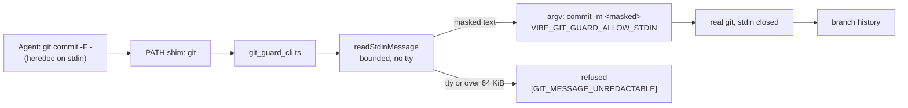

# `git commit -F -` is scanned and committed, not refused

## Summary

The agent-side `git` guard refused every message piped on stdin:
`maskedMessageFile` threw `UnredactableMessageError` on the literal path `-`
before reading anything, so `git commit -F -` — a heredoc into the command, the
idiomatic way a script writes a multi-line message — died with
`[SECURITY] [GIT_MESSAGE_UNREDACTABLE]` and cost a rewrite plus a retry turn.

The guard now does for stdin exactly what it already did for `-F <path>`:
consume it, scan it, and hand the text back inline as `-m <masked>`, so the real
`git` has nothing left to read. Closes #1953.

- `worker/deno/lib/git_stdin_message.ts` (new) — a bounded stdin reader. A
  terminal is refused before a byte is read (an unattended worker must never
  block on a tty), and a message over `MAX_STDIN_MESSAGE_BYTES` (64 KiB) is
  refused naming `-F <path>` rather than truncated. The reader is split from its
  `Deno` binding so the bound is testable without a real pipe.
- `worker/deno/lib/git_message_redaction.ts` — `redactGitMessageArgs` now takes
  either the original `-F <path>` reader or a `MessageSources` object carrying a
  `stdin` source. A stdin message is **always** moved into argv, because the
  stream reads once; a `-F <path>` message still only moves when something was
  masked. With no stdin source the old fail-closed refusal stands, which is what
  the worker's own `runGitCommand` chokepoint still gets.
- `worker/deno/lib/git_guard_cli.ts` — reports the verdict with a second allow
  marker, `VIBE_GIT_GUARD_ALLOW_STDIN`, when it consumed stdin.
- `worker/deno/lib/git_guard_shim.ts` — accepts both allow markers and, on the
  stdin one, `exec`s the real `git` with `</dev/null` so the stream cannot be
  read twice.
- Masking is now reported by the redaction module itself (`onMasked`) instead of
  being inferred from an argv comparison. That inference would have been wrong
  for stdin: its two arguments are rewritten whether or not a secret was found,
  so every piped commit would have claimed `[GIT_MESSAGE_REDACTED]`.
- `prompts/coding_guidelines/prompt.md` — one line telling the agent all three
  spellings work, and what the one refusal is.

### Flow



## Evidence

Backend/CLI change — no web interface to screenshot. The evidence is a real
`git` commit, not a return value: `git_guard_shim_test.ts::git-guard-shim -`git
commit -F -`commits the piped
message for real (Issue #1953)` installs the shim
over a real `git`, pipes a message carrying a fake token into `git commit -F -`
in a throwaway repository, and reads the committed message back with
`git log -1 --format=%B`: the subject and body are intact, the token is
`***REDACTED***`, and the exit code is 0.

The refusal also reproduced live in this run. The first attempt to commit this
very change with `git commit -F -` was refused by the container's installed
guard:

```
[SECURITY] [GIT_MESSAGE_UNREDACTABLE] a git message read from stdin cannot be
scanned for secrets — write it to a file and pass -F <path>
```

That refusal came from the mounted read-only checkout (`VIBE_BASE_DIR`), which
still carries the unfixed guard — the same code path the new tests now drive
green.

The read deadline was verified the same way, against a real pipe nobody writes
to (the case `isTerminal` cannot see, raised by the spec review):

```console
$ mkfifo f && (sleep 120 > f &) && deno run --allow-read …/git_guard_cli.ts -- commit -F - < f
[SECURITY] [GIT_MESSAGE_UNREDACTABLE] a git message on stdin did not arrive
within 60000ms — the stream is still open and nothing is writing to it. Pass
the message with -m <text> or -F <path>
exit=1 elapsed=60s
```

### Quality gate

`./quality.sh` passes every stage except `deno tests`, which fails on 42
`setup_credential_provisioning` / `setup_lockfile` / `setup_provider_credential_flow`
/ `provider_auto_runtime` / `setup_workdir_reminder` cases. Those are
environmental in this container (`CONFIG_FILE and CONFIG_PATH are both set and
name different files`, an image without the `codex` provider, a missing
credential directory) and reproduce unchanged on the base commit `e8b82c03` in
a clean worktree — none of them imports anything this diff touches. Every
git-guard test passes: `git_stdin_message_test.ts`,
`git_message_redaction_test.ts`, `git_guard_cli_test.ts` and
`git_guard_shim_test.ts` — 61 + 13 cases, 0 failures.

## Reproduction

- **symptom** — `git commit -F -` (a heredoc commit message) is refused with
  `[SECURITY] [GIT_MESSAGE_UNREDACTABLE]`, forcing the agent to rewrite the
  command and retry
- **status** — `verified` — the refusal was observed twice: once as a live
  `git commit -F -` in this run (quoted above), and once as a red test — the new
  shim and CLI tests fail against the unfixed guard with exactly that marker and
  pass after the fix
- **regression test** —
  `worker/deno/tests/git_guard_shim_test.ts::git-guard-shim -`git commit
  -F -`commits the piped message for real (Issue #1953)`

## Acceptance Criteria

<!-- vibe-spec-review inputs="diff+issue-body" -->

- **met** — the guard reads a `-` message source to completion, bounded, and
  returns it in place of the stdin reference — evidence:
  `worker/deno/lib/git_stdin_message.ts::readStdinMessage`,
  `git_message_redaction.ts::maskedStdinMessage`,
  `worker/deno/tests/git_stdin_message_test.ts` — reviewer: met — reason: the
  reviewer noted the bound is not literally "the same size limit as the file
  path", because the `-F <path>` reader has none; the stdin path is
  deliberately tighter because its text becomes a single argv element
- **met** — the shim runs the real `git` with stdin closed — evidence:
  `worker/deno/lib/git_guard_shim.ts` (the `</dev/null` exec, gated on
  `VIBE_GIT_GUARD_ALLOW_STDIN`), verified by the reviewer by hand against a
  real `git` — reviewer: met
- **partial** — "refuse only when stdin is a TTY or exceeds the bound" —
  evidence: `worker/deno/lib/git_stdin_message.ts` — reviewer: partial —
  reason: the literal "only" is departed from, deliberately and in this diff.
  The reviewer demonstrated that an open-but-idle pipe (`mkfifo f;
  sleep 1000 > f`) satisfies neither condition and blocked the guard — and the
  agent's `git` with it — indefinitely, where the old code refused instantly.
  The read now also refuses on a 60-second deadline, on a NUL byte the verdict
  framing cannot carry, and on a command naming stdin twice
- **met** — the `[GIT_MESSAGE_REDACTED]` marker still fires for a masked
  message, and only for one — evidence:
  `git_guard_cli_test.ts::masks a secret in a stdin message and says so` and
  `::commits a stdin message instead of refusing it` (which asserts an empty
  stderr) — reviewer: met
- **met** — one line in `prompts/coding_guidelines/prompt.md` — evidence:
  `prompts/coding_guidelines/prompt.md` under **Commit Run-Id Trailer** —
  reviewer: partial — reason: the reviewer read the first commit, whose wording
  claimed 64 KiB was "the one case it refuses"; that overstatement is reworded
  in this diff
- **met** — `printf 'subject\n\nbody' | git commit -F -` commits with the
  message intact, no refusal, no retry — evidence:
  `git_guard_shim_test.ts::a clean message piped on stdin reaches git
  byte-for-byte` and the real-`git` test named under Evidence; the reviewer
  also ran it by hand — reviewer: met
- **met** — a secret-shaped token on stdin is committed masked with the marker,
  exactly as `-F <path>` behaves — evidence:
  `git_guard_shim_test.ts::a token in a message piped on stdin never reaches
  git (Issue #1953)` and the real-`git` test — reviewer: met
- **met** — existing `-F <path>`, `-m`, `-C` and `--` pathspec tests are
  unchanged — evidence: the only test deletions are the two stdin-refusal
  assertions documented under Test Plan — reviewer: met — reason: the reviewer
  noted `runShim` now defaults to `stdin: "null"` instead of inheriting the
  test process's stdin, which changes the environment of the older shim tests
  without moving any assertion; that is hermetic, and kept
- **unrequested** — `SECURITY.md` and `docs/THREAT-MODEL.md` rewritten —
  reviewer: unrequested — reason: both described the old refusal as the
  guard's behaviour, and a code change owes the docs change
- **unrequested** — `docs/audits/lib-sweep-coverage.json` slice `12ac` and
  `docs/audits/security-sweep-1953-git-stdin-message.md` — reviewer:
  unrequested — reason: the repo's completeness gate claims every new `lib/`
  module for a sweep slice; the alternative is a false record in an old slice
- **unrequested** — `worker/deno/lib/vibe_env_registry.ts` entry for
  `VIBE_GIT_GUARD_ALLOW_STDIN` — reviewer: unrequested — reason: the registry
  gate requires every `VIBE_` name in the source to declare its role
- **unrequested** — the `onMasked` hook and the `MessageSources` parameter —
  reviewer: unrequested — reason: the old argv comparison would have announced
  `[GIT_MESSAGE_REDACTED]` on every piped commit, masked or not, which breaks
  the fourth criterion above
- **unrequested** — the second verdict marker `VIBE_GIT_GUARD_ALLOW_STDIN` —
  reviewer: unrequested — reason: the issue asked for `</dev/null`; the marker
  is how the wrapper learns that this call is the one that needs it
- **unrequested** — three refusals the issue did not list (the 60-second
  deadline, the NUL byte, a second `-F -`) — reviewer: unrequested — reason:
  each closes a way the guard would otherwise hang, refuse for a false reason,
  or replay a stream that reads once; all three came from the spec review
- **unrequested** — `redactGitMessageArgs(args)` with neither reader nor stdin
  source now throws on `-F -` where it previously returned argv untouched —
  reviewer: unrequested — reason: fail-closed, and unreachable — the two
  production callers both supply a reader
- **unrequested** — `const realGit = shellQuote(...)` hoisted in
  `git_guard_shim.ts`, and the test helpers `pinGuardToThisCheckout` /
  `resolveRealGit` — reviewer: unrequested — reason: the formatter wrapped the
  new `exec` line mid-command without the hoist, and without the pinning the
  new tests exercise whatever guard the `VIBE_BASE_DIR` mount carries instead
  of the code under test

## Standards Review

<!-- vibe-standards-review inputs="diff+CODING-STANDARDS.md" -->

- **violation** — the real-`git` test inherited the host's signing and hook
  configuration, so a host with `commit.gpgsign=true` would wedge it — a commit
  now running with stdin closed — evidence:
  `worker/deno/tests/git_guard_shim_test.ts:450` — reason: fixed here; the
  repo bootstrap now sets `commit.gpgsign false` and `core.hooksPath`, matching
  the sibling helper in `git_message_redaction_test.ts`
- **violation** — `docs/archive/pr-summaries/pr-summary-1953.md` was untracked,
  so the required PR summary would not have shipped — evidence:
  `docs/archive/pr-summaries/pr-summary-1953.md` — reason: fixed here; it is
  committed with the change
- **violation** — a test asserting a constant against its own literal
  (`assertEquals(MAX_STDIN_MESSAGE_BYTES, 65536)`) exercises no behaviour —
  evidence: `worker/deno/tests/git_stdin_message_test.ts:121` — reason: fixed
  here; it is replaced by a test that drives the default bound, refusing one
  byte over it and accepting the byte on it
- **violation** — KISS: `redactGitMessageArgs` accepts two argument shapes and
  needs `normaliseSources` to reconcile them, for a single unmigrated
  production caller — evidence: `worker/deno/lib/git_message_redaction.ts:240`
  — reason: it stands. Migrating `git_timeout.ts` is one line, but the union
  is what keeps roughly forty existing `-F <path>` / `-m` test call sites
  byte-for-byte, and "existing tests unchanged" is one of this issue's stated
  acceptance criteria. The reconciler is three lines and has no branch beyond
  the shape test
- **clean** — Australian English throughout; fail-loud on every new path (every
  refusal is an `UnredactableMessageError` surfaced as
  `[SECURITY] [GIT_MESSAGE_UNREDACTABLE]`, the wrapper stays positive-marker
  only, the oversized message refuses rather than truncating); the worker
  chokepoint still fails closed on `-F -`; tests call real code and assert on
  results (the shim tests read the argv a stub `git` logged, and the headline
  test reads the message back out of real `git log`) with no source-text
  greps; no wall-clock sleeps, polling loops or absolute timing budgets; no
  hidden or credential-shaped file staged; Deno-native tooling only; new module
  and test both around 200 lines with comments that explain why; every gate
  registration (sweep slice, `VIBE_` name, matching test file) present.

## Test Plan

New — `worker/deno/tests/git_stdin_message_test.ts` (8 tests): a multi-line
message read to completion, an empty stream, multi-byte characters split across
chunks, a terminal refused without a single read, a message past the bound
refused rather than truncated, a message exactly on the bound accepted, a
zero-length read ending the message rather than spinning, and the documented 64
KiB default.

Added to `worker/deno/tests/git_message_redaction_test.ts`: a stdin message
masked and inlined as `-m`; a clean stdin message still inlined (the stream
reads once) with no redaction reported; every stdin spelling (`-F -`,
`--file -`, `--file=-`, `-F-`, `-aF -`, `tag -F -`); an unreadable stdin message
failing closed; and a `--` pathspec `-` that must never be read as a message.

Added to `worker/deno/tests/git_guard_cli_test.ts`: a piped message allowed with
the stdin marker and no redaction line; a piped message carrying a token masked
with `[GIT_MESSAGE_REDACTED]`; a refusing stdin source still refusing; a command
with no message flag (`git am --message-id`) never reading stdin and keeping the
plain allow marker; and `-F <path>` keeping the plain allow marker.

Added to `worker/deno/tests/git_guard_shim_test.ts`: a token piped on stdin
never reaching `git`; a clean piped message reaching `git` byte-for-byte; and
the real-`git` end-to-end commit described under Evidence. Those three pin the
guard module to this checkout, because `defaultGitGuardModulePath` otherwise
prefers the read-only `VIBE_BASE_DIR` mount and the test would exercise whatever
guard that mount carries instead of the code under test.

### Existing tests changed (business-logic change, documented)

Two tests asserted the behaviour this issue removes:

- `git_message_redaction_test.ts::a message from stdin fails closed` → renamed
  to `stdin with no source supplied fails closed`. The assertion is unchanged —
  it now names the case it always covered, the worker chokepoint that supplies
  no stdin source.
- `git_guard_cli_test.ts::refuses a message it cannot scan` used `-F -` as its
  unscannable source, which is now scannable. It became
  `refuses a message file it cannot read` (an unreadable path), and the stdin
  refusal it used to cover is now
  `a stdin message that cannot be read still refuses`, driven by a source that
  throws the way a terminal does.

No test was commented out or deleted, and the `-F <path>`, `-m`, `-C` and `--`
pathspec tests are untouched.

### Known pre-existing gap, out of scope here

`git commit-tree <tree>` with no `-m`/`-F` at all also reads its message from
stdin, and carries no option the shim's fast path matches, so it never reaches
the guard. That is a separate root cause from this issue's _refusal_, predates
this change, and is filed as #1969 rather than folded in.
