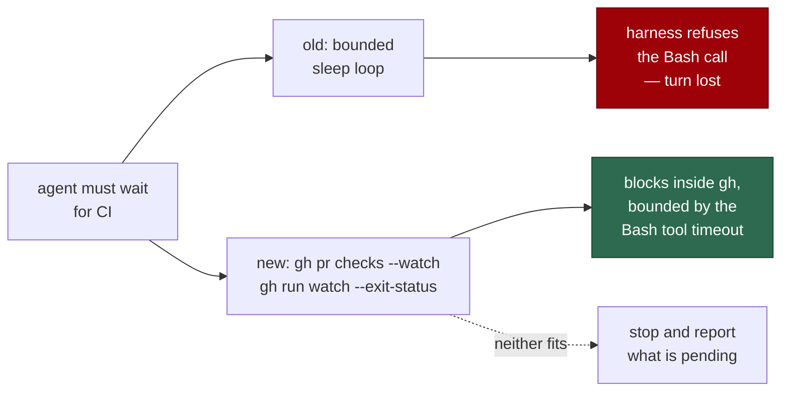

# Give the agent a wait pattern that works inside the container

## Summary

`prompts/coding_guidelines/prompt.md` told the agent that, if it genuinely
must poll, it should bound the loop with "a fixed maximum number of
iterations, each with a `sleep`" — the one wait the agent harness's Bash tool
documents as blocked. An agent waiting for CI followed the guideline, hit the
refusal and lost the turn, and no in-container alternative was offered
anywhere.

Both the coding-guidelines and the CI-fix templates now name a wait that works
in the container: `gh pr checks <pr> --watch --fail-fast` and
`gh run watch <run-id> --exit-status`. Both block inside `gh` rather than in
the shell, both are bounded by the Bash tool's own timeout, and when neither
fits the instruction is to stop and report what is still pending rather than
loop. A new sweep test reads every template under `prompts/` and fails when
one offers a sleep poll as the way to wait. Closes #1954.

## Evidence

Backend/prompt change with no web interface to screenshot. The evidence is
test output and a guard probe:

- `worker/deno/tests/sleep_poll_guidance_1954_test.ts` — 9 cases, all passing
  (`deno test --allow-read --allow-env tests/sleep_poll_guidance_1954_test.ts`).
- The sweep was observed red before the prompt edit, naming the exact offender:
  `prompts/coding_guidelines/prompt.md line 70: If you genuinely must poll,
  bound it: a fixed maximum number of iterations, each with a` `sleep`.
- The `gh` guard was confirmed to pass `--watch` through rather than changed:
  `evaluateGhCommand` allows `pr checks 12 --watch --fail-fast`,
  `run watch 4242 --exit-status` and the `--repo` variant under an active
  write-repo allowlist and a claimed issue. The agent-side shim `exec`s the
  real binary with no timeout of its own
  (`worker/deno/lib/gh_guard_shim.ts:433`), so the wait is bounded by the Bash
  tool, as the prompts now state.
- `./quality.sh` — every stage PASSED except `deno tests`, which fails on two
  pre-existing environmental cases in `tests/provider_auto_runtime_test.ts`
  ("The running container image did not install the `codex` coding-agent
  provider. Installed: claude."). That file is byte-identical to
  `origin/milestone/container-friction` and is unrelated to this diff.
- Honest caveat on the claim the prompts now make: this container ran a
  foreground `sleep 20` without refusal, while the harness's own Bash tool
  documentation states a foreground `sleep` is blocked. The guidelines
  therefore source the claim ("its own Bash tool documents the refusal") and
  say the turn is lost "where that block is in force" — the `gh` watch
  commands are the pattern that works either way.

## Reproduction

- **symptom** — the injected guidelines told an agent to wait by looping with
  a foreground `sleep`, which the agent harness's Bash tool refuses, so an
  agent waiting for CI lost its turn to the refusal and had no documented
  alternative.
- **status** — `verified` — the sweep case
  `prompts - none recommends sleep as a polling primitive` was observed
  failing against the unfixed templates (naming
  `prompts/coding_guidelines/prompt.md line 70`) and passing after the rewrite;
  the two `names a wait command that works in the container` cases went the
  same way.
- **regression test** —
  `worker/deno/tests/sleep_poll_guidance_1954_test.ts::prompts - none recommends sleep as a polling primitive`

## Acceptance Criteria

<!-- vibe-spec-review inputs="diff+issue-body" -->

- **met** — No prompt shipped in `prompts/` recommends `sleep` as a polling
  primitive — evidence:
  `worker/deno/tests/sleep_poll_guidance_1954_test.ts::prompts - none recommends sleep as a polling primitive`
  sweeps all 43 `*.md` files under `prompts/` — reviewer: met — reason: the
  reviewer flagged the detector as narrow (a sentence-wide prohibition cue
  could excuse a rephrased recommendation); the prohibition is now read per
  clause and a case covering "the harness blocks background jobs, so poll with
  `sleep 30`" was added.
- **met** — The CI-fix and coding-guideline prompts name a wait command that
  works inside the container, with its timeout behaviour — evidence:
  `prompts/coding_guidelines/prompt.md:69-88`, `prompts/ci_fix/prompt.md:17`,
  pinned by
  `worker/deno/tests/sleep_poll_guidance_1954_test.ts::coding_guidelines - names a wait command that works in the container`
  — reviewer: met — reason: the reviewer showed two of the four contract rows
  matched text that predated the change; both now name the sentences they
  exist to pin (`foreground …sleep… block`, `bounded by the Bash tool's …
  timeout`).
- **met** — Prompt snapshot tests updated — evidence:
  `worker/deno/tests/sleep_poll_guidance_1954_test.ts` (9 cases);
  `deno task check:manifests` green, so the new suite needs no manifest entry
  — reviewer: met — reason: the reviewer noted the repo pins no literal prompt
  snapshot, so this suite is the pin the criterion asks for.
- **met** — (issue bullet 3) Confirm the `gh` guard passes `--watch` through —
  evidence:
  `worker/deno/tests/sleep_poll_guidance_1954_test.ts::gh guard - allows the watch commands the prompts now recommend`
  — reviewer: met — reason: the reviewer noted it exercises
  `gh_guard_decision.ts` rather than the shim; that is the module the shim
  re-enters for every agent `gh` call, and no guard change was needed.
- **unrequested** — a repo-wide prose detector (sentence splitter, clause-level
  prohibition) rather than a check pinned to the two edited files — reviewer:
  unrequested — reason: the criterion is stated over every prompt in
  `prompts/`, so the sweep is what makes it enforceable; it is confined to the
  test file.

The reviewer also flagged a `$TIMEOUT_CMD <seconds>` wrapping suggestion as
unrequested and unverified (`TIMEOUT_CMD` is not exported into the agent's
shell). It was removed rather than defended, so it is not listed as a change
above.

## Standards Review

<!-- vibe-standards-review inputs="diff+CODING-STANDARDS.md" -->

- **violation** — the committed test file failed `deno fmt --check` — evidence:
  `worker/deno/tests/sleep_poll_guidance_1954_test.ts:80` — reason: fixed here
  (`deno fmt`); the gate's `deno fmt` stage now passes.
- **violation** — a gate row that cannot go red for the reason it names
  (`{ what: "the bounding timeout", pattern: /timeout/i }` matched pre-existing
  prose) — evidence:
  `worker/deno/tests/sleep_poll_guidance_1954_test.ts:177` — reason: fixed here;
  both weak rows now match the specific sentences the change introduced.
- **violation** — the prohibition was read across the whole sentence, so
  "the harness blocks background jobs, so poll with `sleep 30`" would pass —
  evidence: `worker/deno/tests/sleep_poll_guidance_1954_test.ts:50-51` — reason:
  fixed here; prohibition is now clause-scoped, with a regression case.
- **violation** — an undocumented `read` alias in an otherwise fully
  doc-commented file — evidence:
  `worker/deno/tests/sleep_poll_guidance_1954_test.ts:113` — reason: removed;
  the two call sites use `Deno.readTextFile` directly.
- **violation** — the injected block now hard-codes one harness's behaviour,
  and nothing in the repo enforces that the refusal is real — evidence:
  `prompts/coding_guidelines/prompt.md:70-73` — reason: stands, softened. The
  issue asks for exactly this statement; the wording now sources it to the Bash
  tool's own documentation and scopes the loss to "where that block is in
  force", and the recommended `gh` commands are correct regardless.
- **violation** — the CI-fix template repeats the refusal and the bound that
  the injected guidelines block already carries (DRY) — evidence:
  `prompts/ci_fix/prompt.md:17` — reason: stands. The issue asks for the same
  guidance where the CI inspection commands are listed, and a CI-fix run that
  reads only that bullet must not be left to infer the bound.
- **violation** — a third copy of prompt-tree enumeration beside
  `prompt_house_vocabulary_drift_test.ts` — evidence:
  `worker/deno/tests/sleep_poll_guidance_1954_test.ts:124-136` — reason:
  stands. The sibling walker lists top-level prompt directories only; this
  sweep must also reach `prompts/best_practices/buckets/*.md`, and hoisting a
  shared walker would edit support code other gates depend on.
- **clean** — Australian English throughout; tests call real functions
  (`findSleepPollRecommendations`, `evaluateGhCommand`) and assert on results
  rather than grepping source; fail-loud plumbing (`flattenAll` throws on an
  unbalanced fence, `lineAt` throws on a bad offset); commit safety (no hidden
  paths staged, no `-f`, no `--no-verify`, run-id trailer present);
  `deno lint`, `deno check`, `markdownlint` and `deno task check:manifests`
  green; no production code or guard behaviour changed.

## Test Plan

- Added `worker/deno/tests/sleep_poll_guidance_1954_test.ts`:
  - `findSleepPollRecommendations - flags a bounded sleep poll loop` — the
    exact wording removed from the guidelines is detected.
  - `findSleepPollRecommendations - accepts a prohibition` — a template may
    still forbid the loop.
  - `findSleepPollRecommendations - ignores sleep in code under test` — an
    audit template's `sleep 5` finding is not a polling recommendation.
  - `findSleepPollRecommendations - flags a poll dressed as a prohibition` —
    a block mentioned in another clause does not excuse the poll.
  - `findSleepPollRecommendations - ignores a watch command` — the sanctioned
    wait is not flagged.
  - `prompts - none recommends sleep as a polling primitive` — the repo-wide
    sweep (acceptance 1).
  - `coding_guidelines|ci_fix - names a wait command that works in the
    container` — both templates name the two `gh` waits, the foreground
    `sleep` block and the bound (acceptance 2).
  - `gh guard - allows the watch commands the prompts now recommend` — the
    guard's verdict on `--watch` (issue bullet 3).
- No existing test was modified or removed.
