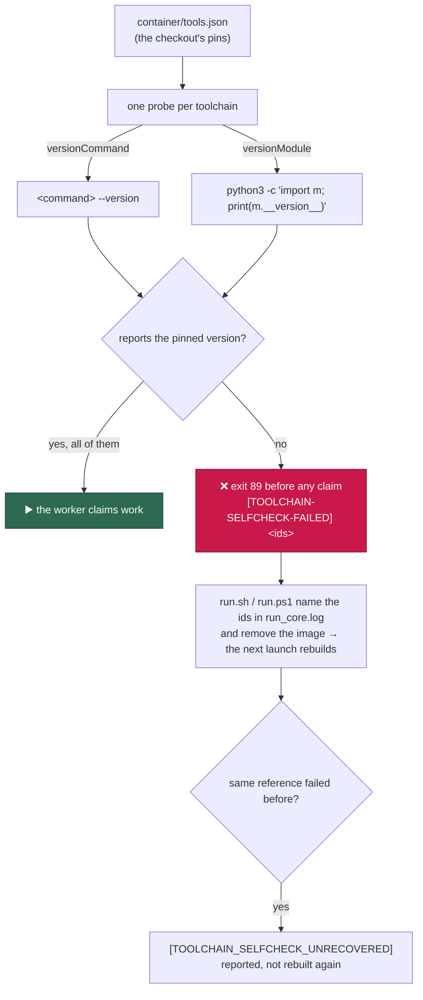

# Container start-up toolchain self-check

## Summary

Nothing verified, at start-up, that the image a host is about to use actually
provides the toolchains `container/tools.json` promises. The build-time smoke
checks run inside a `RUN` layer — a cached layer skips them, a forced-platform
build passes them under emulation — and the content-derived tag guarantees a
rebuild when the *inputs* change, not that the *running* image is the one those
inputs describe. So an `actionlint` that would not execute and a `python3` that
could not import `yaml` were both discovered by the agent mid-run, after the
claim, and the run was charged as a failure.

The worker now probes every pinned toolchain before it claims anything, and a
mismatch costs a launch instead of a run. Closes #1956.

- **`worker/deno/lib/toolchain_selfcheck.ts`** derives one probe per manifest
  toolchain — `versionCommand` run with `--version`, or `versionModule`
  imported by `python3` — runs them concurrently and bounded, and compares each
  reported version with the pin as a whole token. The probe list *is* the
  manifest, so it cannot drift from the install list.
- **`run_worker.ts`** runs it as step 4.55, before the prompt check and before
  the GitHub identity is even resolved: an image fault exits
  `TOOLCHAIN_SELFCHECK_EXIT_STATUS` (89) printing
  `[TOOLCHAIN-SELFCHECK-FAILED] <ids>`, so no issue is claimed and no attempt
  is spent.
- **`run.sh` / `run.ps1`** read the failing ids out of the container's captured
  stderr, name them in `run_core.log`, and remove the content-derived image
  reference — an absent reference is exactly the rebuild signal the launch
  reads. The removal verb rides the launch plan (`image-remove=`), so Apple
  `container`'s `image delete` is not guessed at. Exactly one rebuild per
  reference: a fault the rebuild did not clear is reported as
  `[TOOLCHAIN_SELFCHECK_UNRECOVERED]` rather than rebuilding a multi-gigabyte
  image every cycle for ever.

## Evidence

Backend/CLI only — there is no web interface to screenshot. The evidence is the
check running against this container (which *is* the image), the test suites,
and the quality gate.



**The real check against the real image** (`checkContainerToolchains` over the
committed manifest, in-image stamp set):

```text
toolchain-selfcheck: ok shellcheck 0.11.0
toolchain-selfcheck: ok actionlint 1.7.12
toolchain-selfcheck: ok cargo-deny 0.20.2
toolchain-selfcheck: ok gitleaks 8.30.1
toolchain-selfcheck: ok pwsh 7.6.5
toolchain-selfcheck: ok bats-core 1.14.0
toolchain-selfcheck: ok codespell 2.4.3
toolchain-selfcheck: ok node 24.19.0
toolchain-selfcheck: ok npm 12.0.2
toolchain-selfcheck: ok markdownlint-cli2 0.23.2
toolchain-selfcheck: ok rust 1.98.0
toolchain-selfcheck: ok semgrep 1.173.0
toolchain-selfcheck: ok pyyaml 6.0.3
toolchain-selfcheck: 13 toolchains verified against …/container/tools.json
ok=true elapsed=1986ms
```

**Cost.** All thirteen probes run concurrently, so the launch pays the slowest
one: **0.64 s** against a warm page cache and **1.99 s** on the first run after
the image is written. The same thirteen run one after another cost 1.10 s warm.
The cost is the tools' own start-up rather than the check's —
`markdownlint-cli2` alone is 1.9 s of a cold run and `semgrep` 0.65 s — and it
is paid once per launch, before any claim.

**Quality gate.** `./quality.sh` is green on every stage except `deno tests`,
whose only failure is pre-existing and unrelated:
`config_test.ts::config - a provider override beside the config applies to the
loaded agent (Issue #2062)` fails because this image installs only the `claude`
provider. Verified on a clean `origin/main` worktree — `FAILED | 106 passed | 1
failed`, the same case — so it is not this change.

## Acceptance Criteria

<!-- vibe-spec-review inputs="diff+issue-body" -->

- **met** — a container whose `actionlint` cannot execute, or whose `python3`
  cannot import `yaml`, never starts an agent run; the log names the toolchain
  and the host rebuilds on the next launch — evidence:
  `worker/deno/tests/toolchain_selfcheck_test.ts::checkContainerToolchains - a binary that cannot execute fails, naming it`,
  `…::a module python3 cannot import fails, naming it`,
  `worker/deno/tests/run_worker_test.ts::runWorker - an image missing a pinned toolchain aborts before any claim (Issue #1956)`,
  `worker/deno/tests/launcher_toolchain_selfcheck_test.ts::run.sh|run.ps1 - a failed toolchain self-check removes the cached image so the next launch rebuilds`
  — reviewer: met
- **partial** — a healthy image adds well under a second to start-up —
  evidence: measured in the image, 0.64 s for all thirteen probes warm and
  1.99 s cold (`docs/CONTAINER.md`, "The image proves itself at start-up") —
  reviewer: partial — reason: the reviewer noted nothing in the diff asserts
  the budget; the steady-state figure meets the criterion but the first run
  after an image is written does not, and the cost is the tools' own start-up,
  so it is reported rather than claimed. No wall-clock assertion was added —
  an absolute timing threshold inside a unit test is exactly what
  `CODING-STANDARDS.md` forbids.
- **met** — for each toolchain id in `tools.json`, run its version probe with a
  short timeout and compare against the pinned version — evidence:
  `worker/deno/lib/toolchain_selfcheck.ts` (`toolchainProbes`, `judge`,
  `TOOLCHAIN_PROBE_TIMEOUT_MS`);
  `worker/deno/tests/toolchain_selfcheck_test.ts::toolchainProbes - the committed manifest yields one probe per toolchain`
  — reviewer: met — reason: the reviewer recorded one deviation — the issue
  suggested the container entrypoint and the check lives in the worker driver
  instead. Deliberate: the driver runs before any claim just the same, and it
  gives concurrent bounded probes, unit tests over real functions, and no
  dependency on `jq` and `timeout` resolving on the entrypoint's PATH.
- **met** — emit one line per toolchain to the run log — evidence:
  `worker/deno/lib/toolchain_selfcheck.ts` (`lines`), `run_worker.ts` step
  4.55; test `…::a healthy image passes and names every toolchain` — reviewer:
  met
- **met** — fail the run before claiming, without charging an attempt —
  evidence:
  `worker/deno/tests/run_worker_test.ts::runWorker - an image missing a pinned toolchain aborts before any claim (Issue #1956)`
  asserts `github-user` and `loop` never ran — reviewer: met
- **partial** — record a host health failure naming the toolchain — evidence:
  `run.sh` / `run.ps1` write `toolchain-selfcheck: <image> does not provide
  <ids> … no issue was claimed` to `run_core.log`, and status 89 is named in
  the escalation vocabulary (`launcher_failure_evidence.ts`,
  `container_restart_backoff.ts`) — reviewer: partial — reason: the reviewer is
  right that no escalation is filed for the first occurrence, as the egress
  park does; it reaches a human through the ordinary consecutive-failure
  streak. Escalating on the first occurrence would mean a new failure phase
  through the backoff, green-gate and slot-accounting vocabularies, which is
  beyond this issue.
- **met** — trigger the image rebuild path on the next launch rather than
  reusing the cached tag — evidence: `run.sh`, `run.ps1`, the `image-remove`
  plan token (`container_launch.ts`), and
  `worker/deno/tests/launcher_toolchain_selfcheck_test.ts` (three cases per
  launcher) — reviewer: met
- **met** — keep the probe list in `tools.json` next to the pins so it cannot
  drift from the install list — evidence: probes are derived from
  `versionCommand` / `versionModule`, which the manifest parser already
  requires, so `container/tools.json` needed no new field; test
  `toolchainProbes - the committed manifest yields one probe per toolchain`
  fails the moment a pinned toolchain is not probed — reviewer: met
- **unrequested** — one rebuild per image reference
  (`[TOOLCHAIN_SELFCHECK_UNRECOVERED]`, the state file, the
  `VIBE_TOOLCHAIN_REBUILD_STATE` override) — reviewer: unrequested — reason:
  the tag is derived from the definition, so a rebuild produces the same tag; a
  fault the rebuild cannot clear would otherwise have every cycle removing and
  rebuilding a multi-gigabyte image for ever.
- **unrequested** — `image-remove` is now a required launch-plan token, so a
  plan without it refuses to launch — reviewer: unrequested — reason: it is the
  runtime's own removal verb (Apple `container` says `image delete`), and every
  other verb the launchers use is required the same way; a plan silently
  missing it would be a launcher that cannot rebuild and never says so.
- **unrequested** — status 89 added to the escalation's known-worker-status
  table (a new positional parameter on `knownWorkerStatuses`) — reviewer:
  unrequested — reason: without it an alert tells the reader 89 came from the
  container runtime client, which is the wrong half of the search space for a
  status the worker chose deliberately.
- **unrequested** — a manifest fault is separated from an image fault: an
  unreadable or empty `container/tools.json` exits 1 with no marker and no
  image removed — reviewer: unrequested — reason: raised by the review; a
  rebuilt image would meet exactly the same manifest, so a bad checkout must
  not cost the host its image.
- **unrequested** — `docs/CONTAINER.md` gains a section and
  `docs/DEPLOYMENT.md` two entries — reviewer: unrequested — reason: a new exit
  status, a new operator-visible log line and a new environment override are a
  documentation duty under `CODING-STANDARDS.md`.
- **unrequested** — `docs/audits/lib-sweep-coverage.json` gains a `top-up-1956`
  slice with its written record, and the new launcher suite is placed in
  `IN_GATE_SCRIPT_SUITES` — reviewer: unrequested — reason: both are repository
  gates that fail on any new `lib/` module or PowerShell-driving suite; they
  are the cost of adding either.

## Standards Review

<!-- vibe-standards-review inputs="diff+CODING-STANDARDS.md" -->

- **violation** — the new launcher suite drives `run.sh`/`run.ps1` but was in
  none of the three test manifests, so `pwsh_suites_in_the_gate_test.ts` was
  red — evidence: `worker/deno/tests/launcher_toolchain_selfcheck_test.ts` —
  reason: fixed here — it is now in `IN_GATE_SCRIPT_SUITES` with its reason and
  measured cost, and it earns the placement with a parity case that reads both
  launchers and pins the status and marker to the Deno constants.
- **violation** — the new `lib/` module was claimed by no sweep slice, so
  `lib_sweep_coverage_test.ts` was red — evidence:
  `worker/deno/lib/toolchain_selfcheck.ts` — reason: fixed here — slice
  `top-up-1956` plus the written record
  `docs/audits/security-sweep-1956-toolchain-selfcheck.md`.
- **violation** — a manifest with no `toolchains` key passed vacuously ("0
  toolchains verified" reported as a pass), contradicting the module's own
  fail-loud contract — evidence: `worker/deno/lib/toolchain_selfcheck.ts`
  (`checkContainerToolchains`) — reason: fixed here — that shape is now a
  manifest fault, covered by
  `…::a manifest with no toolchains key blames the manifest, not the image`.
- **violation** — an image removal the runtime refused discarded the runtime's
  own explanation — evidence: `run.sh`, `run.ps1` — reason: fixed here — both
  launchers now capture it and log it in the runtime's own words, as the
  refused-container-start path does.
- **violation** — the state-file read swallows its error with no comment —
  evidence: `run.sh` (`toolchain_rebuild_recorded`), `run.ps1`
  (`Test-ToolchainRebuildRecorded`) — reason: fixed here — both now say why an
  unreadable record deliberately reads as "not recorded": refusing the first
  removal over an unreadable guard would leave a broken image in place.
- **violation** — `VIBE_TOOLCHAIN_REBUILD_STATE` was undocumented — evidence:
  `run.sh`, `run.ps1` — reason: fixed here in `docs/DEPLOYMENT.md`'s launcher
  environment table, beside `VIBE_STATE_DIR`.
- **violation** — no `docs/archive/pr-summaries/pr-summary-1956.md` — evidence:
  the diff at review time — reason: fixed here; this is that file.
- **clean** — Australian English throughout; `deno fmt` and `deno lint` clean
  across 2,620 / 2,608 files; the plan and outcome contracts gain fields and
  remove none; `knownWorkerStatuses`' one production caller and its test both
  updated; tests drive real functions through injected seams plus genuine
  subprocesses and grep no source; the launcher harness keeps the state file
  inside its temp `HOME`; probe argv is a list with allowlisted command and
  module names, never a shell string; no hidden path staged; commits carry the
  issue and the run-id trailer; the decision logic is Deno and the launchers
  only react to an exit status.

Two further review findings were fixed rather than argued with: the failure
marker now goes to the error sink as well as the log (at `LOG_LEVEL=WARNING`
the launcher could otherwise not name the toolchain), and a command probe must
report the pinned version as a whole token, so `1.7.1` no longer passes against
an installed `1.7.12`.

## Test Plan

Added:

- `worker/deno/tests/toolchain_selfcheck_test.ts` (19 cases) — probe derivation
  from the committed manifest, both surfaces of a toolchain that declares both,
  the healthy verdict, a binary that cannot execute, a module that will not
  import, a wrong version on either surface, a prefix version, a timeout, a
  banner-then-version output, several failures at once, the host skip, an
  unreadable manifest, a manifest that pins nothing, and two end-to-end cases
  that spawn real stub commands.
- `worker/deno/tests/launcher_toolchain_selfcheck_test.ts` (7 cases, both
  launchers) — the image is removed and the toolchains named in `run_core.log`;
  a fault a rebuild did not clear is reported and not removed again; a clean
  run clears the record so a later fault is acted on; and both launchers
  restate the status and the marker.

Modified:

- `worker/deno/tests/run_worker_test.ts` — an image missing a pinned toolchain
  aborts before any claim on status 89; a manifest the checkout cannot supply
  fails on status 1 instead; a host run has no image to verify and starts
  normally.
- `worker/deno/tests/container_launch_test.ts` — the plan carries the runtime's
  own image-removal verb and renders it to the launchers.
- `worker/deno/tests/launcher_failure_evidence_test.ts` — 89 is named as the
  worker's own status, not blamed on the runtime client.
- `worker/deno/tests/tabletop_container_runner_test.ts` — the plan literal
  carries the new field.

Suites run: `toolchain_selfcheck` (19), `launcher_toolchain_selfcheck` (7),
`run_worker` (30), `container_launch` (69), `launcher_failure_evidence` +
`container_restart_backoff` (58), `run_sh_launcher` + `launcher_parity` (112),
`run_ps1_launcher`, `integration_test_manifest`, `pwsh_suites_in_the_gate`,
`lib_sweep_coverage`, `tabletop_container_runner` — all green — plus
`./quality.sh` (one pre-existing unrelated failure, above).
