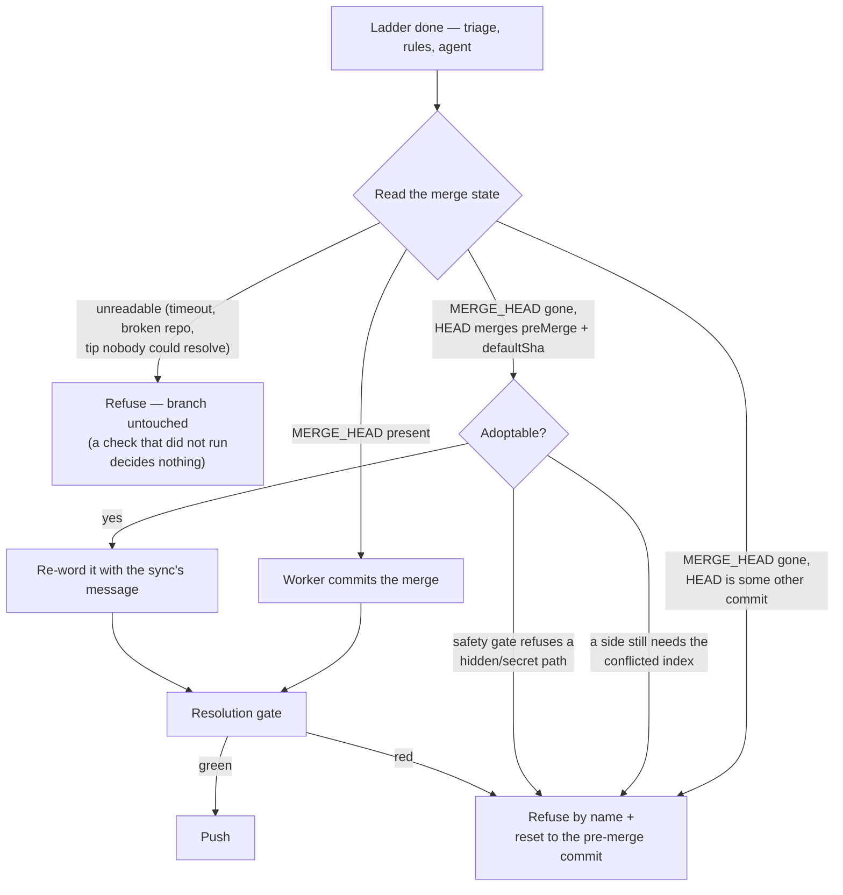

# Keep an agent-committed merge on the milestone sync path

## Summary

The milestone sync's final-mile `git commit -m …` assumed nothing else had
committed the merge. When the conflict ladder's agent rung staged **and**
committed — which `prompts/merge_conflict/prompt.md` permitted — git exited 1
with `nothing to commit, working tree clean` on **stdout**, the failure branch
read `stderr` alone and logged `git reported no stderr`, the merge was aborted
and a good resolution was thrown away. Every cycle repeated it until a human
took the branch (`stSoftwareAU/GRQ-AutoTrader#168`, four cycles, four agent
runs, over one paragraph of prose).

This change makes the merge state something the sync **reads** rather than
assumes, gives every git failure on that path git's stdout as well as its
stderr, and escalates a reason that has not changed on its second occurrence
instead of its fourth. Closes #1964.

- **`worker/deno/lib/milestone_merge_state.ts`** (new) — `readMergeCommitState`
  (in progress / already committed / determinately no merge / unknown),
  `assertAdoptedMergeIsSafe` (the pre-commit safety gate applied to a commit
  the worker did not write), and `describeGitFailure` (stderr, then stdout).
- **`git_pull.ts`** — an already-committed merge keeps its commit and takes the
  sync's message via `commit --amend`; anything else is refused by name with
  the branch reset to its pre-merge commit. A push that fails for anything but
  a repository rule is now a failed sync rather than an empty note on a
  success.
- **`milestone_branch_sync.ts` / `milestone_sync_streak.ts`** — a concluded
  reason identical to the previous **failing** cycle's escalates at two, with
  the previous conclusion quoted.
- **The prompt decides one way** — the agent stages, the worker commits; the
  guard above is belt and braces.

## Evidence

Backend/CLI only — no web interface to screenshot. The evidence is the test
suite: 11 tests in `milestone_merge_state_test.ts`, 5 in
`milestone_sync_agent_commit_test.ts` (real git remotes, clones, conflicts and
pushes throughout) and 5 in `milestone_sync_repeat_escalation_test.ts`.

The decision the sync now makes before it commits:

## Reproduction

- **symptom** — an agent rung that ran `git commit --no-edit` made the sync
  report `Failed to commit conflict resolution for 'milestone/…' (Issue
  #4260): git reported no stderr`, abort the merge and lose the resolution,
  identically every cycle
- **status** — `verified` — the regression test was run against the unfixed
  code and failed with that exact message
  (`the agent's own commit must not cost the sync its resolution: Failed to
  commit conflict resolution for 'milestone/1964' (Issue #4260): git reported
  no stderr`), and passes after the fix
- **regression test** —
  `worker/deno/tests/milestone_sync_agent_commit_test.ts::syncMilestoneBranchWithDefault - an agent that stages AND commits the merge keeps its resolution, which is gated and pushed (Issue #1964)`

## Acceptance Criteria

<!-- vibe-spec-review inputs="diff+issue-body" -->

- **met** — with an agent that runs `git commit --no-edit`, the sync proceeds
  to the gate and pushes; the log names the agent as the rung that settled the
  file — evidence:
  `worker/deno/tests/milestone_sync_agent_commit_test.ts::an agent that stages AND commits the merge keeps its resolution, which is gated and pushed`
  (asserts one merge commit of the two sides, the pushed ref, `rung === "agent"`
  and `agent` in the outcome message) — reviewer: partial — reason: the
  reviewer found the mixed case (a triage `ours`/`theirs` decision alongside an
  agent-committed merge) still failing at `applyConflictPlan`; the state is now
  read **before** the plan is applied and that case is refused by name with the
  branch restored, covered by
  `…an agent that commits while another file still needs the conflicted index is refused`
- **met** — a stdout-only git failure on the sync path is logged with that
  stdout; `git reported no stderr` can no longer appear when git printed
  anything at all — evidence:
  `worker/deno/tests/milestone_merge_state_test.ts::describeGitFailure - a git failure that printed only on stdout is described with that stdout`,
  and the literal is gone from every sync-path site (`git_pull.ts`,
  `milestone_conflict_git.ts`, `milestone_conflict_ladder.ts`,
  `milestone_rollback.ts`, `milestone_sync_pr.ts`) — reviewer: partial —
  reason: the reviewer listed those five files as still stderr-only; each was
  converted after the review
- **partial** — two consecutive cycles failing for the same reason escalate
  with the diagnostic; four identical cycles cannot happen — evidence:
  `worker/deno/tests/milestone_sync_repeat_escalation_test.ts::two cycles failing for the identical reason escalate on the second`
  and `…a failure, a success, then the same failure is a first failure again` —
  reviewer: partial — reason: the rule covers the plain-failure lane only. A
  conflict-lane failure is deliberately governed by Issue #1778's attempt
  budget (three concluded failures, then a roll-back) and a merge-gate failure
  already escalates on its *first* occurrence, so neither lane can reach four
  identical cycles either — but neither compares reasons, and rewiring #1778's
  budget was out of scope here
- **partial** — `./quality.sh` passes — evidence: full gate run after the final
  edit; every check green (`completeness checks`, `semgrep`, `markdownlint`,
  `mermaid`, `deno lint`, `deno type check`, `deno fmt` and the chokepoint
  scans) except `deno tests`, which reports
  `21150 passed | 2 failed` — reviewer: missing — reason: the two failures are
  `tests/provider_auto_runtime_test.ts`, which refuses because this container
  image installs only the `claude` provider and the test needs `codex`. They
  are environmental and pre-existing: the same two fail on the base commit
  `9deb97b` in a clean worktree, with nothing from this diff in their import
  graph. Every test this change touches passes (1317 across the
  `milestone*`, `git_pull*`, `*conflict*`, `rollback` and `pre_commit`
  suites)
- **unrequested** — a push that fails for anything other than a repository
  rule now fails the sync instead of returning an empty note
  (`git_pull.ts`, `pushSyncedMilestoneBranch`) — reviewer: unrequested —
  reason: the issue asked only that push failures quote stdout, but the
  standards reviewer showed the old silence parked an unpushed merge as
  "synced" — `recordSuccess` wrote the tip it never reached, so the cadence
  guard skipped the branch every cycle and no escalation could fire
- **unrequested** — the refusal path resets the branch to its pre-merge commit
  (`git_pull.ts`, `refuseResolution`) — reviewer: unrequested — reason: the
  issue asked only for a failure "by name"; the reset keeps the documented
  invariant that a refused sync leaves the branch exactly where it stood, and
  it is skipped whenever the state could not be read
- **unrequested** — `describeGitFailure` takes a head/tail line window
  (`milestone_merge_state.ts`) — reviewer: unrequested — reason: it lets the
  checkout failure keep its existing first-six-lines shape while there is one
  helper rather than two spellings of the same fallback

## Standards Review

<!-- vibe-standards-review inputs="diff+CODING-STANDARDS.md" -->

- **violation** — the new `lib/` module was claimed by no sweep slice, so
  `check:manifests` went red — evidence: `docs/audits/lib-sweep-coverage.json`
  — reason: registered in this diff
- **violation** — a failed push was reported as a note on the success path, so
  an unpushed merge was recorded as synced — evidence: `git_pull.ts:305` (as
  reviewed) — reason: fixed here; the push failure is now the sync's failure
- **violation** — an adopted agent commit skipped the pre-commit safety gate
  (`git add -A` finds a clean tree, so the index inspection sees nothing) —
  evidence: `git_pull.ts:927` (as reviewed) — reason: fixed by
  `assertAdoptedMergeIsSafe`, which classifies the commit's own changed paths;
  covered by two tests
- **violation** — a `MERGE_HEAD` probe that failed for any reason read as "no
  merge in progress", and the caller's response was a hard reset — evidence:
  `milestone_merge_state.ts:139` (as reviewed) — reason: fixed; only exit 1 is
  a determinate absence, everything else is `unknown` and resets nothing
- **violation** — a failed `commit --amend` left the agent's un-reworded merge
  on the branch while the sibling path reset — evidence: `git_pull.ts:934` (as
  reviewed) — reason: fixed; both paths now restore the pre-merge commit
- **violation** — `GitOutput` re-declared the exported `GitCommandOutput` —
  evidence: `milestone_merge_state.ts:30` (as reviewed) — reason: fixed, the
  type is now `Result<GitCommandOutput>`
- **violation** — the module doc claimed every sync-path caller read the same
  helper while `milestone_rollback.ts` kept its own stderr-only spelling —
  evidence: `milestone_rollback.ts:321` — reason: fixed; `gitDetail` reads
  stdout too and the doc no longer over-claims
- **violation** — the prompt's parenthetical described a rewrite the PR
  merge-conflict pass does not perform — evidence:
  `prompts/merge_conflict/prompt.md:110` — reason: reworded to what holds for
  both consumers
- **violation** — `isRepeatedFailureReason` was a new exported function with no
  direct test, and compared against a `lastAttempt` that survives a success —
  evidence: `milestone_sync_streak.ts:40` — reason: both fixed; it now takes
  the consecutive-failure count and has its own unit test plus an end-to-end
  fail/succeed/fail case
- **clean** — Australian English throughout; no hidden or key-material path
  staged; the run-id trailer and issue reference on the commit; tests call real
  code against real git repositories and assert on outcomes, pushed refs and
  commit parents; no test deleted or commented out; no wall-clock thresholds,
  sleeps or polling; `Result<T>` and `@std/assert` conventions kept; each new
  module paired with its test file; docs and prompt updated in the same change

## Test Plan

- `worker/deno/tests/milestone_merge_state_test.ts` (new, 11 tests) —
  `describeGitFailure` over stdout-only, both-streams, silent and
  spawn-failure results and both line windows; `readMergeCommitState` over a
  merge in progress, an agent-committed merge, an aborted merge, a commit on
  top of the merge, an unreadable default tip and an unreadable repository;
  `assertAdoptedMergeIsSafe` over a clean merge, one carrying `.env`, and a
  check that could not run.
- `worker/deno/tests/milestone_sync_agent_commit_test.ts` (new, 5 tests) — an
  agent that stages and commits (the regression test for the reported fault);
  an agent that only stages; an agent that aborts the merge; an agent that
  commits a hidden path; an agent that commits while a triage decision still
  needs the conflicted index.
- `worker/deno/tests/milestone_sync_repeat_escalation_test.ts` (new, 5 tests) —
  two identical cycles escalating on the second; changing reasons waiting for
  the ordinary threshold; one comment across four identical cycles; a success
  breaking the streak; `isRepeatedFailureReason`'s own edge cases.
- Regression: the full `milestone*`, `git_pull*`, `*conflict*`, `rollback` and
  `pre_commit` suites (1317 tests, green), then `./quality.sh` — green but for
  two pre-existing `provider_auto_runtime_test.ts` failures this container
  image causes, which also fail on the base commit.
