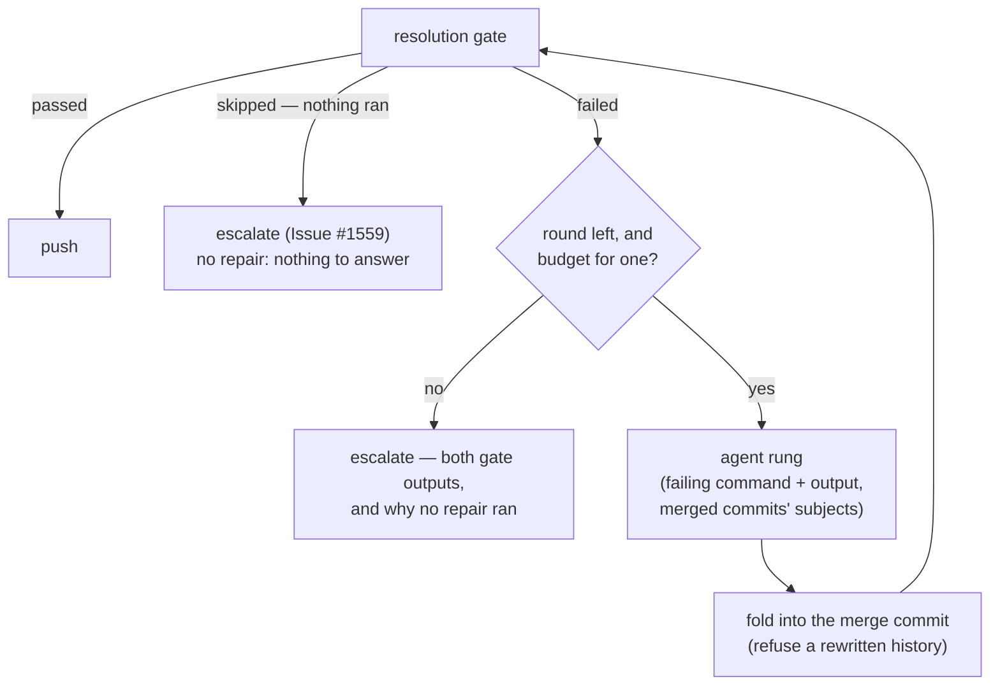

## Summary

A milestone sync whose textual conflicts are all resolved can still produce a
tree that does not compile: the default branch changed an interface the
milestone branch implements somewhere no hunk overlapped, so git merged every
file cleanly and the verification gate failed in a file it never reported as
conflicted. That failure went straight to a human. It now goes back to the
resolution agent — bounded, on the same clone, carrying the gate's own output —
and only a tree the gate still refuses reaches a human. Closes #1965.

- **`worker/deno/lib/milestone_gate_repair.ts`** (new) — runs the verification,
  offers a failure back to the agent rung for at most two rounds a cycle, folds
  whatever the agent stages *or* commits into the merge commit, and re-runs the
  gate. A repair that rewinds the branch off the merge commit is refused rather
  than absorbed: that is a side-pick arriving as history.
- **`git_pull.ts`** — the gate now runs before the push path (which resets a
  refused merge away at once, so a resolution reset away cannot be repaired),
  and the escalation carries both gate outputs.
- **Budget** — a repair spends what is left of the cycle's *single* agent grant
  (Issue #1693), not a fresh one. A grant that cannot cover one is refused by
  name and the escalation says the repair was never attempted.
- **Record** — the merge commit, the sync's log line and the report comment all
  name the repair: which files each round touched, and that the gate passed
  afterwards.

## Evidence

Backend/CLI change with no web interface, so the evidence is the test run, not
a screenshot.



Test output for the new suites (`deno test --allow-all`):

```text
tests/milestone_sync_gate_repair_test.ts   ok | 6 passed | 0 failed (23s)
tests/milestone_gate_repair_test.ts        ok | 12 passed | 0 failed (11s)
tests/milestone_gate_repair_prompt_test.ts ok | 5 passed | 0 failed (7ms)
```

The headline fixture was watched failing against the unfixed code first
(worktree at `271ae85`, same test file): it escalated with
`Refused to push the merge of 'main' into 'milestone/1965' … error[E0046]: not
all trait items implemented, missing: find_by_client_order_id` — the issue's
symptom exactly — and passes after the change.

## Acceptance Criteria

<!-- vibe-spec-review inputs="diff+issue-body" -->

- **met** — The trait-method fixture syncs without a human, and the merge commit
  names the repaired file and the rung that repaired it — evidence:
  `worker/deno/tests/milestone_sync_gate_repair_test.ts::a gate failure in a
  file git never conflicted is repaired by the agent rung and pushed` — reviewer: met
- **met** — A repair that fails the gate escalates once with both gate outputs;
  no second repair is attempted in the same cycle — evidence:
  `worker/deno/tests/milestone_sync_gate_repair_test.ts::a repair the gate still
  refuses escalates once, with both gate outputs` — reviewer: partial — reason:
  the reviewer read the checkbox literally (one repair) against the implemented
  bound of two; the issue's own comment amends it to "up to two repair rounds
  per cycle before escalating with both gate outputs", which is what shipped —
  the cycle still escalates exactly once, and the test asserts the rung is never
  asked a third time
- **met** — `./quality.sh` passes — evidence: full gate run after the final
  edit — reviewer: missing — reason: the reviewer saw only the diff and could
  not run the gate to completion; it was run here (see Test Plan)
- **partial** — the repair prompt carries the *full* compiler output, all errors
  (issue comment) — evidence: `worker/deno/lib/prompt_builder.ts`
  `buildGateRepairSection` carries `MergeGateOutcome.output` verbatim —
  reviewer: partial — reason: the gate captures a 40-line/4000-char **tail** at
  `milestone_merge_gate.ts` before this code sees it, which matches the issue
  body ("its output tail … not the whole log"); widening that capture is a
  change to the gate's own limits and affects every escalation, so it was left
  out of scope
- **missing** — the repair prompt carries the diff of both sides for the types
  involved (issue comment) — reviewer: missing — reason: the prompt carries the
  merged-in commits' subjects and directs the agent to read both sides with
  `git log`/`git show` in the clone it is already running in; shipping
  pre-computed diffs for "the types involved" needs a type-extraction step the
  issue does not specify
- **unrequested** — the repair block tells the agent to add or update the tests
  its reconciliation needs — reviewer: unrequested — reason: traceable to the
  issue comment's own account of the #304 repair ("add two tests"); kept because
  a semantic reconciliation that only compiles is the failure mode being fixed
- **unrequested** — `now`/`promptsDir` seams on `MilestoneConflictAgentBinding`
  and the export of `stageAgentResolution` — reviewer: unrequested — reason:
  injection seams the tests need (the repo forbids `Deno.env` mutation in
  tests); `stageAgentResolution` is reused rather than copied
- **unrequested** — `docs/audits/security-sweep-1965-milestone-gate-repair.md`
  and the `lib-sweep-coverage.json` slice — reviewer: unrequested — reason:
  required by the repo's own `check:manifests` gate for any new `lib/` module

## Standards Review

<!-- vibe-standards-review inputs="diff+CODING-STANDARDS.md" -->

- **violation** — a test mutated process-wide state (`Deno.env.set`) — evidence:
  `worker/deno/tests/milestone_gate_repair_prompt_test.ts:175` — reason: fixed
  here; `bindMilestoneConflictAgent` gained the `promptsDir` seam the runner
  already had, and the env hack is gone
- **violation** — the new `lib/` module was claimed by no sweep slice — evidence:
  `docs/audits/lib-sweep-coverage.json` — reason: fixed here; slice
  `top-up-1965` and its written record were added, and `check:manifests` passes
- **violation** — a repair that ran and failed was reported as "not attempted" —
  evidence: `worker/deno/lib/milestone_gate_repair.ts` `stop()` — reason: fixed
  here; only a rung that was never asked (no agent, no merge commit, no budget)
  is `not-attempted`, covered by four new unit tests
- **violation** — a non-zero `git log` exit was discarded silently — evidence:
  `worker/deno/lib/milestone_gate_repair.ts` `readMergedCommitSubjects` —
  reason: fixed here; both degradations now warn, and a test asserts they do
- **violation** — 76 lines of orchestration inline in an already long
  `syncMilestoneBranchWithDefault` — evidence: `worker/deno/lib/git_pull.ts` —
  reason: fixed here; extracted to `runGateWithRepair`, leaving the sync a call
  site
- **violation** — the new module had no companion test file, and its failure
  branches were untested — evidence: `worker/deno/lib/milestone_gate_repair.ts` —
  reason: fixed here; `worker/deno/tests/milestone_gate_repair_test.ts` covers
  all of them plus `readMergedCommitSubjects`
- **violation** — catch-and-ignore in a test's temp-dir cleanup — evidence:
  `worker/deno/tests/milestone_sync_gate_repair_test.ts:166` — reason: fixed
  here; a tree that cannot be removed is reported
- **violation** — the repair-round list was rendered twice — evidence:
  `worker/deno/lib/milestone_sync_conflict.ts:53` and
  `worker/deno/lib/milestone_gate_repair.ts:376` — reason: fixed here; one
  `listGateRepairRounds`, two sinks
- **violation** — `isGateRepairBudgetExhausted` lacked `@param`/`@returns` —
  evidence: `worker/deno/lib/milestone_gate_repair.ts:80` — reason: fixed here
- **violation** — the PR summary was absent — evidence: this file — reason:
  fixed here
- **clean** — Australian English throughout; real tests (real git repositories,
  a gate that reads the merged tree, no source-grep assertions); no wall-clock
  sleeps or absolute timing thresholds (the clock is injected); prompt-injection
  hygiene (the gate output and commit subjects are fenced and named in the
  boundary instruction); the prompt template edited in place with
  `REPAIR_CONTEXT` registered optional so operator overrides stay valid; every
  new interface field optional, nothing removed; no hidden path staged; run-id
  trailer present

Two further spec-review findings were also fixed rather than argued: a
`skipped` verification (a repo defining no checks) no longer buys agent repair
runs — it is refused under Issue #1559 as before, with a test — and each repair
round now reports the files *it* changed, measured against the tree it started
from, so round two no longer inherits round one's list.

## Test Plan

- `worker/deno/tests/milestone_sync_gate_repair_test.ts` (new, 6 cases) — the
  trait-method fixture repaired and pushed; a repair the agent commits itself
  folded into the merge commit; a repair the gate still refuses escalating once
  with both outputs and nothing pushed; a grant too small reporting a repair
  never attempted; a repository with no verification buying no repair run; a
  sync with no agent rung unchanged.
- `worker/deno/tests/milestone_gate_repair_test.ts` (new, 12 cases) — every
  failure branch of the loop (no rung, no merge commit, run failed, run ended by
  the worker, repair changed nothing, budget refused), the two-round bound, a
  second round finishing what the first started, a history rewrite refused, a
  `skipped` re-run buying no further round, and `readMergedCommitSubjects`
  including its degraded paths.
- `worker/deno/tests/milestone_gate_repair_prompt_test.ts` (new, 5 cases) — the
  repair prompt's content and fencing, an ordinary resolution rendering no
  repair block, and the grant ledger (a repair gets what is left, a repair the
  grant cannot cover is refused by name, an unbounded pass refuses none).
- `worker/deno/tests/milestone_sync_conflict_test.ts` (2 cases added) — the
  report comment names a repair, and says nothing when there was none.
- Full `./quality.sh` after the final edit: every stage passes except
  `deno tests`, which reports two failures that pre-date this change and are
  environmental —
  `agent_provider_test.ts::the per-run provider override beats the configured
  file value (Issue #2062)` and
  `config_test.ts::the per-run provider override applies to the loaded agent
  (Issue #2062)`, both raising *"The running container image did not install the
  'deepseek' coding-agent provider. Installed: claude."* Both were reproduced
  failing identically on the base commit `271ae85` in a clean worktree, with no
  code from this change in the tree. Nothing else in the suite fails
  (21,585 passed).
