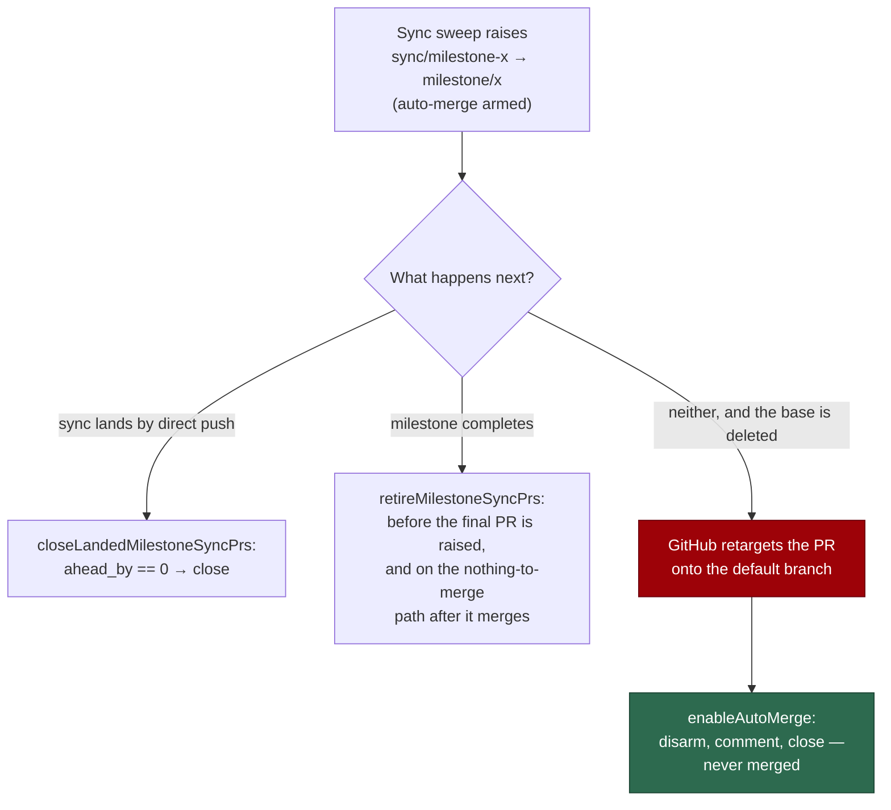

## Summary

A milestone sync PR merges the default branch **into** a milestone branch, so
it is the one PR the fleet raises that must never target the default branch.
GitHub does not close the PRs pointing at a branch it deletes on merge — it
**retargets** them to the default branch, carrying approvals and auto-merge
arming with them. `VibeCoder#1957` reached `main` that way fourteen minutes
after its milestone's final PR merged: a squash remnant whose only diff
reverted `docs/audits/lib-sweep-coverage.json` to a pre-#1940 state, approved a
minute later, and stopped from landing only by an unrelated red shard.

New `worker/deno/lib/milestone_sync_pr_retirement.ts` closes the sync PR — and
deletes its branch — at each of the three moments it stops being useful, and
the arming chokepoint refuses one that slipped through. Closes #1967.

## Evidence

Backend/CLI change with no web interface to screenshot. The evidence is the
test suites below plus the full quality gate (see **Test Plan**).

- **Milestone completion** (`worker/deno/lib/milestone_completion.ts`) retires
  the sync PR before raising the final PR, on the "complete with nothing to
  merge" path, and again once the final PR is confirmed merged.
- **The sync sweep** (`worker/deno/lib/milestone_branch_sync.ts`) closes a sync
  PR the direct push has made redundant (`ahead_by == 0` on the compare
  endpoint — not the PR's file list, which GitHub computes asynchronously).
- **The arming chokepoint** (`worker/deno/lib/pr_auto_merge.ts`) — the one door
  the priority 1.65 sweep, the PR-maintenance scan, the CI-fix re-arm and
  `pr_manager` all go through — disarms, comments and closes a
  same-repository `sync/milestone-*` head found on the default branch, before
  either GitHub's `--auto` or the unprotected-base direct merge is reached.

## Reproduction

- **symptom** — a `Sync main into milestone/<name>` PR left open when the
  milestone's final PR merged was retargeted by GitHub to `main` with its
  approval and auto-merge arming intact, its diff reverting the milestone's
  own work
- **status** — `partial` — three regression tests were observed failing against
  the unfixed code and passing after the fix (milestone completion left the
  sync PR open; the sync sweep left an empty sync PR armed; the arming path
  armed a sync PR based on `main`). `reason:` GitHub's own retarget cannot be
  performed from a unit test, so the retargeted state is stipulated as a
  fixture (`baseRefName: "main"`) rather than produced by deleting a branch.
- **regression test** —
  `worker/deno/tests/pr_auto_merge_sync_pr_retarget_test.ts::enableAutoMerge - a sync PR retargeted onto the default branch is closed, never merged (Issue #1967)`,
  `worker/deno/tests/milestone_sync_pr_retirement_test.ts::checkAndHandleMilestoneCompletions - the open sync PR is closed before the final milestone PR is raised (Issue #1967)`

## Acceptance Criteria

<!-- vibe-spec-review inputs="diff+issue-body" -->

- **partial** — close every open sync PR before the final milestone PR is
  raised and again after it merges, deleting the branch, with a comment —
  evidence: `worker/deno/lib/milestone_completion.ts` (pre-raise, post-merge
  and nothing-to-merge paths), `worker/deno/tests/milestone_sync_pr_retirement_test.ts::the open sync PR is closed before the final milestone PR is raised`
  — reviewer: partial — reason: the pre-raise retirement runs only on the cycle
  that raises the final PR. Retiring on every later cycle would close and
  re-raise the sync while a summary PR waits behind a red check, leaving the
  milestone branch unable to take the default branch at all; the residual
  window is covered by the chokepoint refusal instead.
- **met** — when a sync lands by direct push, close the PR in the same cycle
  rather than leaving auto-merge armed — evidence:
  `worker/deno/lib/milestone_branch_sync.ts` + `closeLandedMilestoneSyncPrs`,
  `worker/deno/tests/milestone_sync_pr_retirement_test.ts::syncMilestoneBranches - a sync PR left empty by a direct push is closed the same cycle`
  — reviewer: met
- **met** — defence in depth: the maintenance scans close (never merge) a
  fleet-authored `sync/milestone*` head based on the default branch, and post
  why — evidence: `worker/deno/lib/pr_auto_merge.ts` (the chokepoint every scan
  calls), `worker/deno/tests/pr_maintenance_test.ts::an already-armed sync PR is not skipped: it reaches the close path`
  — reviewer: partial — reason: the reviewer saw the refusal in `enableAutoMerge`
  while `ensureAutoMergeOnOpenPrs` still skipped already-armed PRs, so the
  incident shape could not reach it. That skip now exempts sync-shaped heads,
  which is what the added scan test covers.
- **met** — regression tests: milestone completion with an open sync PR closes
  it first; a retargeted sync PR is refused — evidence:
  `worker/deno/tests/milestone_sync_pr_retirement_test.ts` (17 cases),
  `worker/deno/tests/pr_auto_merge_sync_pr_retarget_test.ts` (6 cases),
  `worker/deno/tests/pr_maintenance_test.ts::an already-armed sync PR is not skipped`
  — reviewer: partial — reason: the reviewer wanted a test driving the scan
  itself rather than only the chokepoint; that test was added afterwards.
- **partial** — no open sync PR survives its milestone's final merge —
  evidence: `worker/deno/lib/milestone_completion.ts` retires on three
  completion paths — reviewer: partial — reason: a sync PR raised while the
  final PR waits is retired by the next cycle rather than before the merge; in
  that window the chokepoint refusal, not the retirement, is what keeps it off
  the default branch.
- **partial** — a sync PR whose base disappears can never be merged into the
  default branch by the fleet's own auto-merge — evidence:
  `worker/deno/lib/pr_auto_merge.ts` refuses to arm and closes;
  `closeSyncPr` issues `gh pr merge --disable-auto` before the close —
  reviewer: partial — reason: the fleet now neither arms such a PR nor leaves
  one armed once it sees it, but GitHub owns an arming granted before the
  retarget; if its checks go green before the next sweep, GitHub merges it. The
  window is one sweep, and nothing in the fleet contributes to it.
- **unrequested** — `sync-base-unreadable` deferral and the `sync_pr_retired`
  merge outcome (`worker/deno/lib/pr_auto_merge.ts`,
  `worker/deno/lib/merge_block_escalation.ts`) — reviewer: unrequested —
  reason: the refusal needs two non-arming exits — "could not tell" and
  "already closed" — and without them both classify as `merge_error`, which
  escalates a healthy PR to `needs-human`.
- **unrequested** — the same-repository check on the close path
  (`worker/deno/lib/pr_auto_merge.ts`) — reviewer: unrequested — reason: the
  issue says "fleet-authored"; a fork names its own branches (Issue #1249), so
  head ownership is the evidence available at the chokepoint, and an unreadable
  answer defers rather than arming.
- **unrequested** — retirement on the "complete with nothing to merge"
  completion path (`worker/deno/lib/milestone_completion.ts`) — reviewer:
  unrequested — reason: it is the path that actually runs after the final PR
  merges (the branch is then 0 ahead), so without it the post-merge half of the
  first criterion would be unreachable.
- **unrequested** — `docs/INTERNALS.md` and `docs/MERGE.md` sections, and the
  `docs/audits/lib-sweep-coverage.json` entry — reviewer: unrequested —
  reason: repo convention (a code change owes a docs change) and the
  completeness gate, which fails on an unregistered `lib/` module.

## Standards Review

<!-- vibe-standards-review inputs="diff+CODING-STANDARDS.md" -->

- **violation** — the new `classifyMergeAttempt` branch was untested —
  evidence: `worker/deno/lib/merge_block_escalation.ts:102` — reason: fixed
  here; `worker/deno/tests/merge_block_escalation_test.ts` now covers
  `sync_pr_retired` in both `classifyMergeAttempt` and `handleMergeAttempt`.
- **violation** — the new suite mutated the process-global base-protection
  memo without the reset seam — evidence:
  `worker/deno/tests/pr_auto_merge_sync_pr_retarget_test.ts:18` — reason: fixed
  here; each case now calls `_resetBaseProtectionMemo()`, as the three sibling
  `enableAutoMerge` suites do.
- **violation** — no `docs/archive/pr-summaries/pr-summary-1967.md` — evidence:
  the repo's last five merges each add one — reason: fixed here; this file.
- **violation** — the new mapping in `attemptMerge` was untested — evidence:
  `worker/deno/lib/pr_maintenance.ts:1662` — reason: partly fixed; the scan
  route is now covered end to end by
  `tests/pr_maintenance_test.ts::an already-armed sync PR is not skipped`,
  which drives `closed_retargeted_sync` through the mapping.
- **clean** — Australian English throughout; TDD with real function calls and
  no source-grep assertions; fail-loud handling (every `gh` failure logs a
  `WARNING` naming the PR and declines to count it, an unreadable comparison
  or default branch closes and arms nothing); no hidden paths staged; module ↔
  test pairing; `deno fmt`, `deno lint`, `deno check` and
  `deno task check:manifests` all clean; the new module registered in the lib
  sweep ledger.

## Test Plan

- `worker/deno/tests/milestone_sync_pr_retirement_test.ts` — 17 cases: the
  retarget predicate in both directions, the three closures (including a
  refused close, an unreadable comparison and a PR that still carries
  commits), and three end-to-end cases driving
  `checkAndHandleMilestoneCompletions` and `syncMilestoneBranches`.
- `worker/deno/tests/pr_auto_merge_sync_pr_retarget_test.ts` — 6 cases: the
  retargeted sync PR is disarmed and closed; a sync PR on its milestone base
  and an ordinary PR into the default branch are armed as before; a fork's
  sync-shaped head is neither closed nor armed; an unreadable default branch
  defers; a refused close fails loud instead of arming.
- `worker/deno/tests/pr_maintenance_test.ts` — the already-armed sync PR is no
  longer skipped and reaches the close path, while an ordinary armed PR still
  is.
- `worker/deno/tests/merge_block_escalation_test.ts` — `sync_pr_retired` is
  classified `await_checks` and never escalated.
- Full gate: `./quality.sh` — all checks pass except `deno tests`, which
  reports two failures in `tests/provider_auto_runtime_test.ts`
  ("The running container image did not install the \"codex\" coding-agent
  provider"). Both are environmental and pre-existing — that file and
  `lib/agent_provider.ts` are untouched by this change (they arrived with
  #1940) — and they fail identically on the unmodified base commit.
