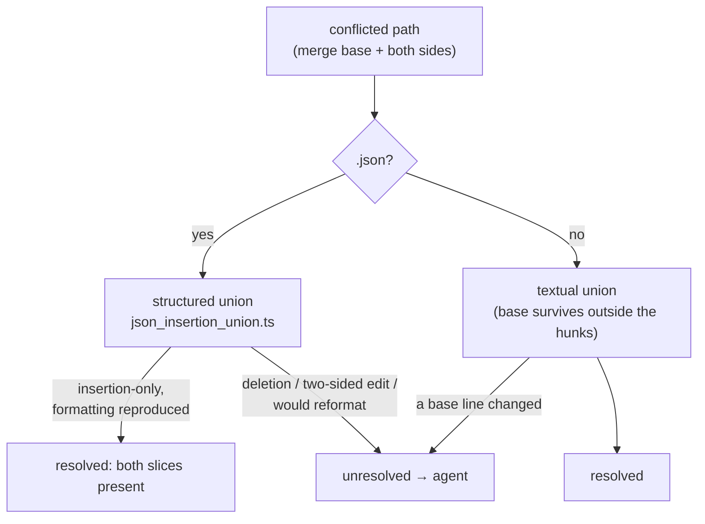

# Concurrent lib-sweep top-ups no longer collide, and two appended slices union

## Summary

Two runs adding modules under the ledger roots in the same window both read the
ledger's tail, both allocated the next chunk id, and their insertions conflicted
*inside* the appended object — a shape the textual `both-inserted` union cannot
resolve. The hand resolution kept one slice, dropped the other, and `main` went
red. This fixes both halves. Closes #1968.

- **A conflicted `.json` is unioned by value, not by text.** New
  `worker/deno/lib/json_insertion_union.ts` parses the merge base and both
  sides, merges insertion-only (array items matched by value, object keys
  neither side deleted), and re-serialises in the file's own formatting. It
  refuses a deletion, a two-sided edit, or a file it would reformat — the merge
  base must re-serialise to its own bytes before any union is attempted.
  `both_inserted_conflict_rule.ts` routes every `.json` path through it; the
  line-based checks stay for every other format, because appending to a JSON
  array also edits the previous entry's closing line to add a comma.
- **A top-up chunk id is derived from its issue.** `topUpChunkId(issue)` →
  `top-up-<issue>`, so two runs cannot pick the same id: two runs are never
  working the same issue. `parseCoverageLedger` now refuses a repeated `chunk`,
  a repeated `issue`, and a `top-up-<n>` id that names another slice's issue —
  the collision fails on the PR that introduces it, not after the merge.
- **The three chunk ids the tree already claimed twice were renamed.** `12n`,
  `12o` and `12p` each named two slices (#1846/#1822, #1885/#1823,
  #1862/#1859), and #1938's record still cited the id #1966 renamed away from
  it. All are now `top-up-<issue>`, with their written records and every
  cross-reference updated.

## Evidence

Backend/CLI change with no web interface, so no screenshot applies. What was
tested instead:

- **The conflict fixture is real, not invented.** Two scratch branches each
  appended a slice to a ledger and `git merge` produced the conflict; that exact
  text (markers and all) is the fixture in
  `both_inserted_conflict_rule_test.ts`.
- **End-to-end on the real 68 KB ledger.** The same two-branch merge was run
  against `docs/audits/lib-sweep-coverage.json` itself and the conflicted file
  plus `git show :1:` were fed to `resolveBothInserted`: `resolved`, 41 slices,
  both `top-up-1940` and `top-up-1943` present, no conflict marker, and the
  result parses through `parseCoverageLedger`.
- **Targeted suites.** `deno test tests/json_insertion_union_test.ts
  tests/both_inserted_conflict_rule_test.ts tests/lib_sweep_coverage_test.ts` —
  60 passed, 0 failed. `deno task check:manifests` — 639 passed.
- **Full gate.** `./quality.sh` passes every check except two
  `provider_auto_runtime_test.ts` cases that fail on this container for an
  unrelated reason — the image installed only the `claude` provider, so
  `assertImageInstalledProvider` throws `The running container image did not
  install the "codex" coding-agent provider`. Unrelated to this diff and
  reproducible on the unmodified tree.

## Reproduction

- **symptom** — two branches each append a top-up slice to
  `docs/audits/lib-sweep-coverage.json`; the merge conflicts inside the appended
  object, the `both-inserted` rule defers, and the hand resolution drops one
  slice, so `every non-test module under the ledger roots is claimed by exactly
  one sweep slice` fails on the merged tip
- **status** — `verified` — the regression test was run against the unfixed
  rule (`git show HEAD:…/both_inserted_conflict_rule.ts` restored in place) and
  failed with `unresolved`, then passed after the fix
- **regression test** —
  `worker/deno/tests/both_inserted_conflict_rule_test.ts::resolveBothInserted - two appended ledger slices are unioned, not dropped (Issue #1968)`

## Acceptance Criteria

<!-- vibe-spec-review inputs="diff+issue-body" -->

- **met** — two branches that each add a top-up slice reconcile automatically
  with both slices present — evidence: `worker/deno/tests/both_inserted_conflict_rule_test.ts::resolveBothInserted - two appended ledger slices are unioned, not dropped (Issue #1968)` — reviewer: met — the reviewer reproduced the conflict on the real ledger and confirmed both slices survive
- **met** — a ledger with two slices sharing a chunk id fails
  `lib_sweep_coverage_test` on the PR that introduces it — evidence: `worker/deno/tests/lib_sweep_coverage_test.ts::parseCoverageLedger - two slices sharing a chunk id fail loud (Issue #1968)` — reviewer: met
- **met** — a ledger with one module claimed twice fails
  `lib_sweep_coverage_test` — evidence: `worker/deno/tests/lib_sweep_coverage_test.ts::diffCoverage - a module claimed by two slices is reported` and the real-ledger test at `:449` — reviewer: met — pre-existing `diffCoverage` behaviour, unchanged and still enforcing
- **met** — extend validation to refuse duplicate `chunk` ids and duplicate
  `issue` numbers — evidence: `worker/deno/lib/lib_sweep_coverage.ts::duplicateSliceIds` and the throw in `parseCoverageLedger` — reviewer: met
- **met** — teach the both-inserted rule a JSON case: parse both sides, union,
  re-serialise with the file's formatting, keep the "does not parse → defer"
  guard for everything else — evidence: `worker/deno/lib/json_insertion_union.ts` and `both_inserted_conflict_rule.ts:185` — reviewer: met — the reviewer noted the union keys on structural value rather than on `issue`; behaviourally equivalent for this ledger, and a duplicate `issue` is now caught by the validator
- **partial** — make the slice id collision-free *by construction* — evidence:
  `worker/deno/lib/lib_sweep_coverage.ts::topUpChunkId`, every top-up slice renamed — reviewer: partial — reason: nothing forces a new slice to use the helper; a run that picks `12ah` still parses. The reviewer's gap about a `top-up-<n>` id naming a different issue was closed after the review (`mismatchedTopUpIds`), but convention plus duplicate detection is still not literal construction
- **missing** — the stated alternative: re-run the coverage test in the
  branch-update pass after any merge that touched the ledger — reviewer:
  missing — reason: the issue offers it as an alternative to the two fixes that
  landed, so it was deliberately not implemented
- **partial** — the issue notes `prompts/security_scan/prompt.md` carries no
  uniqueness rule — evidence: `docs/SECURITY-SCAN.md` ("Adding a top-up slice"), the ledger's own `description`, and the `chunk` field's JSDoc — reviewer: partial — reason: that prompt's chunk list is the *scan* plan, not the ledger, so the convention was documented where a run adding a slice actually reads it
- **unrequested** — the union is a general three-way JSON merge for every
  `.json` the rule matches, not only this ledger — reviewer: unrequested —
  reason: a rule keyed to one filename would be dead weight the moment another
  audit ledger appears; the cost is that a `.json` whose base does not
  round-trip now defers where the text union could once succeed, which is the
  safe direction and is covered by a test
- **unrequested** — renaming #1938's `12ab` (a unique id) to `top-up-1938` —
  reviewer: unrequested — reason: its written record still cited `12aa`, the id
  #1966 renamed away from it, so the rename removed a live drift between the
  ledger and the record
- **unrequested** — `docs/audits/security-sweep-1968-json-insertion-union.md`
  and its ledger slice — reviewer: unrequested — reason: required by the
  repository's own coverage invariant for any new `lib/` module

## Standards Review

<!-- vibe-standards-review inputs="diff+CODING-STANDARDS.md" -->

- **violation** — dead code: the textual JSON well-formedness guard inside
  `resolveBothInserted` became unreachable once `.json` returned earlier —
  evidence: `worker/deno/lib/both_inserted_conflict_rule.ts:226` (pre-fix) —
  reason: fixed here; the call was removed and `unionIsWellFormed` kept as the
  export the milestone ladder rung still uses
- **violation** — stale doc: "both rungs apply the same guard" no longer held —
  evidence: `worker/deno/lib/both_inserted_conflict_rule.ts:244` (pre-fix) —
  reason: fixed here; the comment now says which rung the guard protects
- **violation** — DRY: `renderSide` re-implemented `applyHunkChoices` —
  evidence: `worker/deno/lib/both_inserted_conflict_rule.ts:124` (pre-fix) —
  reason: fixed here; it calls `applyHunkChoices`
- **violation** — a doc comment stated a false premise ("one side's hunks are
  exactly that side's file") — evidence:
  `worker/deno/lib/both_inserted_conflict_rule.ts:121` (pre-fix) — reason:
  fixed here; the comment now says a rendered side also carries the other
  side's cleanly merged insertions
- **violation** — the "kept once" claim was untrue across anchors: base
  `["a","b"]`, ours `["X","a","b"]`, theirs `["a","X","b"]` yielded
  `["X","a","X","b"]` — evidence: `worker/deno/lib/json_insertion_union.ts:148`
  (pre-fix) — reason: fixed here; de-duplication is against every insertion the
  other side made, covered by `unionJsonInsertions - an entry both sides added
  at different points is still kept once`
- **violation** — fail-loud gap: `JSON.parse` accepts documents
  `JSON.stringify` cannot walk, and `dependency_conflict_apply.ts` calls
  `rule.resolve` without a `try` — evidence:
  `worker/deno/lib/json_insertion_union.ts:238` (pre-fix) — reason: fixed here;
  the merge and re-serialisation are wrapped and return a refusal, covered by
  `unionJsonInsertions - a document too deep to re-serialise is refused, not
  thrown`
- **violation** — KISS/strict typing: three non-null assertions from parsing
  the sides through a keyed record — evidence:
  `worker/deno/lib/json_insertion_union.ts:238-250` (pre-fix) — reason: fixed
  here; three explicit `parseSide` calls
- **violation** — a rename left references: `12n`/`12o`/`12p`/`12ab` were still
  cited by six ledger `definition` strings and five record lines — evidence:
  `docs/audits/lib-sweep-coverage.json:992` and
  `docs/audits/security-sweep-1859-changed-workflow-gate.md:7` — reason: fixed
  here; those ranges now read "after the chunk-12 slices recorded their
  coverage"
- **violation** — the milestone ladder's union rung still text-unions a
  conflicted `.json`, so the same two-appended-slices shape escalates there —
  evidence: `worker/deno/lib/milestone_conflict_git.ts:367` — reason: stands.
  It spawns git and has no unit coverage, so the fix needs an integration test
  rather than a line in this diff; filed as stSoftwareAU/VibeCoder#2013 with the
  exact change and test strategy
- **violation (minor)** — the touched audit records carried lines past the ~80
  column wrap the rest of each file uses — evidence:
  `docs/audits/security-sweep-1822-workflow-file-checks.md:15` — reason: fixed
  here; the prose was re-wrapped
- **violation** — the replaced test `resolveBothInserted - a JSON ledger whose
  union does not parse defers` was removed with the removal documented nowhere —
  evidence: `worker/deno/tests/both_inserted_conflict_rule_test.ts:227`
  (pre-fix) — reason: fixed here; it is documented under **Test Plan** below.
  That deferral *was* the bug: the fixture's two comma-less appended objects are
  now unioned structurally, and the deferral behaviour it guarded is covered by
  three narrower tests (deletion, would-reformat, tab indent)
- **clean** — Australian English throughout; every test calls the real
  functions with test data and asserts on results (no source-grepping, no
  wall-clock assertions, no spawned processes); fail-loud everywhere (refusals
  carry a reason, `parseCoverageLedger` throws rather than degrading); no hidden
  or credential paths staged; both commits carry `(Issue #1968)` and a
  `Vibe-Coder-Run-Id` trailer; `deno lint`, `deno fmt --check` and
  `deno check` clean; the new module is claimed by slice `top-up-1968` with its
  written record

## Test Plan

New — `worker/deno/tests/json_insertion_union_test.ts` (16 cases):

- two appended ledger slices both survive, base-branch side first
- an entry both sides added is kept once, at the same anchor and at different
  anchors
- insertions keep their position relative to the base; a key only one side
  added is kept
- refusals: a deleted array item, a deleted key, a value both sides changed
  differently, two sides that rewrote the same entry, each of the three sides
  failing to parse, a base that would be reformatted, a tab-indented base, a
  document too deep to re-serialise
- a base with no trailing newline keeps none; `jsonEquals` compares
  structurally and ignores key order

Modified — `worker/deno/tests/both_inserted_conflict_rule_test.ts`:

- added `resolveBothInserted - two appended ledger slices are unioned, not
  dropped (Issue #1968)` — the regression test, using a conflict captured from
  a real `git merge`
- added `a JSON side that deleted a base entry defers` and `a JSON file the
  union would reformat defers`
- rewrote `a JSON ledger whose union parses is kept` with fully-expanded JSON
  fixtures (the old compact ones would be reformatted by the union, which is
  now a deferral)
- **removed** `a JSON ledger whose union does not parse defers` — that
  behaviour is the bug this issue reports; its fixture is exactly the shape now
  unioned structurally. The "do not write an invalid or reformatted document"
  guarantee it protected is covered by the three refusal tests above

Modified — `worker/deno/tests/lib_sweep_coverage_test.ts`:

- `parseCoverageLedger` fails loud on a repeated chunk id, a repeated issue
  number, and a `top-up-<n>` id naming another issue
- `duplicateSliceIds` and `mismatchedTopUpIds` unit cases
- `topUpChunkId` derives a distinct id per issue
- the real ledger allocates each chunk id and issue number once

Test category: these are **unit tests** — every case calls the real function
with in-memory fixtures, spawns nothing, and the three suites together run in
about 120 ms.
