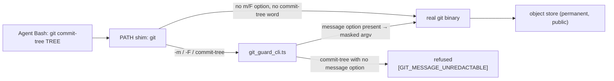

## Summary

`git commit-tree <tree>` reads its commit message from **stdin** when neither
`-m` nor `-F` is given — no option is involved at all — so the agent-side `git`
shim's lexical fast path (`-*m*|-*F*|--f*`) never matched, the guard child never
ran, and the message reached the object store unscanned. A token piped into it
was the same exploit as `-m "$GH_TOKEN"`, with no control anywhere in the path.

The fix is the refusal option the issue offers: the fast path now matches the
bare word `commit-tree` so every invocation reaches the guard, and
`redactGitMessageArgs` refuses a `commit-tree` carrying no message option,
naming the flagged spellings (`-m <text>`, `-F <path>`, `-F -`) that the guard
does scan. Flagged `commit-tree` messages are scanned exactly as before.

Scanning the flagless message instead was rejected: the guard would have to
**grow** the argv to hand `git` a `-m <masked>` that was never there, and the
wrapper's "redaction never adds or drops an argument" check — the integrity test
that proves the rewrite is the command the guard judged — would have to be
loosened to allow it. A refusal that names a scannable spelling keeps that
invariant and fails loud.

Closes #1969.

## Evidence

Backend/CLI change with no web interface to screenshot. The evidence is the
object store a real `git commit-tree` writes to, asserted through the generated
wrapper against the real `git` binary.

Against the unfixed shim the regression test printed the exploit directly (probe
output, removed before committing):

```text
EXPLOIT-PROBE stdout: "cbedc98c34ad6747a3d16c82a4463d6f8b045d1c\n"
EXPLOIT-PROBE committed message: "subject\n\nbody with <fake ghp_ PAT fixture, redacted>\n\n"
```

After the fix the same command refuses, prints no commit id, and leaves no
commit object in the store.



## Reproduction

- **symptom** — `printf '…$GH_TOKEN…' | git commit-tree "$TREE"` through the
  agent's guarded `git` wrote the token into a commit object unscanned; the
  guard child never ran
- **status** — `verified` — the regression test was observed failing against the
  unfixed code (the shim exited 0 and the probe above shows the token in the
  commit it created) and passing after the fix
- **regression test** —
  `worker/deno/tests/git_guard_shim_test.ts::git-guard-shim - `git commit-tree <tree>` writes no commit object for an unscanned stdin message (Issue #1969)`

## Test Plan

Added:

- `git_guard_shim_test.ts::git-guard-shim - `git commit-tree <tree>` writes no
  commit object for an unscanned stdin message (Issue #1969)` — real `git`, real
  tree, token on stdin: the wrapper refuses with `GIT_MESSAGE_UNREDACTABLE`,
  prints no commit id, and the object store holds no commit.
- `git_guard_shim_test.ts::git-guard-shim - `git commit-tree -m` still commits,
  with the secret masked (Issue #1969)` — the flagged spelling still writes a
  commit, and its message in the store is masked.
- `git_guard_cli_test.ts::refuses commit-tree with no message option (Issue
  #1969)` and `::a flagged commit-tree message is scanned, not refused`.
- `git_message_redaction_test.ts::refuses commit-tree with no message option
  (Issue #1969)` (bare and `-p`-routing spellings) and `::a flagged commit-tree
  message is still scanned` (`-m`, `-F -`, `--file <path>`).
- `usesStdinMessage` now answers `false` for `["commit-tree", "abc123"]` — it
  reads no stdin for a command the real pass refuses.

Changed (business-logic change, documented):

- `git_message_redaction_test.ts::masks a commit-tree plumbing message` asserted
  that `["commit-tree", "abc123", "-p", "deadbeef"]` passed through untouched.
  That argv is now refused, so the routing assertion it exists for moved inside
  a command that also carries `-m`: `-p deadbeef` is still byte-for-byte, and
  the flagless refusal is covered by the new test above. No test was removed or
  commented out.

## Quality gate

`./quality.sh` was run in full. Every check passes except `deno tests`, whose
only failures are environmental and unrelated to this change:

- `tests/provider_auto_runtime_test.ts` (2 tests) — "The running container image
  did not install the `codex` coding-agent provider. Installed: claude."
- `tests/setup_provider_credential_flow_test.ts` and its siblings (40 tests) —
  the worker's own `CONFIG_PATH` leaks into the test environment
  ("CONFIG_FILE and CONFIG_PATH are both set and name different files"). Run as
  `env -u CONFIG_PATH deno test tests/setup_provider_credential_flow_test.ts`
  they pass 11/11.

No failure touches the `git` guard. The guard's own suites —
`git_guard_shim_test.ts`, `git_guard_cli_test.ts`,
`git_message_redaction_test.ts`, `git_stdin_message_test.ts` — pass 80/80, and
`git_timeout_test.ts` plus `git_spawn_chokepoint_check_test.ts` pass 31/31.
