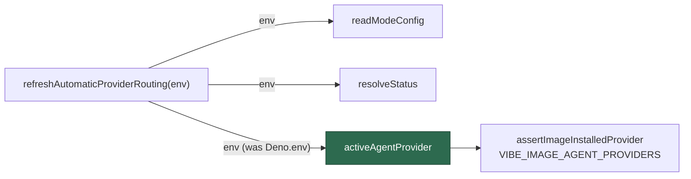

## Summary

`worker/deno/tests/provider_auto_runtime_test.ts` resolved providers through
the **ambient** environment, so two of its cases asserted which agent CLIs the
running container image installed rather than the routing behaviour they are
about. On a `claude`-only image both failed with
`did not install the "codex" coding-agent provider`, turning `./quality.sh`
red before it reached the serial pass.

The fix states the environment instead of reading the host's:

- **Test** — every provider resolution in the suite now goes through an
  `envFrom` lookup that states `VIBE_IMAGE_AGENT_PROVIDERS=claude,codex`,
  the pattern the rest of the provider suite already uses. The assertions
  still exercise the installed-set gate; they just gate on a stated image.
- **Library** — `refreshAutomaticProviderRouting` threads its injected `env`
  seam into `activeAgentProvider({ env })`
  (`worker/deno/lib/provider_auto_runtime.ts:454`). Every other read in that
  function already went through `env`; this one reached for `Deno.env`, which
  is what made the active provider — and the image set it is checked against —
  a fact about the host rather than about the routing being decided. Production
  callers pass no `env`, so the default stays the process environment and
  behaviour is unchanged.

Closes #1977.

## Evidence

Backend/CLI change with no web interface, so the evidence is test output.

The suite is now image-independent — run under three different stamps, all
green:

```text
== stamp='codex'         ok | 12 passed | 0 failed
== stamp='claude,codex'  ok | 12 passed | 0 failed
== stamp=''              ok | 12 passed | 0 failed
```

Full gate after the final edit: `./quality.sh` → `Result: PASSED (with skipped
checks)` (`config integration` skipped, as it is without a live config).



## Reproduction

- **symptom** — on a `claude`-only image, `auto mode selects quota winner and
  updates only default routing` and `VIBE_AGENT_PROVIDER disables auto mode and
  preserves explicit provider` failed with
  `The running container image did not install the "codex" coding-agent
  provider. Installed: claude.`, so `deno tests FAILED` in the gate's parallel
  pass
- **status** — `verified` — both cases were observed failing on this
  `VIBE_IMAGE_AGENT_PROVIDERS=claude` image before the change
  (`FAILED | 9 passed | 2 failed`) and passing after it
  (`ok | 12 passed | 0 failed`); the new seam test was likewise observed
  failing against the unfixed library and passing after the one-line fix
- **regression test** —
  `worker/deno/tests/provider_auto_runtime_test.ts::automatic routing reads the active provider from the environment it was given`

## Test Plan

- Modified `worker/deno/tests/provider_auto_runtime_test.ts` — added `statedEnv`
  / `CONFIGURED_ENV` lookups stating the installed provider set, and routed
  every `activeAgentProvider` / `selectAgentProvider` assertion and every
  `refreshAutomaticProviderRouting` `env` through them. No test was removed,
  disabled or weakened; the same assertions run against a stated image.
- Added `automatic routing reads the active provider from the environment it was
  given` — states an image carrying `codex` alone while the process default is
  `claude`, and asserts the refresh fails loud naming `claude`. This is red
  against the unfixed library (which read `Deno.env`) and green after.
- Ran `deno test tests/provider_auto_runtime_test.ts` under
  `VIBE_IMAGE_AGENT_PROVIDERS` of `claude`, `codex`, `claude,codex` and `""`.
- Ran the adjacent suites `provider_quota_scope_test.ts`,
  `provider_auto_state_test.ts`, `provider_auto_selection_test.ts` — 28 passed.
- Ran the full `./quality.sh` gate — PASSED.
