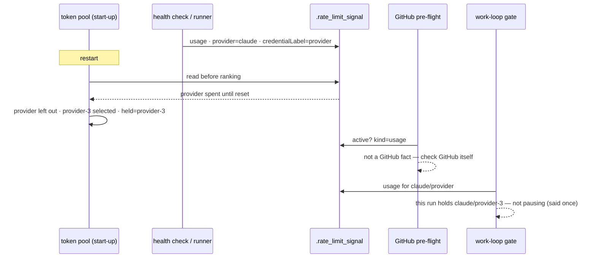

# A spent subscription's usage signal no longer pauses a restart onto a fresh one (Issue #2002)

## Summary

On GRQ-25 on 2026-09-11 the worker's token pool chose the weekly-spent
subscription (every budget probe had answered `429`, so discovery order
decided), the health check met `You've hit your weekly limit` and wrote an
80-hour usage signal, and then **every restart onto a subscription with a full
window was paused by that same signal**: 25 restarts between 16:40Z and 20:01Z,
zero issues worked, while `provider-3` sat at 100 % of its five-hour window.

Three defects combined, and each is closed here:

1. **The GitHub pre-flight honoured usage signals.** `preflightGitHubRateLimit`
   short-circuited on _any_ active `.rate_limit_signal`. It now short-circuits
   on a `github` signal only; a usage signal is logged and left to the work
   loop's provider-scoped gate, which runs after initialisation and is the place
   a restart holding a fresh subscription can be told apart from a run still
   holding the spent one.
2. **Usage signals named no credential.** `RateLimitSignalData.credentialLabel`
   existed but no writer set it. `credential_preflight.ts` now records which
   credential file each provider's run environment holds (set by start-up's
   `applyProviderCredentialEnv` and by the pool's `applySelection`), and every
   usage-signal writer — the health check and both runner sites — names
   `provider` and `credentialLabel` (a file stem, never a value).
   `usageSignalPausesHost` does not pause a run holding a _different_ credential
   of the same provider, and `isHostRateLimitPauseActive` says so once. An
   unlabelled signal keeps the historical host-wide pause.
3. **Start-up could re-pick the spent token.** `run_worker` now reads the active
   usage signal before ranking and records the named credential as spent in the
   pool (`primeClaudePoolFromUsageSignal`); `selectToken` leaves a
   recorded-spent token with a future reset out of the start-up ranking while
   another candidate exists — even when every probe fails, where the recorded
   exhaustion would otherwise rank _first_ as the only measured budget.

Closes #2002.



## Evidence

Backend/CLI change with no web interface; the evidence is the log sequence in
the issue and the regression suite below.

Before (GRQ-25, every eight minutes for three and a half hours):

```text
19:57:50 [SECURITY] claude token selected provider-3 (#3) of 3: highest-remaining-per-hour rate=0.48%/h remaining=76.0%
[SECURITY] claude token pool: provider-3 still has 100.0% of its five-hour window — restarting rather than waiting out the spent token
20:01:09 INFO: Pre-flight: Rate-limit signal still active (277131s remaining) — pausing until reset at 2026-09-15 11:00:00 AEST (in 76h 58m)
20:01:09 INFO: Pre-flight: rate-limit wait would exceed run-duration cap — exiting cleanly
20:01:09 [WORKER_SUMMARY] issues_processed=0 duration=99.674s
```

Focused validation (this branch, macOS host):

```text
provider_quota_scope_test.ts / github_rate_limit_preflight_test.ts /
claude_credential_pool_test.ts / claude_pool_budget_test.ts /
rate_limit_signal_test.ts / rate_limit_signal_kind_test.ts /
run_worker_test.ts / credential_preflight_test.ts
  → 149 passed, 0 failed (126 on the unmodified base)
deno check (changed modules) → clean
deno lint (changed modules)  → clean
```

Full `./quality.sh` on this branch: every stage passes except `deno tests`,
which reports the twelve host-only failures this macOS host always reports
(`quality_gate_test` `runDenoCheck`/`runDenoFmtCheck`, `quality_gate_test_env_test`,
`quality_helpers_test detectTool`, `run_core_idle_detect_audit_test`,
`pwsh_suites_in_the_gate_test`) — the scrubbed-PATH suites find no `deno` and
the host has no PowerShell. The set is identical to an unmodified `main` on
the same host; CI's runners have both.

Not changed here, recorded in the issue: the launcher-side restart question
(`poolHasAnotherTokenWithBudget`) still receives no `spentLabel`, because the
signal file lives on the container's work volume and the launcher cannot read
it; the spent token's own probe answers spent, so the question is still answered
correctly, one probe dearer. And `probeClaudeTokenBudget` still reports a `429`
as unknown without reading the headers a rejected probe may carry.

## Test Plan

Added:

- `tests/provider_quota_scope_test.ts` — a signal naming another credential of
  the held provider does not pause; naming the held one does; unlabelled and
  unknown-held keep the pause; GitHub signals are unaffected;
  `usageSignalIsForAnotherCredential` truth table; `isHostRateLimitPauseActive`
  against a real signal file explains itself once and still pauses the run that
  holds the spent token.
- `tests/github_rate_limit_preflight_test.ts` — an active usage signal does not
  short-circuit and GitHub is checked (signal left in place); an active GitHub
  signal still short-circuits.
- `tests/claude_credential_pool_test.ts` — a recorded-spent token is left out of
  the start-up ranking when every probe fails; an elapsed exhaustion is ranked
  normally; an all-spent pool still ranks (a start never refuses);
  `applySelection` records the held label; `exhaustionFromUsageSignal` window
  inference and every "nothing to record" case; `primeClaudePoolFromUsageSignal`
  against a real signal file, and its no-op cases.
- `tests/run_worker_test.ts` — start-up records the label of the exported file
  and nothing when the variable was already in the environment.
- `tests/rate_limit_signal_test.ts` — provider and credential label round-trip.

Documentation: `docs/SETUP.md` (Which Claude token a run uses) and
`docs/INTERNALS.md` (signal kinds).
